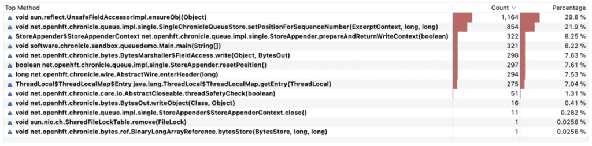

**Become familiar with the art of object reuse by reading this article and learn the pros and cons of different reuse strategies in a multi-threaded Java application. This allows you to write more performant code with less latency.**

While the use of objects in object-oriented languages such as Java provides an excellent way of abstracting away complexity, frequent object creation can come with downsides in terms of increased memory pressure and garbage collection which will have an adverse effect on applications' latency and performance.

Carefully reusing objects provides a way to maintain performance while keeping most parts of the intended level of abstraction. This article explores several ways to reuse objects.

### The Problem

By default (\*), the JVM will allocate new objects on the heap. This means these new objects will accumulate on the heap and the space occupied will eventually have to be reclaimed once the objects go out of scope (i.e. are not referenced anymore) in a process called "Garbage Collection" or GC for short. As several cycles with creating and removing objects are passed, memory often gets increasingly fragmented.

While this works fine for applications with little or no performance requirements, it becomes a significant bottleneck in performance-sensitive applications. To make things worse, these problems are often exacerbated in server environments with many CPU cores and across NUMA regions.

(\*) Under some conditions, the JVM can instead allocate an object (or rather a restricted view of an object) on the stack using the C2 compiler's escape analysis capability, greatly improving performance. This is out of the scope of this article. Read more about escape analysis [here](https://dzone.com/articles/minborgs-java-pot-java-8-the-jvm-can-re-capture-ob "here").

#### Memory Access Latencies

Accessing data from main memory is relatively slow (around 100 clock cycles, so about 30 ns on current hardware compared to sub ns access using registers) especially if a memory region has not been accessed for long (leading to an increased probability for a TLB miss or even a page fault). Progressing towards more localized data residing in L3, L2, L1 CPU caches down to the actual CPU registers themselves, latency improves by orders of magnitude. Hence, it becomes imperative to keep a small working set of data.

#### Consequences of Memory Latencies and Dispersed Data

As new objects are created on the heap, the CPUs have to write these objects in memory locations inevitably located farther and farther apart as memory located close to the initial object becomes allocated. This might not be a far-reaching problem during object creation as cache and TLB pollution will be spread out over time and create a statistically reasonably evenly distributed performance reduction in the application.

However, once these objects are to be reclaimed, there is a memory access "storm" created by the GC that is accessing large spaces of unrelated memory over a short period of time. This effectively invalidates CPU caches and saturates memory bandwidth which results in significant and non-deterministic application performance drops.

To make things worse, if the application mutates memory in a way that the GC cannot complete in reasonable time, some GCs will intervene and stop all application threads so it can complete its task. This creates massive application delays, potentially in the seconds or even worse. This is referred to as "stop-the-world collections".

#### Improved GCs

In recent years, there has been a significant improvement in GC algorithms that can mitigate some of the problems described above. However, fundamental memory access bandwidth limitations and CPU cache depletion problems still remain a factor when creating massive amounts of new objects.

### Reusing Objects is Not Easy

Having read about the issues above, it might appear that reusing objects is a low-hanging fruit that can be easily picked at will. As it turns out, this is not the case as there are several restrictions imposed on object reuse.

An object that is immutable can always be reused and handed between threads, this is because its fields are final and set by the constructor which ensures complete visibility. So, reusing immutable objects is straightforward and almost always desirable, but immutable patterns can lead to a high degree of object creation.

However, once a **mutable** instance is constructed, Java's memory model mandates that normal read and write semantics are to be applied when reading and writing normal instance fields (i.e. a field that is not *volatile*). Hence, these changes are only guaranteed to be visible to the same thread writing the fields.

Hence, contrary to many beliefs, creating a POJO, setting some values in one thread, and handing that POJO off to another thread will simply not work. The receiving thread might see no updates, might see partial updates (such as the lower four bits of a *long* were updated but not the upper ones), or all updates. To make thighs worse, the changes might be seen 100 nanoseconds later, one second later or they might never be seen at all. There is simply no way to know.

### Various Solutions

One way to avoid the POJO problem is to declare primitive fields (such as *int* and *long* fields) *volatile* and use atomic variants for reference fields. Declaring an array as *volatile* means only the reference itself is volatile and does not provide volatile semantics to the elements. This can be solved but the general solution is outside the scope of this article although the *Atomic Array* classes provide a good start. Declaring all fields volatile and using concurrent wrapper classes may incur some performance penalty.

Another way to reuse objects is by means of *ThreadLocal* variables which will provide distinct and time-invariant instances for each thread. This means normal performant memory semantics can be used. Additionally, because a thread only executes code sequentially, it is also possible to reuse the same object in unrelated methods. Suppose a *StringBuilder* is needed as a scratch variable in a number of methods (and then reset the length of the StringBuilder back to zero between each usage), then a *ThreadLocal* holding the very same instance for a particular thread can be reused in these unrelated methods (provided no method calls a method that shares the reuse, including the method itself). Unfortunately, the mechanism around acquiring the ThreadLocal's inner instance creates some overhead. There are a number of other culprits associated with the use of code-shared *ThreadLocal* variables making them:

* Difficult to clean up after use.
* Susceptible to memory leaks.
* Potentially unscalable. Especially because Java's upcoming virtual thread feature promotes creating a massive amount of threads.
* Effectively constituting a global variable for the thread.

Also, it can be mentioned that a thread context can be used to hold reusable objects and resources. This usually means that the thread context will somehow be exposed in the API but the upshot is that it provides fast access to thread reused objects. Because objects are directly accessible in the thread context, it provides a more straightforward and deterministic way of releasing resources. For example, when the thread context is closed.

Lastly, the concept of *ThreadLocal* and thread context can be mixed providing an untainted API while providing simplified resource cleaning thereby avoiding memory leaks.

It should be noted that there are other ways to ensure memory consistency. For example, using the perhaps less known Java class *Exchanger*. The latter allows the exchange of messages whereby it is guaranteed that all memory operations made by the from-thread prior to the exchange happen before any memory operation in the to-thread.

Yet another way is to use open-source Chronicle Queue which provides an efficient, thread-safe, object creation free means of exchanging messages between threads.

In Chronicle Queue, messages are also persisted, making it possible to replay messages from a certain point (e.g. from the beginning of the queue) and to reconstruct the state of a *service* (here, a thread together with its state is referred to as a service). If an error is detected in a service, then that error state can be re-created (for example in debug mode) simply by replaying all the messages in the input queue(s). This is also very useful for testing whereby a number of pre-crafted queues can be used as test input to a service.

Higher order functionality can be obtained by composing a number of simpler services, each communicating via one or more Chronicle Queues and producing an output result, also in the form of a Chronicle Queue.

The sum of this provides a completely deterministic and decoupled event-driven microservice solution.

### Reusing Objects in Chronicle Queue

In a [previous article](https://chronicle.software/creating-terabyte-sized-queues-with-low-latency-2/ "previous article"), [open-source Chronicle Queue](https://chronicle.software/queue/ "open-source Chronicle Queue ")was benchmarked and demonstrated to have high performance. One objective of this article is to take a closer look at how this is possible and how object reuse works under the hood in Chronicle Queue (using version 5.22ea6).

As in the previous article, the same simple data object is used:

```java
public class MarketData extends SelfDescribingMarshallable {
    int securityId;
    long time;
    float last;
    float high;
    float low;

    // Getters and setters not shown for brevity

}
```


The idea is to create a top-level object that is reused when appending a large number of messages to a queue and then analyse internal object usage for the entire stack when running this code:

```java
public static void main(String[] args) {
    final MarketData marketData = new MarketData();
    final ChronicleQueue q = ChronicleQueue
            .single("market-data");
    final ExcerptAppender appender = q.acquireAppender();

    for (long i = 0; i < 1e9; i++) {
        try (final DocumentContext document =
                     appender.acquireWritingDocument(false)) {
             document
                    .wire()
                    .bytes()
                    .writeObject(MarketData.class, 
                            MarketDataUtil.recycle(marketData));
        }
    }
}
```


Since Chronicle Queue is serializing the objects to memory-mapped files, it is important that it does not create other unnecessary objects for the performance reasons stated above.

### Memory Usage

The application is started with the VM option "-verbose:gc" so that any potential GCs are clearly detectable by observing the standard output. Once the application starts, a histogram of the most used objects are dumped after inserting an initial 100 million messages:

```
pemi@Pers-MBP-2 queue-demo % jmap -histo 8536

 num     #instances         #bytes  class name
----------------------------------------------
   1:         14901       75074248  [I
   2:         50548       26985352  [B
   3:         89174        8930408  [C
   4:         42355        1694200  java.util.HashMap$KeyIterator
   5:         56087        1346088  java.lang.String
…
2138:             1             16  
sun.util.resources.LocaleData$LocaleDataResourceBundleControl
Total        472015      123487536
```


After the application appended about 100 million additional messages some seconds later, a new dump was made:

```
pemi@Pers-MBP-2 queue-demo % jmap -histo 8536

 num     #instances         #bytes  class name
----------------------------------------------
   1:         14901       75014872  [I
   2:         50548       26985352  [B
   3:         89558        8951288  [C
   4:         42355        1694200  java.util.HashMap$KeyIterator
   5:         56330        1351920  java.lang.String
…
2138:             1             16  
sun.util.resources.LocaleData$LocaleDataResourceBundleControl
Total        473485      123487536
```


As can be seen, there was only a slight increase in the number of objects allocated (around 1500 objects) indicating n**o object allocation was made per message sent**. No GC was reported by the JVM so no objects were collected during the sampling interval.

Designing such a relatively complex code path without creating any object while considering all the constraints above is of course non-trivial and indicates that the library has reached a certain level of maturity in terms of performance.

### Profiling Methods

Profiling methods called during execution reveals Chronicle Queue is using ThreadLocal variables:  


It spends about 7% of its time looking up thread local variables via the*ThreadLocal$ThreadLocalMap.getEntry(ThreadLocal)* method but this is well worth its effort compared to creating objects on the fly.

As can be seen, Chronicle Queue spends most of its time accessing field values in the POJO to be written to the queue using Java reflection. Even though it is a good indicator that the intended action (i.e. copying values from a POJO to a Queue) appears somewhere near the top, there are ways to improve performance even more by providing hand-crafted methods for serialization substantially reducing execution time. But that is another story.

### What's Next?

In terms of performance, there are other features such as being able to isolate CPUs and lock Java threads to these isolated CPUs, substantially reducing application jitter as well as writing custom serializers.

Finally, there is an enterprise version with replication of queues across server clusters paving the way towards high availability and improved performance in distributed architectures.

The enterprise version also includes a set of other features such as encryption, time zone rolling, and asynchronous message handling.

### Resources

[Chronicle Queue Enterprise](https://chronicle.software/queue-enterprise/ "Chronicle Queue Enterprise")  
[Chronicle Queue (open-source)](https://chronicle.software/queue/ "Chronicle Queue (open-source)")
