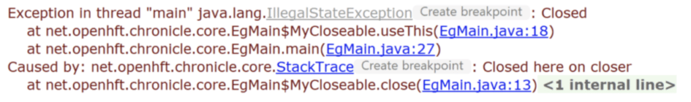
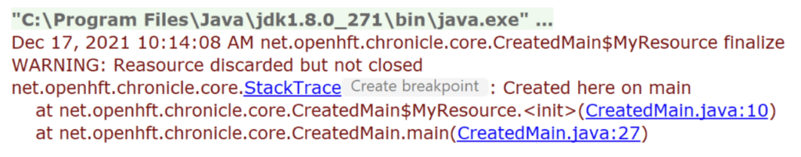
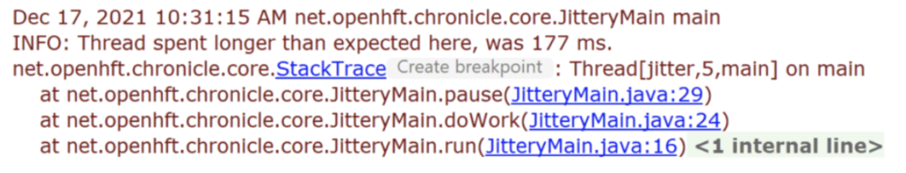
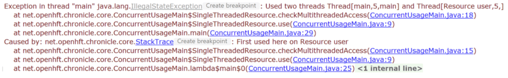

There are things you can do in Java you rarely see, generally because there is no use for it.

However, there are some unusual things in Java that could be surprisingly useful.

[Chronicle Software](https://chronicle.software/ "Chronicle Software") uses a number of different useful patterns in its low-level libraries most developers wouldn't generally come across.

One of them is a class that extends Throwable but isn't an Error or an Exception.

### StackTrace Extends Throwable

```java
package net.openhft.chronicle.core;
/**
* Throwable created purely for the purposes of reporting a stack trace.
* This is not an Error or an Exception and is not expected to be thrown or caught.
*/
public class StackTrace extends Throwable {
   public StackTrace() { this("stack trace"); }
   public StackTrace(String message) { this(message, null); }
   public StackTrace(String message, Throwable cause) {
       super(message + " on " + Thread.currentThread().getName(), cause);
   }

   public static StackTrace forThread(Thread t) {
       if (t == null) return null;
       StackTrace st = new StackTrace(t.toString());
       StackTraceElement[] stackTrace = t.getStackTrace();
       int start = 0;
       if (stackTrace.length > 2) {
           if (stackTrace[0].isNativeMethod()) {
               start++;
           }
       }
      if (start > 0) {
         StackTraceElement[] ste2 = new StackTraceElement[stackTrace.length - start];
         System.arraycopy(stackTrace, start, ste2, 0, ste2.length);
         stackTrace = ste2;
      }

       st.setStackTrace(stackTrace);
       return st;
   }
}
```

Some important side notes to get out of the way first

* Yes, I really do use a proportional font in my IDE. I use Verdana on Windows, which I got used to very easily and haven't wanted to go back.
* This isn't a class which I expect to ever get thrown. Classes directly extending Throwable are checked, as Exception is, so the compiler will help you enforce this.
* The stack trace of a Throwable is determined when the Throwable is created, not where it is thrown. Usually this is the same line, but it doesn't have to be. A Throwable doesn't have to be thrown to have a stack trace.
* The stack trace element objects aren't created until they are needed. Instead meta data is added to the object itself to reduce overhead and the array of StackTraceElements are populated on first use.

However, let's look at the class in more detail. The class will record both the stack trace of where it was created and the thread which created it. You should see how this is useful later.

It can also be used to hold a stack trace of another running thread.

A stack trace of another thread is only taken when the thread reaches a safe point, which can be some time after you attempt to get it.

This is due to the JVM stopping the thread, and typically JVMs wait to stop every thread, so it can inspect the stack of the thread you are attempting to capture.

I.e., It has a high overhead but can be very useful.

### StackTrace as a Deferred Exception

We don't expect this Throwable to be thrown but it can record the cause of an Exception which may be thrown later.

#### Why was a resource closed

```java
public class EgMain {
   static class MyCloseable implements Closeable {
       protected transient volatile StackTrace closedHere;

       @Override
       public void close() {
           closedHere = new StackTrace("Closed here"); // line 13
       }

       public void useThis() {
           if (closedHere != null)
               throw new IllegalStateException("Closed", closedHere);
       }
   }

   public static void main(String[] args) throws InterruptedException {      
 MyCloseable mc = new MyCloseable(); // line 27
       Thread t = new Thread(mc::close, "closer");
       t.start();
       t.join();
       mc.useThis();
   }
}
```

Produces the following Exception when run:



Normally you would see the IllegalStateException and where your code tried to use the closed resource, but this doesn't tell you why it was closed without additional information.

As StackTrace is a Throwable, you can make it the cause of a subsequent Exception or Error.

You can see the thread which closed the resource, so you know it occurred in another thread and you can see the stack trace of why it was closed. This can help diagnose hard-to-find issues for premature closing of resources very quickly.

#### Which Resource Was Discarded?

Long lived Closeable objects can have a complex life cycle and ensuring they are close when they need to be can be hard to trace, and can lead to resource leaks.

Some resources are not cleaned up when the GC frees the object e.g. a RandomAccessFile object is cleaned up on a GC by the file it represents isn't closed unless you close it, leading to a potential resource leak of file handles.

```java
public class CreatedMain {
   static class MyResource implements Closeable {
       private final transient StackTrace createdHere = new StackTrace("Created here");
       volatile transient boolean closed;

       @Override
       public void close() throws IOException {
           closed = true;
       }

       @Override
       protected void finalize() throws Throwable {
           super.finalize();
           if (!closed)
               Logger.getAnonymousLogger().log(Level.WARNING, "Resource discarded but not closed", createdHere);
       }
   }

   public static void main(String[] args) throws InterruptedException {
       new MyResource(); // line 27
       System.gc();
       Thread.sleep(1000);
   }
}
```

Prints the following:



This allows you to not just see where a resource was created so you can try to determine why it wasn't closed, but it's trivial to log in a manner your IDE understands, as your logger will already have support for printing out the stack trace. e.g. you can click on the line numbers to look through the code which created it.

### Performance Monitoring a Critical Thread in Production

In some environments, you want a low overhead way of monitoring the jitter of a critical event in production, without running a profiler. This can be achieved by adding your own monitoring to only sample a stack trace when it exceeds some threshold. This can find problems you can't reproduce in a test or development environment, so it can be invaluable.

When we have added this to our infrastructure, the number of mysterious delays reported to us by our clients dropped dramatically as clients could diagnose for themselves what the issue was from the stack trace.

```java
public class JitteryMain implements Runnable {
   volatile long loopStartMS = Long.MIN_VALUE;
   volatile boolean running = true;

   @Override
   public void run() {
       while (running) {
           loopStartMS = System.currentTimeMillis();
           doWork();
           loopStartMS = Long.MIN_VALUE;
       }
   }

   private void doWork() {
       int loops = new Random().nextInt(100);
       for (int i = 0; i  System.currentTimeMillis()) {
           long busyMS = System.currentTimeMillis() - jittery.loopStartMS;
           if (busyMS > 100) {
               Logger.getAnonymousLogger()
                       .log(Level.INFO, "Thread spent longer than expected here, was " + busyMS + " ms.",
                               StackTrace.forThread(thread));
           }
           pause(50);
       }
       jittery.running = false;
   }
}
```

Prints the following, which again you can see is easy to navigate the stack in your IDE.



You might be wondering why this happens in this case. The most likely cause is that *Thread.sleep(time)* sleeps for a minimum amount of time, not a maximum and on Windows sleep 1 ms actually takes about 1.9 ms fairly consistently.

### Detecting When a Single Threaded Resource is Accessed Concurrently Between Threads

```java
package net.openhft.chronicle.core;

public class ConcurrentUsageMain {
   static class SingleThreadedResource {
       private StackTrace usedHere;
       private Thread usedByThread;

       public void use() {
           checkMultithreadedAccess();
           // BLAH
       }

       private void checkMultithreadedAccess() {
           if (usedHere == null || usedByThread == null) {
               usedHere = new StackTrace("First used here");
               usedByThread = Thread.currentThread();
           } else if (Thread.currentThread() != usedByThread) {
               throw new IllegalStateException("Used two threads " + Thread.currentThread() + " and " + usedByThread, usedHere);
           }
       }
   }

   public static void main(String[] args) throws InterruptedException {
       SingleThreadedResource str = new SingleThreadedResource();
       final Thread thread = new Thread(() -> str.use(), "Resource user"); // line 25
       thread.start();
       thread.join();

       str.use(); // line 29
   }
}
```

Prints the following:



You can see the resource was used by two threads with their names, however, you can also see where in the stack they were used to determine the possible cause.

### Turning Off This Tracing

Creating a StackTrace has a significant impact on the thread and possibly the JVM. However it is easily turned off using a control flag such as a system property and replaced with a null value.

```java
createdHere = Jvm.isResourceTracing() 
                        ? new StackTrace(getClass().getName() + " created here")
                        : null;
```

This use of a *null* doesn't require much special handling as loggers will ignore a Throwable which is *null* , and you can give a *null* cause to an Exception and it's the same as not providing one.

### Conclusion

While having a class that directly extends Throwable is surprising, it is allowed and is also surprisingly useful for providing additional information about the life cycle of a resource, or adding simple monitoring you can run in production.

### Links

[Chronicle Software](https://chronicle.software/ "Chronicle Software")  
[OpenHFT Chronicle Core](https://github.com/OpenHFT/Chronicle-Core "OpenHFT Chronicle Core")
