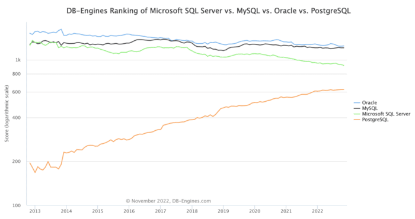
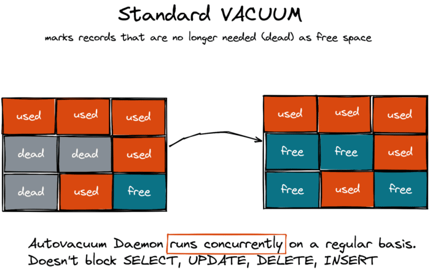
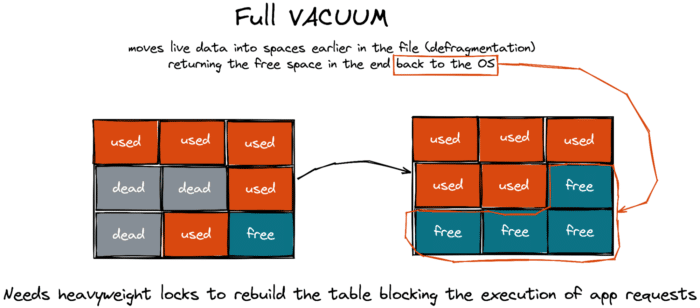

As Java developers, we're no strangers to the concept of garbage collection. Our apps generate garbage all the time, and that garbage is meticulously cleaned out by CMS, G1, Azul C4, and other types of collectors.

However, the story doesn't end with the Java heap. In fact, it is just the beginning.

In this article, we will create a simple Java application that uses a relational database for the user data and solid-state drives (SSDs) as a storage device. From here, we'll explore how the application generates garbage at the database and SSD levels, while executing the application logic.

Before we start, let me address a question that some of you might have: "Why should I care?"

First, there is a practical reason. If your Java app experiences performance issues and all looks good from the app and JVM standpoint then this might be due to your database or SSD garbage collection cycles.

Second, curiosity. Software engineers usually love to explore what happens beyond their cozy and well-known Java neighborhood. So, get ready to learn the internals of two components usually present in your application stack - the database and SSDs.

Finally, remember when Java was mocked for using garbage collection? I heard opinions like, "why would you use Java and not C++? Java apps are slow by design with their dependency on garbage collection and bytecode interpretation in runtime." Well, now we can oppose that by saying that garbage collection != slow. Other technologies (databases and SSDs) use garbage collection effectively, and nobody usually refers to them as "slow by design."

We'll start with [PostgreSQL](https://www.postgresql.org/ "PostgreSQL"), the fastest-growing relational database [according to the DB Engines](https://db-engines.com/en/ranking_trend/system/Microsoft+SQL+Server%3BMySQL%3BOracle%3BPostgreSQL "according to the DB Engines") website. Many Java apps use PostgreSQL as the go-to database, so it's reasonable to start with it.

I'll be sharing easy-to-follow instructions for those who want to reproduce the behavior at home. It's also fine just to read the article. You can choose whatever suits you best.

Our [sample app](https://github.com/dmagda/java-litters-everywhere "sample app") is a Spring Boot RESTful service for a pizzeria. The app tracks pizza orders.

Let's start a PostgreSQL instance first. We can do this within a minute with Docker:

1. Start the database in a container: 

<pre class="EnlighterJSRAW" data-enlighter-language="bat">rm -R ~/postgresql_data/
mkdir ~/postgresql_data/

docker run --name postgresql \
    -e POSTGRES_USER=postgres -e POSTGRES_PASSWORD=password \
    -p 5432:5432 \
    -v ~/postgresql_data/:/var/lib/postgresql/data -d postgres:13.8
</pre>

2. Connect to the container: 

<pre class="EnlighterJSRAW" data-enlighter-language="bash">docker exec -it postgresql /bin/bash</pre>

3. Connect to the database using psql tool: 

<pre class="EnlighterJSRAW" data-enlighter-language="bash">psql -h 127.0.0.1 -U postgres</pre>

4. Make sure the database is empty (no tables yet): 

<pre class="EnlighterJSRAW" data-enlighter-language="sql">postgres=# \d
Did not find any relations.</pre>

Next, clone and start the pizza app:

<pre class="EnlighterJSRAW" data-enlighter-language="bash">git clone https://github.com/dmagda/java-litters-everywhere.git &amp;&amp; cd java-litters-everywhere
mvn spring-boot:run</pre>

The app connects to the database via the Hikari pool and listens for our requests on port `8080`:

<pre class="EnlighterJSRAW" data-enlighter-language="java">INFO 58081 --- [main] com.zaxxer.hikari.HikariDataSource       : HikariPool-1 - Starting...
INFO 58081 --- [main] com.zaxxer.hikari.HikariDataSource       : HikariPool-1 - Start completed.
INFO 58081 --- [main] o.s.b.w.embedded.tomcat.TomcatWebServer  : Tomcat started on port(s): 8080 (http) with context path</pre>

Go back to your psql session within the Docker container and make sure the app created an empty `pizza_order` table:

<pre class="EnlighterJSRAW" data-enlighter-language="sql">postgres=# \d
            List of relations
 Schema |    Name     | Type  |  Owner   
--------+-------------+-------+----------
 public | pizza_order | table | postgres
(1 row)

postgres=# select * from pizza_order;
 id | status | order_time 
----+--------+------------
(0 rows)</pre>

Now it's time to put the first order in the pizzeria queue. For that we're going to use the app's REST `putNewOrder` endpoint:

1. Call the endpoint with curl: 

<pre class="EnlighterJSRAW" data-enlighter-language="bash">curl -i -X POST  http://localhost:8080/putNewOrder --data 'id=1'</pre>

2. The application persists the order to the database using the following SQL statement (see the app's log output): 

<pre class="EnlighterJSRAW" data-enlighter-language="java">Hibernate: 
    insert 
    into
        pizza_order
        (order_time, status, id) 
    values
 (?, ?, ?)</pre>

3. Use your psql session to check that the row made it to PostgreSQL: 

<pre class="EnlighterJSRAW" data-enlighter-language="sql">postgres=# select * from pizza_order;
 id | status  |       order_time        
----+---------+-------------------------
  1 | Ordered | 2022-11-21 11:14:35.103</pre>

PostgreSQL stores rows in pages. The default page size is 8KB, which means that a single page usually holds multiple records. The database has an extension that allows us to look into the raw page data. Let's install the extension and explore the database storage internals:

1. From within the psql session, install the pageinspect extension: 

<pre class="EnlighterJSRAW" data-enlighter-language="sql">postgres=# CREATE EXTENSION pageinspect;
CREATE EXTENSION</pre>

2. Request the contents of the first page of the `pizza_order` table:

<pre class="EnlighterJSRAW" data-enlighter-language="sql">postgres=# select t_ctid,t_xmin,t_xmax,t_data from heap_page_items(get_raw_page('pizza_order',0));
 lp     | t_xmin | t_xmax |               t_data               
--------+--------+--------+------------------------------------
 1      |    488 |      0 | \x0100000002400000180fd8edf7900200</pre>

There is a single row in the page right now, and that's the row your application sees by executing the `select * from pizza_order` statement. Let's decipher the pageinspect columns:

* `lp` - a row identifier within the page
* `t_xmin` - an id of a transaction that inserted the row in the table (this is the id assigned to our previous INSERT statement).
* `t_xmax` - an id of a transaction deleted the row, or 0 if the row is visible to all future requests.
* `t_data` - this value is used to construct a pointer to the actual row data (payload).

Now, let's see what happens when the chef gets to this order and starts baking the pizza. The kitchen staff changes the order status to `Baking`:

1. Update the status with curl: 

<pre class="EnlighterJSRAW" data-enlighter-language="bash">curl -i -X PUT http://localhost:8080/changeStatus --data 'id=1' --data 'status=Baking'</pre>

2. The app persists the change using the following statement: 

<pre class="EnlighterJSRAW" data-enlighter-language="java">Hibernate: 
   update
        pizza_order 
    set
        status=? 
    where
        id=?</pre>

3. And PostgreSQL confirms the change is applied: 

<pre class="EnlighterJSRAW" data-enlighter-language="sql">postgres=# select * from pizza_order;
id | status |       order_time        
----+--------+-------------------------
  1 | Baking | 2022-11-21 11:14:35.103</pre>

Now for the most interesting part, go ahead and check the storage state with the pageinspect extension:

<pre class="EnlighterJSRAW" data-enlighter-language="sql">postgres=# select lp,t_xmin,t_xmax,t_data from heap_page_items(get_raw_page('pizza_order',0));
 lp | t_xmin | t_xmax |               t_data               
----+--------+--------+------------------------------------
  1 |    488 |    490 | \x0100000002400000180fd8edf7900200
  2 |    490 |      0 | \x0100000004400000180fd8edf7900200</pre>

Even though the `select * from pizza_order` statement returns only one row, internally, PostgreSQL stores two versions for the order with `id=1`.

The first version (with `lp=1`) is what the application initially inserted in the database when the order status was `Ordered`. This version has the `t_xmax` field set to 490 - which is the id of the UPDATE transaction that changed the status to `Baking`. The non-zero `t_xmax` field means that the record is labeled as deleted and cannot be visible to future application requests. This is why `select * from pizza_order` no longer returns us this row version.

The second version (with `lp=2`) is the latest row version with `status=Baking`. The version's `t_xmin` value is set to 490 - the id of the same UPDATE that changed the status. That's the version the application sees via `select * from pizza_order`.

A DELETE or UPDATE statement in PostgreSQL doesn't remove a record immediately, nor update an existing record in place. Instead, the deleted row is marked as a dead one and will remain in storage.

The updated record is, in fact, a brand new record that PostgreSQL inserts by copying the previous version of the record and updating requested columns. The previous version of that updated record is considered deleted and marked as a dead row version.

Want to see more garbage in PostgreSQL storage? Let's change-up the pizza order status:

1. With curl, change the status to `Delivering` and then to `YummyInMyTummy` (hope the customer would love the pizza):

<pre class="EnlighterJSRAW" data-enlighter-language="bash">curl -i -X PUT http://localhost:8080/changeStatus --data 'id=1' --data 'status=Delivering'
curl -i -X PUT http://localhost:8080/changeStatus --data 'id=1' --data 'status=YummyInMyTummy'</pre>

2. Using the psql session, confirm that the application will see only a row version with `status=YummyInMyTummy`:

<pre class="EnlighterJSRAW" data-enlighter-language="sql">postgres=# select * from pizza_order;
 id |     status     |       order_time        
----+----------------+-------------------------
  1 | YummyInMyTummy | 2022-11-21 11:14:35.103</pre>

3. Check how many versions of the row are in PostgreSQL storage: 

<pre class="EnlighterJSRAW" data-enlighter-language="sql">postgres=# select lp,t_xmin,t_xmax,t_data from heap_page_items(get_raw_page('pizza_order',0));
 lp | t_xmin | t_xmax |               t_data               
----+--------+--------+------------------------------------
  1 |    488 |    490 | \x0100000002400000180fd8edf7900200
  2 |    490 |    491 | \x0100000004400000180fd8edf7900200
  3 |    491 |    492 | \x0100000006400000180fd8edf7900200
  4 |    492 |      0 | \x0100000008400000180fd8edf7900200
(4 rows)</pre>

There are four versions in the storage for our pizza order with `id=1`. The only difference between those versions is the value of the `status` column!

There is a good reason why the database engine stores the deleted and updated records. Your application can run a bunch of transactions against PostgreSQL in parallel. Some of those transactions start earlier than others. But, if a transaction deletes or updates a record that still might be of interest to transactions started earlier, then the record needs to be kept in the database in its original state (until the point in time when all earlier started transactions finish). This is how PostgreSQL implements [MVCC](https://en.wikipedia.org/wiki/Multiversion_concurrency_control "MVCC") (multi-version concurrency protocol).

It's clear that PostgreSQL can't and doesn't want to keep the dead row versions forever. This is why the database has its own garbage collection process called [vacuum](https://www.postgresql.org/docs/current/sql-vacuum.html "vacuum").

There are two types of VACUUM --- the standard one and the full one. The standard VACUUM works in parallel with your application workloads and doesn't block your queries. This type of vacuuming marks the space occupied by dead rows as free, making it available for the new data that your app will add to the same table later.

The standard VACUUM doesn't return the space to the operating system to be reused by other tables or third party applications (except in some corner cases when a page includes only dead row version and the page is in the end of a table).

In contrast, the full VACUUM defragments the storage space and can reclaim the free space to the operating system, but it blocks application workloads.

Think of the full vacuum as Java's "stop-the-world" garbage collection pause. It's only in PostgreSQL that this pause can last for hours (depends on the database size). So, database admins try their best to prevent the full VACUUM from happening at all and ensure the autovacuum daemon (that does the standard vacuum) gets the garbage cleaned in a timely manner.

Next time someone asks you to explain the inner workings of Java garbage collection, go ahead and surprise them by expanding on the topic to include relational databases.

On a serious note, garbage collection is a widespread technique used far beyond the Java ecosystem. If implemented properly, garbage collection can simplify the architecture of software and hardware without impacting performance. Java and PostgreSQL are good examples of products that have successfully taken advantage of garbage collection, and feature among the top products in their categories.

This story isn't over yet. In my next article, I'll explain what happens if a Java application runs on a distributed database and uses solid-state drives (SSDs).

If you want to discover more about distributed SQL databases in the meantime, check out [this resource](https://www.yugabyte.com/tech/distributed-sql/ "this resource")!
