Apache Kafka is a common choice for inter-service communication.

Kafka facilitates the parallel processing of messages and is a good choice for log aggregation. Kafka [claims to be low latency, high throughput](https://www.confluent.io/blog/kafka-fastest-messaging-system/ "claims to be low latency, high throughput"). However, is Kafka fast enough for many microservices applications in the cloud?

When I wrote [Open Source Chronicle Queue](https://chronicle.software/queue/ "Open Source Chronicle Queue"), my aim was to develop a messaging framework with microsecond latencies, and banks around the world have adopted it for use in their latency-sensitive trading systems and real-time streaming applications.

In this article, I will describe how Kafka does not scale in terms of throughput as easily as Chronicle Queue for microservices applications.

As a teaser, I will show you this chart showing that Chronicle Queue is around 750 times faster even when handling 5x the throughput of Kafka.  
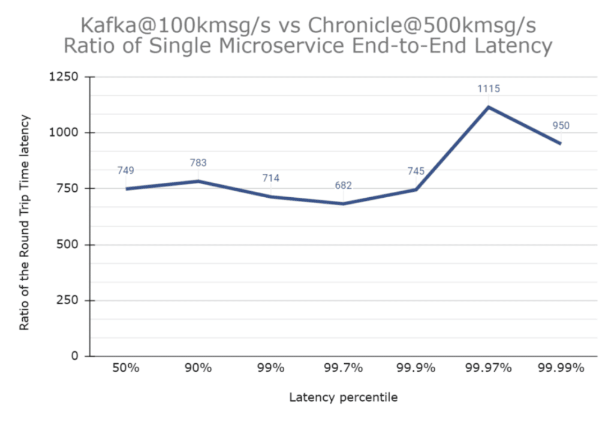

### Visualising Delay as a Distance

In order to illustrate the difference, let me start with an analogy.

Light travels through optic fibre and copper at about two thirds the speed of light in a vacuum, so to appreciate very short delays, they can be visualised as the distance a signal can travel in the time.

This can really matter when you have machines in different data centres.

#### Microservice Latency Using Chronicle

The 99%ile single microservice end-to-end latency for Chronicle Queue Enterprise at 500k msg/s was 3.69 microseconds.

To visualise this timeframe, a signal travels a distance of 750 m. This can be compared to a 10-minute walk in central London.

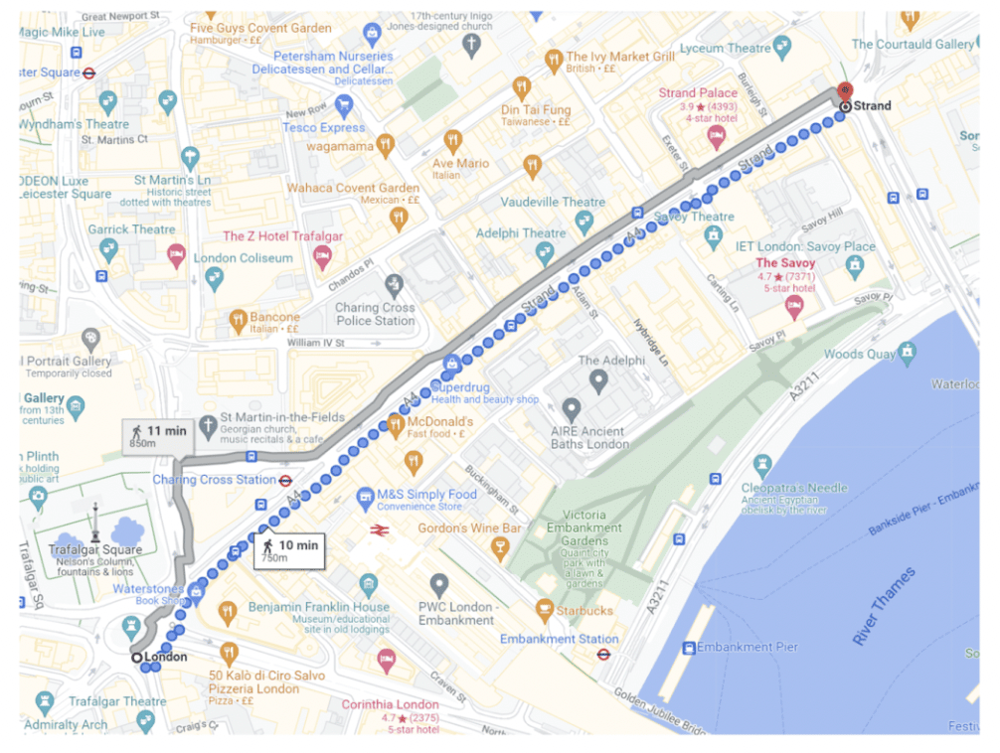

#### Microservice Latency Using Kafka

Using Kafka for the same test, but at a lower throughput of 100k msg/s the 99%ile single-stage microservice end-to-end latency was around 2633 microseconds (from 150k msg/s, the latencies increase dramatically).

To use the same analogy as above, this is the time it takes for a signal to travel 526 km. If you walk this distance from London, you will for example end up in Dumfries in Scotland and you will need to walk for over 100 hours.

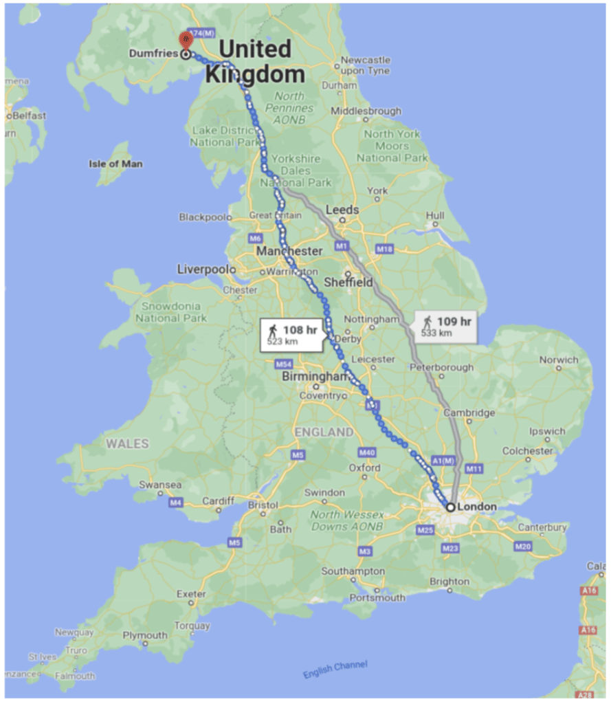

### Log Aggregation

Kafka was originally designed for log aggregation.

It has many connectors and for this use case, it does an excellent job.

I measured good results which show [using Kafka](https://docs.confluent.io/cloud/current/client-apps/optimizing/latency.html "using Kafka") to replace writing to log files in a typical system could improve performance as well as give significantly more manageability

#### Test Scenarios

In each case, the same test hardness was used. Everything was deployed onto a Ryzen 9 5950X running Ubuntu 21.04.

The same MP600 PRO XT 2TB M.2 NVMe drive was used in all tests.

The source for the benchmark is available [here](https://github.com/OpenHFT/Microservice-Benchmark "here").

* Chronicle Queue open-source v5.22ea14 writing at 500k messages/second, using Chronicle Wire for serialization. Single producer (and a single consumer downstream)  
  ` -Dworkload=500kps.yaml chronicle.yaml`
* Chronicle Queue Enterprise v2.22ea72 writing at 500k messages/second, using Chronicle Wire for serialization, Single producer in Asynchronous buffer mode (and a single consumer downstream)  
  ` -Dworkload=500kps.yaml chronicle-async.yaml`
* Kafka 3.0.0 with Jackson writing JSON at 100k message/second in high throughput latency configuration (primarily linger.ms=1) Four partitions and eight consumers  
  ` -Dworkload=100kps.yaml kafka.yaml`
* Kafka 3.0.0 with Jackson writing JSON at 250k message/second in high throughput latency configuration (primarily linger.ms=1) Four partitions and eight consumers.  
  ` -Dworkload=250kps.yaml kafka.yaml`

#### Notes

The number of partitions and consumers were selected which produced the best latencies 99.99% of the time.

For Chronicle Queue, the performance of 100k msg/s or 500k msg/s was much the same so I included the 500k msg/s results. One publisher, one consumer, and one microservice were used.

NOTE: An important design characteristic of Chronicle Queue is that the performance is largely insensitive to the number of publishers and consumers.

Benchmarking Kafka at 500k msg/s resulted in messages queuing, with latencies increasing the longer the benchmark ran. I.e. a 2-minute burst resulted in a typical latency of close to 1 minute.

For Kafka to process 250k msg/s at least four consumers were needed, and a benchmark with eight is reported here as this produced a better result. My understanding is this is a recommended scaling technique for Kafka.

The low latency configuration (linger.ms=0) failed for throughputs over 25k msg/s from a single producer.

### Publish Latency

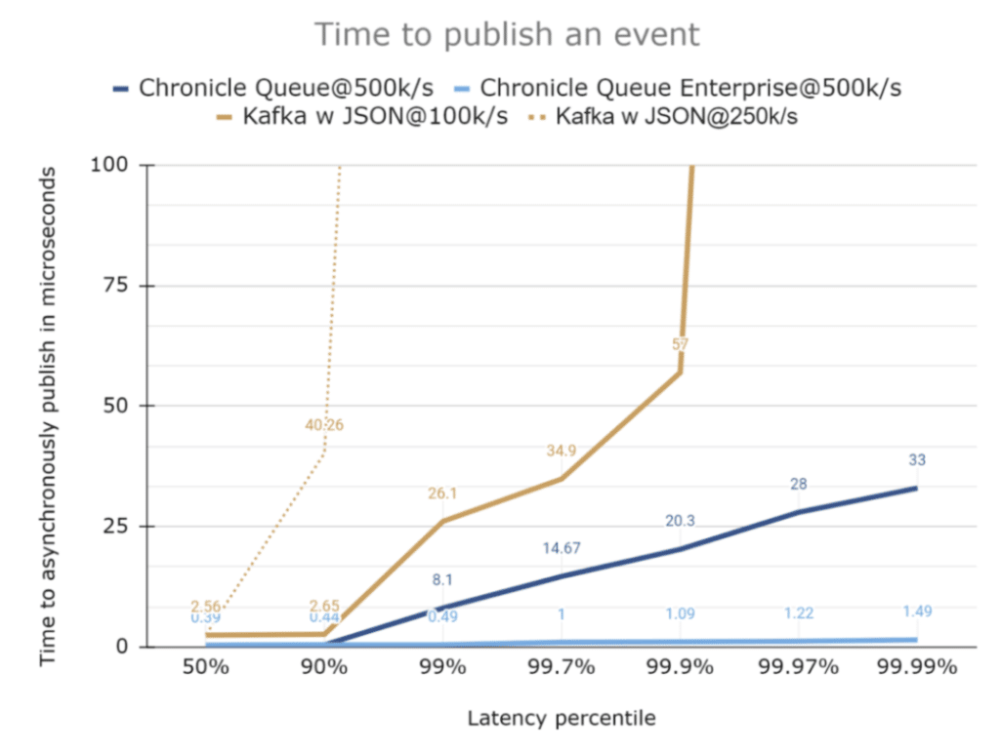  

As can be seen, the typical latency to publish is comparable. However, the outliers are much higher. Depending on the use case, the performance difference might not matter, and the typical latency across tests was no more than 2.6 microseconds.

In each case, the events published were 512-byte JSON messages. Two fields were added to trace when the message was sent.

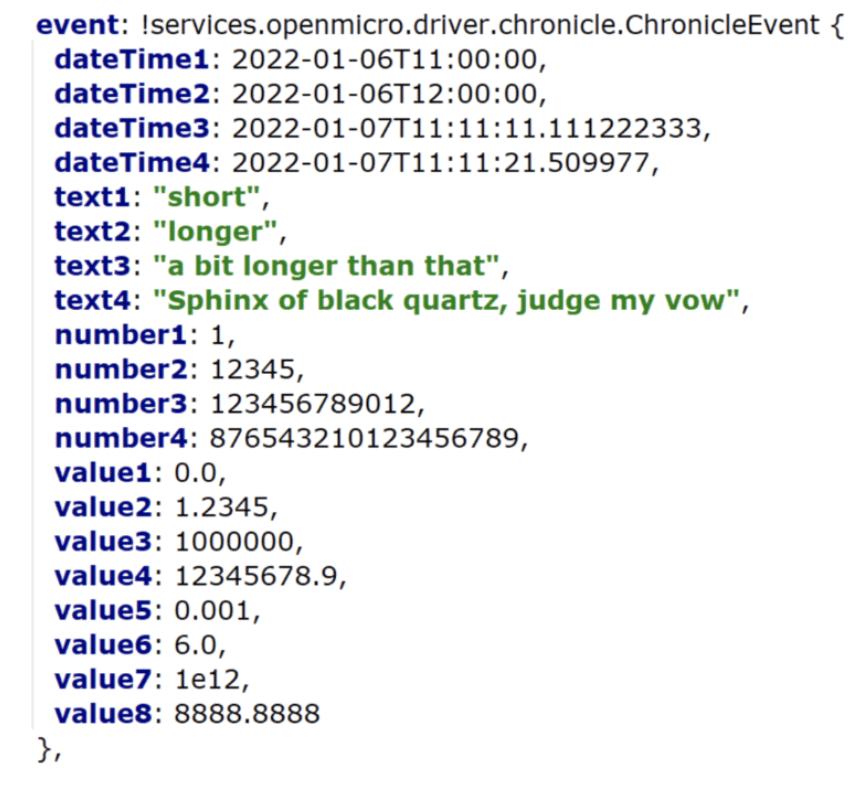

### Microservice Messaging Transport

While the time to publish, or the time to send/receive a pre-serialized message can be a good comparison of messaging solutions, this is only a piece of the puzzle.

For microservices, you need to know from the time you have a DTO describing the event to process until a downstream consumer reads the resulting DTO from the original microservice.

For a microservices benchmark, we look at the time to send the same event as above, end to end.

* Add a high-resolution timestamp (System.nanoTime())
* Serialize the first message
* Publish the first message
* Consume the first message
* Deserialize the first message
* Call the microservice
* Add a second high-resolution timestamp
* Serialize the second message on another topic/queue
* Publish the second message
* Consume the second message
* Deserialize the second message.
* Record the end to end latency

NOTE: every message produced creates a second message as a response, so the actual number of messages is doubled compared to a single-hop messaging benchmark.

### How does Kafka Perform in Their Published Benchmarks?

While publishing events on Kafka typically takes single-digit microseconds, the end-to-end transport can take **milliseconds**.

Confluent published a [benchmark](https://www.confluent.io/blog/kafka-fastest-messaging-system/ "benchmark") that is one-hop but includes replicated messaging. They report 99 percentile (worst 1 in 100) latencies of 5 milliseconds for an end-to-end time.

In our benchmark, we have two hops, serialization, and deserialization, all on one host. I expect that for 100k msg/s out and 100k msg/s returned we should get a similar delay as 200k msg/s over a single hop.

### End to End Latency

It's hard to illustrate how much lower latency Chronicle exhibits compared to Kafka, so in the series of charts below, each chart also has a zoomed-out version at 10x the scale of the previous one.

#### Latencies up to 100 microseconds

With the same scale as we had before, it can be seen that Chronicle Queue Enterprise has consistent latencies even across two hops including serialization.

Chronicle Queue open-source performs much the same most of the time, however, it has much higher latencies.

Chronicle Queue Enterprise includes specific features (over open source) to better control outliers. You can't see Kafka in this chart as the latencies are all much higher.

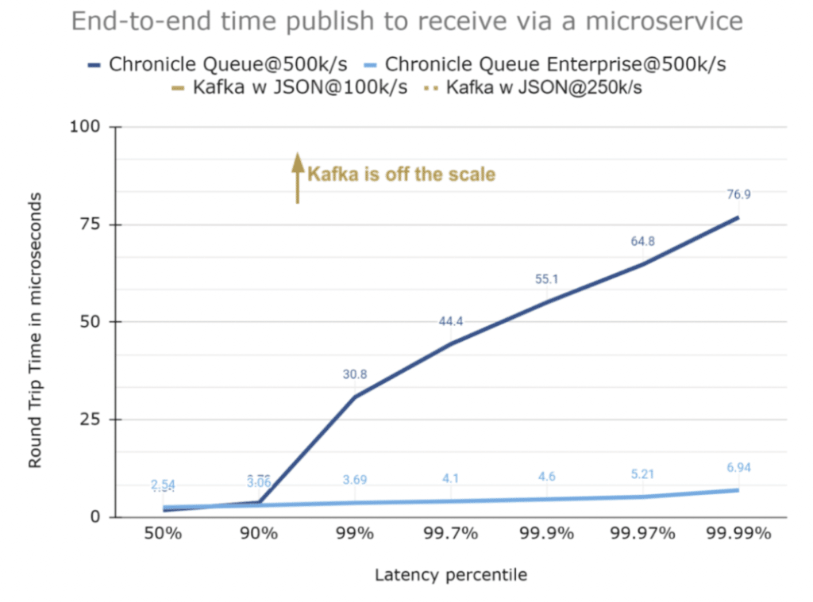

#### Latencies up to 1000 microseconds

The chart below has a 10x scale, and it can be seen that while Chronicle Queue has higher outliers they are reasonably consistent up to the 99.99 percentile. Kafka is yet to appear.

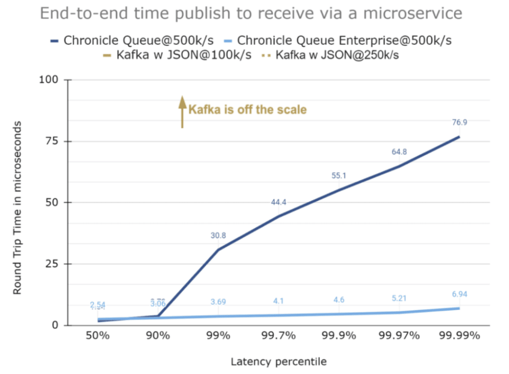

#### Latencies up to 10,000 microseconds

The chart below has a scale again made 10x larger. In this scale, not much detail can be seen for the Chronicle benchmarks, but the typical latencies for two of the Kafka configurations now appear.

In particular, it can be seen that the 99% latency for 100k msg/s (200k msg/s total) is around 2,630 microseconds, similar to the 5 milliseconds for Confluent's benchmark.

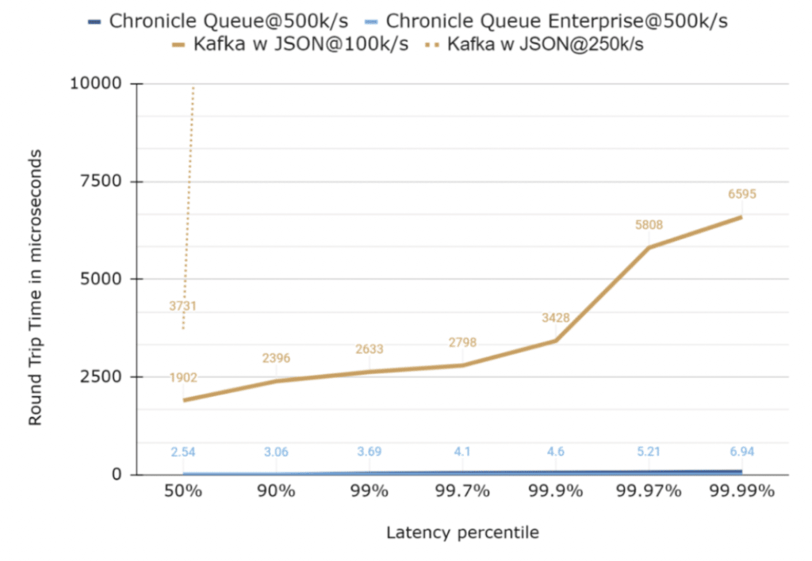

#### Using a logarithmic scale for the latencies

With a large range of values, it can be useful to use a logarithmic scale.

While this can be more readable, it can be harder to appreciate how different the latencies are as many people are not used to reading logarithmic scale charts.

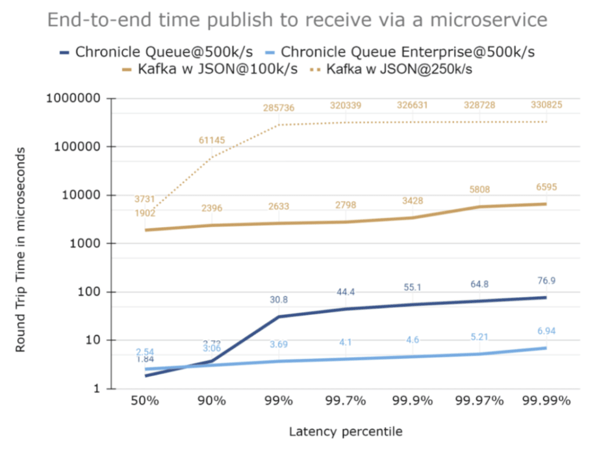

### How much higher are the latencies?

Another way to visualise just how much higher the latencies are for Kafka is to plot the ratio of latencies between Kafka and Chronicle.

The chart below is a plot of the ratio of latencies between Kafka@100k msg/s which is one of the best results, and Chronicle Queue Enterprise@500k msg/s ie at 5x the load.

Kafka is consistently at least 680x slower for this benchmark, even for one-fifth of the throughput.

For Kafka to achieve its lowest latencies with a 100k msg/s throughput, four partitions and eight microservices were used, however, Chronicle Queue only needed one in all cases.

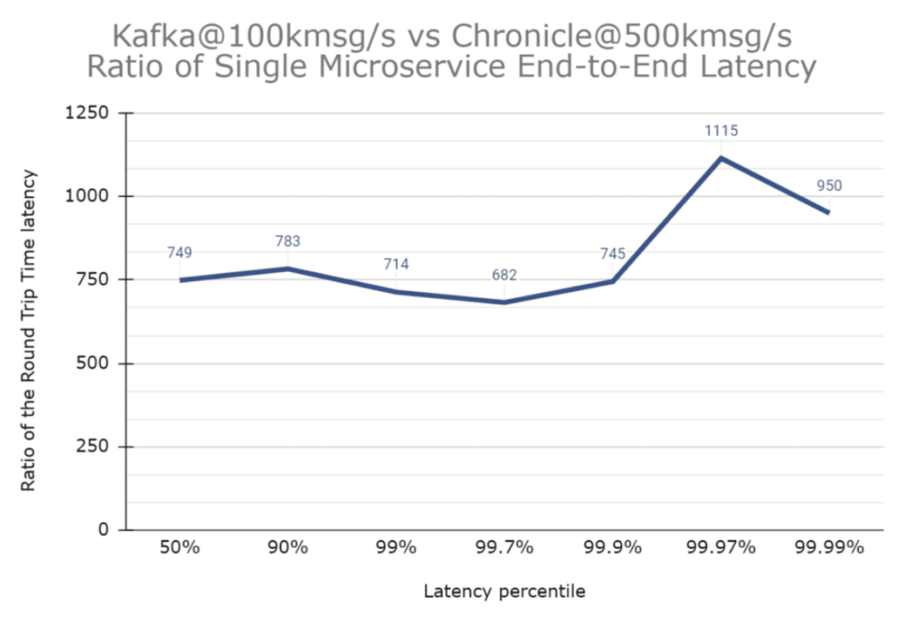

### Heap usage

#### Chronicle Queue Heap Usage

The Chronicle Queue benchmark with 500k msg/s for 5 minutes (300 million messages total), used a peak heap size of 40 MB with the G1 collector and default GC parameters.

The benchmark runs with a 32 MB heap. No GCs occurred after warm-up.

NOTE: Most of the garbage is from the Flight Recorder doing its job and Chronicle Queue doesn't use the standard Java serialization features.

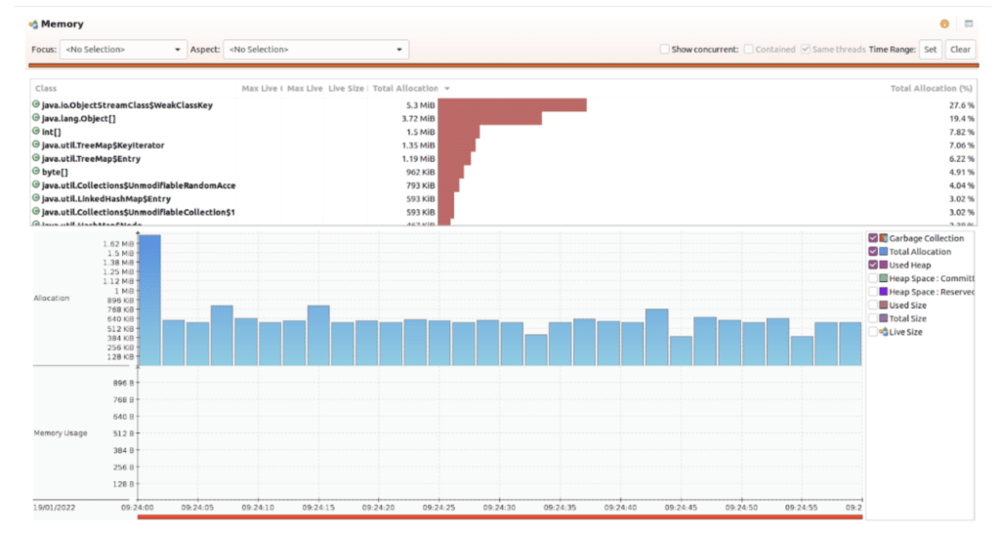

#### Kafka memory usage

The Kafka benchmark of 250k/s messages for 10 minutes (300 million messages total), used a peak of 2.87 GB of the heap and triggered 2,410 young pause collections, and 182 concurrent cycle collections after warm-up.

This can be run with a 128 MB heap size but results in over 139k GCs which is sub-optimal.

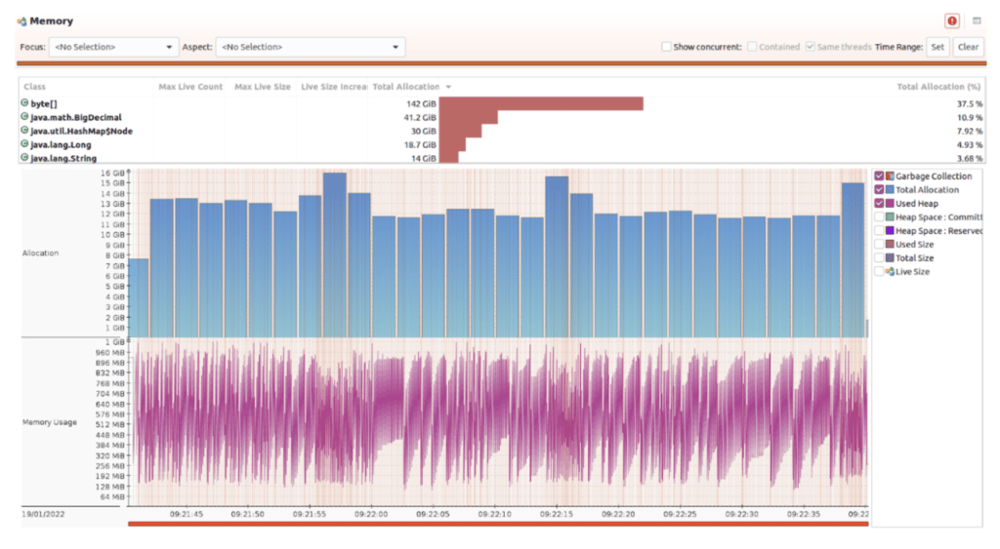

### Conclusion

While Kafka is a good choice for log aggregation, it might not be low latency enough for many use cases involving microservices due to its relatively high end-to-end latencies.

[Chronicle Queue open-source](https://chronicle.software/queue/ "Chronicle Queue open-source") achieves consistent latencies below 100 microseconds more than 99.99% of the time while Kafka had outliers of 7 ms even at 1/5th of the throughput.

[Chronicle Queue Enterprise](https://chronicle.software/queue-enterprise/ "Chronicle Queue Enterprise") has additional features to keep latencies more consistent with latencies of below 10 microseconds more than 99.99% of the time.
