In this article, we're going to take a look at different ways to view your external dependencies in IntelliJ IDEA.

## Introduction

If you're working on a real-world application, your project will probably use external libraries and frameworks.

Occasionally, you might want to see which dependencies your project uses, for various reasons.

There are several ways to view dependencies in [IntelliJ IDEA](https://www.jetbrains.com/idea/ "IntelliJ IDEA").

Each view has a different focus.

## Dependency management config file

You can find direct dependencies in the dependency management config file. Direct dependencies are the dependencies that your project depends on directly.

They are declared in the dependency management config file.

One example is this pom.xml in a Maven project.

[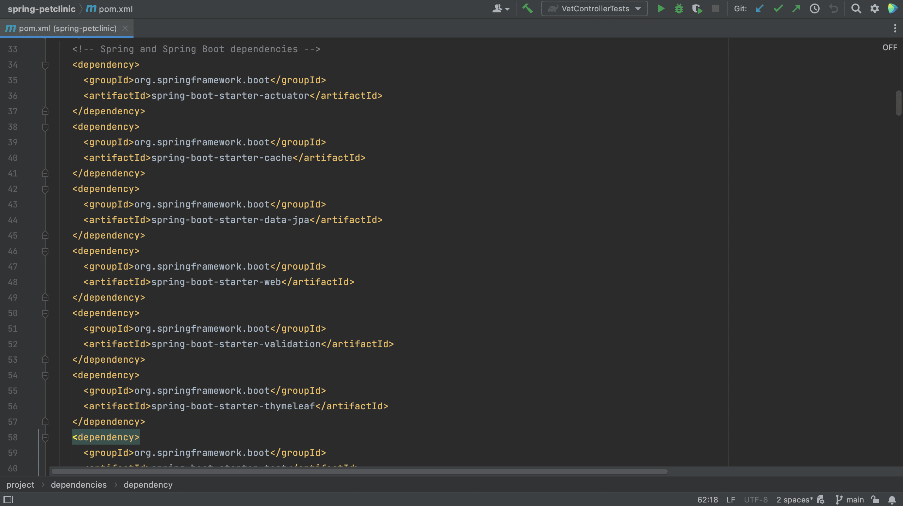](pom-xml.png "Maven pom.xml file")

Another example is the build.gradle in a Gradle project.

[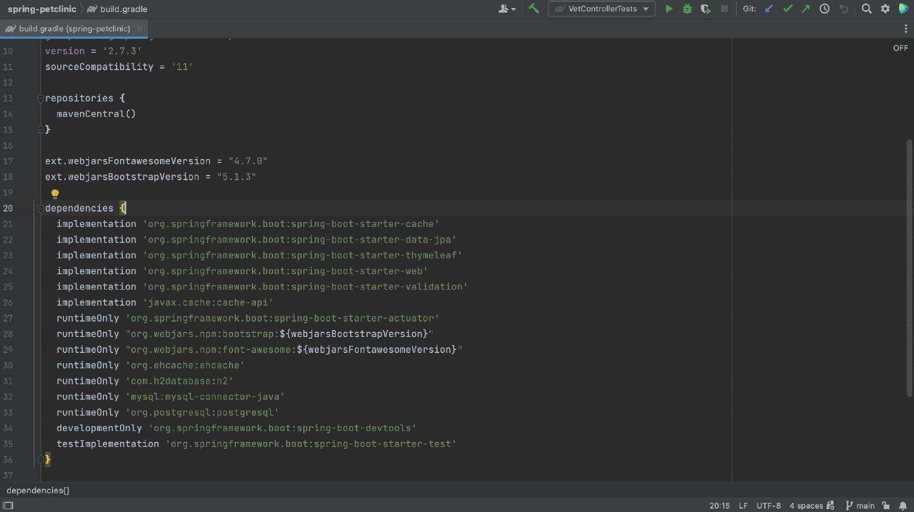](build-gradle.png "Gradle build.gradle file")

Note that the dependency management config file includes only declared dependencies and not their transitive dependencies (or the dependencies that these declared dependencies depend on).

## Project tool window

In the Project tool window, **⌘1** (on Mac) or **Alt+1** (on Windows/Linux), under External Libraries we can see all the JAR files needed by our application, including the transitive dependencies.

However, we cannot tell the difference between direct dependencies and transitive dependencies. One declared dependency might bring in multiple JAR files.

[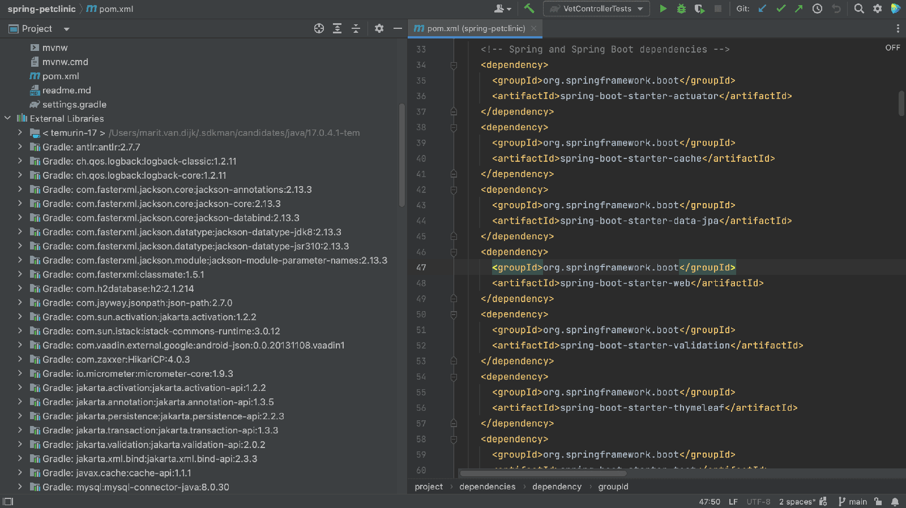](project-tool-window.png "Project tool window")

## Build tool window

To see direct dependencies and their transitive dependencies, we can look in the Build tool window. There is no shortcut to open the Build tool window.

We can open it by clicking Quick Launch in the bottom-left and selecting Gradle, or Maven depending on what we're using.

[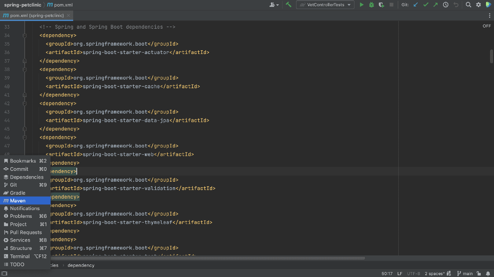](quick-launch-maven.png "Open the Build Tool Window in the Quick Launch menu")

[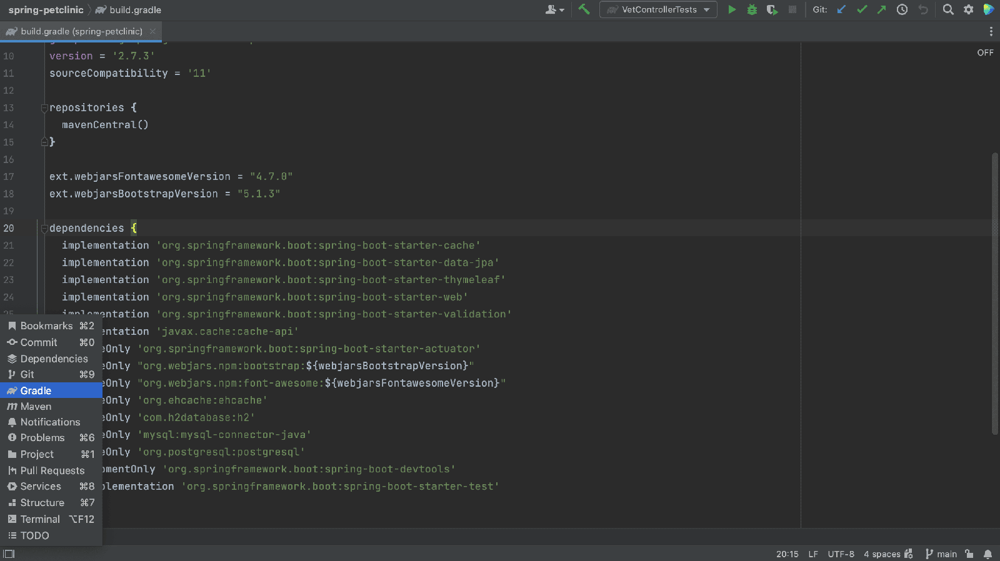](quick-launch-gradle.png "Open the Gradle Build Tool Window in the Quick Launch menu")

Alternatively, we can open it by using Recent Files, **⌘E** (on Mac) or **Ctrl+E** (on Windows/Linux), and typing "gradle" or "maven", or the name of your build system.

[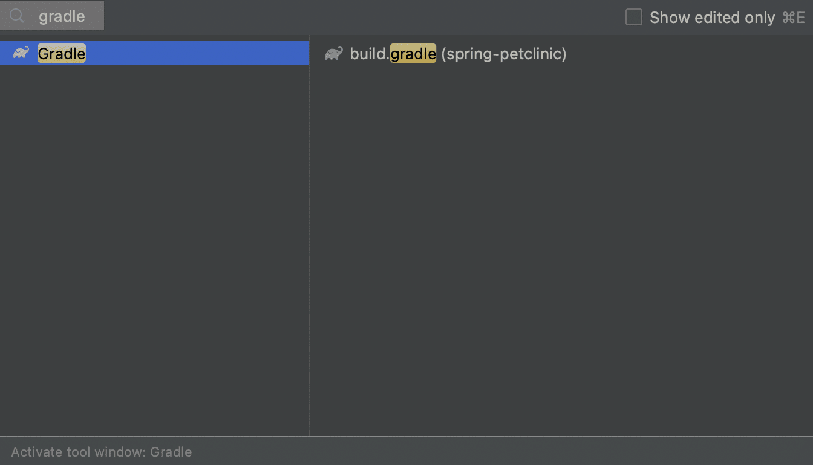](recent-files-gradle.png "Open the Gradle Build Tool Window using the Recent Files popup")

[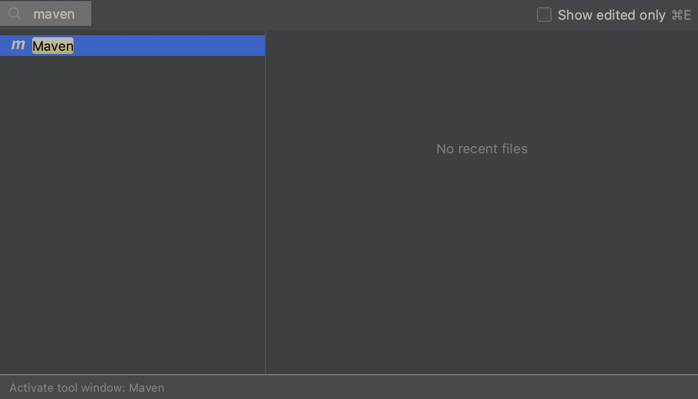](recent-files-maven.png "Open the Maven Build Tool Window using the Recent Files popup")

The Build tool window shows you each IntelliJ IDEA module separately, and each module's "Dependencies" folder shows you all your dependencies in a hierarchical structure.

We can expand our dependencies to see their transitive dependencies.

[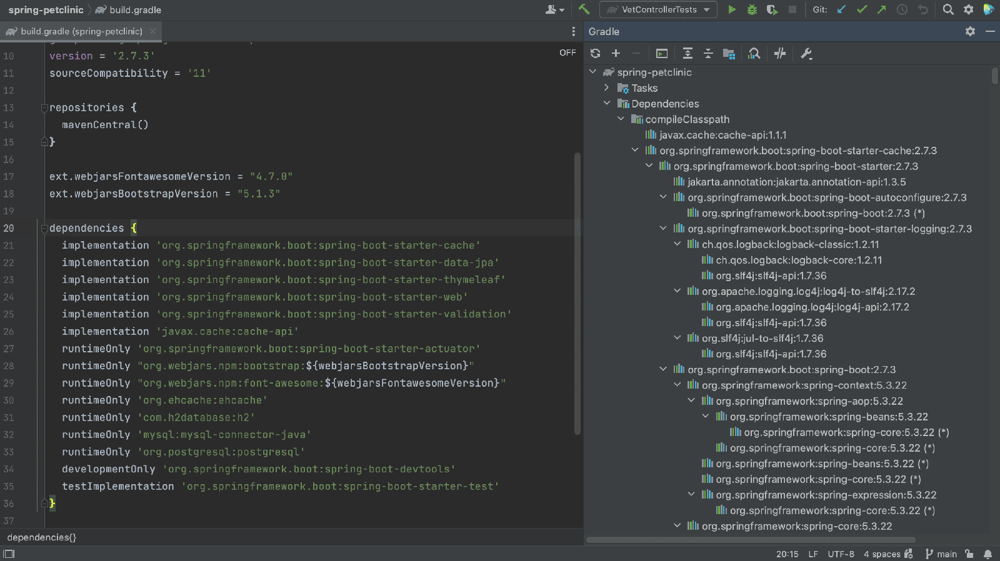](build-tool-window-gradle.png "Gradle Build Tool Window showing dependencies")

[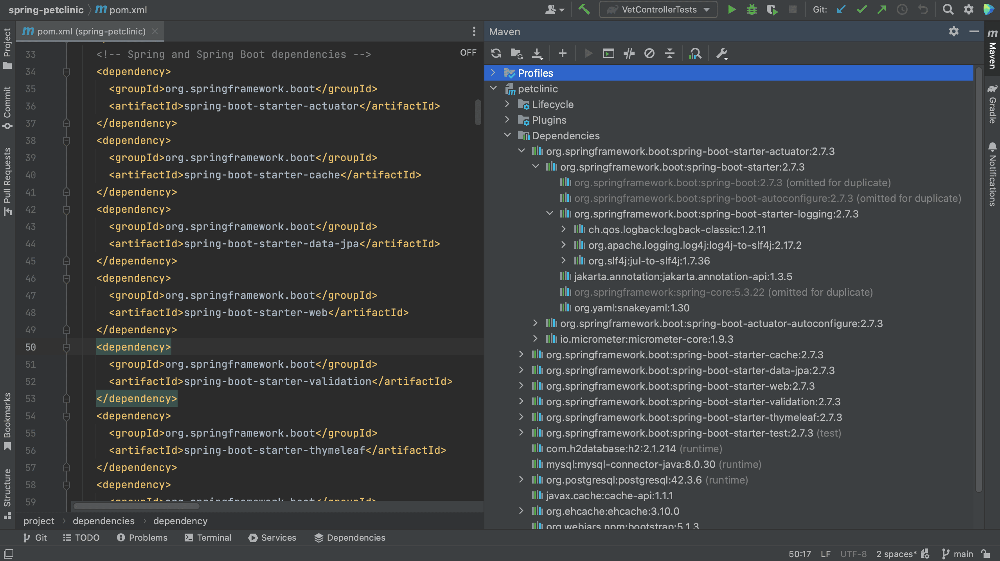](build-tool-window-maven.png "Maven Build Tool Window showing dependencies")

## Dependency tool window

Finally, we can view and manage dependencies in the Dependencies tool window. The Dependencies tool window becomes available when the current project has at least one supported module.

All types of dependencies are supported for Maven. For Gradle only a top level `dependencies { }` block is supported in the build script.

Since there is no shortcut to open the Dependencies tool window directly either, we can again use Recent Files, **⌘E** (on Mac) or **Ctrl+E** (on Windows/Linux), and type in "dependencies" to open the Dependencies tool window.

Alternatively, we can open it by clicking Quick Launch in the bottom-left and selecting Dependencies.

Here we can see our project's direct dependencies. Select "All Modules" to see the dependencies for all modules, or select an indivual module to see the dependencies for that specific module.

The Dependencies tool window shows direct dependencies, and not their transitive dependencies.

[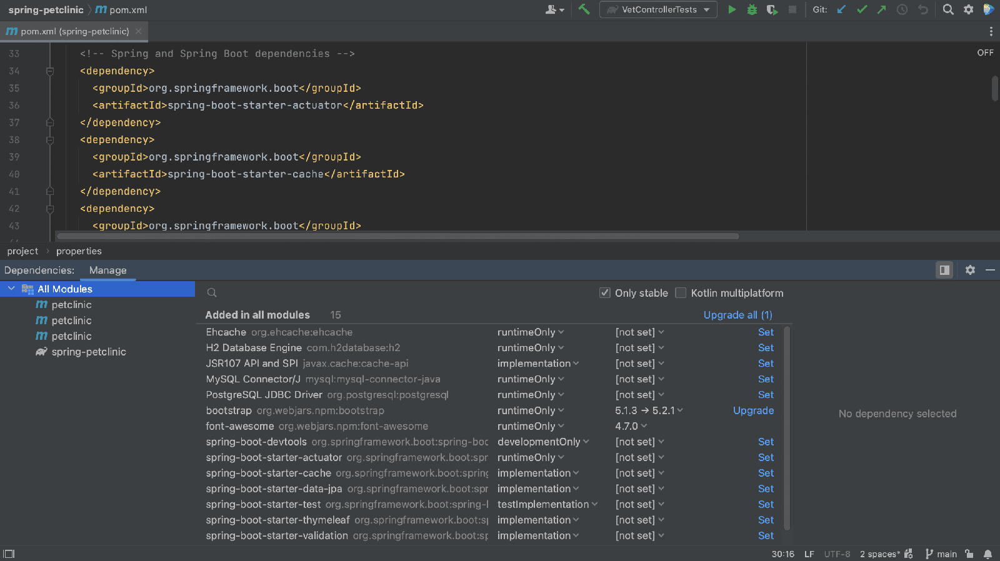](dependency-tool-window.png "Dependencies Tool Window")

We can see details about a selected dependency in the dependency details pane.

[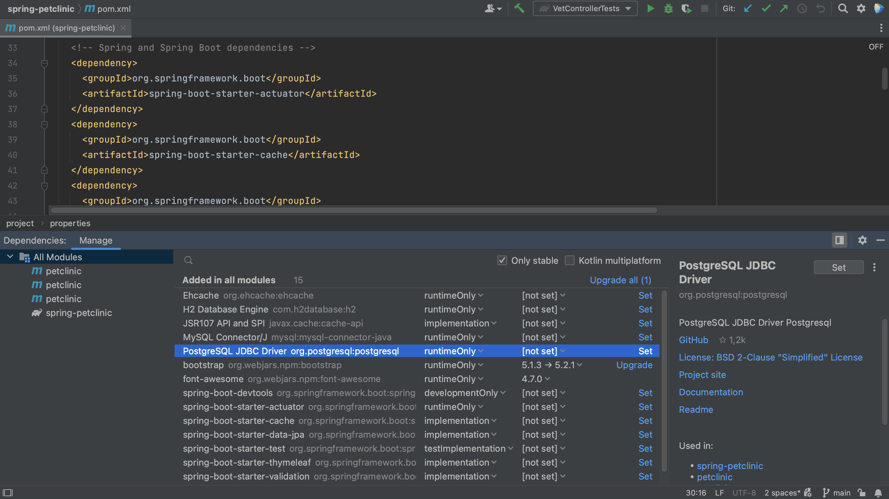](dependency-details-pane.png "Dependency Details Pane")

The dependency details pane displays the information about the selected dependency, such as:

* Repository or repositories where it's available, for example Maven Central
* A description if it is available
* GitHub information if the dependency sources are hosted on GitHub
* The licence under which an open source library is available
* A link to the project website, documentation and readme
* List of usages in the current module.
* Authors if available
* Supported Kotlin or Multiplatform platforms if it is a Kotlin Multiplatform dependency

## Summary and Shortcuts

Now we know the different ways in which we can view our project's dependencies in IntelliJ IDEA, and the different focus for each view.

### IntelliJ IDEA Shortcuts Used

Here are the IntelliJ IDEA shortcuts that we used.

|                                                          Name                                                          | macOS Shortcut | Windows / Linux Shortcut |
|------------------------------------------------------------------------------------------------------------------------|----------------|--------------------------|
| Open / Close [Project Tool Window](https://www.jetbrains.com/help/idea/project-tool-window.html "Project Tool Window") | ⌘1             | Alt+1                    |
| Recent Files                                                                                                           | ⌘E             | Control+E                |

### Related Links

* (video) JetBrains - Viewing Dependencies
* (docs) JetBrains - Package Search
* (code) JetBrains - intellij-samples
* (code) Spring PetClinic
