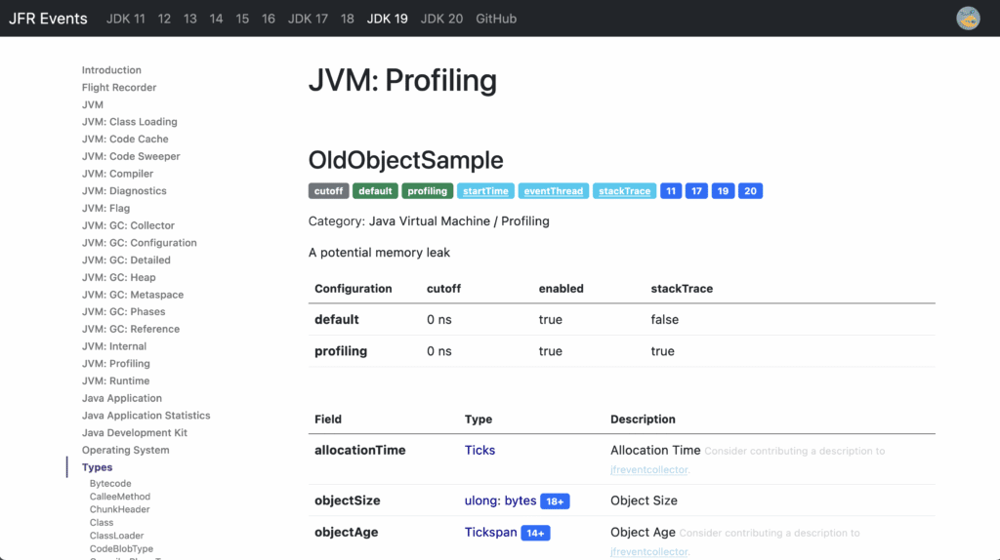
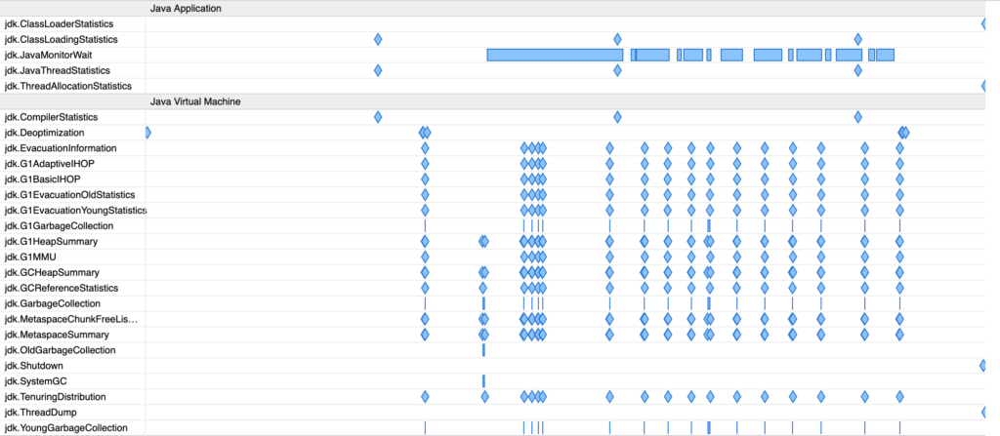
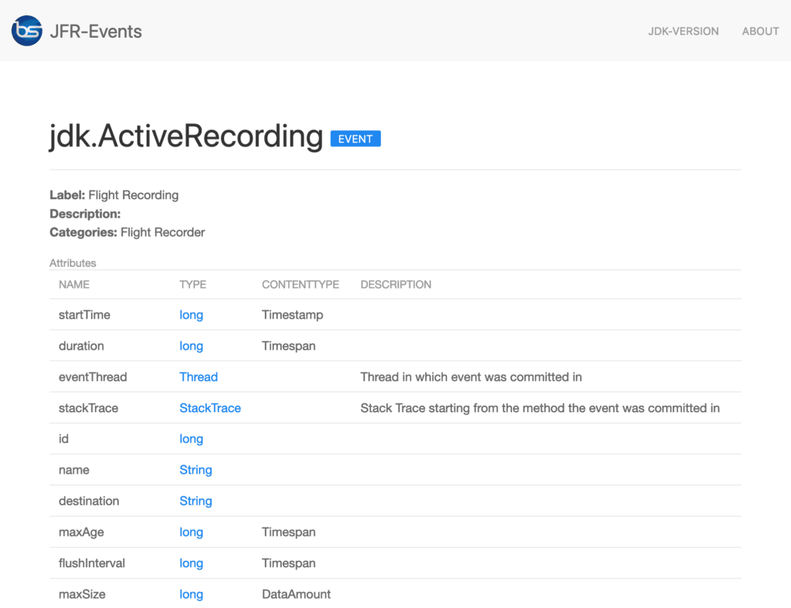
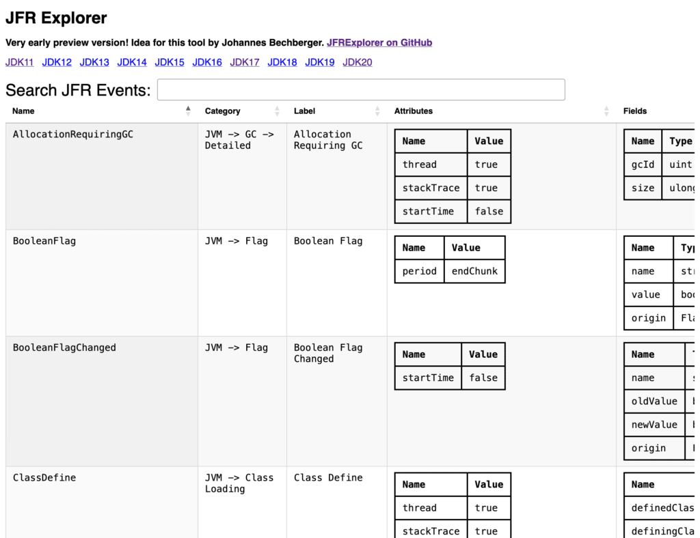

Ever wondered what all the JDK Flight Recorder events are, in which JDK versions they are supported, and what examples of an event looks like?

Wonder no more, I created the [JFR Event Collection](https://sapmachine.io/jfrevents) website which contains all this and more.
[](https://sapmachine.io/jfrevents)

This site gives you an up-to-date collection of all OpenJDK JFR events for every JDK since 11, giving you the following additional information:

* configuration properties
* fields with their types and description
* examples from a renaissance benchmark run
* with which GC this event appears
* [additional descriptions](https://github.com/parttimenerd/jfreventcollector/blob/main/additional.xml) collected by JFR users

The idea for this website came during the development of my prototypical JFR UI:


To improve this UI I needed to know more about the JFR events emitted by current JDKs. So I turned to the [jfr/metadata.xml](https://github.com/openjdk/jdk/blob/master/src/hotspot/share/jfr/metadata/metadata.xml) in the JDK source code:

```xml
...
<Event name="JavaMonitorEnter" category="Java Application" 
  label="Java Monitor Blocked" thread="true" stackTrace="true">
    <Field type="Class" name="monitorClass" label="Monitor Class" />
    <Field type="Thread" name="previousOwner" label="Previous Monitor Owner" />
    <Field type="ulong" contentType="address" name="address" 
      label="Monitor Address" relation="JavaMonitorAddress" />
</Event>
...
```

It specifies most events and gives you enough information in a rather concise format. But the events that are defined in the JFR source code as Java code are missing, so I turned to the website of [BestSolution](https://bestsolution-at.github.io/jfr-doc/openjdk-18.html) which shows all events:
[](https://bestsolution-at.github.io/jfr-doc/openjdk-18.html)

The problem is that it is not up-to-date (it is only available up to JDK 18), its generation seems to require every JDK version to be installed, which is a major hassle for automatization, and it does not include any examples and information on configurations.

I found example data in a repository by Petr Bouda called [jfr-playground](https://github.com/petrbouda/jfr-playground), but it is patchy and not yet integrated into a website.

So when I saw a few weeks back in the foojay Slack channel that Chris Newland is working on his [VM Options Explorer](https://chriswhocodes.com), I approached him with my idea for a new website. Our discussion lead to him creating his prototypical [JFR Events website](https://www.chriswhocodes.com/jfr_jdk20.html):
[](https://www.chriswhocodes.com/jfr_jdk20.html)

His website is still an early prototype but uses the same data set as mine. This shows that this dataset can be used for different websites and might later be used for my prototypical JFR UI too.

The project behind the website consists of two subprojects the website generator and the data source with an event collector.

The data on JFR events (fields, examples, JDK versions, ...) is collected by the [jfreventcollector](https://github.com/parttimenerd/jfreventcollector) extending the [jfr/metadata.xml](https://github.com/openjdk/jdk/blob/master/src/hotspot/share/jfr/metadata/metadata.xml) file, so that it contains the events defined in the JDK source code and all the other information shown on the website. The extended files are published in the [release](https://github.com/parttimenerd/jfreventcollector/releases/) section of the subproject and as a maven package with model classes for the XML elements. This is completely automated and only needs a current JDK installed.

Just add a dependency to the jfreventcollectionartifact:

```xml
<dependency>
    <groupId>me.bechberger</groupId>
    <artifactId>jfreventcollection</artifactId>
    <version>0.2</version>
</dependency>
```

Even the extended metadata file alone is useful:

```xml
...
<Event name="JavaMonitorEnter" label="Java Monitor Blocked"
  category="Java Application" experimental="false" thread="true"
  stackTrace="true" internal="false" throttle="false"
  cutoff="false" enabled="true" jdks="" startTime="true">
    <Field type="Class" name="monitorClass" label="Monitor Class" 
      struct="false" experimental="false" array="false" jdks=""/>
    <Field type="Thread" name="previousOwner" label="Previous Monitor Owner"
      struct="false" experimental="false" array="false" jdks=""/>
    <Field type="ulong" name="address" label="Monitor Address"
      relation="JavaMonitorAddress" contentType="address" struct="false"
      experimental="false" array="false" jdks=""/>
    <Configuration id="0" jdks="">
        <Setting name="enabled" jdks="">true</Setting>
        <Setting name="stackTrace" jdks="">true</Setting>
        <Setting name="threshold" control="locking-threshold" jdks="">20 ms</Setting>
    </Configuration>
...
</Event>
...
```

The website is generated by [jfrevents-site-generator](https://github.com/parttimenerd/jfrevents-site-generator) with depends on the data published by the collector and creates a [Twitter Bootstrap](https://getbootstrap.com/docs/5.0) based static HTML page using Kotlin and [mustache](https://github.com/spullara/mustache.java) templates. The generated website is then deployed to [sapmachine.io](https://sapmachine.io/jfrevents).

This website is hopefully helpful to all JFR users and Java profiling tool developers out there, the extended metadata being a good starting point for similar websites and tools which need metadata on JFR events.

Issues and pull requests are always welcome in both GitHub projects.

*This project is part of my work in the [SapMachine](https://sapmachine.io) team at [SAP](https://sap.com), making profiling easier for everyone. This article first appeared on my personal blog [mostlynerdless.de](https://mostlynerdless.de). Thanks to Chris Newland, Matthias Baesken, and Ralf Schmelter for their help.*
