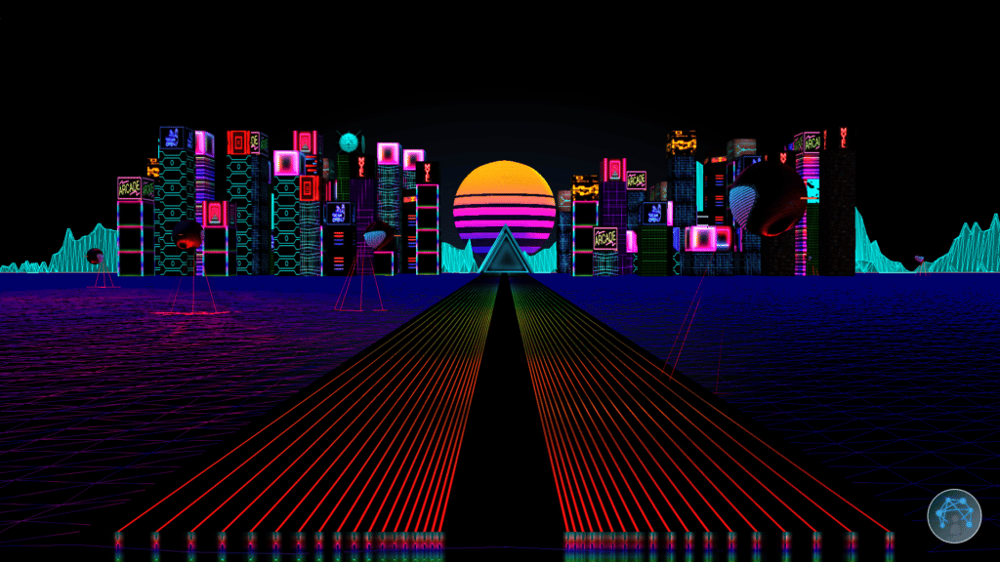
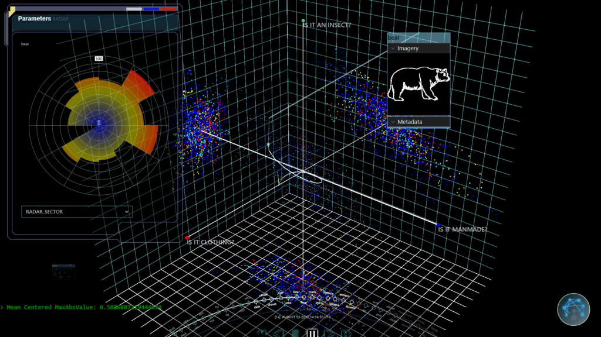
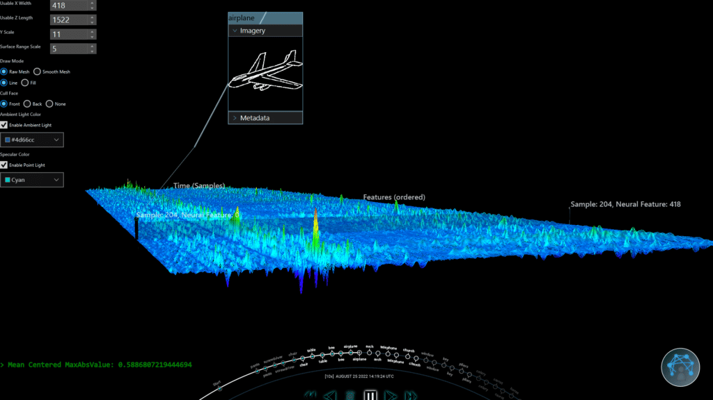

Recently [**Sean Phillips**](https://twitter.com/SeanMiPhillips) shared some fascinating screenshots on Twitter and videos on YouTube of **Trinity**, a JavaFX application he is working on.

He is a software engineer at the **Johns Hopkins University Applied Physics Laboratory** ([JHUAPL](https://www.jhuapl.edu/)), specializing in data visualization for multiple projects. JHUAPL works on various projects, ranging from medical work, building drones, cyber defense, and brain-computer interfaces to cislunar defense systems.

The project that caught my eye is a visual exploration tool to test and evaluate machine learning decision-making and decoding systems.

Based on many inputs, Trinity helps evaluate whether machine learning models produce the correct results. Artificial intelligence is a fascinating technology, but how can you prove that a model is working correctly? How can researchers dive into massive amounts of data to evaluate the results?

Trinity allows users to navigate and explore hundreds of layers in AI models and hyper-dimensional data by visualizing them in 3D.

<figure class="wp-block-gallery has-nested-images columns-default is-cropped wp-block-gallery-1 is-layout-flex wp-block-gallery-is-layout-flex">
 <figure class="wp-block-image size-large">
  
  <figcaption>
   Trinity intro and main menu
  </figcaption>
 </figure>
 <figure class="wp-block-image size-large">
  
  <figcaption>
   Trinity Hyperspace Tool
  </figcaption>
 </figure>
 <figure class="wp-block-image size-large">
  
  <figcaption>
   Trinity Hypersurface Tool
  </figcaption>
 </figure>
</figure>

## Project History

Trinity is a spinoff of an earlier project, Neurally Enhanced Operator (NEO), so its name was found in the Matrix universe.

Once the tool was created, it became clear it was easily extendable to be used in any project where massive amounts of data need to be visualized. It has now been further adapted to be used with machine learning models, but also to visualize Covid gene classification clustering to make decisions about tissue analysis.

Sean deliberately chose Java to handle big data sets at high speed in a multithreaded environment, while JavaFX provides the 2D and 3D tools to visualize all this.

## What Data is Used

As the tool is used in various projects, we look at one use case: **Brain-Computer Interfaces (BCI)**. For these projects, data is collected with non-invasive (head wraps with many cables) and invasive (brain implants) sensors.

Many of these projects would have been considered science fiction 20 years ago, but now the technology exists and is being researched. In this example, participants wear a non-invasive sensor wrap and look at a screen. Brain data is recorded while test images are shown.

The hyper-dimensional neural signals are captured from the brain, decoded, and mapped to a semantic meaning model. The semantic meaning, quantified as scores within a lower dimensional output, indicate what the image means to the viewer.

For example, how strongly does the viewer feel the image represents a building, or an insect or something edible.

This data can be processed by Trinity as JSON files or via ZeroMQ for live data up to 20.000 messages/second. By analyzing the hyper-dimensional neural data in Trinity and the semantic meaning output produced by the model, the scientists working on the project can evaluate the effectiveness of their models.

## Visualization Tools

The videos below are based on one experiment of 14 minutes that produces a 100MB JSON file with data.

This data set is very dense both vertically and horizontally, with many vectors of data containing a total of more than one million data points.

### Hypersurface Tool

The first video shows the tool used to visualize the **hyper-dimensional input data**. These are the raw signals from the BCI collected over a certain amount of time. There are 418 neural signals horizontally arranged from left to right. The Z-axis going "into the screen" is the time. The data close to you is on timestamp 0, and the end of the recording is furthest away "in" the screen.

The magnitude of the neural signal can be a positive or negative value and is shown with a color range from red (= extreme) to blue (= neutral). Most of the signals can be interpreted as noise (blue).

The colored spikes show when an image was presented on the screen, and the participant's brain became more active. This tool is interactive, allowing the researcher to take a deeper look at the spikes.



### Hyperspace Tool

This tool provides a **scatterplot** system for visualizing the **transformed model outputs**, in this case semantic meaning. This is an essential tool for the researchers, as it shows the data after it has been processed by the model to make a data reduction.

In this video, you see how the model has handled the BCI data via a decoder through the semantic space to interpret the image seen by the participant. It allows the researchers to take a look at the data in a visual way instead of going through many lines of data and trying to find a pattern in them.

It helps them to determine if the model is correctly decoding and handling the data.



## Why Java and JavaFX are the Perfect Tools

Many programming languages can handle millions of data points, Java allows doing so at speed while also providing easy to implement visualizations.

For Trinity to be able to fluently visualize all this data, it has to calculate the results within 15 milliseconds. Only then a smooth user interface can be produced at 60 frames per second. With Java, the two biggest challenges are solved: handle a massive amount of data "behind the scenes" while providing an optimal user experience!

Generating 3D renders can be harder than traditional 2D user interfaces, it is truly an extra dimension to master, both visually and in code! JavaFX has a fantastic 2D system and a "decent" 3D. It is not the ideal solution for a 3D game, but perfect for the Trinity use case.

Sean believes that with some extra "love and care," the 3D implementation of JavaFX could become the industry standard for many more applications once some missing features, like custom shaders, would be added.

## What is used for Trinity?

Trinity is built thanks to many tools the Java community provides:

* [Apache NetBeans](https://netbeans.apache.org/), all the time, Sean will never stop using it as his IDE
* OpenJDK 18
* OpenJFX 18
* Maven
* Gradle for jlink + jpackage: native deployments
* [FXyz3D](https://github.com/FXyz/FXyz): JavaFX 3D visualization and component library
* [Charts](https://github.com/HanSolo/charts): library for scientific charts in JavaFX
* [LitFX](https://github.com/Birdasaur/LitFX): 3D special FX
* [JeroMQ](https://github.com/zeromq/jeromq): pure Java implementation of ZeroMQ

## Conclusion

Sean admits he is opinionated about Java, after all, he is a Java Champion!

But it's his firm opinion that Java+JavaFX is one of the very few combinations that could provide him with the tools he needed to get this job done in the time he had.

As the requirements are about performance and smooth interactions, it would have been difficult to achieve the same results with other technologies.

Yes, with a lot of time and effort, you could build similar applications in, for instance, the browser, but that would already require different frameworks like WebGL and Vue.js to build the same user experience.

And taking the amount of data and required frames per second, running all this in a browser would have been a no-go.

As he states: "Web apps work for simpler problems. The limited time I have in this life, I want to spend on interesting stuff, not web apps! As I have done most of this project in my spare time with a limited budget, I choose **the most powerful tools I could use: Java and JavaFX**."
