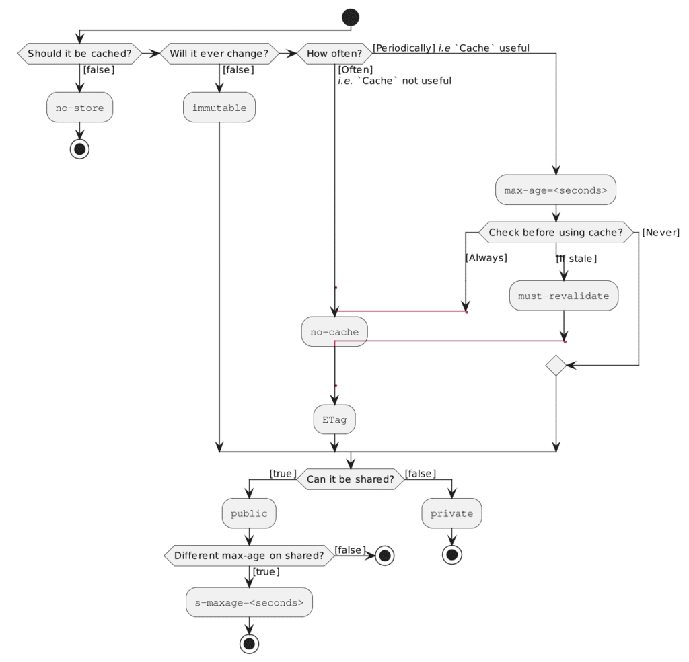
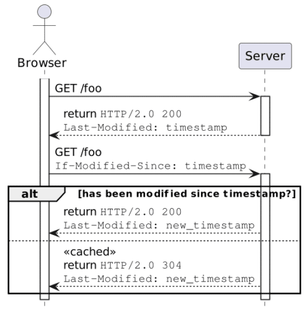

The subject of Web resource caching is as old as the World Wide Web itself.

However, I'd like to offer an as-exhaustive-as-possible catalog of how one can improve performance by caching.

Web resource caching can happen in two different places: client-side - on the browser and server-side.

This article is dedicated to the former; the next article will focus on the latter.

Caching 101 {#h2-0-caching-101}
-------------------------------

The idea behind caching is simple: if a resource is a time- or resource-consuming to compute, do it once and store the result.

When somebody requests the resource afterward, return the stored result instead of computing it a second time. It looks simple - and it is, but the devil is in the detail, as they say.

The problem is that a "computation" is not a mathematical one. In mathematics, the result of a computation is constant over time.

On the Web, the resource you requested yesterday may be different if you request it today. Think about the weather forecast, for example. It all boils down to two related concepts: **freshness** and **staleness**.
> A fresh response is one whose age has not yet exceeded its freshness lifetime. Conversely, a stale response is one where it has.
>
> A response's freshness lifetime is the length of time between its generation by the origin server and its expiration time. An explicit expiration time is the time at which the origin server intends that a stored response can no longer be used by a `Cache` without further validation, whereas a heuristic expiration time is assigned by a `Cache` when no explicit expiration time is available. A response's age is the time that has passed since it was generated by, or successfully validated with, the origin server.
>
> When a response is "fresh" in the cache, it can be used to satisfy subsequent requests without contacting the origin server, thereby improving efficiency.
>
> -- [RFC 7234 - 4.2. Freshness](https://www.rfc-editor.org/rfc/rfc7234#section-4.2)

Early Web resource caching {#h2-1-early-web-resource-caching}
-------------------------------------------------------------

Remember that the WWW was relatively simple at its beginning compared to nowadays. The client would send a request, and the server would return the requested resource. When the resource was a page, whether it was a static page or a server-rendered page was unimportant. Hence, early client-side caching was pretty "rustic".

The first specification of Web caching is defined in [RFC 7234](https://www.rfc-editor.org/rfc/rfc7234), *aka* HTTP/1.1 Caching, in 2014. Note that it has been superseded by [RFC 9111](https://www.rfc-editor.org/rfc/rfc9111) since 2022.

I won't talk here about the `Pragma` HTTP header since it's deprecated. The most straightforward cache management is through the `Expire` response header. When the server returns the resource, it specifies after which timestamp the cache is stale. The browser has two options when a cached resource is requested:

* Either the current time is *before* the expiry timestamp: the resource is considered fresh, and the browser serves it from the local cache
* Or it's *after*: the resource is considered stale, and the browser requires the resource from the server as it was not cached

The benefit of `Expire` is that it's a purely local decision. It doesn't need to send a request to the server. However, it has two main issues:

* The decision to use the locally cached resource (or not) is based on heuristics. The resource may have changed server-side despite the `Expiry` value being in the future, so the browser serves an out-of-date resource. Conversely, the browser may send a request because the time has expired, but the resource hasn't changed.
* Moreover, `Expire` is pretty basic. A resource is either fresh or stale; either return it from the `Cache` or send the request again. We may want to have more control.

Cache-Control to the rescue {#h2-2-cache-control-to-the-rescue}
---------------------------------------------------------------

The `Cache-Control` header aims to address the following requirements:

* Never cache a resource at all
* Validate if a resource should be served from the cache before serving it
* Can intermediate caches (proxies) cache the resource?

`Cache-Control` is an HTTP header used on the request **and** the response. The header can contain different directives separated by commas. Exact directives vary depending on whether they're part of the request or the response.

All in all, `Cache-Control` is quite complex. It might be well the subject of a dedicated post; I won't paraphrase the [specification](https://www.rfc-editor.org/rfc/rfc9111#name-cache-control).

However, here's a visual help on how to configure `Cache-Control` response headers.



The [Cache Control](https://developer.mozilla.org/en-US/docs/Web/HTTP/Headers/Cache-Control#use_cases) page of Mozilla Developer Network has some significant use cases of `Cache-Control`, complete with configuration.

As `Expire`, `Cache-Control` is also **local**: the browser serves the resource from its cache, if needed, without any request to the server.

Last-Modified and ETag {#h2-3-last-modified-and-etag}
-----------------------------------------------------

To avoid the risk of serving an out-of-date resource, the browser **must** send a request to the server. Enters the `Last-Modified` response header. `Last-Modified` works in conjunction with the `If-Modified-Since` *request* header:
> The `If-Modified-Since` request HTTP header makes the request conditional: the server sends back the requested resource, with a `200` status, only if it has been last modified after the given date. If the resource has not been modified since, the response is a `304` without any body; the `Last-Modified` response header of a previous request contains the date of last modification. Unlike `If-Unmodified-Since`, `If-Modified-Since` can only be used with a `GET` or `HEAD`.
>
> -- [If-Modified-Since](https://developer.mozilla.org/en-US/docs/Web/HTTP/Headers/If-Modified-Since)

Let's use a diagram to make clear how they interact:



<br />

Note: the `If-Unmodified-Since` has the opposite function for `POST` and other non-idempotent methods. It returns a `412 Precondition Failed` HTTP error to avoid overwriting resources that have changed.

The problem with timestamps in distributed systems is that it's impossible to guarantee that all clocks in the system have the same time. Clocks drift at different paces and need to [synchronize](https://en.wikipedia.org/wiki/Clock_synchronization) to the same time at regular intervals. Hence, if the server that generated the `Last-Modified` header and the one that receives the `If-Modified-Since` header are different, the results could be unexpected depending on their drift. Note that it also applies to the `Expire` header.

Etags are an alternative to timestamps to avoid the above issue. The server computes the hash of the served resource and sends the `ETag` header containing the value along with the resource. When a new request comes in with the `If-None-Match` containing the hash value, the server compares it with the current hash. If they match, it returns a `304` as above.

It has the slight overhead of computing the hash vs. just handing the timestamp, but it's nowadays considered a good practice.

The Cache API {#h2-4-the-cache-api}
-----------------------------------

The most recent way to cache on the client side is via the [Cache API](https://developer.mozilla.org/en-US/docs/Web/API/Cache). It offers a general cache interface: you can think of it as a local key-value provided by the browser.

Here are the provided methods:

|------------------------------------|--------------------------------------------------------------------------------------------------------------------------------------------------------------------------------------------------------------------|
| `Cache.match(request, options)`    | Returns a `Promise` that resolves to the response associated with the first matching request in the `Cache` object.                                                                                                |
| `Cache.matchAll(request, options)` | Returns a `Promise` that resolves to an array of all matching responses in the `Cache` object.                                                                                                                     |
| `Cache.add(request)`               | Takes a URL, retrieves it and adds the resulting response object to the given cache. This is functionally equivalent to calling `fetch()`, then using `put()` to add the results to the cache.                     |
| `Cache.addAll(requests)`           | Takes an array of URLs, retrieves them, and adds the resulting response objects to the given cache.                                                                                                                |
| `Cache.put(request, response)`     | Takes both a request and its response and adds it to the given cache.                                                                                                                                              |
| `Cache.delete(request, options)`   | Finds the `Cache` entry whose key is the request, returning a `Promise` that resolves to `true` if a matching `Cache` entry is found and deleted. If no `Cache` entry is found, the `Promise` resolves to `false`. |
| `Cache.keys(request, options)`     | Returns a `Promise` that resolves to an array of `Cache` keys.                                                                                                                                                     |

The Cache API works in conjunction with [Service Workers](https://developer.mozilla.org/en-US/docs/Web/API/Service_Worker_API/Using_Service_Workers). The flow is simple:

1. You register a service worker on a URL
2. The browser calls the worker before the URL fetch call
3. From the worker, you can return resources from the cache and avoid **any** request to the server

It allows us to put resources in the cache after the initial load so that the client can work offline - depending on the use case.

Summary {#h2-5-summary}
-----------------------

Here's a summary of the above alternatives to cache resources client-side.

| Order |        Alternative         | Managed by | Local |         Pros         |                               Cons                                |
|-------|----------------------------|------------|-------|----------------------|-------------------------------------------------------------------|
| 1     | Service worker + Cache API | You        | Yes   | Flexible             | * Requires JavaScript coding skills * Coding and maintenance time |
| 2     | `Expire`                   | Browser    | Yes   | Easy configuration   | * Guess-based * Simplistic                                        |
| 2     | `Cache-Control`            | Browser    | Yes   | Fine-grained control | * Guess-based * Complex configuration                             |
| 3     | `Last-Modified`            | Browser    | No    | Just works           | Sensible to clock drift                                           |
| 3     | `ETag`                     | Browser    | No    | Just works           | Slightly more resource-sensitive to compute the hash              |

Note that those alternatives aren't exclusive. You may have a short `Expire` header and rely on `ETag`. You should probably use both a level 2 alternative and a level 3.

A bit of practice {#h2-6-a-bit-of-practice}
-------------------------------------------

Let's put the theory that we have seen above into practice. I'll set up a two-tiered HTTP cache:

* The first tier caches resources locally for 10 seconds using `Cache-Control`
* The second tier uses `ETag` to avoid optimizing the data load over the network

I'll use [Apache APISIX](https://apisix.apache.org/). APISIX sits on the shoulder of giants, namely NGINX. NGINX adds `ETag` response headers *by default*.

We only need to add the `Cache-Control` response header. We achieve it with the `response-rewrite` plugin:

```yaml
upstreams:
  - id: 1
    type: roundrobin
    nodes:
      "content:8080": 1
routes:
  - uri: /*
    upstream_id: 1
    plugins:
      response-rewrite:
        headers:
          set:
            Cache-Control: "max-age=10"
```


Let's do it *without a browser* first.

```bash
curl -v localhost:9080
```


```
HTTP/1.1 200 OK
Content-Type: text/html; charset=utf-8
Content-Length: 147
Connection: keep-alive
Date: Thu, 24 Nov 2022 08:21:36 GMT
Accept-Ranges: bytes
Last-Modified: Wed, 23 Nov 2022 13:58:55 GMT
ETag: "637e271f-93"
Server: APISIX/3.0.0
Cache-Control: max-age=10
```


To prevent the server from sending the same resource, we can use the `ETag` value in an `If-None-Match` request header:

```bash
curl -H 'If-None-Match: "637e271f-93"' -v localhost:9080
```


The result is a `304 Not Modified` as expected:

```
HTTP/1.1 304 Not Modified
Content-Type: text/html; charset=utf-8
Content-Length: 147
Connection: keep-alive
Date: Thu, 24 Nov 2022 08:26:17 GMT
Accept-Ranges: bytes
Last-Modified: Wed, 23 Nov 2022 13:58:55 GMT
ETag: "637e271f-93"
Server: APISIX/3.0.0
Cache-Control: max-age=10
```


Now, we can do the same inside a browser. If we use the *resend* feature a second time before 10 seconds have passed, the browser returns the resource from the cache without sending the request to the server.

Conclusion {#h2-7-conclusion}
-----------------------------

In this post, I described several alternatives to cache web resources: `Expiry` and `Cache-Control`, `Last-Modified` and `ETag`, and the Cache API and web workers.

You can easily set the HTTP response headers via a reverse proxy or an API Gateway. With Apache APISIX, ETags are enabled by default, and other headers are easily set up.

In the next post, I will describe caching server-side.

You can find the source code for this post on [GitHub](https://github.com/ajavageek/web-caching).

**Continue to part 2:**

[Web resource caching: Server-side](https://foojay.io/today/web-caching-server/)

**To go further:**

* [RFC 7234: HTTP/1.1: Caching (obsolete)](https://www.rfc-editor.org/rfc/rfc7234)
* [RFC 9111: HTTP Caching](https://www.rfc-editor.org/rfc/rfc9111)
* [HTTP caching](https://developer.mozilla.org/en-US/docs/Web/HTTP/Caching)
* [Cache-Control](https://developer.mozilla.org/en-US/docs/Web/HTTP/Headers/Cache-Control)
* [Prevent unnecessary network requests with the HTTP Cache](https://web.dev/http-cache/)
* [Cache API](https://developer.mozilla.org/en-US/docs/Web/API/Cache)
* [Service worker caching and HTTP caching](https://web.dev/service-worker-caching-and-http-caching/)

*Originally published at [A Java Geek](https://blog.frankel.ch/web-caching/client/) on November 27^th^, 2022*
