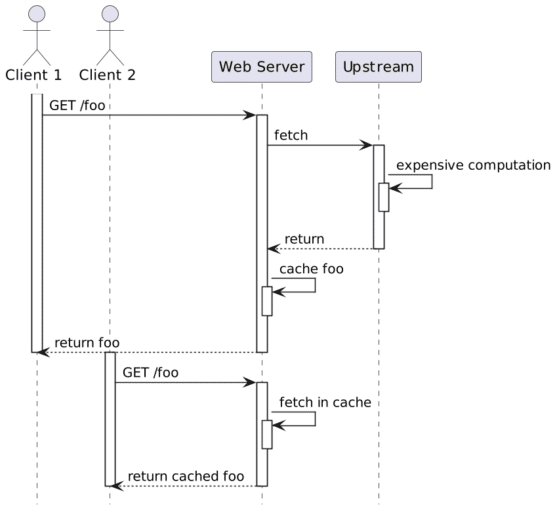

The subject of Web resource caching is as old as the World Wide Web itself.

However, I'd like to offer an as-exhaustive-as-possible catalog of how one can improve performance by caching.

Web resource caching can happen in two different places: client-side - on the browser and server side.

In the [previous post](https://foojay.io/today/web-caching-client/), I explained the former; this post focuses on the latter.

While client-side caching works well, it has one central issue: to serve the resource locally, it must first have it in the cache. Thus, each client needs its cached resource. If the requested resource is intensive to compute, it doesn't scale.

The idea behind server-side caching is to compute the resource once and serve it from the cache to all clients.



A couple of dedicated server-side resource caching solutions have emerged over the years: [Memcached](https://memcached.org/), [Varnish](https://varnish-cache.org/), [Squid](http://www.squid-cache.org/), etc. Other solutions are less focused on web resource caching and more generic, *e.g.* , [Redis](https://redis.io/) or [Hazelcast](https://hazelcast.com/).

If you want to dive deeper into generic caching solutions, please check these [two](https://blog.frankel.ch/choose-cache/1/) [posts](https://blog.frankel.ch/choose-cache/2/) on the subject.

To continue with the sample from last week, I'll use Apache APISIX to demo server-side caching. APISIX relies on the [proxy-cache](https://apisix.apache.org/docs/apisix/plugins/proxy-cache/) plugin for caching. Unfortunately, at the moment, APISIX doesn't integrate with any third-party caching solution. It offers two options: memory-based and disk-based.

In general, the former is faster, but memory is expensive, while the latter is slower, but disk storage is cheap. Within OpenResty, however, the disk option may be faster because of how LuaJIT handles memory. You should probably start with the disk, and if it's not fast enough, mount [/dev/shm](https://datacadamia.com/os/linux/shared_memory).

Here are my new routes:

```yaml
routes:
  - uri: /cache
    upstream_id: 1
    plugins:
      proxy-rewrite:
        regex_uri: ["/cache(.*)", "/$1"]
      proxy-cache: ~
```

Note that the default cache key is the host and the request URI, which includes query parameters.

The default `proxy-cache` configuration uses the default disk-based [configuration](https://github.com/apache/apisix/blob/master/conf/config-default.yaml#L53-L69):

```yaml
proxy_cache:                      # Proxy Caching configuration
  cache_ttl: 10s                  # The default caching time in disk if the upstream does not specify the cache time
  zones:                          # The parameters of a cache
    - name: disk_cache_one        # The name of the cache, administrator can specify
                                  # which cache to use by name in the admin api (disk|memory)
      memory_size: 50m            # The size of shared memory, it's used to store the cache index for
                                  # disk strategy, store cache content for memory strategy (disk|memory)
      disk_size: 1G               # The size of disk, it's used to store the cache data (disk)
      disk_path: /tmp/disk_cache_one  # The path to store the cache data (disk)
      cache_levels: 1:2           # The hierarchy levels of a cache (disk)
    - name: memory_cache
      memory_size: 50m
```

We can test the setup with `curl`:

```bash
curl -v localhost:9080/cache
```

The response is interesting:

```
< HTTP/1.1 200 OK
< Content-Type: text/html; charset=utf-8
< Content-Length: 147
< Connection: keep-alive
< Date: Tue, 29 Nov 2022 13:17:00 GMT
< Last-Modified: Wed, 23 Nov 2022 13:58:55 GMT
< ETag: "637e271f-93"
< Server: APISIX/3.0.0
< Apisix-Cache-Status: MISS                      #1
< Accept-Ranges: bytes
```

1. Because the cache is empty, APISIX has a cache miss. Hence, the response is from the upstream

If we `curl` again before the default cache expiration period (300 seconds), the response is from the cache:

```
< HTTP/1.1 200 OK
...
< Apisix-Cache-Status: HIT
```

After the expiration period, the response is from the upstream, but the header is explicit:

```
< HTTP/1.1 200 OK
...
< Apisix-Cache-Status: EXPIRED
```

Note that we can explicitly purge the entire cache by using the custom `PURGE` HTTP method:

```bash
curl localhost:9080/cache -X PURGE
```

After purging the cache, the above cycle starts anew.

Note that it's also possible to bypass the cache, *e.g.*, for testing purposes. We can configure the plugin accordingly:

```yaml
routes:
  - uri: /cache*
    upstream_id: 1
      proxy-cache:
        cache_bypass: ["$arg_bypass"]       #1
```

1. Bypass the cache if you send a `bypass` query parameter with a non-`0` value

```bash
curl -v localhost:9080/cache?bypass=please
```

It serves the resource from the upstream regardless of the cache status:

```
< HTTP/1.1 200 OK
...
< Apisix-Cache-Status: BYPASS
```

For more details on all available configuration parameters, check the [proxy-cache](https://apisix.apache.org/docs/apisix/plugins/proxy-cache/) plugin.

## Conclusion

This post was relatively straightforward. The most challenging issue with server-side caching is the configuration: what to cache, for how long, etc.

Unfortunately, it depends significantly on your context, problems, and available resources.

You probably need to apply : guesstimate a relevant configuration, apply it, measure the performance, and rinse and repeat until you find your sweet spot.

I hope that with an understanding of both client-side and server-side caching, you'll be able to improve the performance of your applications.

The source code is available on [GitHub](https://github.com/ajavageek/web-caching).

**To go further:**

* [Cache API responses](https://apisix.apache.org/docs/apisix/tutorials/cache-api-responses/)
* [proxy-cache plugin](https://apisix.apache.org/docs/apisix/plugins/proxy-cache/)

*Originally published at [A Java Geek](https://blog.frankel.ch/web-caching/server/) on December 4^th^, 2022*

*[PDCA]: Plan Do Check Act
