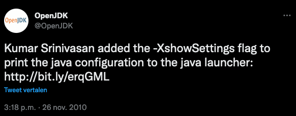

From time to time, you need to check which Java version is installed on your computer or server, for instance when starting on a new project or configuring an application to run on a server.

But did you know there are multiple ways you can do this and even get much more information than you might think, very quickly?

Let's find out...

Reading the Java Version in the Terminal {#WhatJavaversionareyourunning?TakingalookunderthehoodsoftheJDK.-ReadingtheJavaVersionintheTerminal}
---------------------------------------------------------------------------------------------------------------------------------------------

Probably the easiest way to find the installed version is by using the `java -version` terminal command:

<pre class="EnlighterJSRAW" data-enlighter-language="generic" data-enlighter-theme="" data-enlighter-highlight="" data-enlighter-linenumbers="" data-enlighter-lineoffset="" data-enlighter-title="" data-enlighter-group="">$ java -version
openjdk version "19" 2022-09-20
OpenJDK Runtime Environment Zulu19.28+81-CA (build 19+36)
OpenJDK 64-Bit Server VM Zulu19.28+81-CA (build 19+36, mixed mode, sharing)</pre>

Checking Version Files in the Installation Directory {#WhatJavaversionareyourunning?TakingalookunderthehoodsoftheJDK.-CheckingVersionFilesintheInstallationDirectory}
---------------------------------------------------------------------------------------------------------------------------------------------------------------------

The above output results from info read by the `java` executable from a file inside its installation directory.

Let's explore what we can find there.

On my machine, as I use [SDKMAN](https://sdkman.io/) to switch between different Java versions, all my versions are stored here:

<pre class="EnlighterJSRAW" data-enlighter-language="generic" data-enlighter-theme="" data-enlighter-highlight="" data-enlighter-linenumbers="" data-enlighter-lineoffset="" data-enlighter-title="" data-enlighter-group="">$ ls -l /Users/frankdelporte/.sdkman/candidates/java/
total 0
drwxr-xr-x  15 frankdelporte  staff  480 Apr 17  2022 11.0.15-zulu
drwxr-xr-x  16 frankdelporte  staff  512 Apr 17  2022 17.0.3.fx-zulu
drwxr-xr-x  15 frankdelporte  staff  480 Mar 29  2022 18.0.1-zulu
drwxr-xr-x  15 frankdelporte  staff  480 Sep  7 18:36 19-zulu
drwxr-xr-x  18 frankdelporte  staff  576 Apr 18  2022 8.0.332-zulu
lrwxr-xr-x   1 frankdelporte  staff    7 Nov 21 21:09 current -&gt; 19-zulu</pre>

And in each of these directories a release file can be found which also shows us the version information, including some extra information.

<pre class="EnlighterJSRAW" data-enlighter-language="generic" data-enlighter-theme="" data-enlighter-highlight="" data-enlighter-linenumbers="" data-enlighter-lineoffset="" data-enlighter-title="" data-enlighter-group="">$ cat /Users/frankdelporte/.sdkman/candidates/java/19-zulu/release
IMPLEMENTOR="Azul Systems, Inc."
IMPLEMENTOR_VERSION="Zulu19.28+81-CA"
JAVA_VERSION="19"
JAVA_VERSION_DATE="2022-09-20"
LIBC="default"
MODULES="java.base java.compiler ... jdk.unsupported jdk.unsupported.desktop jdk.xml.dom"
OS_ARCH="aarch64"
OS_NAME="Darwin"
SOURCE=".:git:3d665268e905"
&nbsp;
$ cat /Users/frankdelporte/.sdkman/candidates/java/8.0.332-zulu//release
JAVA_VERSION="1.8.0_332"
OS_NAME="Darwin"
OS_VERSION="11.2"
OS_ARCH="aarch64"
SOURCE="git:f4b2b4c5882e"</pre>

Getting More Information With showSettings {#WhatJavaversionareyourunning?TakingalookunderthehoodsoftheJDK.-GettingMoreInformationWithshowSettings}
---------------------------------------------------------------------------------------------------------------------------------------------------

In 2010, an experimental flag (indicated with the `X`) was added to OpenJDK to provide more configuration information: `-XshowSettings`.
 Twitter screenshot of a message by OpenJDK about adding the -XshowSettings flag

This flag can be called with different arguments, each producing an other information output.

The cleanest way to call this flag, is by adding `-version`, otherwise you will get the long Java manual output as no application code was found to be executed.

### Reading the System Properties {#WhatJavaversionareyourunning?TakingalookunderthehoodsoftheJDK.-ReadingtheSystemProperties}

By using the `-XshowSettings:properties` flag, a long list of various properties is shown.

<pre class="EnlighterJSRAW" data-enlighter-language="generic" data-enlighter-theme="" data-enlighter-highlight="" data-enlighter-linenumbers="" data-enlighter-lineoffset="" data-enlighter-title="" data-enlighter-group="">$ java -XshowSettings:properties -version
Property settings:
&nbsp;&nbsp;&nbsp;&nbsp;file.encoding = UTF-8
&nbsp;&nbsp;&nbsp;&nbsp;file.separator = /
&nbsp;&nbsp;&nbsp;&nbsp;ftp.nonProxyHosts = local|*.local|169.254/16|*.169.254/16
&nbsp;&nbsp;&nbsp;&nbsp;http.nonProxyHosts = local|*.local|169.254/16|*.169.254/16
&nbsp;&nbsp;&nbsp;&nbsp;java.class.path =
&nbsp;&nbsp;&nbsp;&nbsp;java.class.version = 63.0
&nbsp;&nbsp;&nbsp;&nbsp;java.home = /Users/frankdelporte/.sdkman/candidates/java/19-zulu/zulu-19.jdk/Contents/Home
&nbsp;&nbsp;&nbsp;&nbsp;java.io.tmpdir = /var/folders/np/6j1kls013kn2gpg_k6tz2lkr0000gn/T/
&nbsp;&nbsp;&nbsp;&nbsp;java.library.path = /Users/frankdelporte/Library/Java/Extensions
&nbsp;&nbsp;&nbsp;&nbsp;&nbsp;&nbsp;&nbsp;&nbsp;/Library/Java/Extensions
&nbsp;&nbsp;&nbsp;&nbsp;&nbsp;&nbsp;&nbsp;&nbsp;/Network/Library/Java/Extensions
&nbsp;&nbsp;&nbsp;&nbsp;&nbsp;&nbsp;&nbsp;&nbsp;/System/Library/Java/Extensions
&nbsp;&nbsp;&nbsp;&nbsp;&nbsp;&nbsp;&nbsp;&nbsp;/usr/lib/java
&nbsp;&nbsp;&nbsp;&nbsp;&nbsp;&nbsp;&nbsp;&nbsp;.
&nbsp;&nbsp;&nbsp;&nbsp;java.runtime.name = OpenJDK Runtime Environment
&nbsp;&nbsp;&nbsp;&nbsp;java.runtime.version = 19+36
&nbsp;&nbsp;&nbsp;&nbsp;java.specification.name = Java Platform API Specification
&nbsp;&nbsp;&nbsp;&nbsp;java.specification.vendor = Oracle Corporation
&nbsp;&nbsp;&nbsp;&nbsp;java.specification.version = 19
&nbsp;&nbsp;&nbsp;&nbsp;java.vendor = Azul Systems, Inc.
&nbsp;&nbsp;&nbsp;&nbsp;java.vendor.url = http://www.azul.com/
&nbsp;&nbsp;&nbsp;&nbsp;java.vendor.url.bug = http://www.azul.com/support/
&nbsp;&nbsp;&nbsp;&nbsp;java.vendor.version = Zulu19.28+81-CA
&nbsp;&nbsp;&nbsp;&nbsp;java.version = 19
&nbsp;&nbsp;&nbsp;&nbsp;java.version.date = 2022-09-20
&nbsp;&nbsp;&nbsp;&nbsp;java.vm.compressedOopsMode = Zero based
&nbsp;&nbsp;&nbsp;&nbsp;java.vm.info = mixed mode, sharing
&nbsp;&nbsp;&nbsp;&nbsp;java.vm.name = OpenJDK 64-Bit Server VM
&nbsp;&nbsp;&nbsp;&nbsp;java.vm.specification.name = Java Virtual Machine Specification
&nbsp;&nbsp;&nbsp;&nbsp;java.vm.specification.vendor = Oracle Corporation
&nbsp;&nbsp;&nbsp;&nbsp;java.vm.specification.version = 19
&nbsp;&nbsp;&nbsp;&nbsp;java.vm.vendor = Azul Systems, Inc.
&nbsp;&nbsp;&nbsp;&nbsp;java.vm.version = 19+36
&nbsp;&nbsp;&nbsp;&nbsp;jdk.debug = release
&nbsp;&nbsp;&nbsp;&nbsp;line.separator = \n
&nbsp;&nbsp;&nbsp;&nbsp;native.encoding = UTF-8
&nbsp;&nbsp;&nbsp;&nbsp;os.arch = aarch64
&nbsp;&nbsp;&nbsp;&nbsp;os.name = Mac OS X
&nbsp;&nbsp;&nbsp;&nbsp;os.version = 13.0.1
&nbsp;&nbsp;&nbsp;&nbsp;path.separator = :
&nbsp;&nbsp;&nbsp;&nbsp;socksNonProxyHosts = local|*.local|169.254/16|*.169.254/16
&nbsp;&nbsp;&nbsp;&nbsp;stderr.encoding = UTF-8
&nbsp;&nbsp;&nbsp;&nbsp;stdout.encoding = UTF-8
&nbsp;&nbsp;&nbsp;&nbsp;sun.arch.data.model = 64
&nbsp;&nbsp;&nbsp;&nbsp;sun.boot.library.path = /Users/frankdelporte/.sdkman/candidates/java/19-zulu/zulu-19.jdk/Contents/Home/lib
&nbsp;&nbsp;&nbsp;&nbsp;sun.cpu.endian = little
&nbsp;&nbsp;&nbsp;&nbsp;sun.io.unicode.encoding = UnicodeBig
&nbsp;&nbsp;&nbsp;&nbsp;sun.java.launcher = SUN_STANDARD
&nbsp;&nbsp;&nbsp;&nbsp;sun.jnu.encoding = UTF-8
&nbsp;&nbsp;&nbsp;&nbsp;sun.management.compiler = HotSpot 64-Bit Tiered Compilers
&nbsp;&nbsp;&nbsp;&nbsp;user.country = BE
&nbsp;&nbsp;&nbsp;&nbsp;user.dir = /Users/frankdelporte
&nbsp;&nbsp;&nbsp;&nbsp;user.home = /Users/frankdelporte
&nbsp;&nbsp;&nbsp;&nbsp;user.language = en
&nbsp;&nbsp;&nbsp;&nbsp;user.name = frankdelporte
&nbsp;
openjdk version "19" 2022-09-20
OpenJDK Runtime Environment Zulu19.28+81-CA (build 19+36)
OpenJDK 64-Bit Server VM Zulu19.28+81-CA (build 19+36, mixed mode, sharing)</pre>

If you ever faced the problem of an unsupported Java version 59 (are similar), you'll now also understand where this value is defined, it's right here in this list as `java.class.version`.

It's an internal number used by Java to define the version.

|-------------------|----|----|----|----|----|----|----|----|----|----|----|----|
| **Java release**  | 8  | 9  | 10 | 11 | 12 | 13 | 14 | 15 | 16 | 17 | 18 | 19 |
| **Class version** | 52 | 53 | 54 | 55 | 56 | 57 | 58 | 59 | 60 | 61 | 62 | 63 |

### Reading the Locale Information {#WhatJavaversionareyourunning?TakingalookunderthehoodsoftheJDK.-ReadingtheLocaleInformation}

In case you didn't know yet, I live in Belgium and use English as my computer language, as you can see when using the `-XshowSettings:locale` flag:

<pre class="EnlighterJSRAW" data-enlighter-language="generic" data-enlighter-theme="" data-enlighter-highlight="" data-enlighter-linenumbers="" data-enlighter-lineoffset="" data-enlighter-title="" data-enlighter-group="">$ java -XshowSettings:locale -version
Locale settings:
&nbsp;&nbsp;&nbsp;&nbsp;default locale = English (Belgium)
&nbsp;&nbsp;&nbsp;&nbsp;default display locale = English (Belgium)
&nbsp;&nbsp;&nbsp;&nbsp;default format locale = English (Belgium)
&nbsp;&nbsp;&nbsp;&nbsp;available locales = , af, af_NA, af_ZA, af_ZA_#Latn, agq, agq_CM, agq_CM_#Latn,
&nbsp;&nbsp;&nbsp;&nbsp;&nbsp;&nbsp;&nbsp;&nbsp;ak, ak_GH, ak_GH_#Latn, am, am_ET, am_ET_#Ethi, ar, ar_001,
&nbsp;&nbsp;&nbsp;&nbsp;&nbsp;&nbsp;&nbsp;&nbsp;ar_AE, ar_BH, ar_DJ, ar_DZ, ar_EG, ar_EG_#Arab, ar_EH, ar_ER,
&nbsp;&nbsp;&nbsp;&nbsp;&nbsp;&nbsp;&nbsp;&nbsp;...
&nbsp;&nbsp;&nbsp;&nbsp;&nbsp;&nbsp;&nbsp;&nbsp;zh_MO_#Hant, zh_SG, zh_SG_#Hans, zh_TW, zh_TW_#Hant, zh__#Hans, zh__#Hant, zu,
&nbsp;&nbsp;&nbsp;&nbsp;&nbsp;&nbsp;&nbsp;&nbsp;zu_ZA, zu_ZA_#Latn
&nbsp;
openjdk version "19" 2022-09-20
OpenJDK Runtime Environment Zulu19.28+81-CA (build 19+36)
OpenJDK 64-Bit Server VM Zulu19.28+81-CA (build 19+36, mixed mode, sharing)</pre>

### Reading the VM Settings {#WhatJavaversionareyourunning?TakingalookunderthehoodsoftheJDK.-ReadingtheVMSettings}

With the `-XshowSettings:vm` flag, some info is shown about the Java Virtual Machine.

As you can see in the second example, the amount of maximum heap memory size can be defined with the `-Xmx` flag.

<pre class="EnlighterJSRAW" data-enlighter-language="generic" data-enlighter-theme="" data-enlighter-highlight="" data-enlighter-linenumbers="" data-enlighter-lineoffset="" data-enlighter-title="" data-enlighter-group="">$ java -XshowSettings:vm -version
VM settings:
&nbsp;&nbsp;&nbsp;&nbsp;Max. Heap Size (Estimated): 8.00G
&nbsp;&nbsp;&nbsp;&nbsp;Using VM: OpenJDK 64-Bit Server VM
&nbsp;
openjdk version "19" 2022-09-20
OpenJDK Runtime Environment Zulu19.28+81-CA (build 19+36)
OpenJDK 64-Bit Server VM Zulu19.28+81-CA (build 19+36, mixed mode, sharing)
&nbsp;
$ java -XshowSettings:vm -Xmx512M -version
VM settings:
&nbsp;&nbsp;&nbsp;&nbsp;Max. Heap Size: 512.00M
&nbsp;&nbsp;&nbsp;&nbsp;Using VM: OpenJDK 64-Bit Server VM
&nbsp;
openjdk version "19" 2022-09-20
OpenJDK Runtime Environment Zulu19.28+81-CA (build 19+36)
OpenJDK 64-Bit Server VM Zulu19.28+81-CA (build 19+36, mixed mode, sharing)</pre>

### Reading all at Once {#WhatJavaversionareyourunning?TakingalookunderthehoodsoftheJDK.-ReadingallatOnce}

If you want all of the information above with one call, use the `-XshowSettings:all` flag.

Conclusion {#h2-7-conclusion}
-----------------------------

Next to `java -version`, we can also use `java -XshowSettings:all -version` to get more info about our Java environment.
