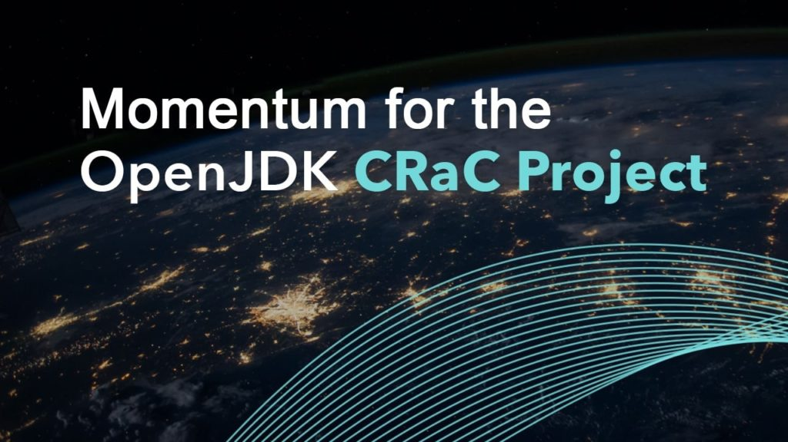

At Azul, we are very excited about the Amazon Web Services launch of [SnapStart for Lambdas](https://docs.aws.amazon.com/lambda/latest/dg/snapstart-runtime-hooks.html).

SnapStart is based on the CRaC (Coordinated Restore at Checkpoint) API developed in OpenJDK, which was originated and led by Azul.

**What is the CRaC API?**

The [CRaC API](https://openjdk.org/projects/crac/) provides a common way for Java applications to coordinate with underlying checkpoint/restore mechanisms, allowing Java code to work seamlessly and portably across various checkpoint/restore mechanisms as they become available.

And Lambda, with its underlying use of the [Firecracker MicroVM](https://firecracker-microvm.github.io) and its new support for the CRaC API, has now become such a platform. When coordinating via the CRaC API, Lambda can now take a snapshot of your application -- when it's already warmed up and ready to accept traffic at speed -- and instantly relaunch any application instance from this snapshot.

**"AWS Lambda SnapStart for Java delivers up to 10x faster function startup performance at no extra cost,"** [the AWS announcement states](https://aws.amazon.com/about-aws/whats-new/2022/11/aws-lambda-snapstart-java-functions/). **"Lambda SnapStart is a performance optimization that makes it easier for you to build highly responsive and scalable Java applications using AWS Lambda without having to provision resources or spend time and effort implementing complex performance optimizations."**

## Momentum for the CRaC API is Building

CRaC has been gaining momentum by supporting a range of microservices frameworks. This is another huge step toward widespread acceptance and adoption of CRaC as a viable way of addressing warmup issues in Java while retaining all the benefits of the platform's dynamic class ecosystem and proven speed and optimization.

The last few months have seen the major frameworks **Quarkus** , **Micronaut** , and **Spring Boot** incorporate CRaC checkpoint/restore coordination support.

The combination of framework support, the support in the OpenJDK CRaC project, and the emerging support in available runtimes has started the ball rolling.

Now, with a major Cloud platform providing built-in support for the CRaC API, it's truly off to the races for CRaC.

## Learn more

Learn more about the CRaC API:

* Foojay.io: [Introducing the OpenJDK "Coordinated Restore at Checkpoint" Project](https://foojay.io/today/introducing-the-openjdk-coordinated-restore-at-checkpoint-project/)
* GitHub: <https://github.com/CRaC/org.crac>
* Javadoc.io: <https://javadoc.io/doc/io.github.crac/org-crac/latest/index.html>

Learn more about Lambda's support for the CRaC API:

* AWS Docs: <https://docs.aws.amazon.com/lambda/latest/dg/snapstart-runtime-hooks.html>

You can get your hands on a CRaC-supporting JDK to play with at <https://cdn.azul.com/zulu/release/temporary/crac/bin>
