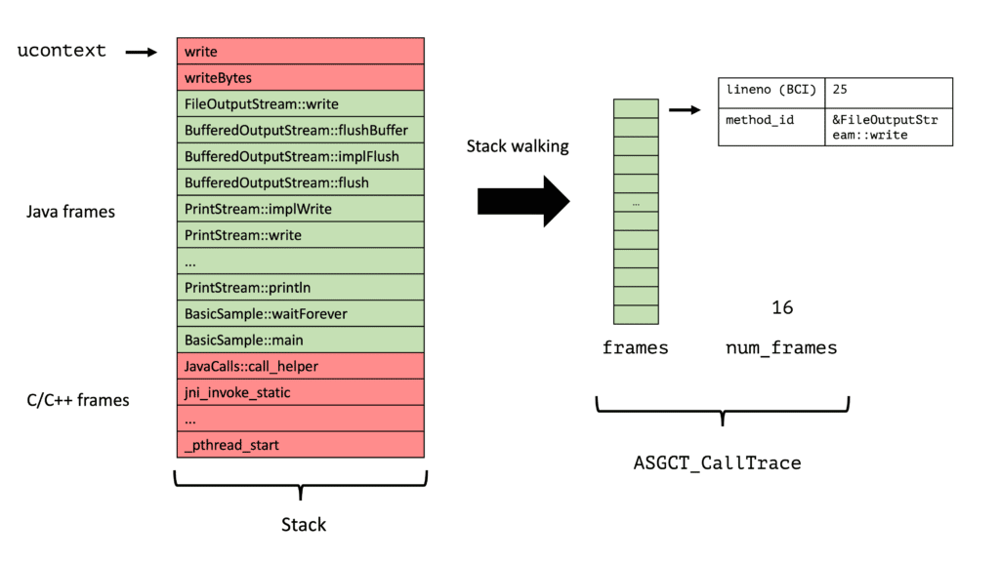

[Async-profiler](https://github.com/jvm-profiling-tools/async-profiler) is undoubtedly one of the most used open-source Java profilers out there.

Its most commonly used feature is sampling a given Java program's stack traces and visualizing them as a flame graph. I would recommend reading the excellent [async-profiler manual](https://krzysztofslusarski.github.io/2022/12/12/async-manual.html) by Krzysztof Ślusarski or taking a look at my profiling playlist on YouTube if you're new to this tool.

After using the async-profiler for a while, you might wonder: How does this tool work? And, of course, if you're someone like me: Could I write a stripped-down versionto learn how it really works?

*I did this a few years back in university when I wanted to understand how LR(1) parser generators work: Turns out it is a lot of work, but my [parser generator](https://github.com/parttimenerd/swp/) can output GIFs.*

This blog series will take you with me on this journey, where we start with a small tool and see where curiosity leads us. It's helpful if you know some C/C++ and have profiled Java using async-profiler before, which helps you better understand my code snippets and the profiling Jargon.

All the code will present on [GitHub](https://github.com/parttimenerd/writing-a-profiler), and I'm happy for any suggestions, bug reports, and comments either under this blog post or on GitHub.

The aim of this series is

* to understand how a sampling profiler works
* to write a simple profiler, and possibly related tools, based on the AsyncGetCallTrace API
  * and later on, my proposed [AsyncGetStackTrace API](https://openjdk.org/jeps/435)
* to have some good tooling which I use in OpenJDK tests, to make the used APIs safer and more reliable

The aim is not to write anything vaguely production ready: async-profiler has too many features to count and is battle-tested.

Come with me on this journey of knowledge, starting with a simple tool that just counts how many times AsyncGetCallTrace could not trace the stack.

The fundamental API that we will be relying on is the AsyncGetCallTrace API of the OpenJDK: This API can be used to obtain the stack trace (which methods are on the stack) for a given thread at any time. This makes it quite useful [for writing accurate profilers](http://psy-lob-saw.blogspot.com/2016/06/the-pros-and-cons-of-agct.html).

The API was introduced in November 2002 for Sun Studio. However, Sun removed it in January 2003 and demoted it to an internal API, but most profiling applications still use it. The following part of this post is inspired by Nitsan Wakart's post, [The Pros and Cons of AsyncGetCallTrace Profilers](http://psy-lob-saw.blogspot.com/2016/06/the-pros-and-cons-of-agct.html).

The AsyncGetCallTrace API is defined in the [forte.cpp](https://github.com/openjdk/jdk/blob/master/src/hotspot/share/prims/forte.cpp) file:

```cpp
typedef struct {
  jint lineno;         // BCI in the source file, or < 0 for native methods
  jmethodID method_id; // method executed in this frame
} ASGCT_CallFrame;

typedef struct {
  JNIEnv *env_id;   // Env where trace was recorded
  jint num_frames;  // number of frames in this trace, < 0 gives us an error code
  ASGCT_CallFrame *frames; // recorded frames 
} ASGCT_CallTrace; 

void AsyncGetCallTrace(ASGCT_CallTrace *trace, // pre-allocated trace to fill
                       jint depth,             // max number of frames to walk
                       void* ucontext);        // signal context
```


One typically uses this API by pinging a thread using a signal, stopping the thread, and invoking the signal handler, which in turn calls AsyncGetCallTrace with the execution context of the stopped thread (the `ucontext`) so that AsyncGetCallTrace can walk the thread, skipping all C/C++ frames on the stack and only storing the native (from `native` methods) and Java frames in the `frames` array.

The signal handler has to process the trace, but this is for another post. We will just store the number of times that AsyncGetCallTrace was successful and unsuccessful.

Be aware that we cannot allocate any memory outside the stack in a signal handler. For this reason, we have to preallocate the data structures for AsyncGetCallTrace. There are a few C library functions that [are guaranteed to be signal safe](https://man7.org/linux/man-pages/man7/signal-safety.7.html).

*To learn more about signals, consider reading [Introduction To Unix Signals Programming](http://www.cs.kent.edu/~ruttan/sysprog/lectures/signals.html), or similar sources. But don't be confused with the terms thread and process. In Unix (Mac OS, Linux, BSD), threads are processes that share the same address space. Every (non-virtual/Loom) thread in Java is backed by an OS thread.*

As an example of calling AsyncGetCallTrace, consider profiling the following Java code:

```java
public class BasicSample {

    public void waitForever() throws InterruptedException {
        System.out.print("Waiting forever...");
        for (int i = 0; i < 100; i++) {
            Thread.sleep(10);
            System.out.print(".");
        }
        System.out.println("done");
    }

    public static void main(String[] args) throws InterruptedException {
        new BasicSample().waitForever();
    }
}
```


During profiling, we call AsyncGetCallTrace often, but let's visualize a trace when the JVM runs one of the `println` lines.
[](https://github.com/parttimenerd/asgct2-demo) AsyncGetCallTrace on a small example, using [the demo code for JEP 435](https://github.com/parttimenerd/asgct2-demo)

*Interrupting a thread at any point and running some code can have stability implications. If you're interested in these when using AsyncGetCallTrace, head over to the [async-profiler manual](https://krzysztofslusarski.github.io/2022/12/12/async-manual.html#stability), where I co-wrote the section on this topic. This small sample tool seems to be quite good at triggering a specific fault in JDK 19+36, run the tool of this blog post yourself to find it.*

The signal handler in our small example is the following:

```cpp
std::atomic<size_t> failedTraces = 0;
std::atomic<size_t> totalTraces = 0;

static void signalHandler(int signo, siginfo_t* siginfo, void* ucontext) {
  const int MAX_DEPTH = 512; // max number of frames to capture
  static ASGCT_CallFrame frames[MAX_DEPTH];
  ASGCT_CallTrace trace;
  trace.frames = frames;
  trace.num_frames = 0;
  trace.env_id = env; // we obtained this via the OnVMInit hook

  // call AsyncGetCallTrace
  asgct(&trace, MAX_DEPTH, ucontext);

  // process the results
  totalTraces++;
  if (trace.num_frames < 0) {
    failedTraces++;
  }
}
```


We use atomic variables here to increment the two counting variables in parallel. We cannot use any locks as creating locks is not signal-safe.

You see in line 13 that we cannot call AsyncGetCallTrace directly, as it is not exported in any JVM header. So we have to obtain the pointer to this function via [dlsym](https://man7.org/linux/man-pages/man3/dlsym.3.html) at the beginning, which is a bit brittle:

```cpp
static void initASGCT() {
  asgct = reinterpret_cast<ASGCTType>(dlsym(RTLD_DEFAULT, "AsyncGetCallTrace"));
  if (asgct == NULL) {
    fprintf(stderr, "=== ASGCT not found ===\n");
    exit(1);
  }
}
```


Additionally, we have to copy the declarations for ASGCT_CallFrame, ASGCT_CallTrace, and AsyncGetCallTrace into our project.

After writing a signal handler, we must use some mechanism to create signals. There are multiple ways, like perf or using a thread that signals all threads every few milliseconds, but we'll use the most straightforward option which is a timer:

```cpp
static bool startITimerSampler() {
  time_t sec = interval_ns / 1000000000;
  suseconds_t usec = (interval_ns % 1000000000) / 1000;
  struct itimerval tv = {{sec, usec}, {sec, usec}};

  // ...

  if (setitimer(ITIMER_PROF, &tv, NULL) != 0) {
    return false;
  }
  return true;
}
```


Our code uses the timers in `PROF` mode: "A profiling timer that counts both processor time used by the process, and processor time spent in system calls on behalf of the process. This timer sends a `SIGPROF` signal to the process when it expires." (see [gnu.org](https://www.gnu.org/software/libc/manual/html_node/Setting-an-Alarm.html)) The result is roughly similar to the CPU and itimer modes of the async-profiler. It is inaccurate, but we'll tackle this problem in another blog post.

You can find the final code in the [GitHub](https://github.com/parttimenerd/writing-a-profiler) repo as [libSmallProfiler.cpp](https://github.com/parttimenerd/writing-a-profiler/blob/main/cpp/libSmallProfiler.cpp). It includes all the boiler-plate code for JVMTI agents that I omitted in this blog post for brevity. Feel free to file issues or PRs with improvements or suggestions there. When we finally run the tool with a JVM and the example Java program, we get the following output via `java -agentpath:cpp/libSmallProfiler.dylib=interval=0.001s -cp samples BasicSample`:

```
Waiting forever.......................................................................................................done
Failed traces:          5
Total traces:          15
Failed ratio:       33.33%
```


This tool might seem to be rather useless, but one can adjust its sampling interval by specifying the `interval` option: This makes it quite helpful in testing the stack walking code of AsyncGetCallTrace.

I hope I didn't frighten you too much with all this Unix C, and hopefully see you again in around two weeks for my next blog post in which we create a tool that outputs a method list.

*The code of this blog post is based on the libAsyncGetCallTraceTest.cpp and the libAsyncGetStackTraceSampler.cpp of the OpenJDK.* *This blog series is part of my work in the [SapMachine](https://sapmachine.io/) team at [SAP](https://sap.com), making profiling easier for everyone. This article first appeared on my personal blog [mostlynerdless.de](https://mostlynerdless.de/blog/2022/11/21/ap-loader-a-new-way-to-use-and-embed-async-profiler/).*
