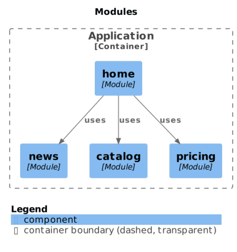
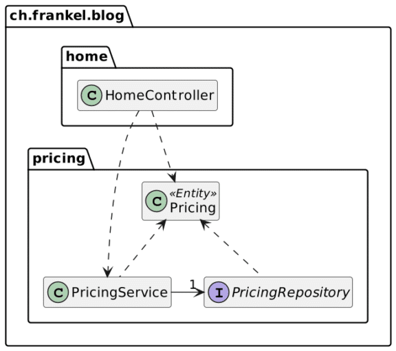
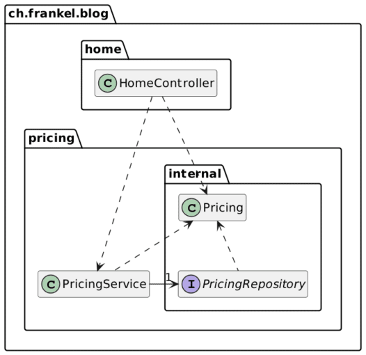
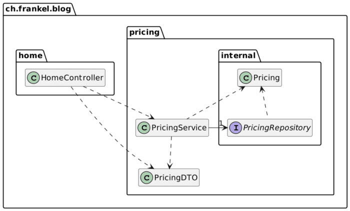

One of the main reasons to design microservices is that they enforce [strong module boundaries](https://martinfowler.com/articles/microservice-trade-offs.html#boundaries).

However, the cons of microservices are so huge that it's like chopping off your right hand to learn to write with the left one; there are more manageable (and less painful!) ways to achieve the same result.

Even since the microservices craze started, some cooler heads have prevailed.

In particular, [Oliver Drotbohm](https://twitter.com/odrotbohm), a developer on the Spring framework, has been a long-time proponent of the [moduliths](https://github.com/moduliths/moduliths) alternative.

The idea is to keep a monolith but design it around modules.

Many flocks to microservices because the application they work on resembles a spaghetti platter.

If their application were better designed, the pull of microservices wouldn't be so strong.

Why modularity?
---------------

Modularity is a way to reduce the impact of change on a codebase. It's very similar to how one designs (big) ships.

When water continuously leaks into a ship, the latter generally sinks because of the decreasing Archimedes thrust. To avoid a single leak sinking the ship, it's designed around multiple watertight [compartments](https://en.wikipedia.org/wiki/Compartment_(ship)). If one leak happens, it's contained in a single compartment. While it's not ideal, it prevents the ship from sinking, allowing it to reroute to the nearest port where one can repair it.

Modularity works similarly: it puts boundaries around parts of the code. This way, the effect of a change is limited to the part and doesn't spread beyond its boundaries.

In Java, such parts are known as packages. The parallel with ships stops there because packages must work together to achieve the desired results. Packages cannot be "watertight". The Java language provides visibility modifiers to work across package boundaries. Interestingly, the most famous one, `public`, allows crossing packages entirely.

Designing boundaries that follow the principle of least privilege is a constant effort. Chances are that under the project's pressure in the initial development or with time during maintenance, the effort will slip, and boundaries will decay.

We need a more advanced way to enforce boundaries.

Modules, modules everywhere
---------------------------

In the long history of Java, "modules" have been a solution to enforce boundaries. The thing is, there are many definitions of what a module is, even today.

[OSGI](https://www.osgi.org/), started in 2000, aimed to provide versioned components that could be safely deployed and undeployed at runtime. It kept the JAR deployment unit but added metadata in its manifest. OSGi was powerful, but developing an OSGi *bundle* (the name for a module) was complex.

Developers paid a higher development cost while the operation team enjoyed the deployment benefits. DevOps had yet to be born; it didn't make OSGi as popular as it could have been.

In parallel, Java's architects searched for their path to modularizing the JDK. The approach is much simpler compared to OSGI, as it avoids deployment and versioning concerns. Java modules, introduced in Java 9, limit themselves to the following data: a name, a public API, and dependencies to other modules.

Java modules worked well for the JDK but much less for applications because of a chicken-and-egg problem. To be helpful to applications, developers must modularize libraries - not relying on auto-modules. But library developers would do it only if enough application developers would use it. [Last time I checked](https://blog.frankel.ch/update-state-java-modularization/), only half of 20 commons libraries were modularized.

On the build side, I need to cite Maven modules. They allow splitting one's code into multiple projects.

There are other module systems on the JVM, but these three are the most well-known.

A tentative approach to enforce boundaries
------------------------------------------

As mentioned above, microservices provide the ultimate boundary during development and deployment. They are overkill in most cases. On the other side, there's no denying that projects rot over time. Even the most beautifully crafted one, which values modularity, is bound to become a mess without constant care.

We need rules to enforce boundaries, and they need to be treated like tests: when tests fail, one must fix them. Likewise, when one breaks a rule, one must fix it. [ArchUnit](https://www.archunit.org/) is a tool to create and enforce rules. One configures the rules and verifies them as tests. Unfortunately, the configuration is time-consuming and must constantly be maintained to provide value. Here's a snippet for a [sample application](https://github.com/thombergs/buckpal) following the Hexagonal architecture principle:

```java
HexagonalArchitecture.boundedContext("io.reflectoring.buckpal.account")
                     .withDomainLayer("domain")
                     .withAdaptersLayer("adapter")
                     .incoming("in.web")
                     .outgoing("out.persistence")
                     .and()
                         .withApplicationLayer("application")
                         .services("service")
                         .incomingPorts("port.in")
                         .outgoingPorts("port.out")
                     .and()
                         .withConfiguration("configuration")
                         .check(new ClassFileImporter()
                         .importPackages("io.reflectoring.buckpal.."));
```


Note that the `HexagonalArchitecture` class is a custom-made DSL façade over the ArchUnit API.

Overall, ArchUnit is better than nothing, but only marginally so. Its main benefit is automation via tests. It would significantly improve if the architectural rules could be automatically inferred. That's the idea behind the Spring Modulith project.

Spring Modulith
---------------

Spring Modulith is the successor of Oliver Drotbohm's [Moduliths project](https://github.com/moduliths/moduliths) (with a trailing S). It uses both ArchUnit and [jMolecules](https://github.com/xmolecules/jmolecules). At the time of this writing, it's *experimental*.

Spring Modulith allows:

* Documenting the relationships between the packages of a project
* Restricting certain relationships
* Testing the restrictions during in tests

It requires that one's application uses the Spring Framework: it leverages the latter's understanding of the former, obtained through assembly.

By default, a Modulith module is a package located at the same level as the `SpringBootApplication`-annotated class.

```
|_ ch.frankel.blog
    |_ DummyApplication       // 1
        |_ packagex           // 2
        |  |_ subpackagex     // 3
        |_ packagey           // 2
        |_ packagez           // 2
          |_ subpackagez      // 3
```


1. Application class
2. Modulith module
3. Not a module

By default, a module can access the content of any other module but cannot access subpackages of other modules.

Spring Modulith offers to generate text-based diagrams based on PlantUML, with UML or [C4](https://c4model.com/) (default) skins. The generation is easy as pie:

```java
var modules = ApplicationModules.of(DummyApplication.class);
new Documenter(modules).writeModulesAsPlantUml();
```


To break the build if a module accesses a regular package, call the `verify()` method in a test.

```java
var modules = ApplicationModules.of(DummyApplication.class).verify();
```


A sample to play with
---------------------

I've created a [sample app](https://github.com/ajavageek/spring-modulith-sample) to play with: it emulates the home page of an online shop. The home page is generated server-side with Thymeleaf and displays catalog items and a newsfeed. The latter is also accessible via an HTTP API for client-side calls (that I was too lazy to code). Items are displayed with a price, thus requiring a pricing service.

Each feature - page, catalog, newsfeed, and pricing - sits in a package, which is viewed as a Spring module. Spring Modulith's documenting feature generates the following:



<br />

Let's check the design of the pricing feature:



<br />

The current design has two issues:

* The `PricingRepository` is accessible outside of the module
* The `PricingService` leaks the `Pricing` JPA entity

We shall fix the design by encapsulating types that shouldn't be exposed. We move the `Pricing` and `PricingRepository` types into an `internal` subfolder of the `pricing` module:



<br />

If we call the `verify()` method, it throws and breaks the build because `Pricing` is not accessible from outside the `pricing` module:

    Module 'home' depends on non-exposed type ch.frankel.blog.pricing.internal.Pricing within module 'pricing'!

Let's fix the violations with the following changes:



<br />

Conclusion
----------

By toying with a sample application, I did like Spring Modulith.

I can see two prominent use cases: documenting an existing application and keeping the design "clean". The latter avoids the "rot" effect of applications over time. This way, we can keep the design as intended and avoid the spaghetti effect.

The icing on the cake: it's great when we need [to chop one](https://blog.frankel.ch/chopping-monolith/) [or more features](https://blog.frankel.ch/chopping-monolith-demo/) to their deployment unit. It will be a very straightforward move, with no time wasted to untangle dependencies. Spring Modulith provides a huge benefit: **delay every impactful architectural decision until the last possible moment**.

Thanks [Oliver Drotbohm](https://twitter.com/odrotbohm) for his review.

You can find the source code on [GitHub](https://github.com/ajavageek/spring-modulith-sample).

**To go further:**

* [Introducing Spring Modulith](https://spring.io/blog/2022/10/21/introducing-spring-modulith)
* [Quick start](https://spring.io/projects/spring-modulith)
* [Reference documentation](https://docs.spring.io/spring-modulith/docs/0.1.0-M1/reference/html/)

*Originally published at [A Java Geek](https://blog.frankel.ch/spring-modulith-modularity-maturity/) on November 13^th^, 2022*

*[DI]: Dependency Injection
