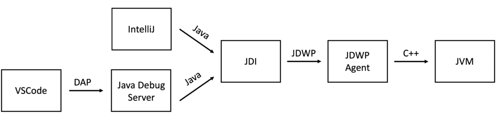
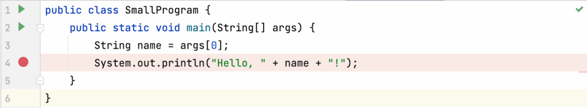
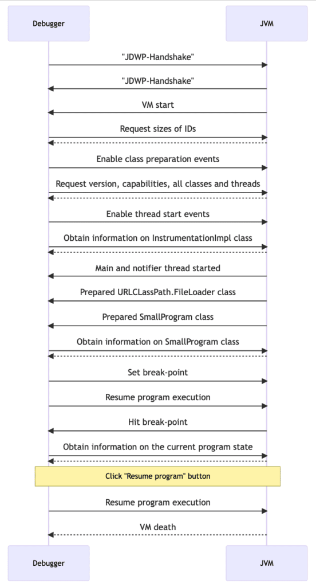
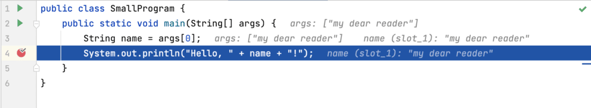

I wanted to write about a small side project---a few months back, I got carried away with understanding how Java debugging works.

The following is an hors d'oeuvre, a small post in between my series on profiling, on the [Java Platform Debugging Architecture](https://docs.oracle.com/en/java/javase/17/docs/specs/jpda/jpda.html).

All Java debuggers use the [Java Debug Wire Protocol (JDWP)](https://docs.oracle.com/en/java/javase/17/docs/specs/jdwp/jdwp-spec.html "Java Debug Wire Protocol (JDWP)") to communicate with the JVM, usually using the Java Debug Interface (JDI) abstraction Layer. The protocol can be used to remote debug, but the JVM and the debugger are commonly on the same machine.

Therefore, the design did not take latency into account, and it requires sending many small messages, but this is a topic for another article. The actual architecture of debuggers differs slightly:
 The architecture of the IntelliJ and the VSCode Java debuggers

The IntelliJ debugger calls the JDI interface directly. The [VSCode debugger](https://github.com/microsoft/vscode-java-debug), in contrast, uses its own protocol called [Debug Adapter Protocol](https://microsoft.github.io/debug-adapter-protocol/), which is for debugging what the [Language Server Protocol](https://microsoft.github.io/language-server-protocol/) is for code editing, to quote the DAP page:
> The idea behind the *Debug Adapter Protocol* (DAP) is to abstract the way how the debugging support of development tools communicates with debuggers or runtimes into a protocol. Since it is unrealistic to assume that existing debuggers or runtimes adopt this protocol any time soon, we rather assume that an intermediary component - a so called *Debug Adapter* - adapts an existing debugger or runtime to the Debug Adapter Protocol.
> [Debug Adapter Protocol](https://microsoft.github.io/debug-adapter-protocol/)

But the JVM does not implement this protocol (although it would certainly have its benefits, so if you're looking for a project during the winter holidays...), so VSCode communicates with a so-called [Java Debug Server](https://github.com/Microsoft/java-debug), which is based on the [Eclipse debugger](https://github.com/vscjavaci/eclipse.jdt.ls), which translates between DAP and JDWP.

Back to the JDWP protocol: JDWP knows four different types of packets.

* Handshake: The string `JDWP-Handshake` is sent from the Debugger (client) to the JDWP Agent/JVM (Server) and back. This initiates the debugging session.
* Request: A request from the client to the server, like `SetBreakpoint`
* Reply: The response to the request
* Event: A collection of events of the same kind that happened in the JVM, like `ClassPrepare`, sent from the JVM to the Debugger to notify it of something, like the preparation of a specific class.

I wrote a small logger which intercepts the JDWP requests, replies, and events, synthesizing them into JDWP programs in a small language. These programs may start with a cause, which probably started the sequence of requests. This allows us to understand better how the debugger interacts with the JVM.

For the purpose of this article, we only consider a small hello world program:


We put a break-point on line 4 using the IntelliJ debugger and run this debugging session with my logger. I'll go into all the sent and received packets in this post, but just to give you the gist of the communication, here is the simplified sequence diagram:


The debugging session starts with the JVM informing the debugger of the start and the debugger then requesting the sizes of the different IDs used in this session (e.g., that a method ID is 8 bytes wide, ...):

```
((= cause (events Event Composite ("suspendPolicy")=(wrap "byte" 2) ("events" 0 "kind")=(wrap "string" "VMStart") ("events" 0 "requestID")=(wrap "int" 0) ("events" 0 "thread")=(wrap "thread" 1)))
  (= var0 (request VirtualMachine IDSizes)))

// the reply to the IDSizes request is
IDSizesReply(fieldIDSize=IntValue(8), methodIDSize=IntValue(8), objectIDSize=IntValue(8), referenceTypeIDSize=IntValue(8), frameIDSize=IntValue(8))
```

Typically one starts the debugging session with `suspend=y`, so that the JVM stops its execution till the debugger is ready. The debugger starts by requesting to get events for every class preparation and thread starts, some information on the debugging capabilities of the JVM and information on the loaded classes, the `sun.instrument.InstrumentationImpl` class in particular:

```
((= cause (request EventRequest Set ("eventKind")=(wrap "byte" 8) ("suspendPolicy")=(wrap "byte" 0)))
  (= var0 (request EventRequest Set ("eventKind")=(wrap "byte" 8) ("suspendPolicy")=(wrap "byte" 0)))
  (= var1 (request VirtualMachine Version))
  (= var2 (request VirtualMachine Capabilities))
  (= var3 (request VirtualMachine CapabilitiesNew))
  (= var4 (request VirtualMachine AllClassesWithGeneric)))
((= cause (request VirtualMachine TopLevelThreadGroups))
  (= var0 (request VirtualMachine TopLevelThreadGroups)))
((= cause (request EventRequest Set ("eventKind")=(wrap "byte" 6) ("suspendPolicy")=(wrap "byte" 0)))
  (= var0 (request EventRequest Set ("eventKind")=(wrap "byte" 6) ("suspendPolicy")=(wrap "byte" 0)))
  (= var1 (request ReferenceType SourceDebugExtension ("refType")=(wrap "klass" 456)))
  (= var2 (request ReferenceType MethodsWithGeneric ("refType")=(wrap "klass" 456)))
  (for iter0 (get var2 "declared") 
    (= var3 (request Method LineTable ("methodID")=(get iter0 "methodID") ("refType")=(wrap "klass" 456)))))
```

`InstrumentationImpl` implements the `Instrumentation` interface:
> This class provides services needed to instrument Java programming language code. Instrumentation is the addition of byte-codes to methods for the purpose of gathering data to be utilized by tools. Since the changes are purely additive, these tools do not modify application state or behavior. Examples of such benign tools include monitoring agents, profilers, coverage analyzers, and event loggers.
> [https://docs.oracle.com/](https://docs.oracle.com/en/java/javase/17/docs/api/java.instrument/java/lang/instrument/Instrumentation.html)

The debugger uses the `AllClassesWithGeneric` request (line 6) to obtain a mapping of class names to class IDs (line 8) which the debugger then used to get the class ID of the `InstrumentationImpl` and obtain information on this class. This is a typical pattern for JDI when the debugger requests any information on a class.

The JVM then sends two `ThreadStart` events for the main and the JVM internal notification thread:

```
((= cause (events Event Composite ("suspendPolicy")=(wrap "byte" 0) ("events" 0 "kind")=(wrap "string" "ThreadStart") ("events" 0 "requestID")=(wrap "int" 4) ("events" 0 "thread")=(wrap "thread" 1097)))
)
((= cause (events Event Composite ("suspendPolicy")=(wrap "byte" 0) ("events" 0 "kind")=(wrap "string" "ThreadStart") ("events" 0 "requestID")=(wrap "int" 4) ("events" 0 "thread")=(wrap "thread" 1)))
)
```

The notification thread is:
>
> ```
> [...] new NotificationThread that is visible to the external view and offloads the ServiceThread from sending low memory and other notifications that could result in Java calls ( GC and diagnostic commands notifications) by moving these activities in this new NotificationThread.
> ```
>
> https://mail.openjdk.org/pipermail/jmx-dev/2019-August/001061.html

The JVM also sends the `ClassPrepare` event for the `URLCLassPath.FileLoader` class:

```
((= cause (events Event Composite ("suspendPolicy")=(wrap "byte" 0) ("events" 0 "kind")=(wrap "string" "ClassPrepare") ("events" 0 "refTypeTag")=(wrap "byte" 1) ("events" 0 "requestID")=(wrap "int" 2) ("events" 0 "signature")=(wrap "string" "Ljdk/internal/loader/URLClassPath$FileLoader$1;") ("events" 0 "status")=(wrap "int" 7) ("events" 0 "thread")=(wrap "thread" 1) ("events" 0 "typeID")=(wrap "klass" 1099)))
)
```

Which is a "Nested class used to represent a loader of classes and resources from a file URL that refers to a directory." used internally during the loading of classes from files.

But then, finally, the JVM loaded the `SmallProgram` class and sends a `ClassPrepare` event. This causes the debugger to obtain information on the class:

```
((= cause (events Event Composite ("suspendPolicy")=(wrap "byte" 1) ("events" 0 "kind")=(wrap "string" "ClassPrepare") ("events" 0 "refTypeTag")=(wrap "byte" 1) ("events" 0 "requestID")=(wrap "int" 34) ("events" 0 "signature")=(wrap "string" "LSmallProgram;") ("events" 0 "status")=(wrap "int" 3) ("events" 0 "thread")=(wrap "thread" 1) ("events" 0 "typeID")=(wrap "klass" 1100) ("events" 1 "kind")=(wrap "string" "ClassPrepare") ("events" 1 "refTypeTag")=(wrap "byte" 1) ("events" 1 "requestID")=(wrap "int" 2) ("events" 1 "signature")=(wrap "string" "LSmallProgram;") ("events" 1 "status")=(wrap "int" 3) ("events" 1 "thread")=(wrap "thread" 1) ("events" 1 "typeID")=(wrap "klass" 1100)))
  (= var0 (request ReferenceType SourceFile ("refType")=(get cause "events" 0 "typeID")))
  (= var1 (request ReferenceType SourceDebugExtension ("refType")=(get cause "events" 0 "typeID")))
  (= var2 (request ReferenceType MethodsWithGeneric ("refType")=(get cause "events" 0 "typeID")))
  (for iter0 (get var2 "declared") 
    (= var3 (request Method LineTable ("methodID")=(get iter0 "methodID") ("refType")=(get cause "events" 0 "typeID")))))
```

The debugger then sets the break-point using the mappings obtained before...

```
((= cause (request EventRequest Set ("eventKind")=(wrap "byte" 2) ("suspendPolicy")=(wrap "byte" 2) ("modifiers" 0 "kind")=(wrap "string" "LocationOnly") ("modifiers" 0 "loc" "codeIndex")=(wrap "long" 4) ("modifiers" 0 "loc" "declaringType")=(wrap "class-type" 1100) ("modifiers" 0 "loc" "methodRef")=(wrap "method" 105553134992648)))
  (= var0 (request EventRequest Set ("eventKind")=(wrap "byte" 2) ("suspendPolicy")=(wrap "byte" 2) ("modifiers" 0 "kind")=(wrap "string" "LocationOnly") ("modifiers" 0 "loc" "codeIndex")=(wrap "long" 4) ("modifiers" 0 "loc" "declaringType")=(wrap "class-type" 1100) ("modifiers" 0 "loc" "methodRef")=(wrap "method" 105553134992648))))
```

... and requests the resuming of the program execution. The JVM then hits the break-point and requests lots of information: Information on the transitive superclasses, the current thread, the current stack trace, and every local variable in the currently executed method:

```
((= cause (events Event Composite ("suspendPolicy")=(wrap "byte" 2) ("events" 0 "kind")=(wrap "string" "Breakpoint") ("events" 0 "requestID")=(wrap "int" 35) ("events" 0 "thread")=(wrap "thread" 1) ("events" 0 "location" "codeIndex")=(wrap "long" 4) ("events" 0 "location" "declaringType")=(wrap "class-type" 1100) ("events" 0 "location" "methodRef")=(wrap "method" 105553134992648)))
  (rec recursion0 1000 var3 (request ClassType Superclass ("clazz")=(get cause "events" 0 "location" "declaringType"))
    (reccall var6 recursion0 ("clazz")=(get var3 "superclass"))
    (= var4 (request ReferenceType Interfaces ("refType")=(get var3 "superclass")))
    (= var5 (request ReferenceType FieldsWithGeneric ("refType")=(get var3 "superclass"))))
  (= var0 (request ReferenceType Interfaces ("refType")=(get cause "events" 0 "location" "declaringType")))
  (= var1 (request ReferenceType FieldsWithGeneric ("refType")=(get cause "events" 0 "location" "declaringType")))
  (= var2 (request ReferenceType ConstantPool ("refType")=(get cause "events" 0 "location" "declaringType")))
  (= var5 (request ThreadReference Name ("thread")=(get cause "events" 0 "thread")))
  (= var6 (request ThreadReference Status ("thread")=(get cause "events" 0 "thread")))
  (= var7 (request ThreadReference ThreadGroup ("thread")=(get cause "events" 0 "thread")))
  (= var8 (request ThreadReference FrameCount ("thread")=(get cause "events" 0 "thread")))
  (= var9 (request ThreadReference Frames ("length")=(get var8 "frameCount") ("startFrame")=(wrap "int" 0) ("thread")=(get cause "events" 0 "thread")))
  (= var10 (request ThreadGroupReference Name ("group")=(get var7 "group")))
  (= var11 (request Method Bytecodes ("methodID")=(get cause "events" 0 "location" "methodRef") ("refType")=(get var9 "frames" 0 "location" "declaringType")))
  (= var12 (request Method IsObsolete ("methodID")=(get cause "events" 0 "location" "methodRef") ("refType")=(get var9 "frames" 0 "location" "declaringType")))
  (= var13 (request Method VariableTableWithGeneric ("methodID")=(get cause "events" 0 "location" "methodRef") ("refType")=(get var9 "frames" 0 "location" "declaringType")))
  (= var15 (request StackFrame GetValues ("frame")=(get var9 "frames" 0 "frameID") ("thread")=(get cause "events" 0 "thread") ("slots" 0 "sigbyte")=(wrap "byte" 91) ("slots" 0 "slot")=(wrap "int" 0)))
  (= var14 (request StackFrame GetValues ("frame")=(get var9 "frames" 0 "frameID") ("thread")=(get cause "events" 0 "thread") ("slots" 0 "sigbyte")=(getTagForValue (get var9 "frames" 0 "frameID")) ("slots" 0 "slot")=(wrap "int" 1)))
  (= var16 (request ObjectReference ReferenceType ("object")=(get var14 "values" 0)))
  (= var17 (request ObjectReference ReferenceType ("object")=(get var15 "values" 0)))
  (= var18 (request ArrayReference Length ("arrayObject")=(get var15 "values" 0)))
  (= var19 (request ReferenceType SourceFile ("refType")=(get var16 "typeID")))
  (= var21 (request ReferenceType Interfaces ("refType")=(get var16 "typeID")))
  (= var22 (request ReferenceType SourceDebugExtension ("refType")=(get var16 "typeID")))
  (= var23 (request ClassType Superclass ("clazz")=(get var16 "typeID")))
  (= var24 (request ArrayReference GetValues ("arrayObject")=(get var15 "values" 0) ("firstIndex")=(wrap "int" 0) ("length")=(get var18 "arrayLength")))
  (for iter1 (get var21 "interfaces") 
    (= var22 (request ReferenceType Interfaces ("refType")=iter1)))
  (= var25 (request StringReference Value ("stringObject")=(get var24 "values" 0))))
```

This allows the debugger to show us the following:


We then press the "Resume Program" button in the IDE. This causes the debugger to send a resume request. This is the last significant communication between the debugger and JVM that we see in our logs, there should at least be a VM death event, but our Java agent-based logger cannot record this.

You can find the transcript of the communication on [GitHub](https://gist.github.com/parttimenerd/102e9ea2bb5a8f411acaeb65924c500e). The logger tool is not yet public, but I hope to publish it in the next year. Although it still contains bugs, it is only usable for understanding JDWP and as a basis for other tools.

Thanks for reading this article till here. My next post will be part of the "[Writing a profiler from scratch](https://foojay.io/today/writing-a-profiler-from-scratch-introduction/)" series again.

*This series is part of my work in the [SapMachine](https://sapmachine.io/) team at [SAP](https://sap.com), making profiling easier for everyone.* *This article first appeared on my personal blog [mostlynerdless.de](https://mostlynerdless.de/blog/2022/11/21/ap-loader-a-new-way-to-use-and-embed-async-profiler/).*
