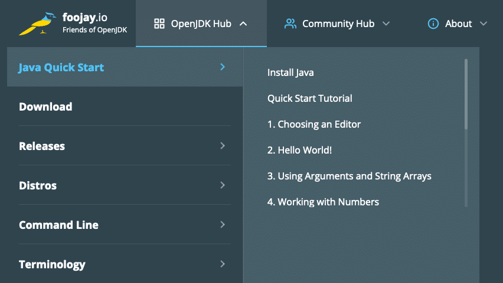
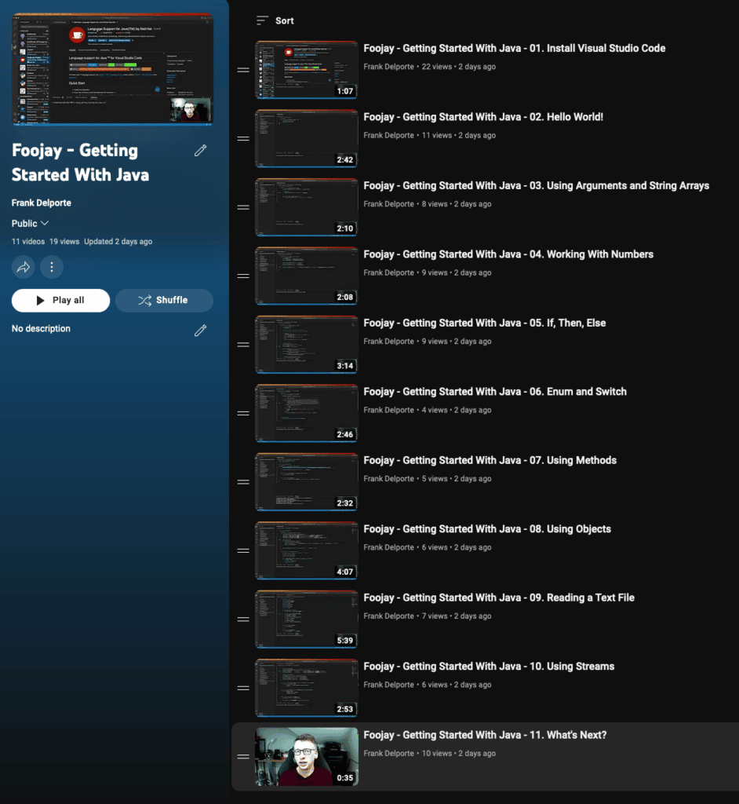

Foojay.io aims to be the starting point for "all-things OpenJDK," but during one of my morning walks the idea struck me that this site really needs complete beginner materials, too.

As we want to spread the love for OpenJDK, i.e., Java, Kotlin, and other OpenJDK languages, the JVM, and all related technologies, we were missing an important audience: someone who is interested in an OpenJDK language, such as Java, but has no experience with it yet, and ends up on Foojay.io.

So... today we're announcing a new section: [Java Quick Start](https://foojay.io/java-quick-start/) (with hopefully more quick starts to follow, e.g., 'Kotlin Quick Start'), which you can reach via the main menu, which includes a 30 minute [video-series](https://www.youtube.com/playlist?list=PL-3Bf_FLNZLCI7MEiWscgdIwSB8p2Z7Xb) with an introduction to the Java programming language:

<figure class="wp-block-gallery has-nested-images columns-default is-cropped wp-block-gallery-1 is-layout-flex wp-block-gallery-is-layout-flex">
 <figure class="wp-block-image size-large">
  
 </figure>
 <figure class="wp-block-image size-large">
  
 </figure>
</figure>

## What You Will Learn

The quick start is divided into these sections.

1. [Installing Java](https://foojay.io/java-quick-start/#1-install-java). Before you can run any Java source code, you need the OpenJDK to be installed. First, we check if you have access to an OpenJDK version 11 or later. If this is not the case, we give you download instructions, including screenshots for Windows, Mac OS X, and Linux.
2. [Quick Start Tutorial](https://foojay.io/java-quick-start). In 10 short screencasts, code samples are provided to explain the basics of using Java. Of course, there is a lot more to learn! But in these videos (in total about 30 minutes), each with a page describing the code, you will see some use cases that can be used to experiment and get a feeling of how to code with Java.
3. [Next Steps](https://foojay.io/java-quick-start/#3-next-steps). We'd like to end by convincing you to dive further into the Java world. There are many more free sources to learn here on Foojay.io and other websites! This is the place where we list a few of these and can easily add more.

We hope [this new section will help new users to start programming with Java](https://foojay.io/java-quick-start/), so please spread the word.

## Conclusion

I do these morning walks together with my dog Wifi. If you hear some snoring during the videos, that's because she is also my not-so-very-active-office-assistent, and you can see her behind me in the movies.

Some Raspberry Pi's "infiltrated" into the example code. That's because this quick start tutorial is part of my book "[Getting Started with Java on the Raspberry Pi](https://webtechie.be/books/)", but has been slightly modified to better fit Foojay.io.
