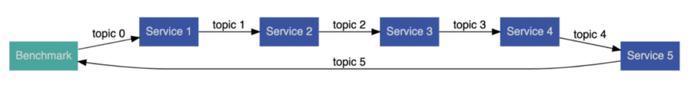
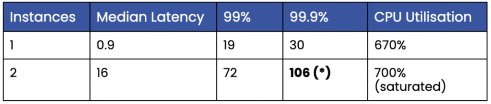
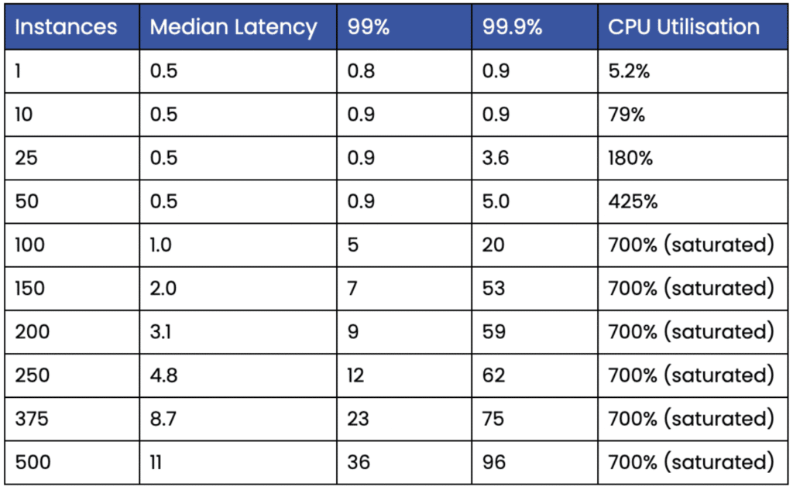
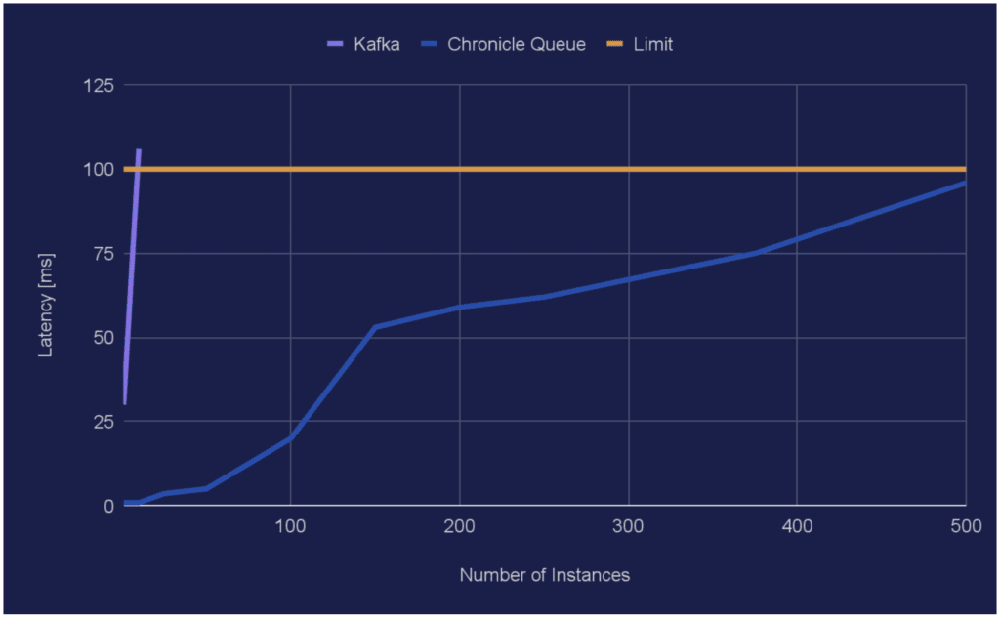
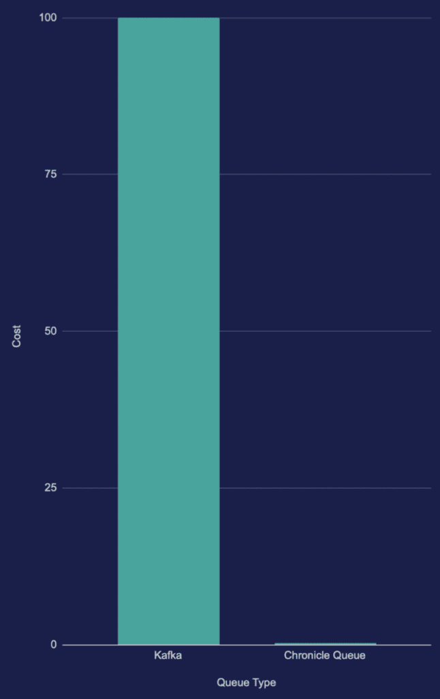

While the Cloud offers great convenience and flexibility, the operational cost for applications deployed in it can sometimes be significant.

In this article, we show a way to substantially reduce operating costs in latency-sensitive Event-Driven Architecture (EDA) Java applications by migrating from Kafka to Chronicle Queue open-source, which is a more resource-efficient and[lower-latency](https://dzone.com/articles/kafka-vs-chronicle-for-microservices " lower-latency") queue implementation.

### What is EDA?

An EDA (Event-Driven Architecture) application is a distributed application where events (in the form of messages or DTOs) are produced, detected, consumed, and reacted to.

Distributed means it might run on different machines or the same machine but in separate processes or threads.

The latter concept is used in this article whereby messages are persisted to queues.

### Setting the Scene

Suppose that we have an EDA application with a chain of five services and where we have a requirement that 99.9% of the messages sent from the first producer to the last consumer should have a latency less than 100 ms at a message rate of 1,000 messages per second.



*Figure 1. The five Services and the Benchmark interconnected by six topics/queues.*

In other words, the time it takes from sending a message (ie using topic 0) by the Benchmark thread to when a resulting message is received by the Benchmark thread again (ie via topic 5) is only allowed to be higher than 100 ms for on average one messages out of every 1,000 messages which are sent every second.

The messages used in this article are simple. They contain a long nanosecond timestamp holding the initial timestamp when a message is first posted via topic 0 and an int value that is increased by one each time the message is propagated from one service to the next (this value is not actually used but illustrates a rudimentary service logic).

When a message arrives back at the Benchmark thread, the current nanotime is compared with the original nanotime in the initial message sent on topic 0 to allow the calculation of the total latency across the entire service chain. The latency samples are then subsequently fed into a histogram for later analysis.

As can be seen in Figure 1 above, the number of topics/queues is equal to the number of services plus one. Hence, there are six topics/queues because there are five services.

### The Question

The question in this article is: ***how many instances of these chains can we set up on a given hardware and still meet the latency requirement?***

Or, to rephrase it, h**ow many of these applications can we run and still pay the same price for the hardware used?**

### Default Setup

**In this article, I have elected to use Apache Kafka because it is one of the most common queue types used in the market. I have also selected Chronicle Queue due to its ability to provide low latency and resource efficiency.**

Both Kafka and Chronicle Queue have several configurable options, including replicating data across several servers. In this article, a single non-replicated queue will be used. For performance reasons, the Kafka broker will be run on the same machine as the services, allowing the use of the local loopback network interface.

The KafkaProducer instances are configured to be[optimised for low latency](https://docs.confluent.io/cloud/current/client-apps/optimizing/latency.html " optimised for low latency") (eg setting "acks=1"), and so are the KafkaConsumer instances.

The Chronicle Queue instances are created using the default setup with no explicit optimisation. Hence, the more advanced performance features in Chronicle Queue like CPU-core pinning and busy spin-waiting are not used.

### Kafka

Apache [Kafka](https://kafka.apache.org/ "Kafka") is an open-source distributed event streaming platform for high-performance data pipelines, streaming analytics, data integration, and mission-critical applications used extensively in various EDA applications, especially when several information sources residing in different locations are to be aggregated and consumed.

In this benchmark, each test instance will create six distinct Kafka topics, and they are named topicXXXX0, topicXXXX1, … , topicXXXX5 where XXXXX is a random number.

### Chronicle Queue

Open-source [Chronicle Queue](https://chronicle.software/queue/ "Chronicle Queue ")is a persisted low-latency messaging framework for high-performance and critical applications. Interestingly, Chronicle Queue uses off-heap memory and memory-mapping to reduce memory pressure and garbage collection impacts, making the product popular within the fintech area where deterministic low latency messaging is crucial.

In this other benchmark, each test instance will create six Chronicle Queue instances, named topicXXXX0, topicXXXX1, … , topicXXXX5 where XXXXX is a random number.

### Code

The inner loops for the two different service thread implementations are shown below. They both poll their input queue until being ordered to shut down and, if there are no messages, they will wait for one-eighth of the expected inter-message time before a new attempt is made.

Here is the code:

#### Kafka

```java
while (!shutDown.get()) {
    ConsumerRecords<Integer, Long> records = 
            inQ.poll(Duration.ofNanos(INTER_MESSAGE_TIME_NS / 8));
    for (ConsumerRecord<Integer, Long> record : records) {
        long beginTimeNs = record.value();
        int value = record.key();
        outQ.send(new ProducerRecord<>(topic, value + 1, beginTimeNs));
    }
}
```

Using the record *key()* to carry an *int* value might be a bit unorthodox but allows us to improve performance and simplify the code.

#### Chronicle Queue

```java
while (!shutDown.get()) {
    try (final DocumentContext rdc = tailer.readingDocument()) {
        if (rdc.isPresent()) {
            ValueIn valueIn = rdc.wire().getValueIn();
            long beginTime = valueIn.readLong();
            int value = valueIn.readInt();
            try (final DocumentContext wdc =
                         appender.writingDocument()) {
                final ValueOut valueOut = wdc.wire().getValueOut();
                valueOut.writeLong(beginTime);
                valueOut.writeInt(value + 1);
            }
        } else {
            LockSupport.parkNanos(INTER_MESSAGE_TIME_NS / 8);
        }
    }
}
```

### Benchmarks

The benchmarks had an initial warmup phase during which the JVM's C2 compiler profiled and compiled code for much better performance. The sampling results from the warmup period were discarded.

More and more test instances were started manually (each with its own five services) until the latency requirements could not be fulfilled anymore. Whilst running the benchmarks, the CPU utilisation was also observed for all instances using the "top" command and averaged over a few seconds.

The benchmarks did not take coordinated omission into account and were run on Ubuntu Linux (5.11.0-49-generic) with AMD Ryzen 9 5950X 16-Core Processors at 3.4 GHz with 64 GB RAM where the applications were run on the isolated cores 2-8 (7 CPU cores in total) and queues were persisted to a 1 TB NVMe flash device . OpenJDK 11 (11.0.14.1) was used.

All latency figures are given in ms, 99% means 99-percentile and 99.9% means 99.9-percentile.

### Kafka

The Kafka broker and the benchmarks were all run using the prefix *"taskset -c 2-8"* followed by the respective command (eg *taskset -c 2-8 mvn exec:java@Kafka*). The following results were obtained for Kafka:



*Table 1. Shows Kafka instances vs latencies and CPU utilisation.*

(\*) Over 100 ms on the 99.9-percentile.

As can be seen, only one instance of the EDA system could be run simultaneously. Running two instances increased the 99.9-percentile, so it exceeded the limit of 100 ms. The instances and the Kafka broker quickly saturated the available CPU resources.

Here is a snapshot from the output from the "top" command when running two instance and a broker (pid 3132946):

```
3134979 per.min+  20   0   20.5g   1.6g  20508 S 319.6   2.6  60:27.40 java                                                                            
3142126 per.min+  20   0   20.5g   1.6g  20300 S 296.3   2.5  19:36.17 java                                                                            
3132946 per.min+  20   0   11.3g   1.0g  22056 S  73.8   1.6   9:22.42 java
```

### Chronicle Queue

The benchmarks were run using the command *"taskset -c 2-8 mvn exec:java@ChronicleQueue"* and following results were obtained:



*Table 2. Shows Chronicle Queue instances vs latencies and CPU utilisation.*

The sheer efficiency of Chronicle Queue becomes apparent in these benchmarks when 500 instances can be run at the same time meaning we handle 3,000 simultaneous queues and 3,000,000 messages per second on just 7 cores at less than 100 ms delay at the 99.9-percentile.

### Comparison

Here is a chart showing the number of instances vs the 99.9-percentile for the two different queue types:



*Chart 1. Shows Instances vs latencies in ms for the 99.9-percentile.*

As can be seen, the curve for Kafka goes from 30 ms to 106 ms in just one step so the latency growth for Kafka looks like a wall in this scale.

### Conclusion

About four hundred times more instances can be run on the same hardware if a switch is made from Kafka to Chronicle Queue for specific latency-sensitive EDA applications.

About four hundred times more instances corresponds to a potential of reducing cloud or hardware costs by about 99.8% as illustrated in Chart 2 below (less is better). In fact, the cost can barely be seen at all in the scale used:



*Chart 2. Shows normalised cost vs queue type (less is better).*

### Resources

Open-source [Apache Kafka](https://kafka.apache.org/ "Apache Kafka")  

Open-source [Chronicle Queue](https://chronicle.software/queue/ "Chronicle Queue ")
