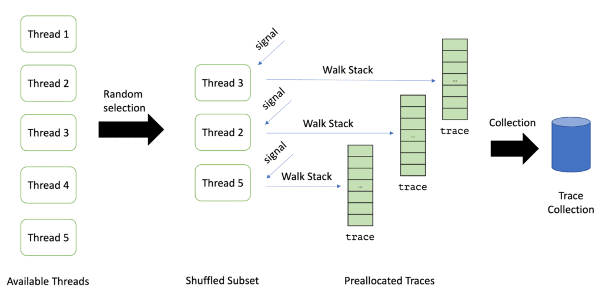

> This is the second post in the series, building a profiler from scratch using AsyncGetCallTrace. Today, we're covering wall-clock profiling and how to collect the obtain stack traces. If you're unfamiliar with AsyncGetCallTrace, please check out my previous article in the series [here](https://foojay.io/today/writing-a-profiler-from-scratch-introduction/).

Our goal today is to essentially write the primary loop of a profiler and do the following every n milliseconds (where n is our chosen profiling interval):


The question that comes up is: Which threads should we sample? If we only sample currently running threads, then we have cpu-time profiling, but if we sample all threads (running and idle), we have the far more popular wall-clock profiling.

The difference between both types is best described by Richard Warburton and Sadiq Jaffer [in their article](https://www.opsian.com/blog/solving-performance-problems-with-profilers-wallclock-vs-cpu-time/) on [opsian.com](https://www.opsian.com/blog/solving-performance-problems-with-profilers-wallclock-vs-cpu-time/):
> *CPU Time*. There's very little point in trying to measure what's happening off-cpu if you've got a single very hot thread, as many event-loop style applications have. You may see plenty of time being spent in other threads that are waiting around performing background work but aren't actually a bottleneck in terms of your application. So CPU Time is useful when you know you're bottlenecked on a CPU problem.
> *Wallclock Time* is useful for problems where CPU utilisation seems low but application throughput or latency doesn't meet expectations. This is because threads are probably blocked on something, for example lock contention, times when you're waiting for downstream blocking network IO to happen or running with too many threads so some of them don't get scheduled. The trigger for looking at Wallclock time would be low CPU usage during your period of performance issues.

The choice of the sampling mode, therefore, depends on the actual use case.

How do we obtain the list of threads in the first place? We could use the aptly named [GetAllThreads](https://docs.oracle.com/en/java/javase/17/docs/specs/jvmti.html#GetAllThreads) method, but we cannot use the returned thread objects to quickly get the thread ids we need for sending the threads signals. There is another possibility: Registering for [ThreadStart](https://docs.oracle.com/en/java/javase/17/docs/specs/jvmti.html#ThreadStart) and [ThreadEnd](https://docs.oracle.com/en/java/javase/17/docs/specs/jvmti.html#ThreadEnd) events and collecting the threads as they are created:
> >
> > ```
> > void JNICALL
> > ThreadStart(jvmtiEnv *jvmti_env,
> >             JNIEnv* jni_env,
> >             jthread thread)
> > ```
>
> Thread start events are generated by a new thread before its initial method executes. A thread may be listed in the array returned by [`GetAllThreads`](https://docs.oracle.com/en/java/javase/17/docs/specs/jvmti.html#GetAllThreads) before its thread start event is generated. It is possible for other events to be generated on a thread before its thread start event. The event is sent on the newly started [`thread`](https://docs.oracle.com/en/java/javase/17/docs/specs/jvmti.html#ThreadStart.thread).
> JVMTI documentation

We create a class called `ThreadMap` for this purpose (stored in a global variable): It maps thread ids to the internal ids (because thread ids might be reused during the lifetime of a process), and the `jthread` (for JVMTI operations) and the `pthread` (for sending signals) and maps these internal ids in turn to names, so we can later display them.

It has to be thread-safe, as we're accessing it from multiple threads in parallel. So we have to create a lock for its internal data structures. This is quite simple with modern C++:

```cpp
struct ValidThreadInfo {
    jthread jthread;
    pthread_t pthread;
    bool is_running;
    long id;
};

class ThreadMap {
  std::recursive_mutex m;
  std::unordered_map<pid_t, ValidThreadInfo> map;
  std::vector<std::string> names;

  public:

    void add(pid_t pid, std::string name, jthread thread) {
      const std::lock_guard<std::recursive_mutex> lock(m);
      map[pid] = ValidThreadInfo{.jthread = thread, .pthread = pthread_self(), .id = (long)names.size()};
      names.emplace_back(name);
    }

    void remove(pid_t pid) {
      const std::lock_guard<std::recursive_mutex> lock(m);
      map.erase(pid);
    }
};
```

Obtaining the thread id for the current thread leads to our first platform-dependent code, using a syscall on Linux and a non-posix pthread method on mac:

```cpp
pid_t get_thread_id() {
  #if defined(__APPLE__) && defined(__MACH__)
  uint64_t tid;
  pthread_threadid_np(NULL, &tid);
  return (pid_t) tid;
  #else
  return syscall(SYS_gettid);
  #endif
}
```

*Yes, we could quickly implement our profiler for other BSDs like FreeBSD, but MacOS is the only one I have at hand.*

Keep in mind to also add the main thread to the collection by calling the `OnThreadStart` method in the OnVMInit method, which handles the start of the VM.

Now we have an up-to-date list of all threads. For wall-clock profiling, this is fine, but for cpu-time profiling, we have to obtain a list of running threads. We conveniently stored the `jthread` objects in our thread map, so we can now use the [GetThreadState](https://docs.oracle.com/en/java/javase/17/docs/specs/jvmti.html#GetThreadState) method:

```cpp
bool is_thread_running(jthread thread) {
  jint state;
  auto err = jvmti->GetThreadState(thread, &state);
  // handle errors as not runnable
  return err == 0 && state != JVMTI_THREAD_STATE_RUNNABLE;
}
```

This leads us to a list of threads that we can sample. It is usually not a good idea to sample all available threads: With wall-clock profiling, the list of threads can be so large that sampling all threads is too costly. Therefore one typically takes a random subset of the list of available threads. Async-profiler, for example, takes 8, which we use too.

Taking a random subset is quite cumbersome in C, but C++ has a neat library function since C++11: [`std:shuffle`](https://en.cppreference.com/w/cpp/algorithm/random_shuffle). We can use it to implement the random selection:

```cpp
std::vector<pid_t> get_shuffled_threads() {
  const std::lock_guard<std::recursive_mutex> lock(m);
  std::vector<pid_t> threads = get_all_threads();
  std::random_device rd;
  std::mt19937 g(rd());
  std::shuffle(threads.begin(), threads.end(), g);
  return std::vector(threads.begin(), threads.begin() + std::min(MAX_THREADS_PER_ITERATION, (int)threads.size()));
}
```

*Be aware that we had to change the mutex to a mutex which allows recursive reentrance, as `get_all_threads` also acquires the mutex.*

The next step is creating a sampling thread that runs the loop I described at the beginning of this article. This superseedes the itimer sampler from the previous post, as the mechanism does not support sending signals to a random subset only. The sampling thread is started in the `OnVMInit` handler and joined the `OnAgentUnload` handler. Its implementation is rather simple:

```cpp
std::atomic<bool> shouldStop = false;
std::thread samplerThread;

static void sampleLoop() {
  initSampler();
  std::chrono::nanoseconds interval{interval_ns};
  while (!shouldStop) {
    auto start = std::chrono::system_clock::now();
    sampleThreads();
    auto duration = std::chrono::system_clock::now() - start;
    // takes into account that sampleThreads() takes some time
    auto sleep = interval - duration;
    if (std::chrono::seconds::zero() < sleep) {
      std::this_thread::sleep_for(sleep);
    }
  }
  endSampler(); // print the collected information
}

static void startSamplerThread() {
  samplerThread = std::thread(sampleLoop);
}
```

The `initSampler` function preallocates the traces for `N=8 `threads, as we decided only to sample as many at every loop. The signal handlers can later use these preallocated traces to call `AsyncGetCallTrace`:

```cpp
const int MAX_DEPTH = 512; // max number of frames to capture

static ASGCT_CallFrame global_frames[MAX_DEPTH * MAX_THREADS_PER_ITERATION];
static ASGCT_CallTrace global_traces[MAX_THREADS_PER_ITERATION];

static void initSampler() {
  for (int i = 0; i < MAX_THREADS_PER_ITERATION; i++) {
    global_traces[i].frames = global_frames + i * MAX_DEPTH;
    global_traces[i].num_frames = 0;
    global_traces[i].env_id = env;
  }
}
```

The `sampleThreads` the function sends the signals to each thread using pthread_signal. This is why store the pthread for every thread. But how does a signal handler know which of the traces to use? And how does the `sampleThreads` function know when all signal handlers are finished?

It uses two atomic integer variables for this purpose:

* `available_trace`: the next unused available trace index in the `global_traces` array
* `stored_traces`: the number of traces already stored

The signal handler is then quite simple:

```cpp
static void signalHandler(int signo, siginfo_t* siginfo, void* ucontext) {
  asgct(&global_traces[available_trace++], MAX_DEPTH, ucontext);
  stored_traces++;
}
```

The `sampleThreads` function has to only wait till `stored_traces` is as expected:

```cpp
static void sampleThreads() {
  // reset the global variables
  available_trace = 0;
  stored_traces = 0;
  // get the threads to sample
  auto threads = thread_map.get_shuffled_threads();
  for (pid_t thread : threads) {
    auto info = thread_map.get_info(thread);
    if (info) {
      // send a signal to the thread
      pthread_kill(info->pthread, SIGPROF);
    }
  }
  // wait till all handlers obtained there traces
  while (stored_traces < threads.size());
  // process the traces
  processTraces(threads.size());
}
```

We keep the processing of the traces from the last blog post and just store the total number of traces as well as the number of failed traces:

```cpp
static void processTraces(size_t num_threads) {
  for (int i = 0; i < num_threads; i++) {
    auto& trace = global_traces[i];
    if (trace.num_frames <= 0) {
      failedTraces++;
    }
    totalTraces++;
  }
}
```

The two global variables don't have to be atomic anymore, as only the sampler thread modifies them. A regular profiler would of course use the traces to obtain information on the run methods, but this is a topic for the next blog post in this series, so stay tuned. You can find the source code for the project on [GitHub](https://github.com/parttimenerd/writing-a-profiler/tree/post-1).

*This blog post first appeared on my personal blog [mostlynerdless.de](https://mostlynerdless.de). This blog series is part of my work in the [SapMachine](https://sapmachine.io/) team at [SAP](https://sap.com), making profiling easier for everyone.*
