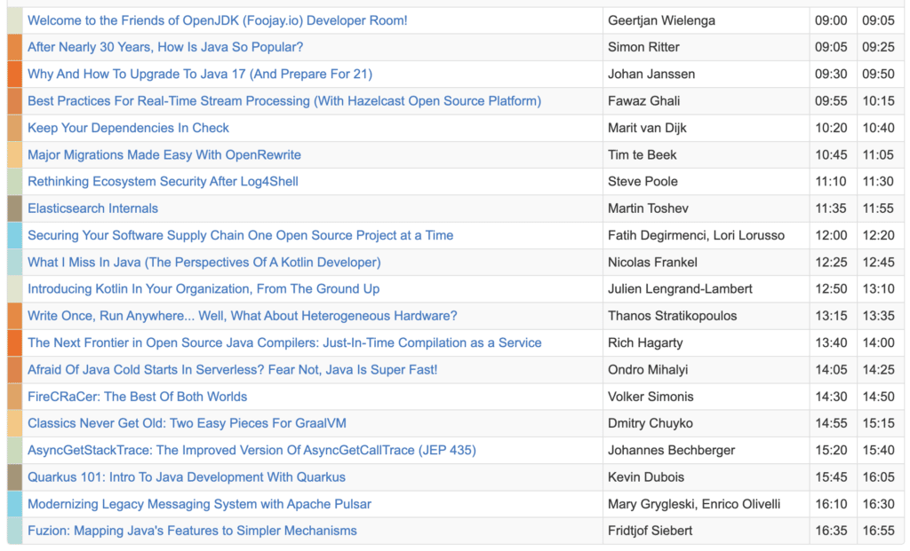

Again, i.e., following on from good times in [2022](https://foojay.io/today/friends-of-openjdk-schedule-at-fosdem-2022/) and [2021](https://foojay.io/today/friends-of-openjdk-schedule-at-fosdem-2021/), we have a really great schedule with inspiring speakers for FOSDEM in Brussels, on Sunday, February 5, providing a place for friends of OpenJDK in the Foojay.io Developer Room.

It's all free and fun and we're also organizing a get together with drinks and food the evening before, on Saturday, February 4.

Click the pic above or here to get to the place on the FOSDEM site, check out the sessions, speakers, and be there, it will be educational and fun, as always. 🙂

<https://fosdem.org/2023/schedule/track/friends_of_openjdk/>

[Join in with the Foojay Slack](https://join.slack.com/t/foojay/shared_invite/zt-tgefdcxv-SDwnqUqPH8peWujGNvC1ZQ), where there's an ongoing hangout in the #fosdem23 channel, where you can already get to know the speakers.
