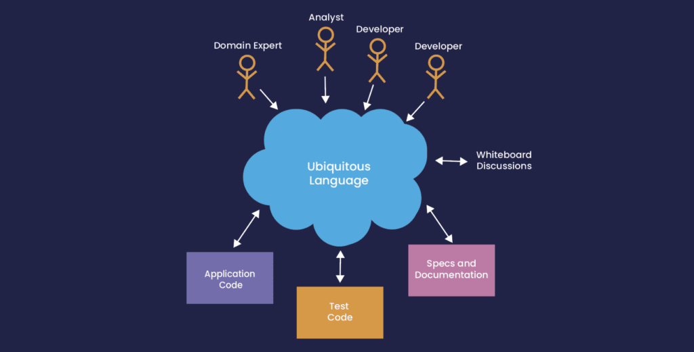

## ...The Fewer the Words, the Greater the Profit."

These wise words were written by François Fénelon, a writer and theologian living during the 17th century.

This is an article summarising different approaches to the development of IT solutions. Learn why the above quote is very relevant for developers in the 21st century.

### Business Driven Development

[Business-driven development](https://en.wikipedia.org/wiki/Business-driven_development "Business-driven development ")is a meta-methodology for developing IT solutions that directly satisfy [business requirements](https://en.wikipedia.org/wiki/Requirement "business requirements"). This leads to increased flexibility and shorter turnaround times when changing the business and adapting the IT systems.

This is achieved by adopting a [model-driven](https://en.wikipedia.org/wiki/Model-driven_engineering "model-driven") approach that starts with the business strategy, requirements and goals and then refines and transforms them into an IT solution. Due to the alignment of the business and IT layers, it is possible to propagate changes in the business automatically to the IT systems.

In [Agile](https://en.wikipedia.org/wiki/Agile_software_development "Agile") terminology, this is partially replaced by Domain-Driven Design and Behaviour Driven Development.

### Domain Driven Development

[Domain-Driven Design](https://en.wikipedia.org/wiki/Domain-driven_design "Domain-Driven Design") is a means of capturing requirements from domain experts to automate a business process using a common language.

### Behaviour Driven Development

[Behaviour Driven Development](https://en.wikipedia.org/wiki/Behavior-driven_development "Behaviour Driven Development") is a means of automating the testing of an application as a high-level description of what the application must do.

This is a form of [Test-Driven Development](https://en.wikipedia.org/wiki/Test-driven_development "Test-Driven Development") that uses inputs, and expected results are modelled as data, e.g., events, data structures, or tables in a [Domain Specific Language](https://en.wikipedia.org/wiki/Domain-specific_language "Domain Specific Language"), rather than in code, allowing these descriptions of functional requirements to be written before coding starts, and automatically checked when code changes.

### Service Oriented Architecture

To divide functionality into easily maintainable, deployable, and replaced parts, a [Service Orientated Architecture](https://en.wikipedia.org/wiki/Service-oriented_architecture "Service Orientated Architecture") models the applications as a collection of microservices.

SOA is often implemented with request/response APIs to support user interfaces.

### Event Driven Architecture

However, backend automated services, where servers communicate with other services are more efficient when an [Event-Driven Architecture](https://en.wikipedia.org/wiki/Event-driven_architecture "Event-Driven Architecture") is used, allowing a higher volume of concurrent events to be in-flight at once.

### Keeping It Simple

While all these things are important during the development of a project, a solution can easily cost many times its initial development over its lifetime.

It is worth spending time on [Keeping it Simple](https://en.wikipedia.org/wiki/KISS_principle "Keeping it Simple") to reduce the cost of maintaining it.

This is something I am always trying to fulfil in the [Chronicle libraries](https://chronicle.software/ "Chronicle libraries") regardless of whether it is an Open Source project or Enterprise projects.

Let's finish with my favourite quote about engineering, from the French writer, Antoine de Saint Exupéry:  
***"It seems that perfection is reached not when there is nothing left to add, but when there is nothing left to take away"*.**

