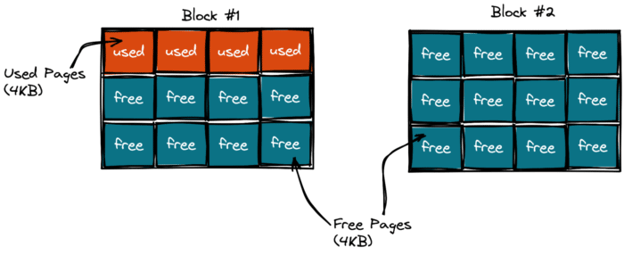
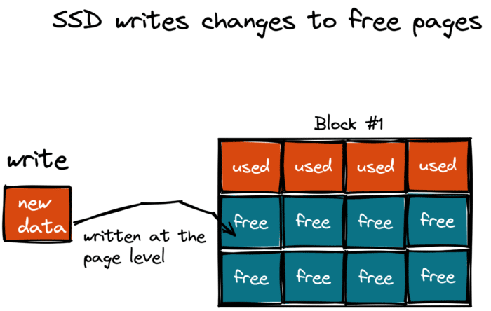
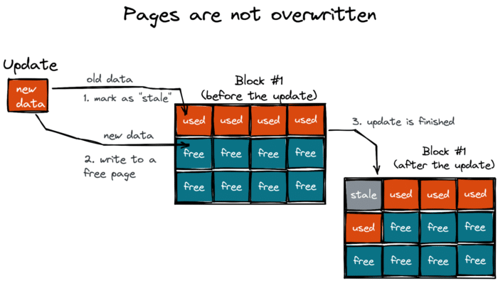
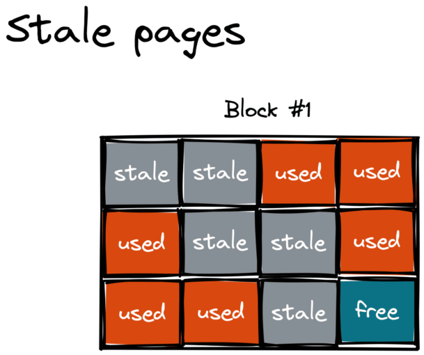
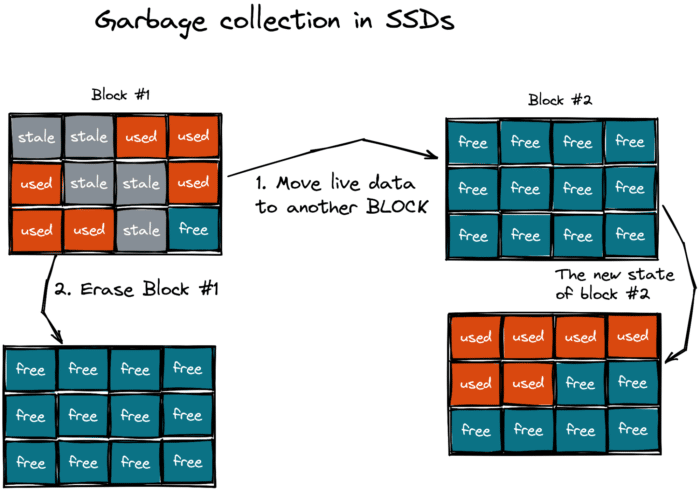
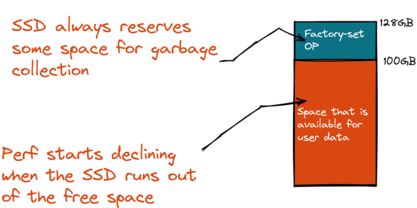
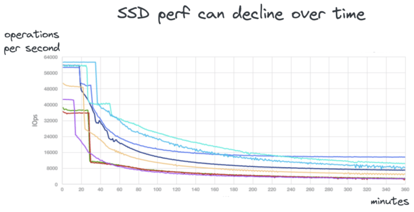

A Java application dutifully executes your logic, leaving behind footprints in the Java heap in the form of dead objects.

A garbage collector will then step in and clean out the memory for the new data. This cycle repeats until the app is stopped. This is well known.

But, the Java heap is one of many places where your app can generate garbage.

The application can also litter other parts of the software stack. It's not done deliberately, but because some stack components also take advantage of garbage collection.

For instance, in my previous articles, I discussed how dead records get generated and then collected in [relational databases such as PostgreSQL](https://foojay.io/today/how-java-litters-beyond-the-heap-relational-databases/ "relational databases such as PostgreSQL") and [distributed databases such as YugabyteDB](https://foojay.io/today/how-java-litters-beyond-the-heap-part-2-distributed-databases/ "distributed databases such as YugabyteDB").

In this article, we'll look at [solid-state drives (SSDs)](https://en.wikipedia.org/wiki/Solid-state_drive "solid-state drives (SSDs)"), which have become ubiquitous and the default storage medium for on-disk data.

What do Java and SSDs have in common? Garbage collection!

## How an SSD Writes Data

Imagine you have created an application that actively uses an SSD. The application can use the SSD directly via the Java File API or indirectly through a database.

The SSD splits its storage space into blocks, then divides each block into pages.

A **page** is the SSD's smallest logical unit, consisting of physical memory cells. The page size is usually 4KB. The pages are grouped into **blocks**. Typically, a block is comprised of 128 pages and has a size of 512KB (128 pages \* 4KB page size).

The block is the smallest unit of access in the SSD. Even if the app needs to read a 4-byte integer value from disk, the file system API/driver first gets a 512KB block containing the value and only then returns to the app the requested 4-byte value.

What about writes? Suppose the app needs to write some user data to disk. The app sends an INSERT statement to a database and the latter flushes changes to the disk.

The SSD will receive the write request from the database and will store data to a free page of one of its blocks. The SSD always writes new data to new pages, it never overwrites used ones.

## How an SSD Updates Data

How does the device handle updates if the SSD never overwrites used pages?

It's simple. The SSD writes new data to a free page and marks a page with old data as stale.

Over time, the number of stale pages in the block keeps growing, leaving less and less space for new data.

The stale pages are effectively garbage that needs to be removed. And the SSD has its own garbage collector.

## Garbage Collection in SSDs

Before getting into the garbage collection details of SSDs, let's find out why the device's inventors turned to this memory management technique. Why couldn't they just erase or overwrite used pages with stale data whenever new data arrived?

It all has to do with physics. While application data can be written or read at the page level, the stale data can only be erased at the block level. This erasure requires more voltage than required for read and write operations. If you apply that voltage at the page level, the SSD controller can damage data in adjacent pages. Thus, the SSD always erases entire blocks.

As a result, the SSD has its own garbage collector (yes, similar to Java) that traverses blocks and cleans those that are about to run out of free space.

The garbage collection is a two-step process in SSDs:

1. All live (used) data is moved to another empty block. See block #2 on the picture.
2. The block with stale data (block #1) gets erased.

As Java developers, we know that the garbage collector needs free space in the heap to do its job efficiently. If the heap space becomes a scarce resource, then the collector can impact the performance of the app and even put it on hold with long stop-the-world pauses. Well, SSDs are similar here as well. If the SSD's garbage collector runs out of free blocks, be ready to take a performance hit.

## SSD Over-Provisioning

SSD manufacturers were aware of the negative impact that garbage collection can have on the performance of our applications. So, they came up with SSD over-provisioning, where each device comes with an extra space that is unavailable to the user.

That over-provisioned space is a safe buffer, allowing your apps and the garbage collector to work with the SSD concurrently, causing as little impact as possible.

However, even though the SSD allocates over-provisioned space, the garbage collector continues using the space belonging to the application data.

As soon as the applications need to persist bigger volumes of data, less space will be available for the garbage collector. If there is a write-intensive workload that generates and updates data on disk continuously, performance can fall sharply:

So, if your application's performance suddenly worsens and your disk I/O chart looks like the one above, tit might be your SSD garbage collector. If the SSD is 50% (or more) full, you may start noticing the impact of garbage collection. In this case, consider using an SSD with larger capacity, and see if you can optimize your write workloads.

## Wrapping Up

As you see, even SSDs use garbage collection to their advantage. If you'd like to learn more about SSD garbage collection internals, check out the following articles:

* [Solid-state storage garbage collection](https://www.techtarget.com/searchstorage/definition/solid-state-storage-SSS-garbage-collection "Solid-state storage garbage collection")
* [Solid-state revolution: in-depth on how SSDs really work](https://arstechnica.com/information-technology/2012/06/inside-the-ssd-revolution-how-solid-state-disks-really-work/3/ "Solid-state revolution: in-depth on how SSDs really work")

This article concludes my series on how Java litters beyond the heap.

The series aimed to show that garbage collection is a widespread technique used far beyond the Java ecosystem.

If implemented properly, garbage collection can simplify the architecture of software and hardware without performance impact.

Java, PostgreSQL, and SSDs are great examples of products that successfully take advantage of garbage collection and still remain among the top products in their categories.

Also, as a bonus, next time someone asks you to explain the inner workings of Java garbage collection, go ahead and surprise them by expanding on the topic to include databases and SSDs.
