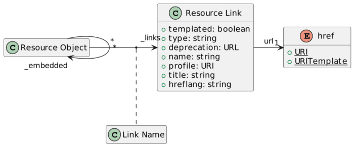
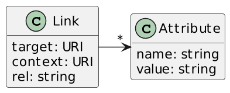

Since I started working for [Apache APISIX](https://apisix.apache.org/), I have tried to deepen my understanding of REST via various means. Did you read my review of [API Design Patterns book](https://blog.frankel.ch/api-design-patterns)?

In the current literature, REST is generally promoted as the best thing since sliced bread. Yet, it comes with lots of challenges. In 2010(!), Martin Fowler wrote a post on the [glory of REST](https://martinfowler.com/articles/richardsonMaturityModel.html). He lists three steps for an API to become *truly* REST:

In each of these steps, issues lurk. This blog post focuses on listing some of them and providing hints at ways to solve them.

Resources {#h2-0-resources}
---------------------------

REST emerged from the cons of SOAP. SOAP provides a single endpoint and executes code depending on the payload. The idea of REST is to provide multiple endpoints, which each executes different code.

I'll be honest; there are few issues at this stage. The biggest one relates to guessing one identity from an existing one. If resource ids are sequential or even only numeric, it's easy to guess other resources' endpoints, *e.g.* , from `/customers/1` to `/customers/2`. The solution is to use non-sequential non-numeric ids, *i.e.* , [Universally unique identifiers](https://en.wikipedia.org/wiki/Universally_unique_identifier).

Let's walk up the REST maturity model.

HTTP verbs {#h2-1-http-verbs}
-----------------------------

HTTP verbs are the next step toward the glory of REST. They come from interactions with HTML "back in the days". Interactions came from operations.

It's pretty straightforward:

| Operation |   Verb   |
|-----------|----------|
| Create    | `POST`   |
| Read      | `GET`    |
| Update    | `PUT`    |
| Update    | `PATCH`  |
| Delete    | `DELETE` |

The main problem with APIs is that you need to go beyond CRUD. Let's imagine a concrete example with a bank transfer: it takes money from an account and moves it to another one. How shall we model it?

We could use the origin account as the resource, *e.g.* , `/accounts/a1b2c3d4e5f6`. The target account, the amount, etc., can be passed as query parameters or in the body. But what HTTP verb shall we use?

It changes the identified resource indeed, but it has "side-effects": it also changes another resource, the target account. Here are a couple of options on how to manage the HTTP verb:

* Use `POST` because it changes the source resource. It's misleading because it doesn't tell about side effects.
* Use a dedicated HTTP verb, *e.g.* , `TRANSFER`. It's not self-explanatory and is opposite to REST principles.
* Use `POST` with a so-called *custom method* . Custom methods are a Google [API Improvement Proposal](https://google.aip.dev/136):  
  > Custom methods should only be used for functionality that can not be easily expressed via standard methods; prefer standard methods if possible, due to their consistent semantics.  
  >
  > The HTTP URI **must** use a `:` character followed by the custom verb.

  Here's our bank account transfer URI: `/accounts/a1b2c3d4e5f6:transfer`.

  What's the best alternative? "It depends".

Hypermedia {#h2-2-hypermedia}
-----------------------------

Fowler describes Hypermedia Controls as the ultimate step to reaching the glory of REST. It's nowadays known as :
> With HATEOAS, a client interacts with a network application whose application servers provide information dynamically through hypermedia. A REST client needs little to no prior knowledge about how to interact with an application or server beyond a generic understanding of hypermedia.
>
> -- [HATEOAS on Wikipedia](https://en.wikipedia.org/wiki/HATEOAS)

HATEOAS is a concept; here's a possible implementation taken from Wikipedia. When one requests a bank account, say `/accounts/a1b2c3d4e5f6`, the response contains links to actions possible with this specific bank account:

<pre class="EnlighterJSRAW" data-enlighter-language="json">{
  "account": {
    "account_number": "a1b2c3d4e5f6",
    "balance": {
      "currency": "USD",
      "value": 100.00
    },
    "links": {
      "_self": "/accounts/a1b2c3d4e5f6",
      "deposit": "/accounts/a1b2c3d4e5f6:deposit",
      "withdrawal": "/accounts/a1b2c3d4e5f6:withdrawal",
      "transfer": "/accounts/a1b2c3d4e5f6:transfer",
      "close-request": "/accounts/a1b2c3d4e5f6:close-request"
    }
  }
}</pre>

If the balance is negative, only the deposit link will be available:

<pre class="EnlighterJSRAW" data-enlighter-language="json">{
  "account": {
    "account_number": "a1b2c3d4e5f6",
    "balance": {
      "currency": "USD",
      "value": 100.00
    },
    "links": {
      "_self": "/accounts/a1b2c3d4e5f6",
      "deposit": "/accounts/a1b2c3d4e5f6:deposit",
    }
  }
}</pre>

A common issue with REST is the lack of standards; HATEOAS is no different. The first attempt to bring some degree of standardization was the [JSON Hypertext Application Language](https://datatracker.ietf.org/doc/html/draft-kelly-json-hal-08), *aka* HAL. Note that it was incepted in 2012; the latest version dates from 2016, and it's still in draft.

Here's a quick diagram that summarizes the proposal:

 

We can rework the above with HAL as the following:

<pre class="EnlighterJSRAW" data-enlighter-language="json">GET /accounts/a1b2c3d4e5f6 HTTP/1.1
Accept: application/hal+json

HTTP/1.1 200 OK
Content-Type: application/hal+json

{
  "account": {
    "account_number": "a1b2c3d4e5f6",
    "balance": {
      "currency": "USD",
      "value": 100.00
    },
    "_links": {                                    &lt;1&gt;
      "self": {                                    &lt;2&gt;
        "href" : "/accounts/a1b2c3d4e5f6",
        "methods": ["GET"]                         &lt;3&gt;
      },
      "deposit": {
        "href" : "/accounts/a1b2c3d4e5f6:deposit", &lt;4&gt;
        "methods": ["POST"]                        &lt;3&gt;
      }
    }
  }
}</pre>

1. Available links
2. Link to self
3. Tell which HTTP verb can be used
4. Link to deposit

Another attempt at standardization is [RFC 8288](https://www.rfc-editor.org/rfc/rfc8288.html), *aka* Web Linking. It describes the format and contains a [link relationship registry](https://www.rfc-editor.org/rfc/rfc5988#section-6.2.2), *e.g.* , `alternate` and `copyright`. The most significant difference with HAL is that RFC 8288 communicates links via HTTP response headers.

<pre class="EnlighterJSRAW" data-enlighter-language="json">HTTP/2 200 OK

Link: &lt;/accounts/a1b2c3d4e5f6&gt; rel="self";
                               method="GET",                           &lt;1&gt;
      &lt;/accounts/a1b2c3d4e5f6:deposit&gt; rel="https://my.bank/deposit";
                                       title="Deposit";
                                       method="POST"                   &lt;2&gt;
{
  "account": {
    "account_number": "a1b2c3d4e5f6",
    "balance": {
      "currency": "USD",
      "value": 100.00
    }
  }
}</pre>

1. Link to the current resource with the non-standard `self` relation type
2. Link to deposit with the extension `https://my.bank/deposit` relation type and an arbitrary `title` target attribute

Other alternative media types specifications are available.

|                                                             Name                                                             |                                                                                                                                                                     Description                                                                                                                                                                      | Provided by |
|------------------------------------------------------------------------------------------------------------------------------|------------------------------------------------------------------------------------------------------------------------------------------------------------------------------------------------------------------------------------------------------------------------------------------------------------------------------------------------------|-------------|
| [Uniform Basis for Exchanging Representations](https://rawgit.com/uber-hypermedia/specification/master/uber-hypermedia.html) | > The UBER document format is a minimal read/write hypermedia type designed to support simple state transfers and ad-hoc hypermedia-based transitions. > This specification describes both the XML and JSON variants of the format and provides guidelines for supporting UBER-encoded messages over the HTTP protocol.                              | Individuals |
| [Collection+JSON](http://amundsen.com/media-types/collection/format/)                                                        | > Collection+JSON is a JSON-based read/write hypermedia-type designed to support management and querying of simple collections.                                                                                                                                                                                                                      | Individual  |
| [JSON:API](https://jsonapi.org/)                                                                                             | > JSON:API is a specification for how a client should request that resources be fetched or modified, and how a server should respond to those requests. > JSON:API can be easily extended with extensions and profiles.                                                                                                                              | Individuals |
| [Siren](https://github.com/kevinswiber/siren)                                                                                | > Siren is a hypermedia specification for representing entities. > As HTML is used for visually representing documents on a Web site, Siren is a specification for presenting entities via a Web API. > Siren offers structures to communicate information about entities, actions for executing state transitions, and links for client navigation. | Individual  |
| [Application-Level Profile Semantics](https://datatracker.ietf.org/doc/html/draft-amundsen-richardson-foster-alps-07)        | > An ALPS document can be used as a profile to explain the application semantics of a document with an application-agnostic media type (such as HTML, HAL, Collection+JSON, Siren, etc.). > This increases the reusability of profile documents across media types.                                                                                  | IETF        |

Bonus: HTTP response status {#h2-3-bonus-http-response-status}
--------------------------------------------------------------

What Fowler's post doesn't mention is the HTTP response status. Most readers are familiar with the status ranges:

* Informational responses: 100 -- 199
* Successful responses: 200 -- 299
* Redirection messages: 300 -- 399
* Client error responses: 400 -- 499
* Server error responses: 500 -- 599

Likewise, most are also with regularly-found HTTP status:

* [200 OK](https://developer.mozilla.org/docs/Web/HTTP/Status/200),
* [301 Moved Permanently](https://developer.mozilla.org/docs/Web/HTTP/Status/301),
* [302 Found](https://developer.mozilla.org/docs/Web/HTTP/Status/302),
* [401 Unauthorized](https://developer.mozilla.org/docs/Web/HTTP/Status/401),
* [403 Forbidden](https://developer.mozilla.org/docs/Web/HTTP/Status/403),
* [404 Not Found](https://developer.mozilla.org/docs/Web/HTTP/Status/404) and
* [500 Internal Server Error](https://developer.mozilla.org/docs/Web/HTTP/Status/500).

The problem is that beyond these simple cases, it's a mess. For example, look at this [StackOverflow question](https://stackoverflow.com/questions/9794696/which-http-status-code-means-not-ready-yet-try-again-later): "Which HTTP status code means Not Ready Yet, Try Again Later?" Here is a summary of the proposed answers, from the most upvoted to the lowest:

* 503 Service Unavailable
* 202 Accepted (accepted answer)
* 423 Locked
* 404 Not Found
* 302 Found
* 409 Conflict
* 501 Not Implemented (downvoted)

It's not a straightforward answer; there was a lot of debate around the alternatives. For the record, I think the accepted answer is the right one.

That's already a lot on the designer side, but the client side contains a lot of uncertainty, too, as some big APIs providers use their [own HTTP status codes](https://en.wikipedia.org/wiki/List_of_HTTP_status_codes#Unofficial_codes).

Conclusion {#h2-4-conclusion}
-----------------------------

The "glory of REST" doesn't mean much.

There's no univocal semantics to rely on, despite any opposite claim.

As it is, it depends mainly on the implementation and interpretation: both require documenting the custom behavior instead of relying on a shared specification.

SOAP's biggest flaw was its complexity and its focus on big companies, but it at least provided a shared set of standard specifications.

The industry replaced it with REST, not a specification but an architectural site.

REST is simpler and, thus, more approachable, but it requires a lot of custom effort, which changes from project to project.

There are initiatives to provide some standardization, but they are few, and some are at odds with others.

Moreover, they have low traction, so people don't know them, which creates a vicious circle. I hardly advocate getting back to SOAP though I sure miss it sometimes.

*Originally published at [A Java Geek](https://blog.frankel.ch/quest-for-rest/) on January 22^nd^, 2023*

*[CRUD]: Create Read Update Delete
*[HATEOAS]: Hypermedia As The Engine of Application State
