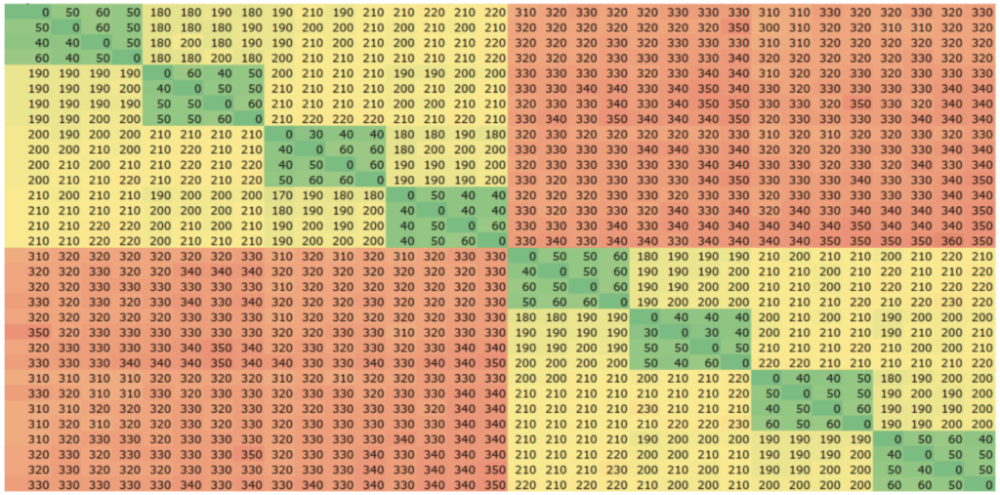
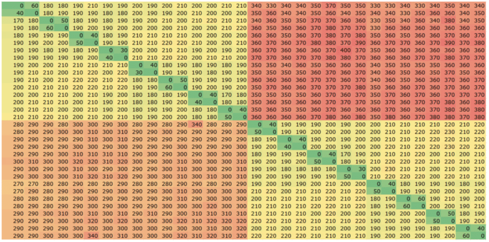

A few years ago we had a global shortage of microchips; now, I feel there is a worldwide shortage of software developers.

Like many other software companies, [Chronicle Software](https://bit.ly/3JE97nx "Chronicle Software") is rapidly expanding and interviewing candidates. We usually ask candidates to demonstrate *a good knowledge of core Java*, then we cover slightly more advanced concepts, such as the use of volatile memory, memory barriers and fences.

While it is important to have a high-level understanding of these concepts when writing concurrent code, it's surprising how few Java developers with 10+ years of experience have a deep knowledge of the underlying hardware. An initial goal of Java was to "write once, run anywhere", but does that mean we should not be sympathetic to the hardware?

Java has done an excellent job at shielding developers from their platform; it is not unreasonable that most developers would rather solve their business problem than become overly burdened with the internal workings of their silicon.

However, some sectors, such as FinTech, benefit from fast software with predictable latencies, where every last microsecond can make a massive difference to their bottom line. For these sectors, it can be beneficial to have a reasonable grasp of the underlying hardware and basic knowledge of the areas described in the following sections.

### Thread Scheduler

Many popular Java frameworks provide horizontal scalability by distributing their workloads over several concurrent compute units. If the number of concurrent threads exceeds the number of cores, the application will suffer a performance degradation every time the thread is swapped out to run another process. The performance cost of this swap will typically add tens of unnecessary microseconds to the overall processing time, not to mention the amount of time that is being used to process the other perhaps not-so-critical task.

Even if the number of critical threads does not exceed the number of cores, threads will still get swapped out or descheduled from time-to-time to allow other threads to run momentarily. In addition, even when a critical thread is spinning at 100% CPU, the scheduler will still occasionally move it to another free core even without obvious pressure from other threads. Such moves not only incur the cost of the switch itself, but also cause increased jitter due to cache invalidation.

To control threads from being scheduled-out we can pin each of our critical threads to a single core. Used in combination with core isolation to reduce interruptions from other tasks, this largely eliminates jitter caused by scheduler interruptions and core migrations, and maximises the benefits available from instruction and data caches.

### Core-To-Core Latency

One often overlooked consideration is core-to-core latency; if we are using the techniques mentioned above to pin our threads to cores, then it is also important to consider which threads we pin to which cores.

For example, if we are exchanging data between two cores on the same socket, then it takes around 100 nanoseconds on Intel Xeon Gold 6346. If instead we exchanged data between cores on different sockets this would take around 225 nanoseconds. The first heatmap below shows the amount of time (in nanoseconds) it takes to exchange data between cores, clearly reflecting the difference in performance when both cores are on the same socket, vs data exchanged between sockets.

AMD architecture differs from Intel by introducing core complexes (CCX) which are subsets of cores within each socket sharing an L3 cache (vs Intel's socket-wide L3 cache design). The number of cores in a CCX varies depending on the specific CPU, with 2, 4, and 8 being common configurations. This means that there is now a difference in performance depending on the placement of threads within a socket, as well as between sockets, with the best performance achieved when exchanging data between cores within the same CCX as is clearly seen in the second and third heatmaps below with 4- and 2-core CCXs respectively.

### Heatmaps

The following heatmaps show the latency when exchanging data between a pair of threads running on different cores, colour-coded with the lowest numbers green, and moving through yellow to red for the highest numbers. All three heatmaps use the same scale.

**Intel Xeon Gold 6346 (2×16 core)**   

**AMD EPYC 7343 (2×16 core, 4-core CCX)**   

**AMD EPYC 73F3 (2×16 core, 2-core CCX)**   

### Conclusion

In tuned Linux environments where threads have been pinned to isolated cores, the best core-to-core performance is available on AMD between cores within the same CCX. When exchanging data between cores in the same socket but across CCX groups, Intel outperforms AMD by around a factor of 2 in these tests. Intel also performs better than AMD by a similar margin when exchanging data between sockets.

Given this, when pinning a number of threads which fits within a CCX then AMD could offer superior performance for distributed applications (recall CCX sizes vary depending on CPU choice).

However, where workloads are spread over a larger number of threads, then Intel is likely to be the preferred platform given the lower, socket-wide core-to-core latencies. Intel is also likely to be the more flexible platform for accommodating expansion in the number of processes/threads given the more consistent socket-wide performance.

Another consideration for small-core-count CCX architectures is thermal management between cores within the same CCX. Specifically, the CCX design dictates that critical threads must be placed within the same CCX for best performance, but the relatively high heat density from neighbouring cores can cause performance to be throttled in some cases. By contrast, Intel's design allows workloads to be more spread across the full socket which helps control heat density and gives more flexibility with thermal management.

Other operating systems such as macOS don't offer quite the same level of fine-grained control as Linux when placing threads, and we are yet to spin up a mac M1 ultra, but when we do it'll be interesting to see how it compares.
