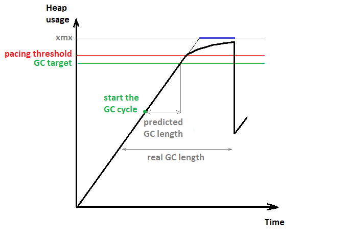
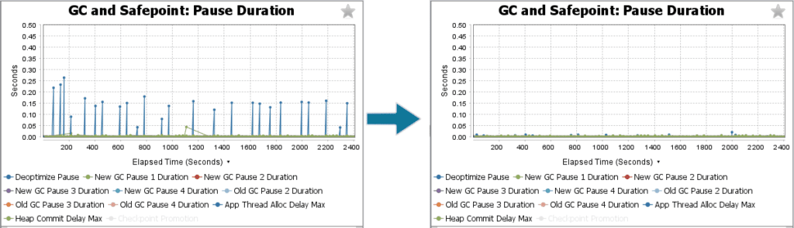
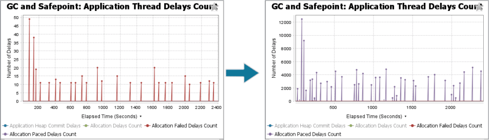
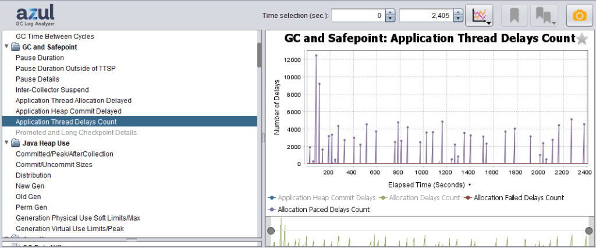

The Java Virtual Machine (JVM) that runs your Java applications has a Garbage Collector (GC) responsible for recycling memory objects that are no longer needed.

The GC operates by cycles, and running a cycle takes some time.

Azul Zulu Prime uses the [C4 Garbage Collector](https://www.azul.com/products/components/pgc/), which runs concurrently with your Java application.

During the GC cycle, the application may outrun the GC and exhaust the memory before the GC completes.

If this happens, delays occur as memory allocations have to wait till the GC finishes.

**Allocation Pacing (AP)** is an additional technique within the JVM of [Azul Zulu Prime builds of OpenJDK](https://www.azul.com/products/components/azul-zulu-prime-builds-of-openjdk/) to prevent long memory allocation delays. AP helps to reduce peak allocation delays by limiting the allocation rate of the application when the heap usage approaches `Xmx`.

AP does this by introducing many small delays into the allocation paths, proportional to the requested allocation size. Giving GC more time to complete its collection helps to avoid exhausting heap space, which can lead to long stalls.

AP is available only in non-ZST mode. AP can be disabled with `-XX:-GPGCUseAllocationPacing`.

What Is ZST? {#h2-0-what-is-zst}
--------------------------------

ZST coordinates memory use between Azul Platform Prime and the Linux operating system. [Learn more on docs.azul.com/prime/ZST](https://docs.azul.com/prime/ZST).

What is Allocation Pacing? {#h2-1-what-is-allocation-pacing}
------------------------------------------------------------

Let's explain Allocation Pacing based on this example graph. The command-line argument Xmx defines the memory limit assigned to the JVM (**grey line**).

Based on a configured value, a target is defined for the GC to keep the total used memory below a specific percentage of Xmx (**green line** ). Depending on the rate of how memory gets allocated (climbing **black line** ), a prediction is made to **start the GC cycle** (**green point**) at the right time not to exceed the target.
 Graph of Allocation Pacing

The application may surprise the GC with a higher allocation rate or live set than predicted. This may lead the heap usage to go over the GC target (**green line** ). If the heap usage keeps growing and reaches the pacing threshold (**red line**), the AP becomes active. AP enforces the maximum allocation rate to reach a better match with the GC cycle length.

The enforced rate is computed dynamically depending on the remaining free space, thus "smoothing" the trajectory leading to the `Xmx` boundary. The reduction is equally proportional between the threads to the requested memory size, thus achieving a fair and proportional distribution of the pacing, without hiccups.

### WITHOUT AP {#h3-2-without-ap}

|   What Happens?   | Allocation delay happens if the requested size doesn't fit in the remaining free space, which can result in two outcomes. |
|-------------------|---------------------------------------------------------------------------------------------------------------------------|
| **Success**       | The GC successfully reclaims enough memory.                                                                               |
| **OOM Exception** | The GC completes a few cycles but isn't able to reclaim enough memory.                                                    |

### WITH AP {#h3-3-with-ap}

|   What Happens?   | Allocation delay happens if the heap usage exceeds the pacing threshold, which can result in two outcomes. |
|-------------------|------------------------------------------------------------------------------------------------------------|
| **Success**       | AP allows allocation to proceed based on global allocation rate and the remaining space.                   |
| **OOM Exception** | The GC completes a few cycles but isn't able to reclaim enough memory.                                     |

 

Effects of Allocation Pacing {#h2-4-effects-of-allocation-pacing}
-----------------------------------------------------------------

* Significantly reduces the maximum magnitude of allocation delays.
* Threads can not suddenly consume the whole heap.
* There is no cost while heap usage is below the pacing threshold.

The first and primary effect of AP is the spreading of long allocation delays into many smaller ones. For the application, this will look more like a throughput reduction than a sudden latency. The second effect is that AP protects the application from an unexpected high activity of some individual threads. One good example is the reloading of a large cache subsystem. Scenarios like that can suddenly increase the allocation rate of the application and exhaust the heap memory.

As a result, this can lead to allocation delays for threads that are responsible for your business logic. With AP, the allocation rate will stay under control. The delays AP introduces are proportional to the allocation size. This means that the more a thread tries to allocate, the more it's getting paced. And therefore, the threads that reload a large cache will be paced a lot, while other threads doing less allocation will stay less affected.

As AP is only active above a certain level, it has no impact at all on the performance of an application as long as it runs below the pacing threshold. AP has to start in advance to have some free space for maneuvering to smooth the heap usage curve before hitting `Xmx`.

Starting early brings the risk of doing unneeded disturbance, as the GC may release memory at any moment. The memory scheduler that organizes the fair and smooth distribution of the allowed under-pacing allocation rate brings some extra cost, which may result in lower throughput when pacing is engaged.

Benchmark to illustrate Application Pacing {#h2-5-benchmark-to-illustrate-application-pacing}
---------------------------------------------------------------------------------------------

To simulate allocation delays and illustrate the abilities of AP, we used EHCachePounder based benchmark that exercises [EHCache](https://www.ehcache.org/). We added a Java agent that periodically consumes a lot of heap. This makes both the allocation rate and live set suddenly jump up. The GC gets surprised, which leads to heap exhaustion before the GC can reclaim any memory. As a result, the benchmark threads start experiencing allocation delays.

If we enable AP, the allocation rate becomes controllable and no longer outruns the GC cycle. All threads, including the benchmark and Java agent, get paced proportionally to their allocations after the heap usage crosses the threshold. In the "GC and Safepoint: Pause Duration," we see a significant decrease in the maximum magnitude of allocation delays (**blue line**).
 Comparison of "GC and Safepoint: Pause Duration"

The improvement happens not only in the GC logs but also in the benchmark metrics themselves. The benchmark reports the duration per iteration in microseconds, with one iteration taking \~0.5 ms on average. Without pacing, we see huge outliers at p99.9+.

Once AP has been enabled, the peaks go down a lot while keeping lower percentiles unaffected. A slight increase at p90+ is expected, as AP replaces long delays with many very short and smooth ones.

| **micros per iteration** | p50 | p90 | p99 |  p99.9 |  p99.99 | p99.999 |
|-------------------------:|----:|----:|----:|-------:|--------:|--------:|
|                **No AP** | 437 | 547 | 771 | 51,967 | 137,215 | 157,695 |
|              **With AP** | 435 | 555 | 795 |  2,703 |   9,663 |  30,079 |

The following chart shows the difference in the number of allocation delays happening per GC cycle. Without AP, the threads, once they run into a delay, have to wait till the GC releases some memory (**red line** -- "Allocation Failed Delays Count").

Oppositely, with AP enabled, there are thousands of small delays (**violet line** -- "Allocation Paced Delays Count"). GC Log Analyzer provides distinct legends depending on the allocation delay origin to make them easy to differentiate. This chart is the best option to answer whether AP gets engaged.
 Comparison of "Allocation Failed Delays Count" versus "Allocation Paced Delays Count"

Troubleshooting {#h2-6-troubleshooting}
---------------------------------------

### Detect if AP is active {#h3-7-detect-if-ap-is-active}

As illustrated in the benchmark, with [Azul GC Log Analyzer](https://docs.azul.com/prime/GC-Log-Analyzer) and a log file of your application, you can detect if the AP has been active.

The "Allocation Paced Delays Count" (**violet line**) in the "GC and Safepoint/GC and Safepoint: Application Thread Delays Count" chart shows the number of small delays introduced by AP during each GC cycle.
 Allocation Paced Delays Count

### Is AP indicating a problem? {#h3-8-is-ap-indicating-a-problem}

* Minor AP activity is not a problem itself.
* Active AP may cause a considerable reduction in throughput.
* If the application metrics reveal a problem, coinciding with AP activity, is a concern.

### How should I address a problem? {#h3-9-how-should-i-address-a-problem}

The best way to get rid of AP being engaged is to help GC to complete in time:

* If GC runs back-to-back, this means heuristics are not too late. GC simply doesn't keep up. Try giving it more memory by increasing `Xmx` for the application.
* Increase the gap between the heuristic target and AP threshold
  * Decrease heuristics target:  
    `-XX:GPGCTargetPeakHeapOccupancyPercent=`\<value\>
  * Increase AP threshold (experimental flag):  
    `-XX:GPGCPacingTriggerHeapOccupancyPercent=`\<value\>

Original article written in cooperation with Dima Silin and [published on the Azul blog](https://www.azul.com/blog/memory-allocation-pacing-in-azul-zulu-prime-builds-of-openjdk-explained/).
