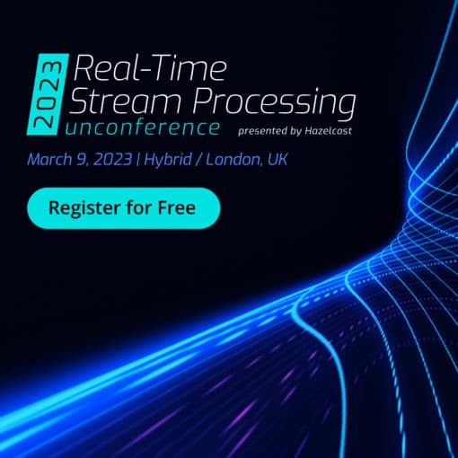

I'm happy to share [Hazelcast will be kicking off 2023](https://hazelcast.com/lp/unconference/) by hosting #RTSPUnconf to connect with community members and industry experts on the Future of Real-Time Stream Processing.

Interested in joining our Stream Processing Fundamentals workshop in-person at CodeNode in London? Connect with other developers and receive a digital badge.

Sign-up here: <https://hazelcast.com/lp/unconference/>

**Why Attend:**

* Gain valuable insight into the future of real-time stream processing from industry experts and peers
* Network and connect with like-minded professionals in the community through networking opportunities
* To learn and enhance your skills in building real-time stream processing applications
* Have an amazing time with new and old friends from the community!

Are you interested in speaking or joining the Real-Time Stream Processing Roundtable?

Send a mail over to: [\[email protected\]](/cdn-cgi/l/email-protection)

**Workshop: Stream Processing Fundamentals**

In this hands-on course, you will gain an understanding of how to use Hazelcast to build solutions that react to events in real-time.

Participants will have the end-to-end experience of developing a solution on their laptop and deploying it to a production cluster that can handle thousands of events per second.

Receive a Stream Processing Fundamentals Workshop digital badge, which you can add to your CV or LinkedIn upon completing our 90 minutes training.

