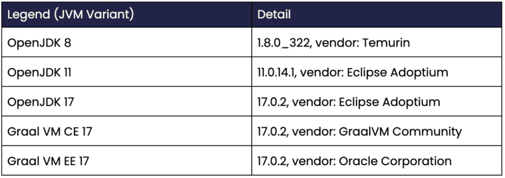
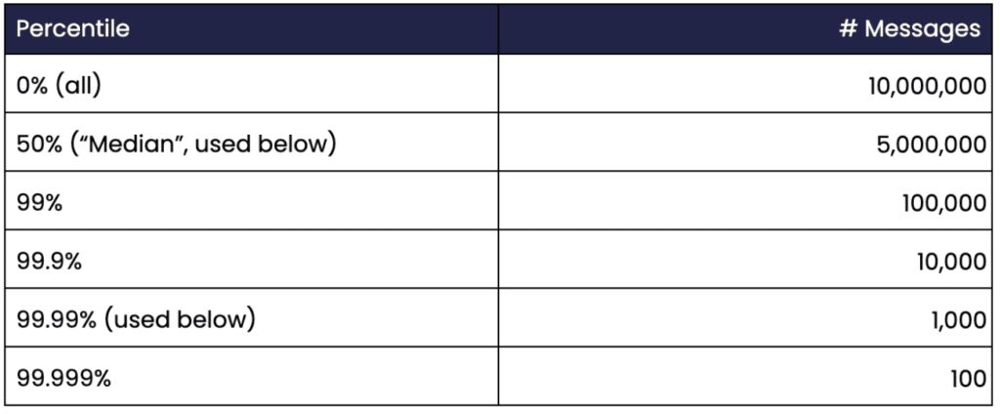
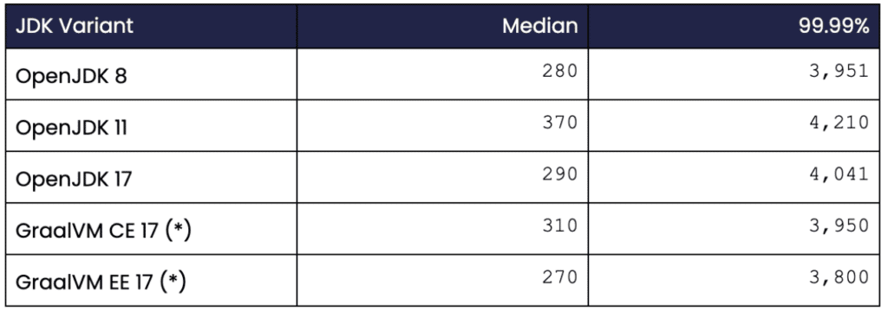
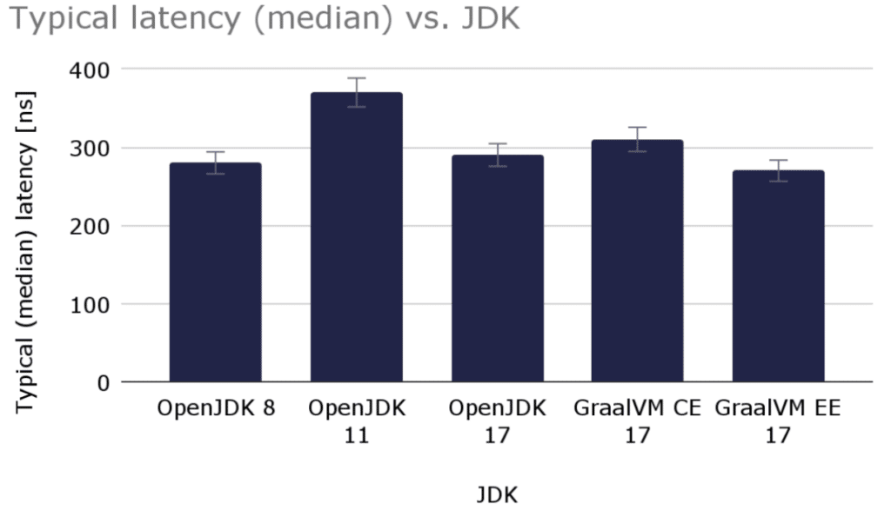
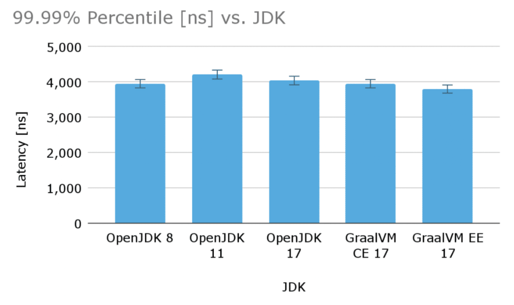

How is a high-performance, low-latency Java application affected by the JVM version used?

Every nanosecond counts for trading and other applications where messages between two different threads are exchanged in about 250ns!

Read this article and find out which JDK variant comes out at the top!

### Benchmarks

This article will use open-source [Chronicle Queue](https://bit.ly/3wWnXy8) to exchange 256-byte messages between two threads whereby all messages are also stored in shared memory (/dev/shm is used to minimise the impact of the disk subsystem).

[Chronicle Queue](https://bit.ly/3wWnXy8) is a persisted low-latency Java messaging framework for high-performance and critical applications. Because Chronicle Queue is operating on mapped native memory, it eliminates the need for garbage collections giving developers deterministic high performance.

In the benchmarks, a single producer thread writes messages to a queue with a nanosecond timestamp. Another consumer thread reads the messages from the queue and records the time deltas in a histogram. The producer maintains a sustained message output rate of 100,000 messages per second with a 256-byte payload in each message. Data is measured over 100 seconds so that most jitter will be reflected in the measurements and ensures a reasonable confidence interval for the higher percentiles.

The target machine has an AMD Ryzen 9 5950X 16-Core Processor running at 3.4 GHz under Linux 5.11.0-49-generic #55-Ubuntu SMP. The CPU cores 2-8 are isolated, meaning the operating system will not automatically schedule any user processes and will avoid most interrupts on these cores.

### The Java Code

Below, parts of the inner loop of the producer is shown:

```
// Pin the producer thread to CPU 2
Affinity.setAffinity(2);

try (ChronicleQueue cq = SingleChronicleQueueBuilder.binary(tmp)
        .blockSize(blocksize)
        .rollCycle(ROLL_CYCLE)
        .build()) {

    ExcerptAppender appender = cq.acquireAppender();
    final long nano_delay = 1_000_000_000L/MSGS_PER_SECOND;

    for (int i = -WARMUP; i < COUNT; ++i) {

        long startTime = System.nanoTime();
        try (DocumentContext dc = appender.writingDocument()) {

            Bytes bytes = dc.wire().bytes();

            data.writeLong(0, startTime);
            bytes.write(data,0, MSGSIZE);
        }
        long delay = nano_delay - (System.nanoTime() - startTime);
        spin_wait(delay);
    }
}
```

In another thread, the consumer thread is running this code in its inner loop (shortened code):

```
// Pin the consumer thread to CPU 4
Affinity.setAffinity(4);

try (ChronicleQueue cq = SingleChronicleQueueBuilder.binary(tmp)
        .blockSize(blocksize)
        .rollCycle(ROLL_CYCLE)
        .build()) {

    ExcerptTailer tailer = cq.createTailer();

    int idx = -APPENDERS * WARMUP;
    while(idx < APPENDERS * COUNT) {
        try (DocumentContext dc = tailer.readingDocument()) {
            if(!dc.isPresent())
                continue;

            Bytes bytes = dc.wire().bytes();

            data.clear();
            bytes.read(data, (int)MSGSIZE);

            long startTime = data.readLong(0);
            if(idx >= 0)
                deltas[idx] = System.nanoTime() - startTime;

            ++idx;
        }
    }
}
```

As can be seen, the consumer thread will read each nano timestamp and record the corresponding latency in an array. These timestamps are later put in a histogram which is printed when the benchmark completes. Measurements will start only after the JVM has warmed up properly and the C2 compiler has JIT:ed the hot execution path.

### JVM Variants

[Chronicle Queue](https://bit.ly/3wWnXy8) officially supports all the recent LTS versions: Java 8, Java 11, and Java 17, and so these will be used in the benchmarks. We will also use the GraalVM community and enterprise edition. Here is a list of the specific JVM variants used:



*Table 1. Shows the specific JVM variants used.*

### Measurements

As 100,000 messages per second are produced, and the benchmarks run for 100 seconds, there will be 100,000 \* 100 = 10 million messages sampled during each benchmark. The histogram used places each sample in a certain percentile: 50% (median), 90%, 99%, 99.9% etc. Here is a table showing the total number of messages received for some percentiles:



*Table 2. Shows the number of messages for each percentile.*

Assuming a relatively small variance of the measurement values, the confidence interval is likely reasonable for percentiles up to 99.99%. The percentile 99.999% probably requires gathering data for at least half an hour or so rather than just 100 seconds to produce any figures with a reasonable confidence interval.

### Benchmarks Results

For each Java variant, the benchmarks are run like this:

```
mvn exec:java@QueuePerformance
```

Remember that our producer and consumer threads will be locked down to run on the isolated CPU cores 2 and 4, respectively.

Here is what a typical process looks like after it has run for a while:

```
$ top

    PID USER      PR  NI    VIRT    RES    SHR S  %CPU  %MEM     TIME+ COMMAND                                                    
3216555 per.min+  20   0   92.3g   1.5g   1.1g S 200.0   2.3   0:50.15
```

As can be seen, the producer and consumer thread spin-waits between each message and therefore consumes an entire CPU core each. If CPU consumption is a concern, latency and determinism can be traded against lowered power consumption by parking threads for a short period (e.g. LockSupport.parkNanos(1000)) when no messages are available.

The figures below are given in nanoseconds (ns) which is essential to understand.

Many other latency measurements are made in microseconds (= 1,000 ns) or even milliseconds (= 1,000,000 ns). One ns corresponds roughly to the access time of [a CPU L1 cache](https://www.intel.com/content/www/us/en/developer/articles/technical/memory-performance-in-a-nutshell.html "a CPU L1 cache").

Here is the result of the benchmarks where all values are given in ns:



*Table 3. Shows the latency figures for the various JDKs used.*   

(\*) Not officially supported by Chronicle Queue.

#### Typical Latency (median)

For the typical (median) values, there is no significant difference between the various JDKs except for OpenJDK 11 which is about 30% slower than the other versions.

The fastest of them all is GraalVM EE 17, but the difference compared to OpenJDK 8/OpenJDK 17 is marginal.

Here is a graph with the typical 256-byte message latency for the various JDK variants used (lower is better):



*Graph 1. Shows the median (typical) latency in ns for the various JDK variants.*

The typical (median) latency varied slightly from run to run where the figures varied around 5%.

#### Higher Percentiles

Looking at the higher percentiles, there is not much difference between the supported JDK variants either. GraalVM EE is slightly faster again but here the relative difference is even smaller. OpenJDK 11 appears to be slightly worse (- 5%) than the other variants, but the delta is comparable within the estimated margin of error.

Here is another graph showing latencies for the 99.99% percentile for the various JDK variants (lower is better):



*Graph 2. Shows the 99.99% percentile latency \[ns\] for the various JDK variants.*

### Conclusions

In my opinion, the latency figures of Chronicle Queue are excellent. Accessing 64-bit data from main memory takes about 100 cycles (which corresponds to about 30 ns on current hardware). The code above has some logic that has to be executed. Additionally, Chronicle Queue obtains data from the producer, persists data (writes to a memory-mapped file), applies appropriate memory fencing for inter-thread communication and happens-before guarantees, and then makes data available to the consumer. All this typically happens around 600 ns for 256 bytes compared to the single 64-bit memory access at 30 ns. Very impressive indeed.

OpenJDK 17 and GraalVM EE 17 seem to be the best choices for this application, providing the best latency figures. Consider using GraalVM EE 17 over OpenJDK 17 if outliers need to be suppressed or if you really need the lowest possible overall latency.

### Resources

Open-source [Chronicle Queue](https://bit.ly/3wWnXy8 "Chronicle Queue")

Open-source [JDK](https://adoptium.net/en-GB/ "JDK")
