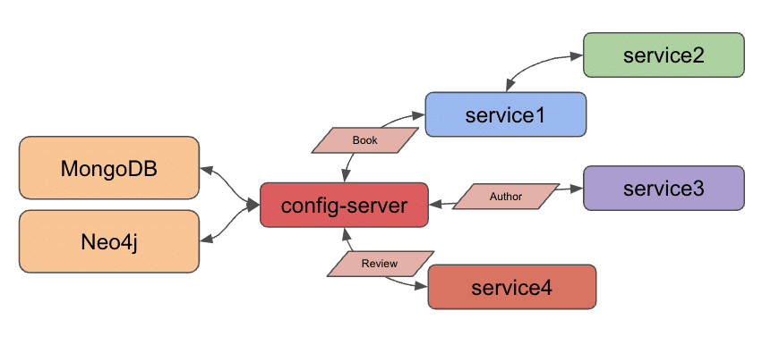
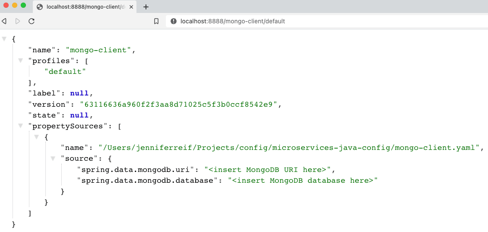
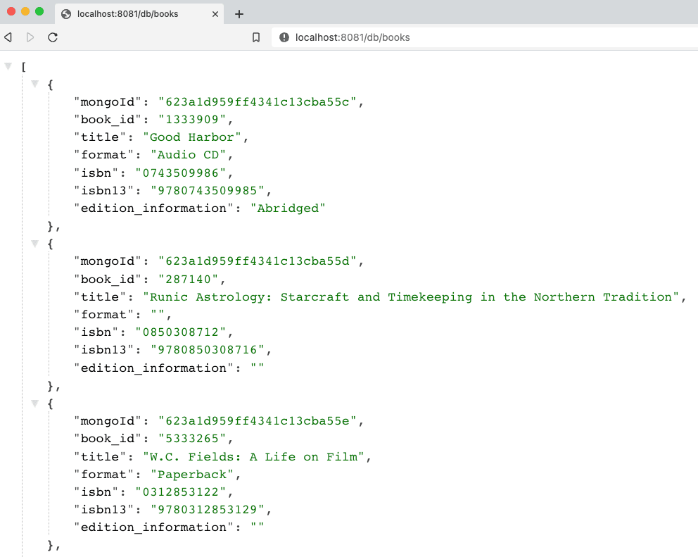
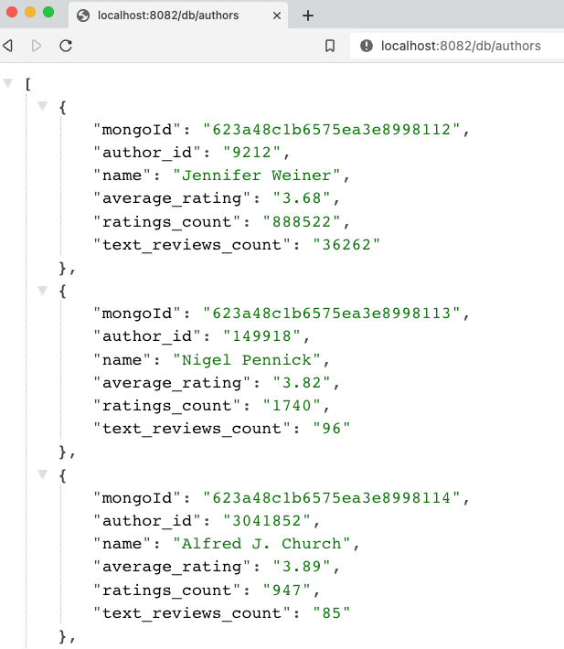

In [our last article](https://foojay.io/today/journeys-in-java-level-7-externalize-microservice-configuration/), we used Spring Cloud Config to provide database credentials to a microservice application connecting to a cloud-hosted Neo4j database. This post will backport this concept to our existing MongoDB database instance and its related microservices.

We will add our MongoDB credentials to the config server, so that it will be the central place for both our Neo4j and MongoDB database access. However, each service only has access to the credentials that it needs to operate, which provides some level of security through "separation of concerns" (versus universal access).

Since we already did this for our Neo4j microservice, there aren't too many steps, and we can use the previous code as our template. Let's get started!

Architecture {#_architecture}
-----------------------------

This microservices project has grown from an [introductory step](https://foojay.io/today/journeys-in-java-level-1-building-an-empire-of-microservices/) with two Spring Boot applications to a managed, configuration-savvy [system of services](https://foojay.io/today/journeys-in-java-level-7-externalize-microservice-configuration/).

In today's edition, we are converting our existing MongoDB-connected services to use Spring Cloud Config for accessing database credentials, matching the architecture we set up last time with a Neo4j microservice.

Updated architecture:



Though we set up Docker Compose to manage all services together a few project iterations ago, we will spend this post focusing on migrating all of our configuration before adding Docker Compose back into the mix later. This means we will run our applications locally today.

Spring Cloud Config {#_spring_cloud_config}
-------------------------------------------

To recap Spring Cloud Config, it provides a way to externalize configuration, so that individual services can access only the properties each needs to operate. More info on the project is written on the [project overview page](https://spring.io/projects/spring-cloud-config).

Our Neo4j microservice (`service4`) is already set up to use Spring Cloud Config, so we can utilize this as a template for our MongoDB services (`service1` for book data and `service3` for author data). We also have an existing `config-server` service, which means we only need to add a separate YAML file to hold our MongoDB credentials separate from the Neo4j credential file. Let's get started!

Applications - Spring Cloud Config Server {#_applications_spring_cloud_config_server}
-------------------------------------------------------------------------------------

The `config-server` is the service that hosts external configuration files and serves them to requesting applications. Since we set this up [last time](https://jmhreif.com/blog/microservices-level7/), the only thing we need to add is another configuration file for this service to make available to our MongoDB services.

Storing config values {#_storing_config_values}
-----------------------------------------------

We used a YAML file for our Neo4j microservice, so we will stick with this same template. However, a properties file would work, as well.

A sample of the new MongoDB file is in the `microservices-java-config` folder of the [Github project](https://github.com/JMHReif/microservices-level8).

```
spring:
  data:
    mongodb:
      uri:
      database:
```


We need to fill in the values for our MongoDB instance in place of the dummy URL and database shown above. Then, we need to save the file and check it into [git](https://git-scm.com/) by running the next statements from the command line.

```bash
microservices-java-config % git init
microservices-java-config % git add
microservices-java-config % git commit -am "Create mongodb yaml"
```


Let's test our config server application with the new configuration file!

Test Config Server {#_test_config_server}
-----------------------------------------

Start the `config-server` application from your IDE or command line. I usually like to test the existing functionality first to ensure we haven't interfered with that before testing new functionality. We can test with the URL `localhost:8888/neo4j-client/default` to ensure our Neo4j configuration still displays.

To test for the newly-added MongoDB config, we need the same `localhost:8888`. Next, we need the *client* application name, which also needs to match the name of the configuration file itself. Since I named the file `mongo-client.yaml`, our application name is `mongo-client`. The last part of the URL is for the user profile, which is `default` because we did not specify otherwise.

That makes our full URL for testing `localhost:8888/mongo-client/default`!



Figure 1. MongoDB config results

Next, we need to plug our MongoDB backing services (`service1` and `service3`) in to use the config server we just set up.

Service1 - modifications {#_service1_modifications}
---------------------------------------------------

Following what we did with our Neo4j app, we need to add a dependency for the Spring Cloud Config client. Open service1's `pom.xml` file and add the following items:

```
<properties>
	//java version property
	<spring-cloud.version>2021.0.3</spring-cloud.version>
</properties>
<dependencies>
	//other dependencies
	<dependency>
		<groupId>org.springframework.cloud</groupId>
		<artifactId>spring-cloud-starter-config</artifactId>
	</dependency>
</dependencies>
<dependencyManagement>
	<dependencies>
		<dependency>
			<groupId>org.springframework.cloud</groupId>
			<artifactId>spring-cloud-dependencies</artifactId>
			<version>${spring-cloud.version}</version>
			<type>pom</type>
			<scope>import</scope>
		</dependency>
	</dependencies>
</dependencyManagement>
```


On the [third line of the above code](https://github.com/JMHReif/microservices-level8/blob/main/service1/pom.xml#L18), we add a property for the Spring Cloud Version, which gives a single location for the pom to source this value. In the dependencies section, we need to add the config client dependency ([seventh line](https://github.com/JMHReif/microservices-level8/blob/main/service1/pom.xml#L34)). Lastly, we add a dependency management section ([line twelve](https://github.com/JMHReif/microservices-level8/blob/main/service1/pom.xml#L50)) to handle versioning of Spring Cloud.

Let's move to the application properties in the `src/main/resources` folder.

```
server.port=8081

spring.application.name=mongo-client
spring.config.import=configserver:http://localhost:8888/
```


The port property stays the same, but we remove the database credential properties because those are now hosted by the config server. The next two properties specify the application name and location of the config server. Our application name and the name of our config file MUST match, so the `spring.application.name` needs to be `mongo-client` (because config file name is `mongo-client.yaml`). Our config server is running locally and on the default config server port, so we use the `localhost:8888` for the last property's value.

This completes the changes needed to `service1`, so we need to do the same to `service3` (our other MongoDB backing service for authors).

Service3 - modifications {#_service3_modifications}
---------------------------------------------------

Here is the list of changes we need to make with links to the code repository included:

1. `pom.xml` - Spring Cloud Config [version property](https://github.com/JMHReif/microservices-level8/blob/main/service3/pom.xml#L18), [dependency](https://github.com/JMHReif/microservices-level8/blob/main/service3/pom.xml#L34), and dependency management [section](https://github.com/JMHReif/microservices-level8/blob/main/service3/pom.xml#L50)
2. `application.properties` - Remove db credentials, add [config server info](https://github.com/JMHReif/microservices-level8/blob/main/service3/src/main/resources/application.properties#L3)

Let's test the updated services with our config server!

Put it to the test {#_put_it_to_the_test}
-----------------------------------------

Kicking things off from the bottom to the top of our stack, let's start the MongoDB instance. *Note: I am running MongoDB locally from a Docker container here. More info is available in the [`docker-mongodb` section](https://github.com/JMHReif/microservices-level8/blob/main/docker-mongodb/README.adoc) of the code repository.*

Next, we start our `config-server` application, either through the IDE or command line. Once running, we can start each of the `service1` and `service3` applications through the IDE or command line. Time to test everything with the following commands.

1. Test config server: open a browser and go to `localhost:8888/mongo-client/default` or go to command line with `curl localhost:8888/mongo-client/default`.
2. Test `service1` is live: open a browser and go to `localhost:8081/db` or go to command line with `curl localhost:8081/db`.
3. Test backend books api: open a browser and go to `localhost:8081/db/books` or go to command line with `curl localhost:8081/db/books`.
4. Test `service3` is live: open a browser and go to `localhost:8082/db` or go to command line with `curl localhost:8082/db`.
5. Test backend authors api: open a browser and go to `localhost:8082/db/authors` or go to command line with `curl localhost:8082/db/authors`.

And here is the resulting output from book and author api results!



Figure 2. Find books



Figure 3. Find authors

Wrapping up! {#_wrapping_up}
----------------------------

For today's progress, we successfully migrated all of our database-interfacing services to use Spring Cloud Config to retrieve database credentials (MongoDB or Neo4j). Next, we will take another run at Docker Compose to add the Neo4j and config services, so that all services can be managed together.

In future posts, we hope to expand our microservices project to dig into service discovery and change data capture topics. Happy coding!

Resources {#_resources}
-----------------------

* Github: [microservices-level8](https://github.com/JMHReif/microservices-level8) repository
* Github: [Meta repository for all related content](https://github.com/JMHReif/microservices-java)
* Documentation: [Spring Cloud Config](https://docs.spring.io/spring-cloud-config/docs/current/reference/html/)
* Blog post: [Baeldung's guide to Spring Cloud Config](https://www.baeldung.com/spring-cloud-configuration)
* Video: [JavaBrain's walkthrough](https://www.youtube.com/watch?v=gb1i4WyWNK4)
