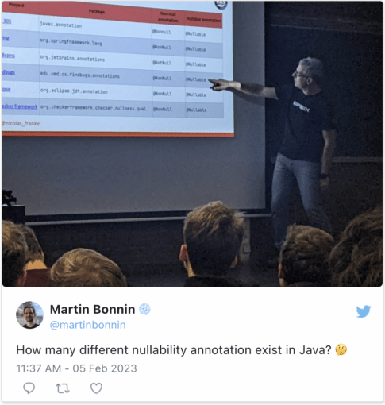

Last week, I was at the [FOSDEM](https://fosdem.org/) conference. FOSDEM is specific in that it has multiple rooms, each dedicated to a different theme and organized by a team. I had two talks:

* [Practical Introduction to OpenTelemetry Tracing](https://fosdem.org/2023/schedule/event/tracing/), in the *Monitoring and Observability* devroom
* [What I miss in Java, the perspective of a Kotlin developer](https://fosdem.org/2023/schedule/event/miss/), in the *Friends of OpenJDK* devroom

The second talk is from [an earlier post](https://blog.frankel.ch/miss-in-java-kotlin-developer/). Martin Bonnin did a tweet from a single slide, and it created quite a stir, even attracting Brian Goetz.

[](https://twitter.com/martinbonnin/status/1622197657534857220)

[



](https://twitter.com/martinbonnin/status/1622197657534857220)

<br />

In this post, I'd like to expand on the problem of nullability and how it's solved in Kotlin and Java and add my comments to the Twitter thread.

Nullability {#h2-0-nullability}
-------------------------------

I guess that everybody in software development with more than a couple of years of experience has heard the following quote:
> I call it my billion-dollar mistake. It was the invention of the null reference in 1965. At that time, I was designing the first comprehensive type system for references in an object oriented language (ALGOL W). My goal was to ensure that all use of references should be absolutely safe, with checking performed automatically by the compiler. But I couldn't resist the temptation to put in a null reference, simply because it was so easy to implement. This has led to innumerable errors, vulnerabilities, and system crashes, which have probably caused a billion dollars of pain and damage in the last forty years.
>
> -- [Tony Hoare](https://en.wikipedia.org/wiki/Tony_Hoare)

The basic idea behind `null` is that one can define an *uninitialized variable*. If one calls a member of such a variable, the runtime locates the memory address of the variable... and fails to dereference it because there's nothing behind it.

Null values are found in many programming languages under different names:

* Python has `None`
* JavaScript has `null`
* So do Java, Scala, and Kotlin
* Ruby has `nil`
* etc.

Some languages do *not* allow uninitialized values, such as Rust.

Null-safety in Kotlin {#h2-1-null-safety-in-kotlin}
---------------------------------------------------

As I mentioned, Kotlin does allow `null` values. However, they are baked into the type system. In Kotlin, every type `X` has two indeed two types:

* `X`, which is non-nullable. No variable of type `X` can be `null`. The compiler guarantees it.

  ```kotlin
  val str: String = null
  ```

  The code above won't compile.
* `X?`, which is nullable.

  ```kotlin
  val str: String? = null
  ```

  The code above does compile.

If Kotlin allows `null` values, why do its proponents tout its null safety? The compiler refuses to call members on *possible* null values, *i.e.*, nullable types.

<pre class="EnlighterJSRAW" data-enlighter-language="kotlin">val str: String? = getNullableString()
val int: Int? = str.toIntOrNull()           //1</pre>

1. Doesn't compile

The way to fix the above code is to check whether the variable is `null` before calling its members:

<pre class="EnlighterJSRAW" data-enlighter-language="kotlin">val str: String? = getNullableString()
val int: Int? = if (str == null) null
          else str.toIntOrNull()</pre>

The above approach is pretty boilerplate-y, so Kotlin offers the null-safe operator to achieve the same:

<pre class="EnlighterJSRAW" data-enlighter-language="kotlin">val str: String? = getNullableString()
val int: Int? = str?.toIntOrNull()</pre>

Null-safety in Java {#h2-2-null-safety-in-java}
-----------------------------------------------

Now that we have described how Kotlin manages `null` values, it's time to check how Java does it. First, there are neither non-nullable types nor null-safe operators in Java. Thus, every variable can potentially be `null` and should be considered so.

<pre class="EnlighterJSRAW" data-enlighter-language="java">var MyString str = getMyString();           //1
var Integer anInt = null;                   //2
if (str != null) {
    anInt = str.toIntOrNull();
}</pre>

1. `String` has no `toIntOrNull()` method, so let's pretend `MyString` is a wrapper type and delegates to `String`
2. A mutable reference is necessary

If you chain multiple calls, it's even worse as every return value can potentially be `null`. To be on the safe side, we need to check whether the result of each method call is `null`. The following snippet may throw a `NullPointerException`:

<pre class="EnlighterJSRAW" data-enlighter-language="java">var baz = getFoo().getBar().getBaz();</pre>

Here's the fixed but much more verbose version:

<pre class="EnlighterJSRAW" data-enlighter-language="java">var foo = getFoo();
var bar = null;
var baz = null;
if (foo != null) {
    bar = foo.getBar();
    if (bar != null) {
        baz = bar.getBaz();
    }
}</pre>

For this reason, Java 8 introduced the [Optional](https://docs.oracle.com/javase/8/docs/api/java/util/Optional.html) type. `Optional` is a wrapper around a possibly null value. Other languages call it `Maybe`, `Option`, etc.

Java language's designers advise that a method returns:

* Type `X` if `X` cannot be `null`
* Type `Optional` if `X` can be `null`

If we change the return type of all the above methods to `Optional`, we can rewrite the code in a null-safe way - and get immutability on top:

<pre class="EnlighterJSRAW" data-enlighter-language="java">final var baz = getFoo().flatMap(Foo::getBar)
                        .flatMap(Bar::getBaz)
                        .orElse(null);</pre>

My main argument regarding this approach is that the `Optional` itself could be `null`. The language doesn't guarantee that it's not. Also, it's not advised to use `Optional` for method input parameters.

To cope with this, annotation-based libraries have popped up:

|                                                                        Project                                                                        |                   Package                    | Non-null annotation | Nullable annotation |
|-------------------------------------------------------------------------------------------------------------------------------------------------------|----------------------------------------------|---------------------|---------------------|
| [JSR 305](https://github.com/amaembo/jsr-305/tree/master/ri/src/main/java/javax/annotation)                                                           | `javax.annotation`                           | `@Nonnull`          | `@Nullable`         |
| [Spring](https://github.com/spring-projects/spring-framework/tree/main/spring-core/src/main/java/org/springframework/lang)                            | `org.springframework.lang`                   | `@NonNull`          | `@Nullable`         |
| [JetBrains](https://github.com/JetBrains/java-annotations/tree/master/common/src/main/java/org/jetbrains/annotations)                                 | `org.jetbrains.annotations`                  | `@NotNull`          | `@Nullable`         |
| [Findbugs](https://github.com/stephenc/findbugs-annotations/tree/master/src/main/java/edu/umd/cs/findbugs/annotations)                                | `edu.umd.cs.findbugs.annotations`            | `@NonNull`          | `@Nullable`         |
| [Eclipse](https://github.com/eclipse/aspectj.eclipse.jdt.core/tree/main/org.eclipse.jdt.annotation/src/org/eclipse/jdt/annotation)                    | `org.eclipse.jdt.annotation`                 | `@NonNull`          | `@Nullable`         |
| [Checker framework](https://github.com/typetools/checker-framework/tree/master/checker-qual/src/main/java/org/checkerframework/checker/nullness/qual) | `org.checkerframework.checker.nullness.qual` | `@NonNull`          | `@Nullable`         |
| [JSpecify](https://github.com/jspecify/jspecify/tree/main/src/main/java/org/jspecify/annotations)                                                     | `org.jspecify`                               | `@NonNull`          | `@Nullable`         |
| [Lombok](https://projectlombok.org/features/NonNull)                                                                                                  | `org.checkerframework.checker.nullness.qual` | `@NonNull`          | -                   |

However, different libraries work in different ways:

* Spring produces WARNING messages *at compile-time*
* FindBugs requires a dedicated execution
* Lombok generates code that adds a null check but throws a `NullPointerException` if it's `null` anyway
* etc.

Thanks to [Sébastien Deleuze](https://mastodon.online/@sdeleuze) for mentioning [JSpecify](https://jspecify.dev/), which I didn't know previously. It's an [industry-wide effort](https://jspecify.dev/about) to deal with the current mess. Of course, the famous XKCD comic immediately comes to mind:


I still hope it will work out!

Conclusion {#h2-3-conclusion}
-----------------------------

Java was incepted when `null`-safety was not a big concern. Hence, `NullPointerException` occurrences are common. The only safe solution is to wrap every method call in a `null` check. It works, but it's boilerplate-y and makes the code harder to read.

Multiple alternatives are available, but they have issues: they aren't bulletproof, compete with each other, and work very differently.

Developers praise Kotlin for its `null`-safety: it's the result of its `null`-handling mechanism baked into the language design. Java will never be able to compete with Kotlin in this regard, as Java language architects value backward compatibility over code safety. It's their decision, and it's probably a good one when one remembers the pain of migration from Python 2 to Python 3. However, as a developer, it makes Kotlin a much more attractive option than Java to me.

**To go further:**

* [Are there languages without "null"?](https://stackoverflow.com/questions/28106234/are-there-languages-without-null)
* [Kotlin nullable types and non-null types](https://kotlinlang.org/docs/null-safety.html#nullable-types-and-non-null-types)
* [JSpecify](https://jspecify.dev/)

*Originally published at [A Java Geek](https://blog.frankel.ch/null-safety-java-vs-kotlin/) on February 12^th^, 2023*
