In this article, we're going to take a look at the [Package Checker plugin](https://plugins.jetbrains.com/plugin/18337-package-checker), that's bundled with [IntelliJ IDEA Ultimate](https://www.jetbrains.com/idea/).

We'll have a look at how to view known vulnerabilities in your Maven or Gradle projects, how to get more information about the known vulnerabilities in a specific dependency and how to remediate these vulnerabilities inside IntelliJ IDEA Ultimate if a new version with a fix is available.

[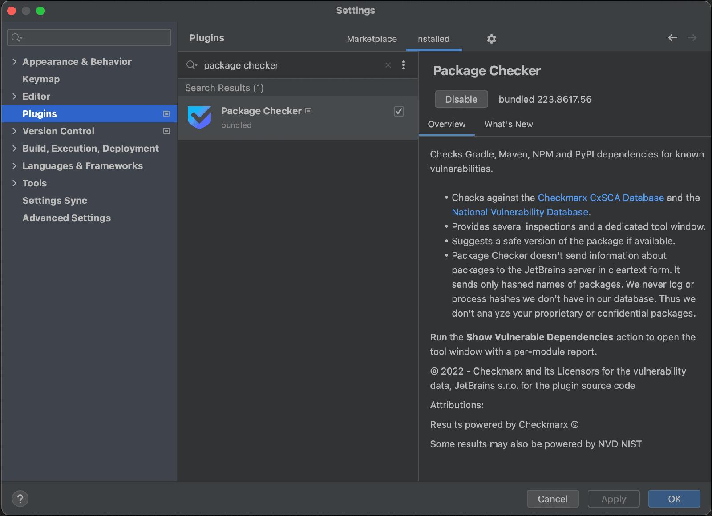](plugin.png "Package Checker plugin")

There are several ways to view known vulnerabilities for the dependencies to your project.

## View vulnerable dependencies in Maven projects

In a Maven project, all of your project's dependencies are declared in the pom.xml.

When we open the pom.xml file for a project which contains vulnerable dependencies, we see that several dependencies are highlighted.

[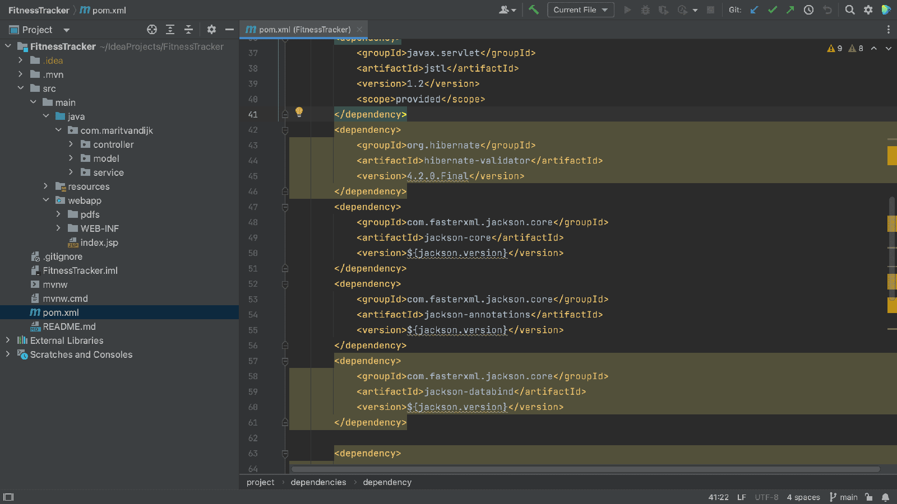](pomxml-highlight.png "Maven pom.xml with vulnerable dependencies highlighted")

The Package Checker plugin highlights vulnerable dependencies and when we hover over the highlighted dependency, IntelliJ IDEA Ultimate shows all the vulnerabilities that were identified in this particular dependency.

When we click on link for the CVE for a particular vulnerability, we're redirected to the Checkmarx Advisory to learn more about this specific vulnerability.

[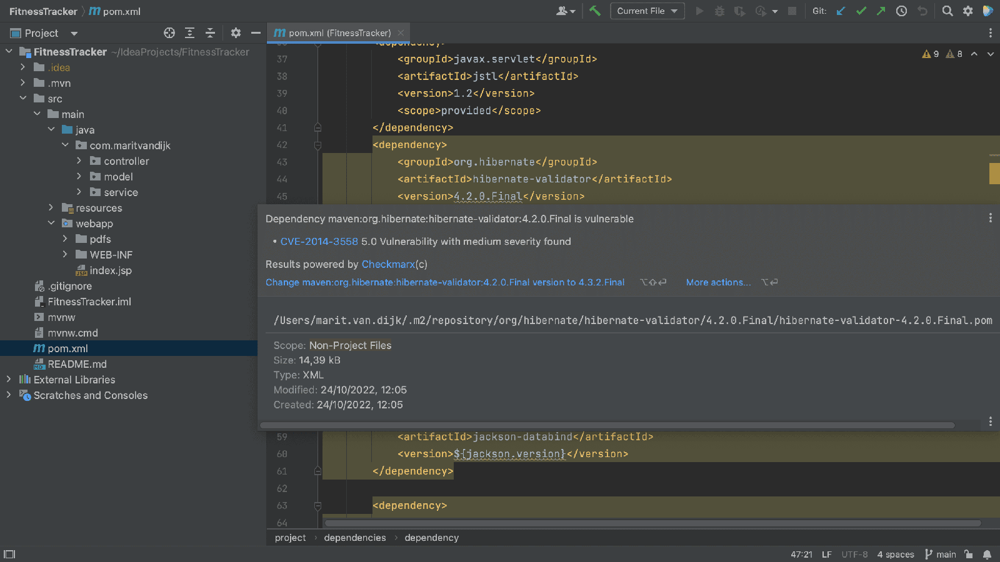](hover.png "Maven pom.xml with hover")

Another way to see all the vulnerable packages is by right-clicking on the pom.xml file and selecting **Analyze** \> **Show Vulnerable Dependencies**.

This will open the Vulnerable Dependencies tool window.

[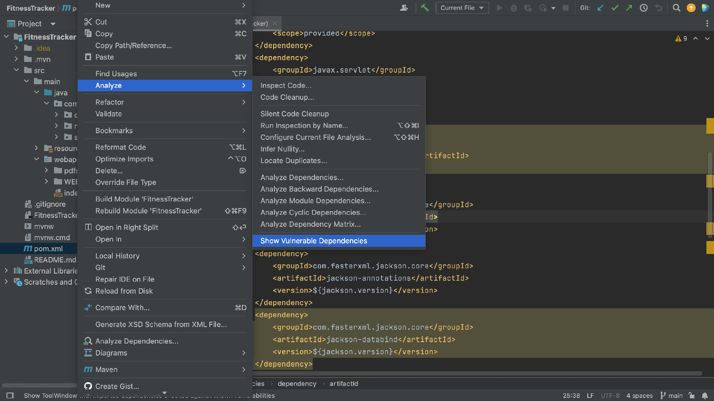](open-from-pomxml.png "Open Vulnerable Dependencies tool window from pom.xml")

[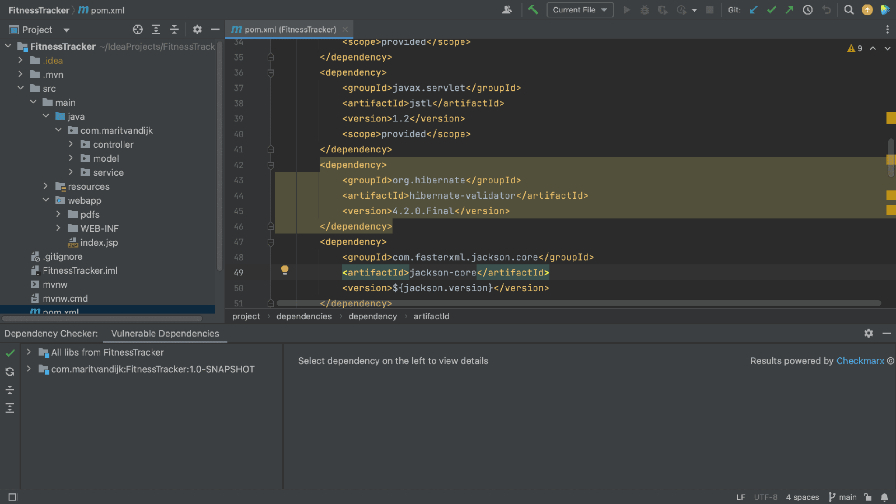](vulnerable-dependencies-tool-window.png "Vulnerable Dependencies tool window")

## View vulnerable dependencies in Gradle projects

In a Gradle project, all of your project's dependencies are declared in the build.gradle.

When we open the build.gradle file for a project which contains vulnerable dependencies, we see that several dependencies are highlighted.

We can open the Vulnerable Dependencies tool window from the build.gradle file. For example, let's have a look at the [Spring PetClinic](https://github.com/spring-projects/spring-petclinic), which uses Gradle.

We can right-click the build.gradle file and go to **Analyze** \> **Show Vulnerable Dependencies**. This will open the Vulnerable Dependencies tool window.

[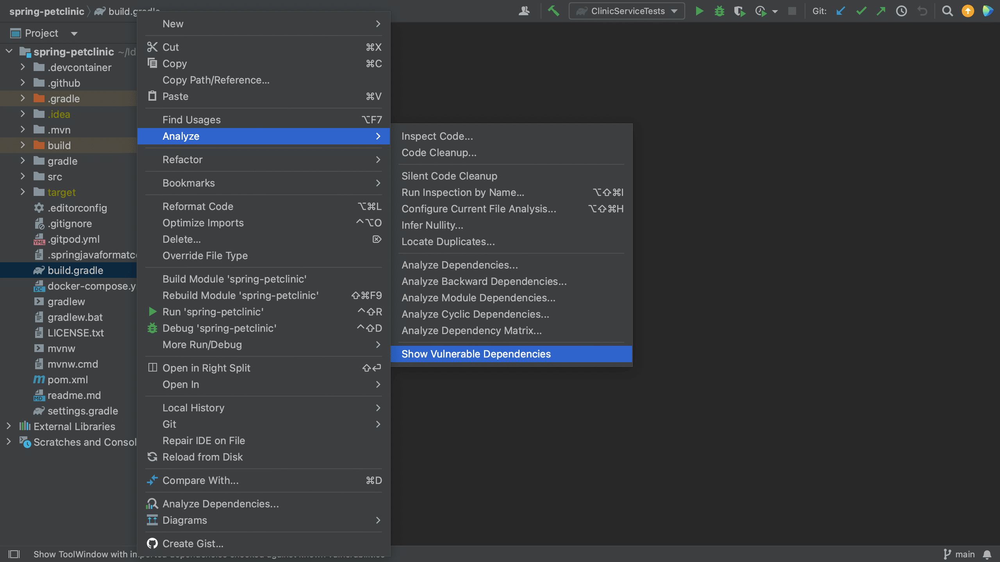](open-from-buildgradle.png "Open Vulnerable Dependencies tool window from build.gradle")

[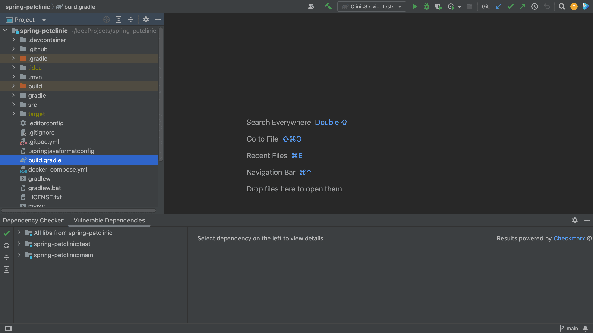](gradle-vulnerable-dependencies-tool-window.png "Vulnerable Dependencies tool window")

## View vulnerable dependencies in the Vulnerable Dependencies tool window

We can also open the Vulnerable Dependencies tool window without having to open the files where our dependencies are declared.

To open the Vulnerable Dependencies tool window straight from the main menu, go to **Code** \> **Analyze Code** \> **Show Vulnerable Dependencies**.

[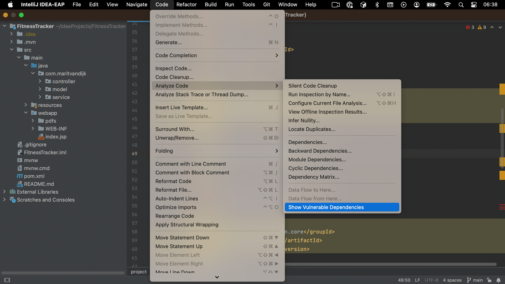](open-from-menu.png "Open Vulnerable Dependencies tool window from menu")

The Vulnerable Dependencies tool window shows all the vulnerable dependencies for the project. For each vulnerability, we can see an indication of the severity.

There are two different views; the **flat view** shows all the vulnerable dependencies in this project and the **dependency hierarchy view** shows the dependency tree and the hierarchy between dependencies.

[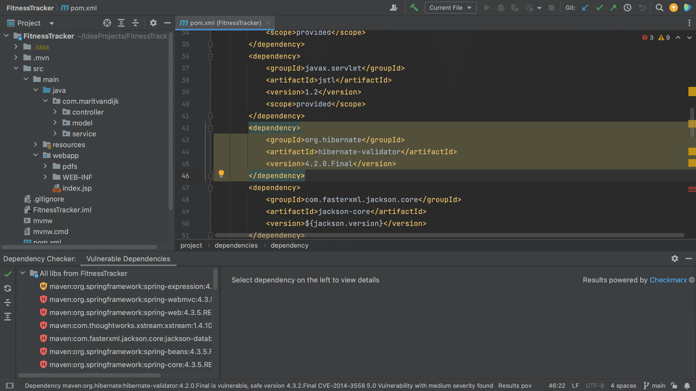](flat-view.png "Vulnerable Dependencies tool window flat view")

[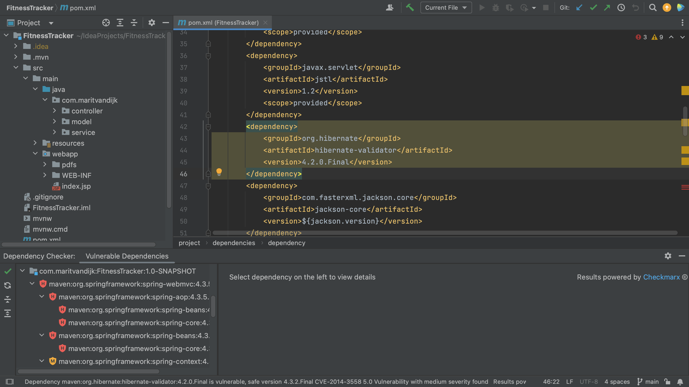](dependency-hierarchy-view.png "Vulnerable Dependencies tool window dependency hierarchy view")

When we click a specific dependency, we can see more information about the vulnerabilities that were found in that dependency.

In the Vulnerable Dependencies tool window details pane on the right, we can click the link to **Read more** under the information about a particular dependency, which will take us to the information about this specific vulnerability in the Checkmarx Advisory.

[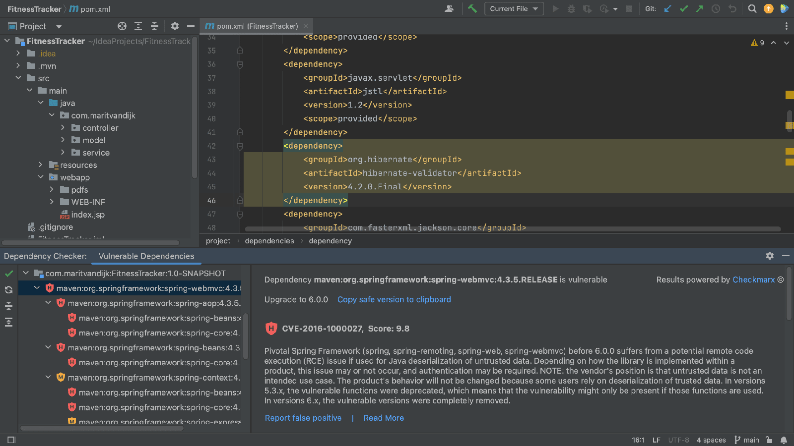](details.png "Vulnerable Dependencies tool window details")

To see all the dependencies of the project regardless of whether they're vulnerable or not, we can click the **Show safe** button on the top left of the Vulnerable Dependencies tool window.

[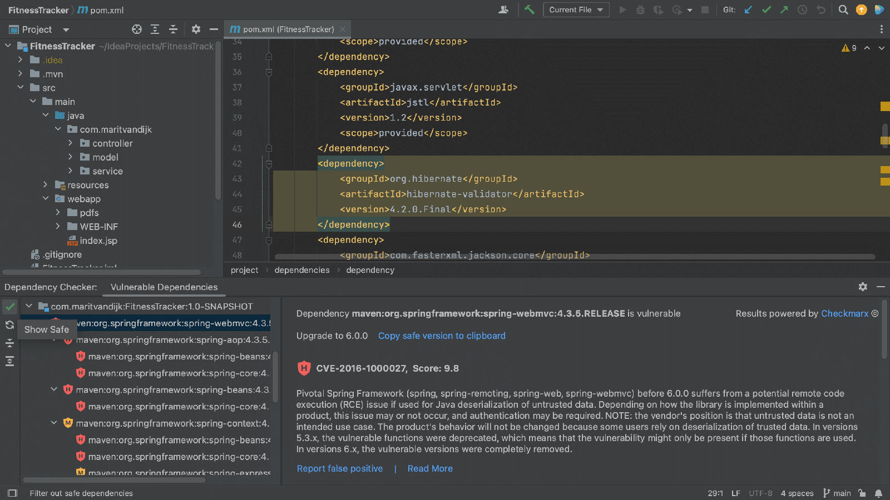](show-safe-button.png "Show safe button")

The dependencies without known vulnerabilities are shown with a green checkmark next to it. We still have the same two views; the **flat view** and the **dependency hierarchy view**.

We can use the **Show safe** button to toggle between showing all dependencies or vulnerable dependencies only. We can use the **Collapse all** or **Expand all** buttons to collapse or expand the views.

[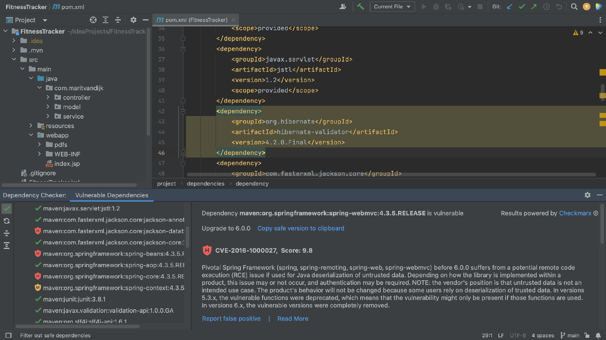](show-safe.png "Show safe")

## Remediate dependencies using IntelliJ IDEA Ultimate

Finally, we can remediate these vulnerabilities.

We can click **Copy safe version to clipboard** in the Vulnerable Dependencies tool window details pane to copy the safe version and paste it into our build file.

[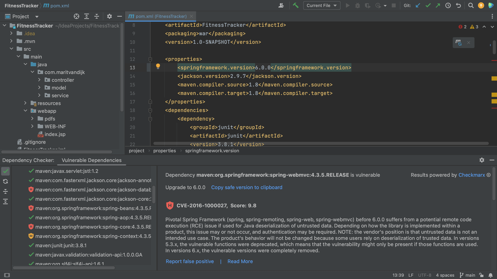](copy-to-clipboard.png "Copy safe version to clipboard")

We can also fix it directly in our build file.

When we hover over a specific vulnerable dependency, the hover menu includes an action that we can click to upgrade the version (if a new version is available).

[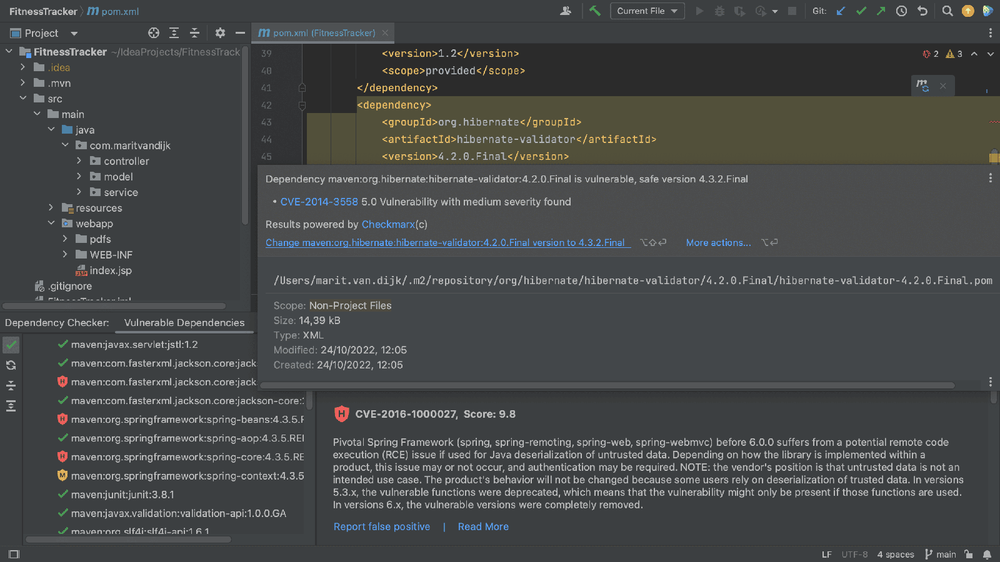](fix-from-hover.png "Show hover")

[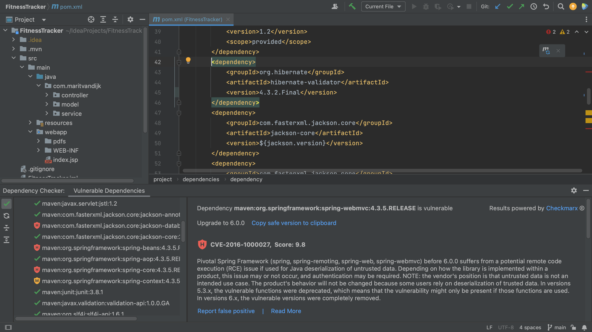](fixed-from-hover.png "Fixed version from hover")

Alternatively, we can use the intention action shortcut, **⌥ ⏎** on MacOs, or **Alt+Enter** on Windows/Linux and select the action to upgrade the version (if a new version is available).

[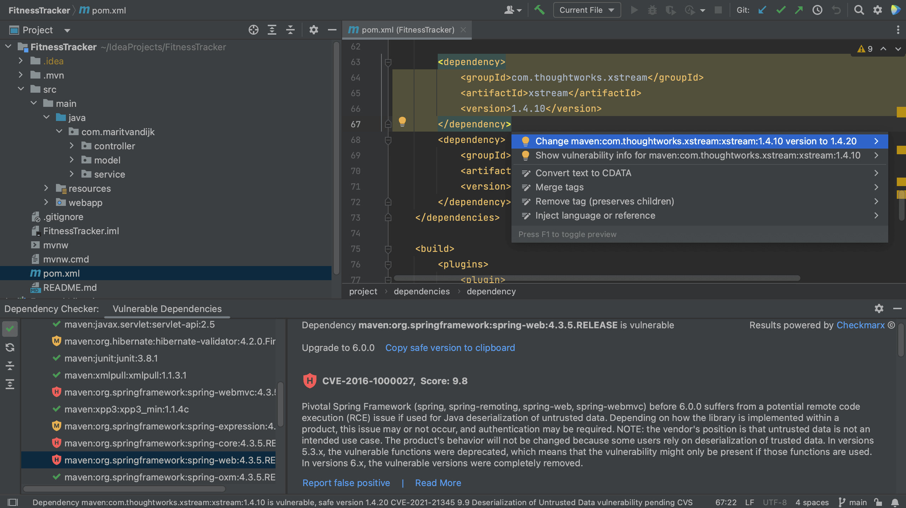](context-actions-1.png "Show context actions")

[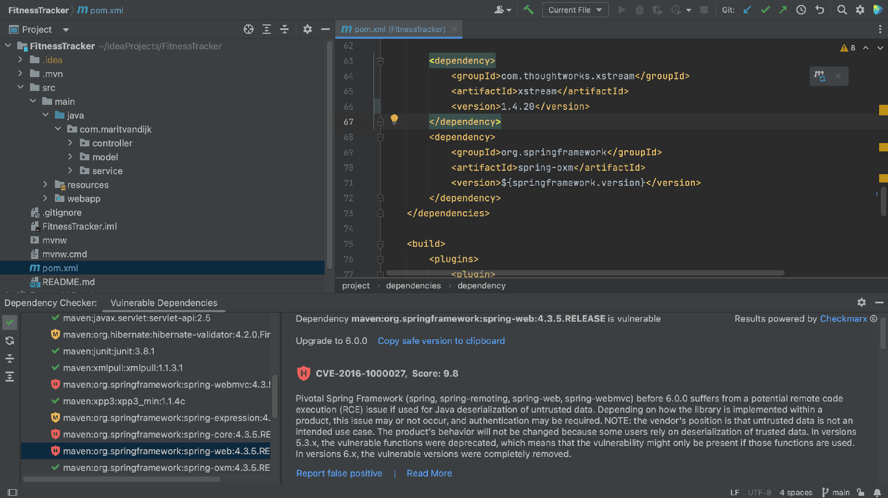](fix-from-context-actions-1.png "Fixed version from context actions")

After we update the versions, we can **Load Maven Changes** , using **⌘⇧I** on MacOs or **Ctrl+Shift+O** on Windows/Linux.

We see that the overview in the Vulnerable Checker tool window is updated, and we see that dependencies that we have upgraded and are no longer vulnerable are removed, or shown with a green checkmark if we have enabled **Show safe** dependencies.

[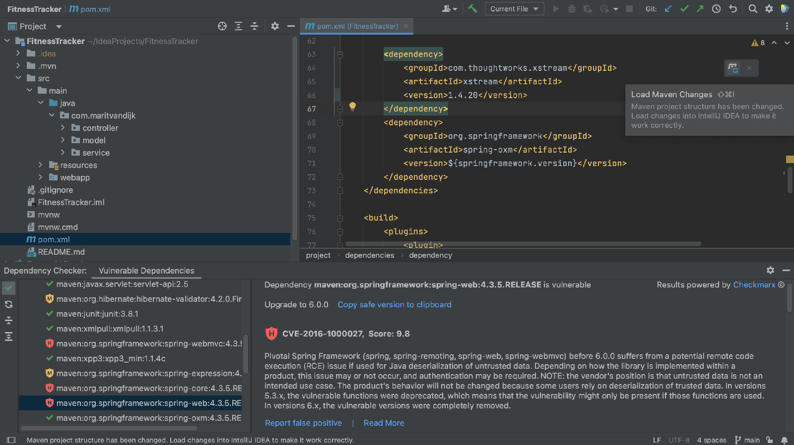](load-maven-changes-1.png "Load Maven Changes")

[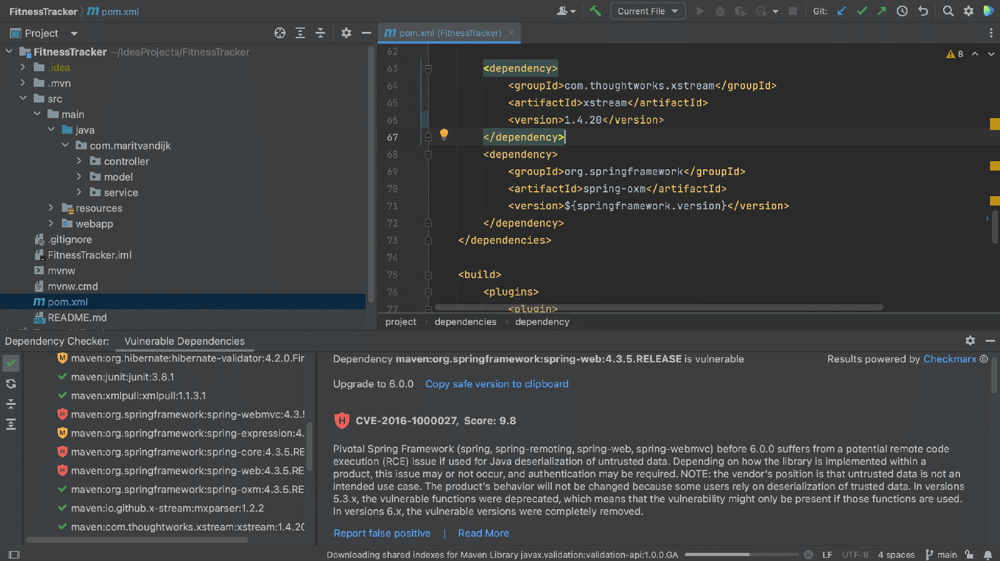](updated-1.png "Updated")

## Summary and Shortcuts

As we have seen, the [Package Checker plugin](https://plugins.jetbrains.com/plugin/18337-package-checker) bundled with [IntelliJ IDEA Ultimate](https://www.jetbrains.com/idea/) offers several different ways in which we can view vulnerable dependencies in our project inside IntelliJ IDEA Ultimate, get more information about these vulnerabilities, and remediate them.

This plugin can help keep your projects safe and secure right inside your IDE!

### IntelliJ IDEA Shortcuts Used

Here are the IntelliJ IDEA shortcuts that we used.

|                                                          Name                                                          | macOS Shortcut | Windows / Linux Shortcut |
|------------------------------------------------------------------------------------------------------------------------|----------------|--------------------------|
| Open / Close [Project Tool Window](https://www.jetbrains.com/help/idea/project-tool-window.html)                       | **⌘1**         | **Alt+1**                |
| Context Actions                                                                                                        | **⌥⏎**         | **Alt+Enter**            |
| [Load Maven Changes](https://www.jetbrains.com/help/idea/delegate-build-and-run-actions-to-maven.html?#maven_reimport) | **⌘⇧I**        | **Ctrl+Shift+O**         |

### Further reading and viewing

* [(video) JetBrains - IntelliJ IDEA Ultimate: Package Checker](https://www.youtube.com/watch?v=RWtN4WNQsX4)
* [(blog) JetBrains - Ensure Greater Software Security With Package Analysis by Checkmarx in IntelliJ IDEA](https://blog.jetbrains.com/idea/2022/04/ensure-greater-software-security-with-package-analysis-by-checkmarx-in-intellij-idea/)
* [(plugin) Package Checker](https://plugins.jetbrains.com/plugin/18337-package-checker)
* [(video) Leverage Open-Source Code with Confidence](https://www.youtube.com/watch?v=4j2LfZepwTU)
