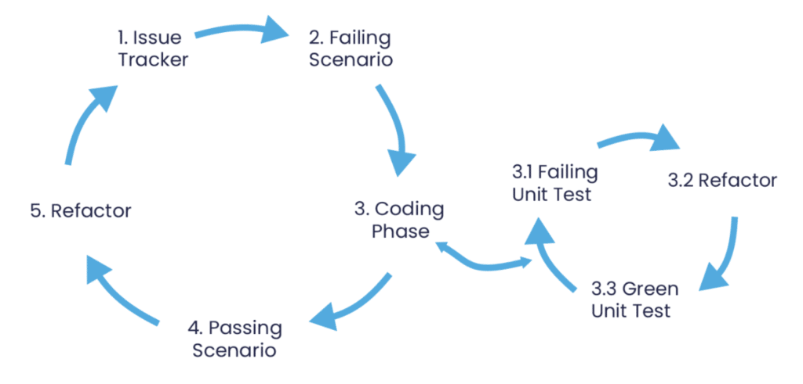
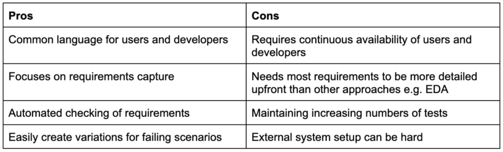
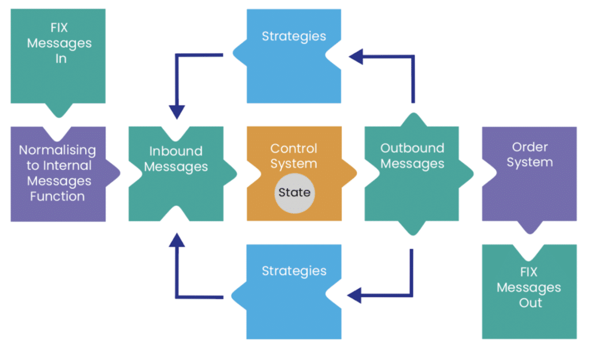
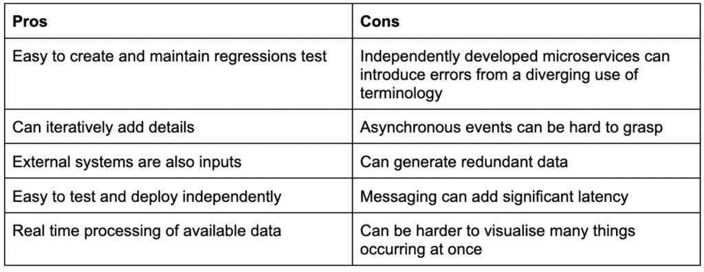
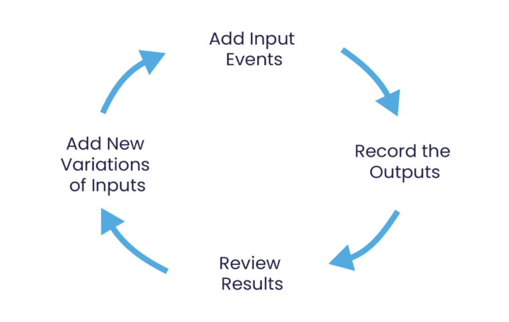
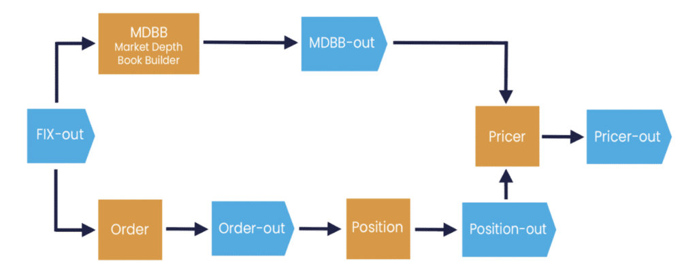

Behaviour Driven Development (BDD) and Event Driven Architecture (EDA) work well together as they complement each other's strengths and weaknesses.

Using both can result in a shorter time to market for new functionality and a more maintainable system.

**Behaviour Driven Development (BDD)** encourages a common language between users and developers in describing requirements in a form the users can understand but can also automatically be checked as the application is developed and maintained.

BDD increases the inclusion of users, focuses on requirements capture and maintains the velocity of development as the application increases in complexity.

  
*Figure 1. Behaviour Driven Development for the high level with Test Driven Development for the low level*

*Table 1. Pros and Cons of Behaviour Driven Development*

**Event Driven Architecture (EDA)** models interactions between services as events.

Events are facts about something that happened representing a state change, such as an order placed or a payment processed, without implying which action if any must be taken, unlike request/response or actor patterns.

EDA supports loosely coupled services, greater fault tolerance, and observable interactions between services can help minimise technical debt.

*Figure 2. Example of an Event Driven Kappa Architecture microservice with feedback*

*Table 2. Pros and Cons of Event Driven Architectures*

### Regression Tests

When we came to design our kitchen recently, there were some things we knew we wanted, but couldn't imagine the details. However, once we could see an initial design based on what we knew we wanted, we were able to get down to the details.

Designing applications can be similar. There are things we know upfront but there are other things we can only decide on once we see it come to life.

EDA makes it natural to record what the application does do, in an easily observable way, and construct a test to ensure this behaviour doesn't change.

From the output of such a test, the user can see with each iteration, how they wish to customise the event processor or microservice, rather than having to specify all the details in advance.

*Figure 3. Using known inputs and designed output to iteratively specify requirement*

### How BDD and EDA are More Effective in Combination

EDA naturally supports the recording and replaying of events produced by each microservice. EDA allows regression tests to be constructed and maintained easily with minimal input from end-users.

While BDD benefits from responsive feedback from users, building regression tests can help in that process so users can see how they want to customise the behaviour. Utilising event driven regression tests reduces the need for users to be always available to give feedback on incremental improvements.

BDD naturally supports the development of a common language between all microservices when microservices could quickly diverge without someone who can authoritatively say how things should be named.

The common language can be referred to in code and kept consistent by having a shared schema of events and data transfer objects.

*Figure 4. Simplified EDA used by a number of our customers*

Recording the outputs of EDA microservices makes it easy to create test input data for new services. In many cases, you can start by determining the output events you need to produce and then recording the events produced by existing systems for the inputs.

BDD can determine functionality requirements to turn inputs into outputs. Breaking this functionality into stages, you can construct the events that should occur at the stages in between.

### Microservices Framework

[Chronicle Software](https://bit.ly/3RCLXjj "Chronicle Software") has a testing methodology and libraries for behaviour-driven development of event-driven systems. This methodology will be introduced in a following article.

Our [microservice framework](https://bit.ly/3RDT2Ao "microservice framework") supports low latency; it uses restartable, scalable, distributed, highly available processes that are very easy to test and debug.

### Conclusion

We have used Behaviour Driven Development to establish the application's requirements from users, and Event Driven Architecture to automate testing to ensure the application meets those requirements as it is developed and changes are made to add more functionality.

We believe this is a very effective way to build and maintain back end real time software.

Event Driven Architecture decomposes complex interactions into easily describable and testable components for real-time processing of streaming data.

Using both together provides a uniquely productive environment to deliver complex functionality.
