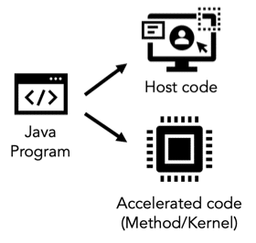
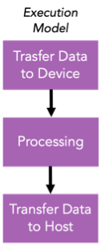
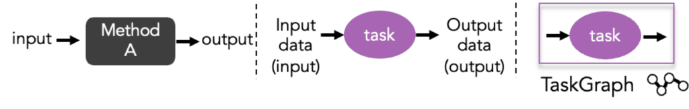
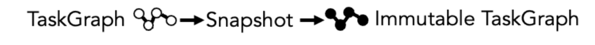

TornadoVM 0.15 introduced changes at the API level with the aim of making the exposed operations more comprehensive to the programmers.

It is imperative after all to get an understanding of how to use the TornadoVM API, as it includes very powerful operations, such as expressing parallelism, chaining Java methods (tasks) for deployment on heterogeneous hardware, configuration of the data transfers, etc.

This article has the following objectives:

* Give an overview of the TornadoVM programming model.
* Provide guidelines on how to define what to run on a device.
* Provide guidelines on how existing TornadoVM programs can migrate to use the TornadoVM v0.15 API.

1. TornadoVM Programming Model {#h2-0-1-tornadovm-programming-model}
--------------------------------------------------------------------

TornadoVM uses a programming model that derives from the state-of-the-art programming models of heterogeneous hardware accelerators, such as OpenCL, Level Zero, and CUDA. A key aspect for software applications that require to offload computations for hardware acceleration is that they are composed of two parts:

* the **host code**, which includes the core software part of the application and it is typically executed on the CPU.
* the **accelerated code**, which corresponds to the method that will perform data processing on a hardware accelerator device.

 

**Note:** This article focuses on the changes that are required to migrate applications that use the TornadoVM API (prior to v0.15). All changes concern only the host code. Therefore for the accelerated code we point you to the [documentation](https://tornadovm.readthedocs.io/en/latest/programming.html#expressing-parallelism-within-java-methods) that shows how to express parallelism within a method.

The execution model of TornadoVM includes three main steps:

1. **Transfer data** from host to the accelerator.
2. Parallel data **processing on the accelerator**.
3. **Transfer the result data** from the accelerator to the host.

To follow the TornadoVM execution model, a programmer needs to use:

* the **TaskGraph** object for the definition of the data to be transferred and the processing,
* the **TornadoExecutionPlan** object for the configuration of the execution.

2. *TornadoVM TaskGraphs: What to run on a device?* {#h2-1-2-tornadovm-taskgraphs-what-to-run-on-a-device}
----------------------------------------------------------------------------------------------------------

TaskGraphs (or formerly known as TaskSchedules) are used in TornadoVM as a way to define the TornadoVM execution model within the host code. This is a TornadoVM object that is exposed to Java programmers and enables them to configure which data have to be transferred between the host and a device (Steps 1 and 3) and which Java method will be offloaded for hardware acceleration (Step 2).

Therefore, this object is meant to address the question of "**which code is marked for acceleration?**".

A very important feature that has been released in TornadoVM v0.15 is the ability to configure how often the input or output data need to be transferred between the host and a device. This operation can be different based on the characteristics of the applications and it can have a high impact in both the execution time and the energy efficiency of the applications.

The following code snippet creates a new TaskGraph:

    TaskGraph taskGraph = new TaskGraph("name");

 

**Note for code-migration:** To migrate existing TornadoVM applications to the new v0.15 API, you can replace the existing **TaskSchedule** objects in your program with the **TaskGraph** objects with the following changes regarding how data is transferred from the host to the device, and vice-versa.

### 2.1. Definition of data to be transferred to device {#h3-2-2-1-definition-of-data-to-be-transferred-to-device}

The TaskGraph API defines a method, named **transferToDevice** to set which arrays need to be transferred to the target device. This method receives two types of arguments:

1. Data Transfer Mode:
   1. **EVERY_EXECUTION** : Data is transferred from the host to the device every time a TaskGraph is executed. This corresponds to the streaming of data as it was expressed via the **streamIn()** method in the TornadoVM API \< 0.15.
   2. **FIRST_EXECUTION**: Data is only transferred the first time a TaskGraph is executed.
2. All input arrays needed to be transferred from the host to the device.

The following code snippet sets one input array (input) to be transferred from the host to the device every time a TaskGraph is executed.

    taskGraph.transferToDevice(DataTransferMode.EVERY_EXECUTION, input);

 

**Note for migration:** The s**treamIn()** and **copyIn()** methods of TornadoVM API (prior to v0.15) need to be replaced with the **transferToDevice()** method, and the first parameter has to be configured accordingly. If your program was using **streamIn()** , then data was moved in every execution, and you will have to use **DataTransferMode.EVERY_EXECUTION** . If your program was using the **copyIn()** method or no method to define the input, then data was moved only during the first execution. So, you have to use the **DataTransferMode.FIRST_EXECUTION** mode.

### 2.2. Definition of the accelerated code for data processing {#h3-3-2-2-definition-of-the-accelerated-code-for-data-processing}

This part remains the same as in the previous TornadoVM API. A Java method that is meant to be offloaded for hardware acceleration corresponds to a **task**, which has inputs and outputs. A TaskGraph can contain one or more tasks which can be chained for execution on a target device. The maximum number of tasks depends on the amount of code that can be shipped to the accelerator.

A task can be defined as follows:

    taskGraph.task("sample", Class::methodA, input, output);

<figure class="aligncenter size-large is-resized">
 
</figure>

 

**Note:** The data in the **transferToHost** and **transferToDevice** methods, define the data flow between one or multiple tasks in a **TaskGraph**. In case data from one task is going to be consumed by another task, then it will be persisted into the device's memory and no copy will be involved.

Unless, the data is also passed in the **transferToHost** method. The TornadoVM runtime stores which data is associated with the corresponding data transfer mode, and it will perform the actual data transfers only during the execution of the task by the execution plan.

### 2.3. Definition of data to be transferred to host {#h3-4-2-3-definition-of-data-to-be-transferred-to-host}

The TaskGraph API defines a method, named **transferToHost** to set which arrays need to be transferred back to the host code. This method receives two types of arguments:

1. Data Transfer Mode:
   1. **EVERY_EXECUTION** : Data is transferred from the device back to the host every time a TaskGraph is executed. This corresponds to the streaming of data as it was expressed via the **streamOut()** method in the TornadoVM API \< 0.15.
   2. **USER_DEFINED**: Data is marked to be transferred only under the demand of the programmer and via the ExecutionResult (Section 5). This is an optimization for programmers that plan to execute a TaskGraph multiple times and do not require to copy the resulting data in every execution.
2. All output arrays needed to be transferred from the device back to the host.

The following code snippet sets one output array (output) to be transferred from the device back to the host every time a TaskGraph is executed.

    taskGraph.transferToHost(DataTransferMode.EVERY_EXECUTION, output);

 

**Note for migration:** The **streamOut()** and **copyOut()** methods of TornadoVM API (prior to v0.15) need to be replaced with the **transferToHost()** method and the first parameter has to be configured accordingly. If your program was using **streamOut()** , then data was moved in every execution, and you will have to use **DataTransferMode.EVERY_EXECUTION**.

3. Create an Immutable Task Graph {#h2-5-3-create-an-immutable-task-graph}
--------------------------------------------------------------------------

Once a TaskGraph is defined, and the programmer is confident that the shape of the TaskGraph will not be altered, then it is necessary to capture a snapshot of the TaskGraph which will return an object of type **ImmutableTaskGraph**.  

<figure class="aligncenter size-large is-resized">
 
</figure>

This is a very simple process:

    ImmutableTaskGraph itg = taskGraph.snapshot();

An immutable task graph cannot be modified. Thus, if programmers need to update a task graph, they can modify the original TaskGraph object and re-invoke the **snapshot** method again to obtain a new ImmutableTaskGraph object.

 

**Note:** This is a new feature that ensures that different shapes of a TaskGraph can co-exist in the same application. The benefit is that code (e.g., OpenCL, PTX, SPIR-V) is generated only for each **snapshot** of a **TaskGraph**, which allows programmers to invoke different versions of a TaskGraph without triggering re-compilation.

4. Further reading and examples {#h2-6-4-further-reading-and-examples}
----------------------------------------------------------------------

The TornadoVM modules for the [tornado-unittests](https://github.com/beehive-lab/TornadoVM/tree/master/tornado-unittests) and the [tornado-examples](https://github.com/beehive-lab/TornadoVM/tree/master/tornado-examples) contain a list of diverse applications that showcase how to use the new TornadoVM API. For more information see [here](https://tornadovm.readthedocs.io/en/latest/programming.html).

Part of the content of this article has been presented in [FOSDEM '23](https://ftp.fau.de/fosdem/2023/H.1302%20(Depage)/hardware.mp4).
