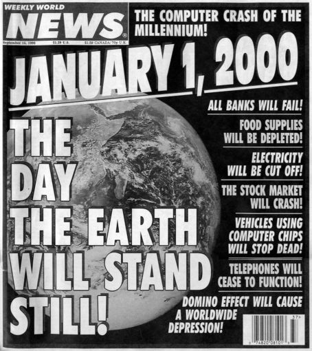

It's still more or less the beginning of the year, where you may want to start scheduling your holidays until the end of it. And I decided to go a step further and I've already planned those for 2038!

Why? Well, some time ago I gave a presentation to students, when I realized they had no idea what I was talking about when mentioning the Y2K-problem. Most of them weren't even born in the year 2000!

I also realized at that moment that I'm probably on the way to becoming a grumpy old man, but that's a subject for another post... 😉 B

But I also found out that a new and similar problem is approaching us in... 2038!

Let's investigate what could happen in that year with `jshell`...



## What was the Y2K problem?

In the last years before 2000, there was a growing concern for computer systems using dates and how they would handle the transition from 1999 to 2000.

The fact that many systems only used the last two digits of the year would definitely lead to sorting problems.

For instance, database systems storing dates in the format YYMMDD would contain this data, where it is obvious the sorting would be "messed up" from the year 2000 onwards:

```
February 28th of 1970   -->     700228
October 23st of 1982    -->     821023
January 1st of 2000     -->     000101
```

<figure class="wp-block-image size-medium">
 
 <figcaption class="wp-element-caption">
  News paper cover announcing the end of the world because of the Y2K bug
 </figcaption>
</figure>

Luckily, most systems were patched before the world was able to collapse and the Y2K-bug disappeared very quickly.

## What is jshell?

The `jshell` tool was added to the Java Development Kit (JDK) with version 9.

It enables quick testing of Java code. If you have a JDK installed, you can use `jshell` in your command line or terminal.

To check your Java version and start `jshell`:

```
$ java -version
openjdk version "19" 2022-09-20
OpenJDK Runtime Environment Zulu19.28+81-CA (build 19+36)
OpenJDK 64-Bit Server VM Zulu19.28+81-CA (build 19+36, mixed mode, sharing)

$ jshell
|  Welcome to JShell -- Version 19
|  For an introduction type: /help intro

jshell>
```

To find out what you can do, type `/help intro`:

```
jshell> /help intro
|
|                                   intro
|                                   =====
|
|  The jshell tool allows you to execute Java code, getting immediate results.
|  You can enter a Java definition (variable, method, class, etc), like:  int x = 8
|  or a Java expression, like:  x + x
|  or a Java statement or import.
|  These little chunks of Java code are called 'snippets'.
|
|  There are also the jshell tool commands that allow you to understand and
|  control what you are doing, like:  /list
|
|  For a list of commands: /help
```

A simple example:

```
jshell> var txt = "Hello World!"
txt ==> "Hello World!"

jshell> txt
txt ==> "Hello World!"

jshell> txt + (5*4)
$3 ==> "Hello World!20"

jshell> txt.substring(2, 5)
$4 ==> "llo"
```

To end `jshell`, use `/exit`

```
jshell> /exit
|  Goodbye
```

## What will happen in 2038?

A new Y2K-bug seems to be approaching, but luckily we still have time to prevent it!

Or you can already schedule a long holiday for the year 2038...

Let's take a look at the problem with `jshell`.

First, we need to import some packages as we will be using some time methods.

```
jshell> import java.time.Instant
jshell> import java.time.ZoneId
jshell> import java.time.ZonedDateTime
```

As you may know, a lot of date formats, started on January 1st in 1970. This is very nicely explained by [Matt Howells](https://stackoverflow.com/users/16881/matt-howells) and community contributions in this [StackOverflow answer](https://stackoverflow.com/questions/1090869/why-is-1-1-1970-the-epoch-time):

***Early versions of unix measured system time in 1/60 s intervals. This meant that a 32-bit unsigned integer could only represent a span of time less than 829 days. For this reason, the time represented by the number 0 (called the epoch) had to be set in the very recent past. As this was in the early 1970s, the epoch was set to 1971-01-01.***

***Later, the system time was changed to increment every second, which increased the span of time that could be represented by a 32-bit unsigned integer to around 136 years. As it was no longer so important to squeeze every second out of the counter, the epoch was rounded down to the nearest decade, thus becoming 1970-01-01. One must assume that this was considered a bit neater than 1971-01-01.***

***Note that a 32-bit signed integer using 1970-01-01 as its epoch can represent dates up to 2038-01-19, on which date it will wrap around to 1901-12-13.***

Based on this answer, it becomes clear that the use of integers to store dates is not an ideal solution...

Something that can be perfectly tested with a few lines of code:

```
jshell> var testDate = ZonedDateTime.of(1970, 1, 1, 0, 0, 0, 0, ZoneId.of("UTC"));
testDate ==> 1970-01-01T00:00Z[UTC]

jshell> testDate.toEpochSecond()
$4 ==> 0
```

Indeed 1970-01-01 returns the value 0 as epoch. Now let's travel to the future and assign the maximum integer value to our test date:

```
jshell> testDate = ZonedDateTime.ofInstant(Instant.ofEpochSecond(Integer.MAX_VALUE), ZoneId.of("UTC"));
testDate ==> 2038-01-19T03:14:07Z[UTC]

jshell> testDate.toEpochSecond()
$5 ==> 2147483647

jshell> testDate = testDate.minusSeconds(1)
testDate ==> 2038-01-19T03:14:06Z[UTC]

jshell> testDate.toEpochSecond()
$6 ==> 2147483646

jshell> testDate = testDate.plusSeconds(2)
testDate ==> 2038-01-19T03:14:08Z[UTC]

jshell> testDate.toEpochSecond()
$7 ==> 2147483648
```

Everything still seems to be OK, but as `toEpochSecond()` returns a long, the problem becomes clear when we convert that last value to an integer.

It becomes a negative value, that when used as an instant to recreate the date, makes us travel back into time to December 13th of 1901!

```
jshell> (int) testDate.toEpochSecond()
$8 ==> -2147483648

jshell> testDate = ZonedDateTime.ofInstant(Instant.ofEpochSecond(-2147483648), ZoneId.of("UTC"));
testDate ==> 1901-12-13T20:45:52Z[UTC]
```

## Conclusion

In the past, when storage space was limited and expensive, it made sense to select the smallest variable type to store data.

But, our future-selves and/or the people maintaining the systems we are building now, will be very grateful if we don't limit the space to store dates and times.
