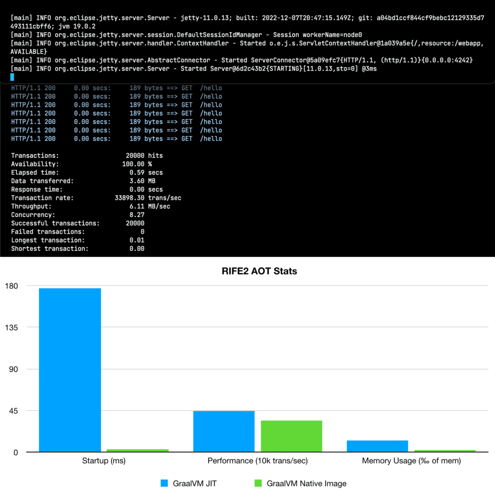

[RIFE2](https://rife2.com) applications already launch quickly with a regular JVM thanks merely calling Java methods, lambdas and doing object instantiations at startup. There are no annotations to scan for, nor any declarations or config files to parse and resolve.

The [RIFE2 v1.3.0 release](https://github.com/gbevin/rife2/releases/tag/1.3.0) introduced experimental support for GraalVM Ahead-Of-Time compilation with native-image, reducing the startup time of the bootstrap project from 177ms to an incredible 3ms.

Try it out yourself {#h2-0-try-it-out-yourself}
-----------------------------------------------

In order to try this out, you can download the latest [GraalVM](https://www.graalvm.org/downloads/) JDK 19 distribution, and follow the steps to install [native-image](https://www.graalvm.org/dev/reference-manual/native-image/) on your machine.

Next, clone the [RIFE2 bootstrap project](https://github.com/gbevin/rife2-hello), make it your current directory and create an UberJar using Gradle.

<pre class="EnlighterJSRAW" style="padding: 2em 0" data-enlighter-linenumbers="false">./gradle2 uberjar
</pre>

If you want to, you can first try the generated UberJar to get a feel of its performance and behavior:

<pre class="EnlighterJSRAW" style="padding: 2em 0" data-enlighter-linenumbers="false">java -jar app/build/libs/hello-uber-1.0.jar
</pre>

The embedded Jetty server will start and in a little under 200ms you should be able to access `http://localhost:8080/hello` to see a Hello World page.

Now, you create a single native executable with GraalVM using the following command:

<pre class="EnlighterJSRAW" style="padding: 2em 0" data-enlighter-linenumbers="false">native-image --no-fallback --enable-preview -jar hello-uber-1.0.jar
</pre>

Starting that one up is even easier with the single executable that now contains everything:

<pre class="EnlighterJSRAW" style="padding: 2em 0" data-enlighter-linenumbers="false">./hello-uber-1.0
</pre>

Microbenchmark numbers {#h2-1-microbenchmark-numbers}
-----------------------------------------------------

I ran the previous instructions on my AMD Ryzen 9 5950X 16 Core 128GB dedicated Ubuntu Linux server and then called `siege -c 10 -r 2000 -b http://localhost:8080/hello` to measure the performance:

These were the key points:

* application startup in 3ms
* standalone native executable size is 38MB
* using `siege` locally with a concurrency of 10 x 2000 requests, gives \~33898 trans/sec
* after the test, used up 281.7MB RES and 24.8MB SHR memory, accounts for 0.2% of memory

In comparison, launching the Uber jar with the JVM on the same machine:

* application startup in 177ms
* uber jar size is 4.7MB but requires a separate JVM installation
* using `siege` locally with a concurrency of 10 x 2000 requests, gives \~44444 trans/sec
* after the test, used up 1.7GB RES and 39.7MB SHR memory, accounts for 1.3% of memory

> **NOTE:** RIFE2 support for GraalVM native-image is still in experimental. There's no solution yet to replace the features of the RIFE2 Java agent, and it's only been tested in a limited context.

Share your thoughts {#h2-2-share-your-thoughts}
-----------------------------------------------

I'm curious to hear how GraalVM native-image is faring for you.

What are you already using it for or what are your plans?  

How could I further improve RIFE2 to better support Ahead Of Time compilation?

Feel free to [connect on Mastodon](https://uwyn.net/@gbevin) or to [join me on Discord](https://discord.gg/DZRYPtkb6J), I would love to hear from you!
