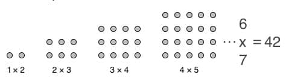

 **Figure 1**.: Hone your software design skills

The aim of the article is to introduce my newly published book "Practical Design Pattern for Java Developers".

Together, we'll explore today's application development challenges and dive deeper into some of Java's new language enhancements by exploring the **Builder** Design pattern in more detail.

**T**he days when applications were developed "ad hoc" seem to have ended only on paper.

When it comes to business, "ad hoc" solutions can still be quite common and accepted, because the "it just works" argument can be strong enough.

Yes, "it works for now" is a winning argument.

**M**any times such a statement is in direct conflict with the business's understanding, as the unspoken expectation under the hood may be extensibility and maintainability.

So that's the other side of the same coin.

The fact that an application can behave unpredictably after a small extension is not caused by magic, and such a condition could have a negative impact on the use of other practices such as SRE (Site Reliability Engineering, Ref. 4).

Many times the "devil" is hidden in the details of the application's composition and design.

The Java platform may seem quite resistant to such "evils''.

Such thoughts are partly true, because the JVM tries to optimize the code it executes based on its internal statistics, but this is not necessarily successful.

**A**fter many years of cross-industry experience, I got the opportunity to get my insights together in the newly published book "Practical Design Pattern for Java Developers".

The book is not only a collection of **42 design patterns** that are being put into today's context, but it also includes many examples linked to the use of the patterns in the OpenJDK source code.
 **Figure 2.** : Imaginary happiness is enhanced by using design patterns for **building** software

**A** lthough the beautiful pronic number 42 (**Figure 2.**, Ref.6) may seem magical, the selected 42 patterns should provide a final solution to help application designers create a maintainable and extensible code base, along with a strong reflection on new Java enhancements.

My "**secret wish**" is that the book will help the community to easily adopt all the improvements that have been added to the JDK, not only to noticeably reduce the language verbosity, but also to increase productivity, maintainability, and code security.

**L** et's for instance explore together one of the most useful creational design patterns, the **Builder** (**Example 1.**), and apply it in the light of record class type (Ref.5.).

Let's say that we would like to create an immutable class "*SuperVehicle*" with multiple fields.

Fields can be very complex and not all values are known at the same time. The resulting product should be immutable with *assessors* and comparable to similar types.

It means implementing *hashCode* and *equals* . The newly added *record* *class* provides us such functionality:

```java
record SuperVehicle(Part engine, Part cabin) implements Vehicle {
    static final class Builder {
        private Part engine;
        private Part cabin;
        Builder(){}
        Builder addEngine(String type) {…}
        Builder addCabin(String type) {…}
        Vehicle build(){
            return new SuperVehicle(this);
        }
    }

    private SuperVehicle(Builder builder) {
        this(builder.engine, builder.cabin);
    }

    @Override
    public void move() {…}

    @Override
    public void parts() {…}
}
```

```java
System.out.println output:
SuperVehicle[engine=RecordPart[name=super_engine], cabin=RecordPart[name=super_cabin]]
```

**Example 1** .: Implementation of the builder pattern using a record class type You may spot the private constructor that denies the instantiation from "outside" and that the class contains a static final ***Builder*** class.

The **builder** provides the fields that are required to create a new *SuperVehicle* instance. The presented **builder** pattern uses a newly added record class type. It is straightforward, transparent, and less error-prone than using multiple constructors, sometimes called the telescopic pattern.

The *SuperVehicle* record class automatically includes assessors, *hashCode* , *equals* , and *toString* methods. As the cherry on the top, the class is immutable by definition. Isn't that wonderful?

### Conclusion

**T** he newly updated **builder** pattern can contribute to the sustainability of the application code base as well as the stability of the application at runtime.

**W** e have **explored** a possible implementation of the **builder**pattern using one of the new Java enhancements.

The book contains many other examples with different implementation proposals.

The text also shows the concurrent nature of the Java platform itself, provides required description of the platform inside and discusses several concurrent design patterns commonly present in today's application design.

Together in this book, we will reveal not only patterns, but also the many anti-patterns that can be considered a natural byproduct of application development.

The book describes how to identify and respond to them.

Everything is packed into a compact design and supported by closely discussed examples published in a [GitHub repository](https://github.com/PacktPublishing/Practical-Design-Patterns-for-Java-Developers) (Ref. 1).

**Enjoy** reading and **happy** coding!

### References

1. GitHub Repository: [Practical Design Pattern for Java Developers](https://github.com/PacktPublishing/Practical-Design-Patterns-for-Java-Developers)
2. Packt: [Interview with Miroslav Wengner](https://partnerships.packt.com/interview-with-miroslav-wengner/)
3. [Launch Countdown 101: How I Become a Book Author](https://openvalue.blog/posts/2023/01/14/book_countdown_101/)
4. [Site Reliability Engineering (SRE)](https://sre.google/)
5. [JEP 395: Records](https://openjdk.org/jeps/395)
6. Wiki: [Pronic number](https://en.wikipedia.org/wiki/Pronic_number)
7. [Practical Design Pattern for Java Developers](https://amzn.eu/d/51Kx745)
