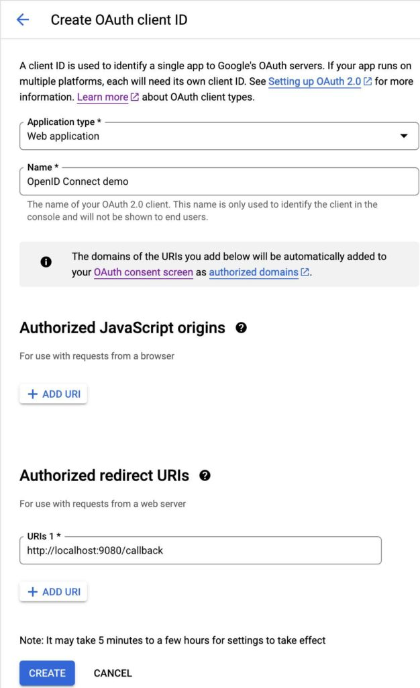
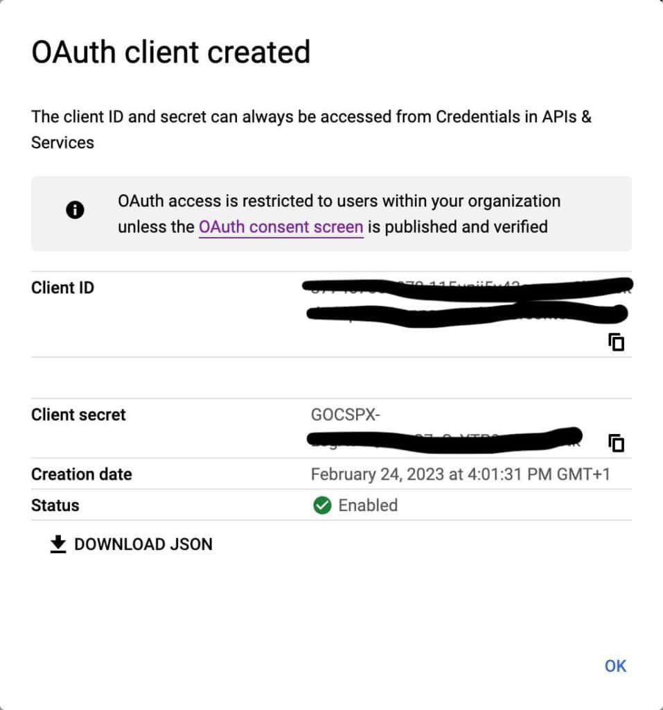

Lots of companies are eager to provide their identity provider: Twitter, Facebook, Google, etc. For smaller businesses, not having to manage identities is a benefit. However, we want to avoid being locked into one provider.

In this article, I want to demo how to use OpenID Connect using Google underneath and then switch to Azure.

## OpenID Connect

The idea of an *authorization* open standard started with [OAuth](https://en.wikipedia.org/wiki/OAuth) around 2006. Because of a security issue, OAuth 2.0 superseded the initial version. OAuth 2.0 became an in 2012:
> The OAuth 2.0 authorization framework enables a third-party  
>
> application to obtain limited access to an HTTP service, either on  
>
> behalf of a resource owner by orchestrating an approval interaction  
>
> between the resource owner and the HTTP service, or by allowing the  
>
> third-party application to obtain access on its own behalf
>
> -- [RFC 7469 - The OAuth 2.0 Authorization Framework](https://www.rfc-editor.org/rfc/rfc6749)

OAuth focuses mostly on *authorization* ;  

the *authentication* part is pretty light:  

it contains a section about Client Password authentication and one Other Authentication Methods.
> The authorization server MAY support any suitable HTTP authentication  
>
> scheme matching its security requirements. When using other  
>
> authentication methods, the authorization server MUST define a  
>
> mapping between the client identifier (registration record) and  
>
> authentication scheme.
>
> -- [2.3.2. Other Authentication Methods](https://www.rfc-editor.org/rfc/rfc6749#section-2.3.2)

OpenID Connect uses OAuth 2.0 and adds the *authentication* part:
> OpenID Connect 1.0 is a simple identity layer on top of the OAuth 2.0 protocol. It allows Clients to verify the identity of the End-User based on the authentication performed by an Authorization Server, as well as to obtain basic profile information about the End-User in an interoperable and REST-like manner.
>
> OpenID Connect allows clients of all types, including Web-based, mobile, and JavaScript clients, to request and receive information about authenticated sessions and end-users. The specification suite is extensible, allowing participants to use optional features such as encryption of identity data, discovery of OpenID Providers, and logout, when it makes sense for them.
>
> -- [What is OpenID Connect?](https://openid.net/connect/)

Here are a couple of identity providers that are compatible with OpenID Connect:

* GitHub
* Google
* Microsoft
* Apple
* Facebook
* Twitter
* Spotify

In the following, we will start with Google and switch to Azure to validate our setup.

## Setting up OpenID Connect with Apache APISIX

Imagine we have a web app behind Apache APISIX that we want to secure with OpenID Connect. Here's the corresponding Docker Compose file:

```yaml
version: "3"

services:
  apisix:
    image: apache/apisix:3.1.0-debian                              #1
    ports:
      - "9080:9080"
    volumes:
      - ./apisix/config.yml:/usr/local/apisix/conf/config.yaml:ro  #2
      - ./apisix/apisix.yml:/usr/local/apisix/conf/apisix.yaml:ro  #3
    env_file:
      - .env
  httpbin:
    image: kennethreitz/httpbin                                    #4
```

1. Apache APISIX API Gateway
2. APISIX configuration - used to configure it statically in the following line
3. Configure the single route
4. Webapp to protect. Any will do

Apache APISIX offers a plugin-based architecture. One such plugin is the [openid-connect](https://apisix.apache.org/docs/apisix/plugins/openid-connect/) plugin, which allows using OpenID Connect.

Let's configure it:

```yaml
routes:
  - uri: /*                                                                    #1
    upstream:
      nodes:
        "httpbin:80": 1                                                        #1
    plugins:
      openid-connect:
        client_id: ${{OIDC_CLIENTID}}                                          #2
        client_secret: ${{OIDC_SECRET}}                                        #2
        discovery: https://${{OIDC_ISSUER}}/.well-known/openid-configuration   #2-3
        redirect_uri: http://localhost:9080/callback                           #4
        scope: openid                                                          #5
        session:
          secret: ${{SESSION_SECRET}}                                          #6
#END
```

1. Catch-all route to the underlying web app
2. Plugin configuration parameters. Values depend on the exact provider (see below)
3. OpenID Connect can use a Discovery endpoint to get all necessary OAuth endpoints. See [OpenID Connect Discovery 1.0 spec](https://openid.net/specs/openid-connect-discovery-1_0.html#ProviderConfig) for more information
4. Where to redirect when the authentication is successful. It mustn't clash with any of the explicitly defined routes. The plugin creates a dedicated route there to work its magic.
5. Default scope
6. Key to encrypt session data. Put whatever you want.

## Configuring Google for OIDC

Like all Cloud Providers, Google offers a full-fledged Identity Management solution, which may be daunting for newcomers. In this section, I'll only detail the necessary steps required to configure it for .

On the [Cloud Console](https://console.cloud.google.com/), create a dedicated project (or use an existing one).

If you didn't do it already, customize the [OAuth Consent Screen](https://console.cloud.google.com/apis/credentials/consent).

In the project context, navigate *APIs \& Services \| Credentials*.



Then, press the *+ CREATE CREDENTIALS* button in the upper menu bar.



Select *OAuth Client Id* in the scrolling menu.



Fill in the fields:

* Application type: Web application
* Name: whatever you want
* Authorized redirect URIs: `/callback`, *e.g.* , `http://localhost:9080/callback`



`URL` should be the URL of the web application. Likewise, `/callback` should match the `openid-connect` plugin configuration above. Note that Google doesn't allow relative URLs, so if you need to reuse the application in different environments, you need to add the URL of each environment. Click the *Create* button.



In the Docker Compose configuration above, use the Client ID and Client Secret as `OIDC_CLIENTID` and `OIDC_SECRET`. I wrote them down as environment variables in a `.env` file.

The last missing variable is `OIDC_ISSUER`: it's `accounts.google.com`. If you navigate to , you'll see all data required by OAuth 2.0 (and more).

At this point, we can start our setup with `docker compose up`. When we navigate to , the browser redirects us to the Google authentication page. Since I'm already authenticated, I can choose my ID - and I need one bound to the organization of the project I created above.



Then, I can freely access the resource.

## Configuring Azure for OIDC

My colleague Bobur has already [described everything](https://dev.to/apisix/api-security-with-oidc-by-using-apache-apisix-and-microsoft-azure-ad-50h3) you need to do to configure Azure for OIDC.

We only need to change the OIDC parameters:

* `OIDC_CLIENTID`
* `OIDC_SECRET`
* `OIDC_ISSUER`: on Azure, it should look something like `login.microsoftonline.com//v2.0`

If you restart Docker Compose with the new parameters, the root page is now protected by Azure login.

## Conclusion

Externalizing your authentication process to a third party may be sensible, but you want to avoid binding your infrastructure to its proprietary process. OpenID Connect is an industry standard that allows switching providers easily.

Apache APISIX offers a plugin that integrates OIDC so that you can protect your applications with the latter. There's no reason not to use it, as all dedicated identity providers, such as Okta and Keycloak, are OIDC-compatible.

The complete source code for this post can be found on [GitHub](https://github.com/ajavageek/openid-authentication).

**To go further:**

* [OpenID Connect](https://openid.net/connect/)
* [OpenID Connect Discovery 1.0 specification](https://openid.net/specs/openid-connect-discovery-1_0.html)
* [Apache APISIX OIDC plugin](https://apisix.apache.org/docs/apisix/plugins/openid-connect/)
* [API Security with OIDC by using Apache APISIX and Microsoft Azure AD](https://dev.to/apisix/api-security-with-oidc-by-using-apache-apisix-and-microsoft-azure-ad-50h3)
* [Use Keycloak with API Gateway to secure APIs](https://apisix.apache.org/blog/2022/07/06/use-keycloak-with-api-gateway-to-secure-apis/)
* [How to Use Apache APISIX Auth With Okta](https://api7.ai/blog/how-to-use-apisix-auth-with-okta)

*Originally published at [A Java Geek](https://blog.frankel.ch/authenticate-openid-connect/) on March 5^th^, 2023*

*[IETF]: Internet Engineering Task Force
*[OIDC]: OpenID Connect
*[RFC]: Request For Comments
