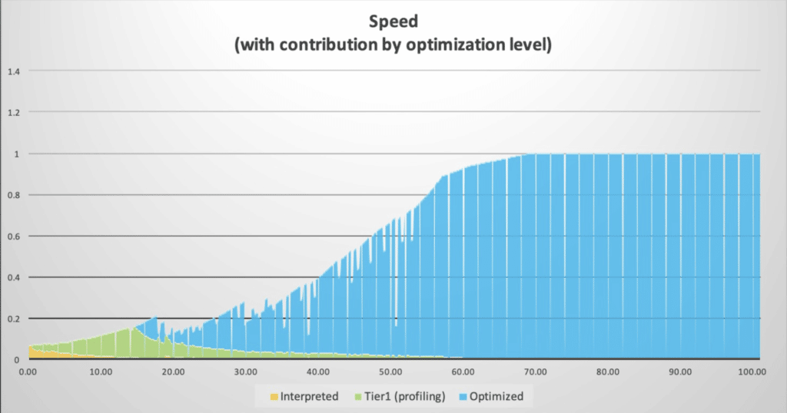

Recently the [Azul](https://www.azul.com/) team attended Devoxx Belgium, one of the biggest Java conferences with over 3,200 visitors.

We talked with many developers and DevOps engineers, and one of the recurring questions was about the difference between Just-In-Time (JIT) and Ahead-Of-Time (AOT) execution of applications.

More specifically, about better JIT performance compared to a native compiled AOT application.

In this post, I give a quick update on both strategies to clarify why you will get different performance results.

## What is Just-In-Time?

The **Java Virtual Machine** executes bytecode, which was generated from the code you wrote in Java (or other supported languages like Kotlin). This bytecode is typically packaged into a JAR file that the runtime can execute on any platform.

During execution, frequently used methods (**hotspots** ) are identified and compiled into native code. This is done using two compilers: **C1** (fast compile, low optimization) and **C2** (slow compile, high optimization). This approach always compiles the most performant native code for the exact use case and platform the application runs on.

The disadvantage of this approach is that at startup, the virtual machine executes the (slow) bytecode during a "warmup time" until it identifies the hotspots and reaches the perfect native compiled code. This process repeats at every startup.

In this graph, you can see this process of using bytecode (yellow), C1 native code (green), up to C2 optimal compiled native code (blue).
 Code speed comparison during different cycles of startup of an application

## What is Ahead-Of-Time?

Java code can also be compiled into native applications, for instance with GraalVM. In such an approach, your Java code is static compiled, and the compiler creates native code in an executable for a specific platform.

The advantage is that no bytecode needs to be interpreted at runtime, no hotspots need to be identified, and no CPU load is needed for the compilation. So the application will start at full speed with the native compiled code created ahead.

The disadvantages are that you need to compile for all the platforms you want to run your application on, and the runtime doesn't contain the original code and cannot use it to further optimize the behavior of the application based on the actual use.

<figure class="wp-block-embed is-type-video is-provider-vimeo wp-block-embed-vimeo wp-embed-aspect-16-9 wp-has-aspect-ratio">
 

  <iframe title="Avoid AOT, Justify JIT" src="https://player.vimeo.com/video/756892955?dnt=1&amp;app_id=122963" width="500" height="281" frameborder="0" allow="autoplay; fullscreen; picture-in-picture; clipboard-write"></iframe>
 

 <figcaption class="wp-element-caption">
  Watch the JIT performance on-demand webinar featuring Azul Deputy CTO Simon Ritter and Payara CEO Steve Millidge.
 </figcaption>
</figure>

## Different approaches, different performance

If all code is compiled before running it (AOT), how can it perform worse than JIT-compiled code? Here lies the true strength of the JIT approach! It can adapt the compiled native code to handle the data or perform its action based on the actual needs.

These are just a few examples of what is known as **Speculative Optimization**:

* If your code has been created to handle several *if* or *switch* cases, but a few of the options are never used, they will not be compiled to native code, making it smaller and faster. If later it turns out some of the not-compiled options are needed, the compiler can produce new native code to handle the method in the best possible way.
* The compiler will replace private variables, where possible, with a public one to reduce the need for a getter method to return the value of an attribute.

At Azul, we have seen that such **speculative optimizations can lead to up to 50% performance gains**!

## Comparison of AOT and JIT compilation

Let's put the pros and cons in an overview:

|                 Ahead-Of-Time                 |                     Just-In-Time                     |
|-----------------------------------------------|------------------------------------------------------|
| - Class loading prevents method inlining      | + Can use aggressive method inlining                 |
| - No runtime bytecode generation              | + Can use runtime bytecode generation                |
| - Reflection is complicated                   | + Reflection is (relatively) simple                  |
| - Unable to use speculative optimizations     | + Can use speculative optimizations                  |
| - Overall performance will typically be lower | +Overall performance will typically be higher        |
| + Full speed from the start                   | - Requires warmup time                               |
| + No CPU overhead to compile code at runtime  | - CPU overhead to compile code at runtime Conclusion |

## Conclusion

Both AOT and JIT provide good ways to execute Java code. But although AOT offers a set of advantages regarding startup, the impact of the JIT compiler should not be underestimated to achieve the best performing code during runtime.

## More learning resources

To learn more about this topic, we recommend the following:

* From the Azul docs: "[Analyzing and Tuning Warm-up](https://docs.azul.com/prime/analyzing-tuning-warmup)" to learn more about the stages of the JIT compiler
* "[JIT vs. AOT: How to Pick the Right Approach](https://www.infoq.com/presentations/jit-aot-tradeoffs/)" panelist recorded at QCon Plus with our CTO Gil Tene, Microsoft Principal Engineer Monica Beckwith, and Independent Software Developer and Consultant Todd Montgomery
* On-demand webinar, [Avoid AOT, Justify JIT: Java Compilation in the Cloud](https://www.azul.com/webinar-java-compilation-in-the-cloud) with Azul Deputy CTO Simon Ritter and Payara CEO Steve Millidge
* Video recording of the Devoxx presentation "Java on CRaC: Superfast JVM Application Startup" by Simon Ritter, in which he describes the differences between AOT and JIT performance:


