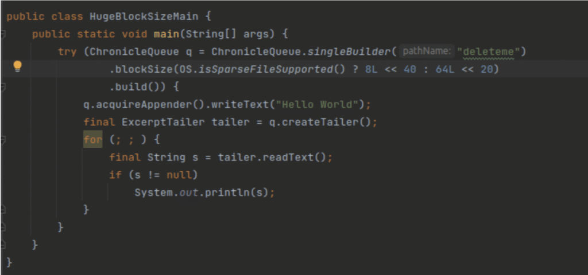
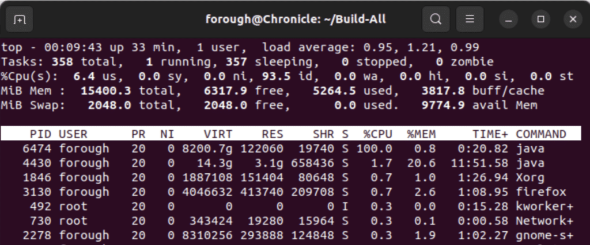
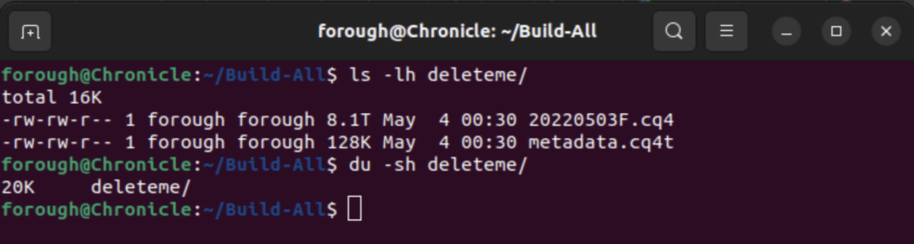
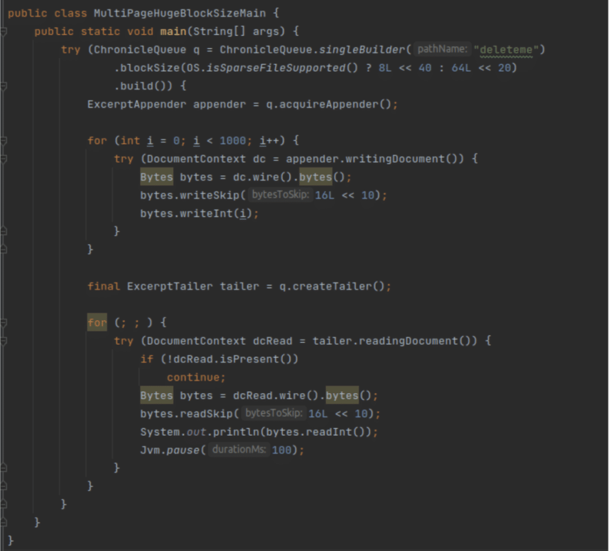
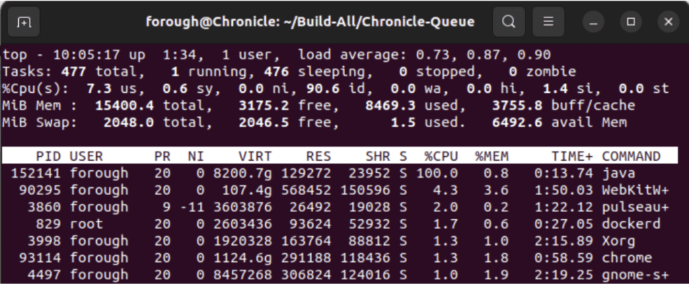
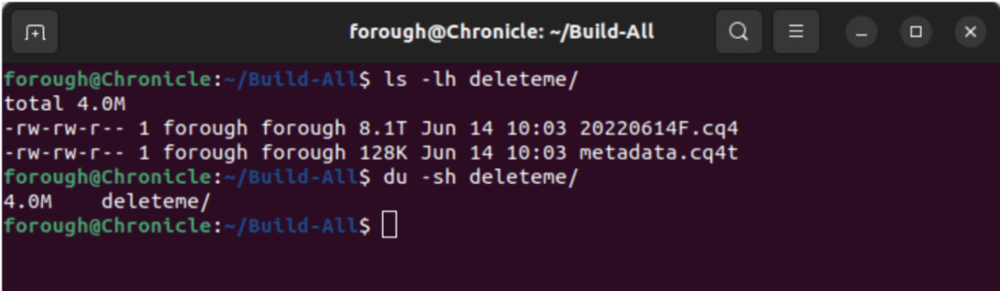

On Linux, you can create [sparse files](https://en.wikipedia.org/wiki/Sparse_file "sparse files"), where only the pages (of 4 KiB) that are touched utilise either memory or disk space.

This allows you to memory map large virtual regions without worrying about wasted memory or disk

In this program, you can see it reserves 8 TiB (8,192 GiB)

  
*Figure 1. Test 1: Sparse file*

Tip: x \<\< y means x × 2y therefore:

```
1L << 10 = 1 KiB (1024 bytes),
1L << 20 = 1 MiB (10242 bytes),
1L << 30 = 1 GiB (10243 bytes),
1L << 40 = 1 TiB etc
```


Using multiples of 10 for the shift makes them easier to read.

```
64L << 20 is 64 × 220 = 64 × 10242 = 64 MiB.
```


The virtual memory size of the above process is just over 8192 GiB at 8200.7 GiB, but the RSS (Resident Set Size) is only 122,060 KB, or 122 MB.  
  
*Figure 2. RES for Test 1*

On disk, the extents reported are 8 TiB, however the amount of disk (and memory) actually used is just 20 KiB.

  
*Figure 3. Disk usage for Test 1*

The following test displays the main point of this article more clearly. In the test the reserved virtual memory is 8 TiB again but data has been written sparsely; 1000 integers are written but there is 16L \<\< 10 (16 KiB = four pages) skip after each write.

  
*Figure 4. Test 2: Sparse file with skipped pages*

The RSS (Resident Set Size) is only 129,272 KB, or 122 MB and the disk usage is only 4.0 MiB which indicates that only touched pages use memory. Although it seems the size of data is 16 KiB *1000 = 16 MiB but only 1 out of 4 pages have been touched so the actual disk usage is 4KiB* 1000 = 4.0 MiB

  
*Figure 5. RES for Test 2*

  
*Figure 6. Disk usage for Test 2*

### Conclusion {#h3-0-conclusion}

Mapping large areas of memory avoids having to know in advance how much memory we need or having to resize the memory mappings while in use, while accessing the data as direct memory without the overhead of system calls.

In short, using virtual memory, instead of real memory, gives greater flexibility to how we tune our systems.

Files that can be pruned lazily make it clear the files won't be extended.

In memory mapped files, only the touched pages use disk space.

On the system used for the tests in this article each page can hold 4 KiB data space hence writing data sparsely so that some pages were skipped did not increase disk usage, in other words only the touched pages contributed to memory demand.
