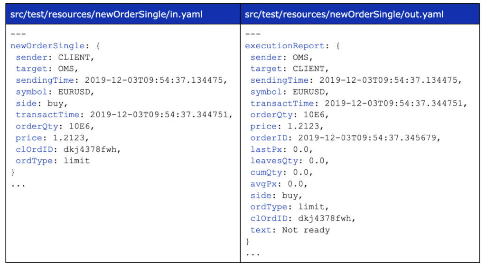
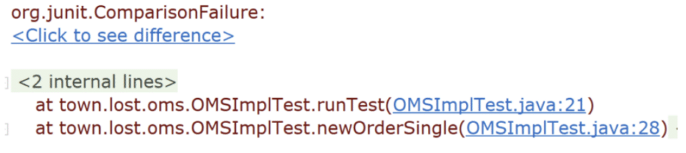
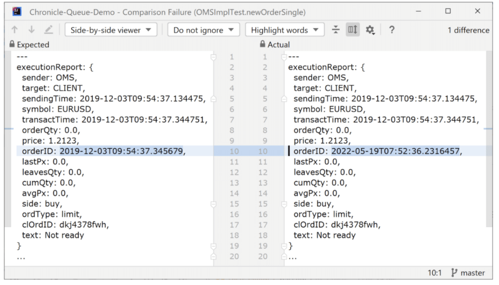
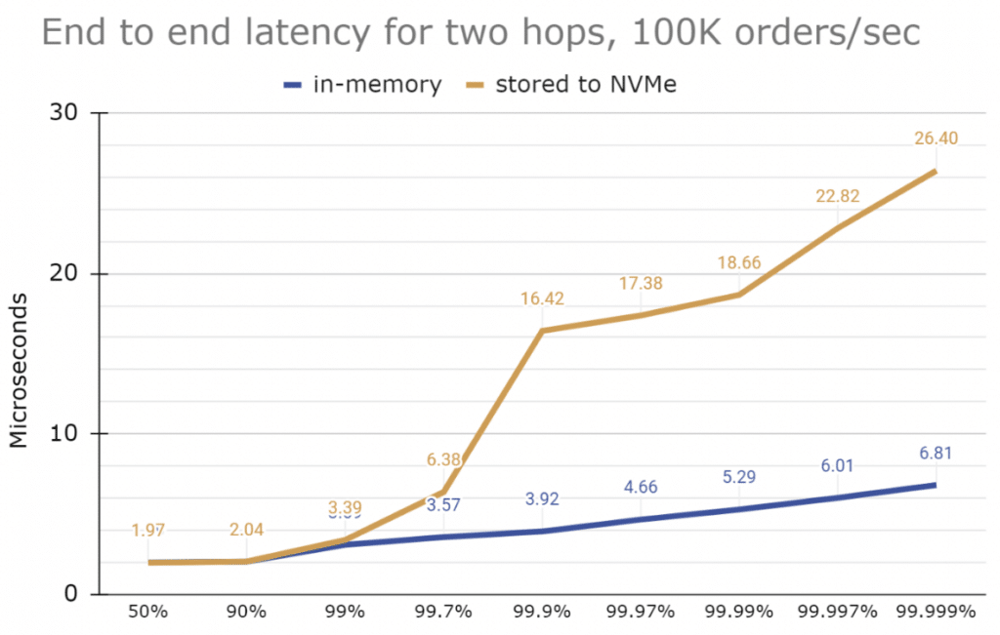

Following the [Hello World example](https://foojay.io/today/event-driven-hello-world-program/ "Hello World example") of a simple, independently deployable real-time Event-Driven Microservice, this article looks at a more realistic example of an Order Processor with a New Order Single in and an Execution Report out.

A [New Order Single](https://www.onixs.biz/fix-dictionary/4.4/msgtype_d_68.html "New Order Single") is a standard message type for the order of one asset in the FIX protocol used widely by financial institutions such as banks.

The reply is typically one or more [Execution Reports](https://www.onixs.biz/fix-dictionary/4.2/msgtype_8_8.html "Execution Reports") updating the status of that order.

### Some Background on Fintech

In fintech, when one organisation wishes to purchase an asset or commodity from another, they send an order.

The other organisation sends back a message to notify if the order was successful; this message is called an execution report. You could think of it a bit like a trade receipt.

These orders and execution reports are transmitted electronically, using a data format standardised by Financial Information eXchange (FIX).

There are many different types of orders, but one of the most popular Orders offered by the FIX standard is the NewOrderSingle.

We use the same terminology as the [FIX protocol](https://www.fixtrading.org/standards/ "FIX protocol") to simplify the translation from one to the other. This example is also [available on GitHub](https://github.com/OpenHFT/Chronicle-Queue-Demo/tree/main/order-processor "available on GitHub").

Again, we model an input event in YAML. To start with, we will reject all new orders as this is simple to demonstrate.



### Testing this Service

We can test this service with the captured data earlier with a YAML configuration. We override the system clock to produce the same results every time.

```
public static void runTest(String path) {
   try {
       SystemTimeProvider.CLOCK = new SetTimeProvider("2019-12-03T09:54:37.345678")
               .advanceMicros(1);
       YamlTester yt = YamlTester.runTest(OMSImpl.class, path);
       assertEquals(yt.expected(), yt.actual());
   } finally {
       SystemTimeProvider.CLOCK = SystemTimeProvider.INSTANCE;
   }
}

@Test
public void newOrderSingle() {
   runTest("newOrderSingle");
}
```


As in previous examples, if the output is incorrect, we can quickly see this in the data.

### What do we see when a test fails?

Say we don't override the time and use the wall clock instead. We might see something like this.



And if we "Click to see difference", we can see the orderID, which contains a timestamp that has changed. There are many ways to handle this, but we override the system clock to ensure we also get the same time in this example.



The component doesn't need to log anything as all results, including errors, are written to the output queue.

### Performance Testing

In this benchmark, 100k orders/s are injected into one queue. These are then processed, and the result is written in a second queue and read to get an end to end latency. Each run is 30 seconds. This times two serializations, two writes, two reads, two deserializations and two hops between threads.

Running on a desktop with an AMD Ryzen 9 5950X and Ubuntu 21.10, gives very stable performance for in memory messaging, and consistent latencies for writing to the memory-mapped file synchronously.

Using the queues in an asynchronous mode achieves similar latencies to in memory writes, while persisting to disk as fast as possible.

*Comparing using tmpfs as in-memory and ext4 on an M.2 NVMe drive.*



### Chronicle Enterprise Extensions

You can test, develop and run microservices using our open source software.

Our commercial extensions support; state management e.g. idempotency, faster restarts of services, distributions of events and HA/DR, centralised monitoring of distributed systems, and configuration and testing of a services mesh.

### Conclusion

Combining high performance and ease of use can be challenging.

However, if you keep it simple, microservices using event sources as input and outputs, can have consistent, microsecond latency and support maintainable tests.
