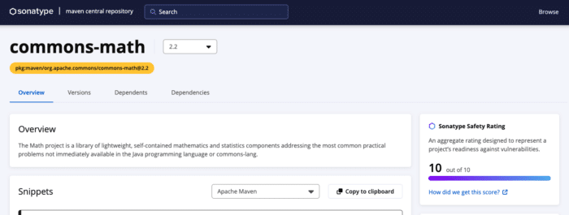
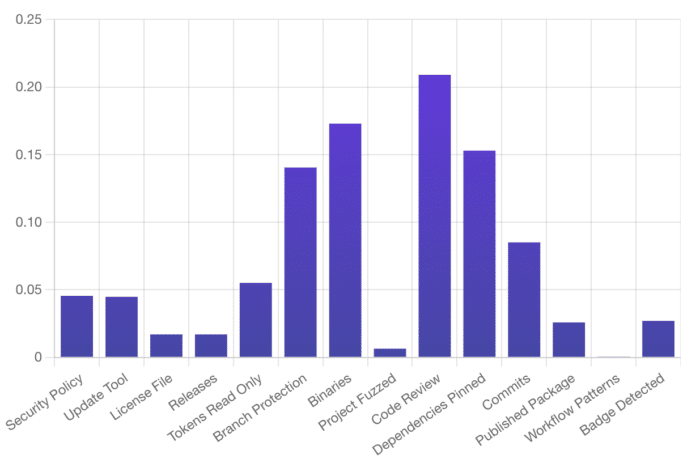

If you've searched for [Maven Central components](http://central.sonatype.com "Maven Central components") in the last six months, you may have noticed some pretty big changes to the website, including a UI facelift and some new component analysis tools like [BOM Doctor](https://bomdoctor.sonatype.com/#/home "BOM Doctor") and the Sonatype Safety Rating.

It's no coincidence that many of these changes are security related. Maven Central, along with public code repositories, are the first line of defense when it comes to supply chain security.

I like to think of the software supply chain as a mighty waterfall, like Niagara Falls near my home in Canada, where the flow of water follows the use of open source libraries in an application.

Cybersecurity can also be a bit of a stressful topic at times, and the sight or sounds of a beautiful waterfall can significantly calm the nerves.

Got your relaxing waterfall sounds on? Good!

In our comparison of software development and waterfalls, the earlier a potential threat enters the stream, the bigger the splash it can make.

With tens of thousands of component downloads per week, open source repositories like Maven Central present huge opportunities for bad actors to inject malicious code into a project.

In fact, over the past three years, there has been a [742% average](https://www.sonatype.com/state-of-the-software-supply-chain/introduction "742% average") annual increase in supply chain attacks on projects like those hosted on Maven Central.

The opportunity is so great that attackers are even creating new ways to attack software pipelines through strategies like typosquatting and dependency confusion.

## Besides listening to soothing waterfall sounds... What can be done?

As it turns out, nearly all downloads of known vulnerable components hosted on Maven Central already have available fixes in newer versions ([95.5% to be exact](https://www.sonatype.com/state-of-the-software-supply-chain/open-source-dependency-management-trends-and-recommendations "95.5% to be exact")). That leaves much of the remaining responsibility on consuming projects to manage their own risk when using software libraries.

When it comes to dependency management, there are a couple of key areas to consider.

The first one is staying up to date with the latest release of existing project dependencies. The average Java project may have thousands to consider, and one part of the challenge is actually being aware of all the project dependencies in the first place. [Steve Poole wrote a good article describing this issue further.](https://foojay.io/today/sboms-first-steps-in-a-new-journey-for-developers/ "Steve Poole wrote a good article describing this issue further.")

Another area that should also be considered is, if you have the luxury of choosing new libraries, it's important to choose the highest quality possible while fulfilling your functional requirements.

What does high quality mean, you ask? No two teams may have exactly the same criteria due to their specific use cases. Regarding security considerations, some crucial areas to consider include the presence of known vulnerabilities and the likelihood of the project having a vulnerability in the future.

## How likely is it for a project to contain a vulnerability?

This is a question Maven Central attempts to provide insight into through the Sonatype Safety Rating. Currently, this experimental rating shows up on only about twenty-five thousand projects. It is 92% accurate in predicting past vulnerabilities on a project.

The rating ranges from 1 to 10, where 1 means a project is very likely to have future vulnerabilities and 10 is unlikely to have future vulnerabilities.  

***Screenshot from central.sonatype.com***{#caption-attachment-62930}

## What goes into this rating?

The two most important inputs to the Sonatype Safety Rating are [OpenSSF Scorecard](https://securityscorecards.dev/ "OpenSSF Scorecard") and Mean Time To Update (MTTU).

OpenSSF Scorecard is an open source tool intended to improve the health of critical open source projects. This tool runs against repositories to verify the presence of security best practices.

And they've done great work. Sonatype trained a machine learning model with this data and was able to predict the likelihood of existing vulnerabilities with 85% accuracy.

When MTTU was introduced to the model, it increased to 92% accuracy. MTTU measures how quickly a project updates its dependencies when new versions are released.

Machine learning nerds can read more details about the rating in the [State of the Software Supply Chain Report](https://www.sonatype.com/state-of-the-software-supply-chain/project-quality-metrics "State of the Software Supply Chain Report").

## In case you didn't know, code review is really important

A key conclusion that came out of analyzing the OpenSSF Scorecard data is that code review is the single most important thing projects can do to reduce the chance of future vulnerabilities.

***OpenSSF Health Checks Most Useful For Identifying Vulnerable Projects***

While this is pretty standard practice in most open source projects I've participated in, it's still reassuring to the analytical mind that there is concrete evidence to know that the benefits of code review go even as far as to say that they can help prevent security vulnerabilities.

## Just the beginning

The Safety Rating is a good start. Ultimately it measures the *least* behaviour a project should exhibit to keep vulnerabilities at bay. It's certainly not a predictor of future trends.

As the bad actors seek more sophisticated ways to attack open source projects our scoring will have to evolve with it.

For now, consider the Sonatype Safety Rating and OpenSSF Scorecard as the baseline. Poor scores likely demonstrate that the project is not paying any attention to security, while higher scores show that they are.

The work required to create a safer Java ecosystem isn't for the faint of heart, but by working together and every player making small steps to improve, we'll get there.

Next time you're considering a new Java library, I'd encourage you to look for that Sonatype Safety Rating on Maven Central to aid in your decision making.

If it seems overwhelming, go back to your soothing waterfall sounds and remember that every small step toward a safer software ecosystem counts and is a step in the right direction.
