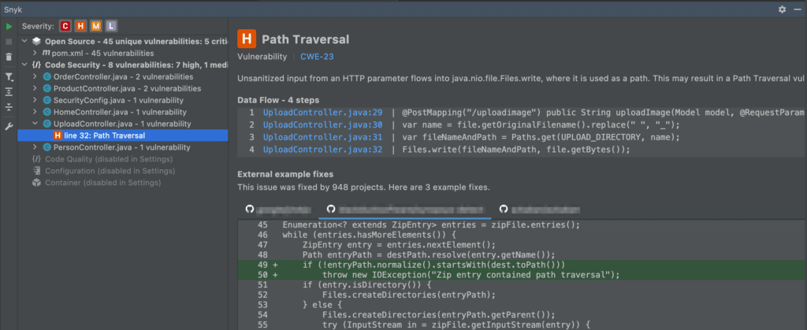

Path traversal is a type of security vulnerability that can occur when a web application or service allows an attacker to access server files or directories that are outside the intended directory structure.

This can lead to the unauthorized reading or modification of sensitive data.

In the context of file uploads, a path traversal vulnerability can occur when an application fails to properly validate the file path specified by the user, which can allow the attacker to upload a malicious file with a filename that gives them access to restricted files on the server.

Preventing path traversal in file uploads is crucial for the security of Java applications, as it helps to protect sensitive data and prevent unauthorized access to restricted files and directories.

In this article, we'll explore path traversal in file uploads in more detail and show you how to prevent this vulnerability in Java applications with Snyk Code.

Whether you're a developer or simply interested in learning more about security in Java, this post will provide you with information and insights to help keep your Java applications secure.

Understanding path traversal in file uploads {#h2-0-understanding-path-traversal-in-file-uploads}
-------------------------------------------------------------------------------------------------

Imagine an application that allows users to upload profile pictures. The application stores the profile pictures in a directory on the server, such as `/images/profiles/`.

If the application fails to validate the file name specified by the user properly, an attacker could upload a malicious file with a file name like `../../etc/passwd`.

This would allow the attacker to access sensitive system files outside the intended directory structure.

Take the example below from a Spring Boot application using Thymeleaf.

<pre class="EnlighterJSRAW" data-enlighter-language="java" data-enlighter-theme="" data-enlighter-highlight="" data-enlighter-linenumbers="" data-enlighter-lineoffset="" data-enlighter-title="" data-enlighter-group="">@PostMapping("/uploadimage")
public String uploadImage (Model model, @RequestParam("image") MultipartFile file) throws IOException {
   var name = file.getOriginalFilename().replace(" ", "_");
   var fileNameAndPath = Paths.get(UPLOAD_DIRECTORY, name);
   Files.write(fileNameAndPath, file.getBytes());
   model.addAttribute("msg", "Uploaded images: " + name);
   return "person/upload";
}</pre>

Web forms are a very common to upload images. When uploading, we use the `originalFilename` from the incoming `MultipartFile`.

If we intercept and inspect the HTTP post call, we see that `filename` is just metadata in this HTTP request shown on line 24.

With the right tools, it is easy to change the filename to anything we want! When we change the filename to `../../../../../../../etc/passwd`, our code will upload the file to `images/profiles/../../../../../../../etc/passwd`.

The path will be traversed to the root, and the file will be overwriting `/etc/passwd`.

How Snyk Code detects path traversal. {#h2-1-how-snyk-code-detects-path-traversal}
----------------------------------------------------------------------------------

Snyk Code is a real-time SAST tool that helps Java developers identify vulnerabilities in their applications --- including path traversal in file uploads. The tool uses a static analysis based on an advanced machine learning model to scan your code and identify potential security risks.

Regarding path traversal, [++Snyk Code++](https://docs.snyk.io/scan-application-code/snyk-code) can help you identify places in your code where user-specified file paths are used and proper validation is not in place. For example, when connecting my GitHub repository to Snyk, Snyk Code found the path traversal issue for me in [++the Web UI++](https://docs.snyk.io/scan-application-code/snyk-code/exploring-and-working-with-the-snyk-code-results).

Next, I'm using the [++Snyk plugin for IntelliJ IDEA++](https://docs.snyk.io/ide-tools/jetbrains-plugins) with Snyk Code enabled. Scanning on my local machine during development already pinpointed the path traversal problem in my file upload.

Additionally, it also gave me some suggestions for possible mitigation actions.

By using Snyk Code, you can proactively identify and fix these path traversal vulnerabilities before they are exploited, helping to ensure the security of your application and the data it handles.

In summary, Snyk Code helps Java developers identify path traversal vulnerabilities in file uploads by scanning their code and identifying areas where proper validation is not in place.

This can help ensure the security of your application and protect against potential attacks.

Mitigating path traversal in file uploads {#h2-2-mitigating-path-traversal-in-file-uploads}
-------------------------------------------------------------------------------------------

The easiest way to fix a path traversal vulnerability is to avoid using the `file.getOriginalFilename()`. If you generate a name yourself, you have absolute control over the location the file gets stored because it is influenced by user input.

However, if you want to preserve the original file's name, we need to check if the location where the file gets stored is where we want it to be. Snyk Code (see the IDE plugin example) already hinted that we can normalize the path.  

Let's change our previous example to check if the **normalized** path at least starts with our intended upload folder. This way, we prevent path traversal issues.

<pre class="EnlighterJSRAW" data-enlighter-language="java" data-enlighter-theme="" data-enlighter-highlight="" data-enlighter-linenumbers="" data-enlighter-lineoffset="" data-enlighter-title="" data-enlighter-group="">@PostMapping("/uploadimage")
public String uploadImage (Model model, @RequestParam("image") MultipartFile file) throws IOException {
   var name = file.getOriginalFilename().replace(" ", "_");
   var fileNameAndPath = Paths.get(UPLOAD_DIRECTORY, name);

   if (!fileNameAndPath.normalize().startsWith(UPLOAD_DIRECTORY)) {
        throw new IOException("Could not upload file: " + name);
   }

   Files.write(fileNameAndPath, file.getBytes());
   model.addAttribute("msg", "Uploaded images: " + name);
   return "person/upload";
}</pre>

Preventing path traversal vulnerabilities is essential. {#h2-3-preventing-path-traversal-vulnerabilities-is-essential}
----------------------------------------------------------------------------------------------------------------------

Path traversal vulnerabilities are a serious threat to the security of Java web applications, and are currently among the top security issues Snyk finds in Java code.

Developers need to be aware of and understand how to prevent them.

By implementing proper validation and using tools like Snyk Code to identify potential vulnerabilities, developers can help ensure the security of their applications and protect against the risks of path traversal attacks.

It's vital to remember that security is an ongoing process, and staying aware and proactive in identifying and mitigating vulnerabilities is key to maintaining the security of your Java applications.
