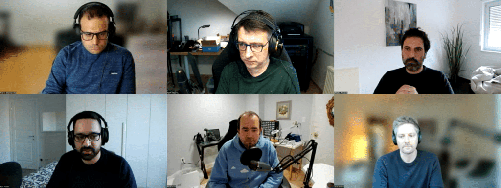

TornadoVM is a programming and execution framework for offloading and running JVM applications on multi-core CPUs, GPUs, and FPGAs.

With the same code, some of your existing program code can be executed hundreds of times faster!



Podcast Apps {#h2-1--odcast-pps}
--------------------------------

You can listen and subscribe to the Foojay Podcast on:

* [Spotify](https://open.spotify.com/show/6CpTfgn9LirzJGAtc4ICdQ)
* [Apple Podcasts](https://podcasts.apple.com/be/podcast/foojay-io-the-friends-of-openjdk/id1652281304)
* And most others...

Guests {#h2-1-guests}
---------------------

* *Juan Fumero, TornadoVM Lead Architect*
  * [*https://twitter.com/snatverk*](https://twitter.com/snatverk)
  * [*https://www.linkedin.com/in/juanjosefumeroalfonso/*](https://www.linkedin.com/in/juanjosefumeroalfonso/)
  * [*https://mastodon.online/@snatverk*](https://mastodon.online/@snatverk)
* *Christos Kotselidis, TornadoVM Project Leader*
  * [*https://twitter.com/CKotselidis*](https://twitter.com/CKotselidis)
  * [*https://www.linkedin.com/in/kotselidis/*](https://www.linkedin.com/in/kotselidis/)
  * [*https://mastodon.online/@kotselidis*](https://mastodon.online/@kotselidis)
* *Thanos Stratikopoulos, TornadoVM Senior Solutions Architect*
  * [*https://twitter.com/thanos_str*](https://twitter.com/thanos_str)
  * [*https://www.linkedin.com/in/stratika/*](https://www.linkedin.com/in/stratika/)
  * [*https://foojay.io/today/author/thanos-stratikopoulos/*](https://foojay.io/today/author/thanos-stratikopoulos/)
  * [*https://mastodon.sdf.org/@thanos_str*](https://mastodon.sdf.org/@thanos_str)
* *Jakob Jenkov*
  * [*https://twitter.com/jjenkov*](https://twitter.com/jjenkov)
  * [*https://www.linkedin.com/in/jakob-jenkov-4a3a8/*](https://www.linkedin.com/in/jakob-jenkov-4a3a8/)

Podcast {#h2-2-podcast}
-----------------------

* Host: Erik Costlow
  * <https://twitter.com/costlow>
  * <https://mastodon.social/@costlow>
* Production: Frank Delporte
  * <https://twitter.com/FrankDelporte>
  * <https://foojay.social/@frankdelporte>

**Content** {#h2-3-content}
---------------------------

* 00'00 Intro
* 00'36 Introduction of the guests
* 04'26 What is TornadoVM?
  * <https://foojay.io/today/hardware-acceleration-for-java-tornadovm-can-do-it/>
  * <https://fosdem.org/2023/schedule/event/hardware/>
  * <https://www.tornadovm.org/>
  * <https://github.com/beehive-lab/TornadoVM>
  * <https://www.infoq.com/articles/java-performance-tornadovm>
  * [https://www.infoq.](https://www.infoq.com/articles/tornadovm-java-gpu-fpga)[com/articles/tornadovm-java-gpu-fpga](https://www.infoq.com/articles/tornadovm-java-gpu-fpga)
* 05'54 How applications can make use of the acceleration provided by TornadoVM
* 11'48 The difference between CPU threads and GPU instruction chain
* 13'42 Possible use cases for TornadoVM
* 15'23 Results on Apple M1
  * <https://foojay.io/today/a-flavour-of-tornadovm-on-apple-m1-pro/>
* 17'19 Can TornadoVM be used in cloud environments
* 21'18 How to use the API
  * <https://foojay.io/today/migrating-applications-to-tornadovm-v0-15-part-1/>
  * <https://foojay.io/today/migrating-applications-to-tornadovm-v0-15-part-2/>
* 24'41 Jakobs view of what would be a good match between TornadoVM and cloud usage on AWS Lambdas
  * <https://foojay.io/today/azul-provides-the-crac-in-aws-snapstart-builds/>
  * <https://foojay.io/today/how-to-run-a-java-application-with-crac-in-a-docker-container/>
  * AWS GPU and CPU capabilities: <https://docs.aws.amazon.com/AmazonECS/latest/developerguide/ecs-gpu.html>
* 30'54 The complexity of GPU and FPGA programming languages and handling the differences between different architectures of GPUs, CPUs, and FPGAs
  * <https://www.khronos.org/>
* 40'28 How TornadoVM could be used to heat up buildings, help to reduce the total cloud cost for companies, and run ChatGPT
* 43'30 Relationship between project Panama and TornadoVM
* 48'10 How to get started with TornadoVM
  * <https://tornadovm.readthedocs.io/en/latest/introduction.html>
* 54'41 Outro
