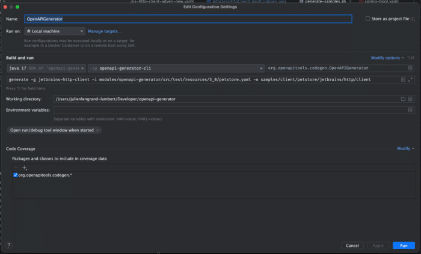
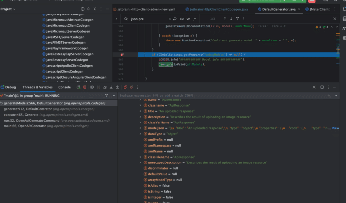
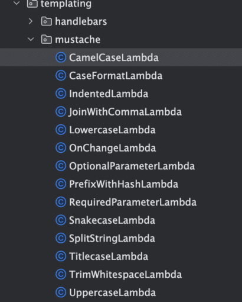

***TL;DR: In this article, I'm sharing some tips and tricks on how to get productive creating OpenAPI generators.***

Lately, I've started dabbling more and more with [OpenAPI](http://https://github.com/OAI/OpenAPI-Specification "OpenAPI"). The OpenAPI specification is a super useful way to describe the API that you're exposing to your users, both internally and externally.

Some of you may also have heard about those under the name of "Swagger files". They're both kinda the same in the common speak, though OpenAPI is an open standard (lead with the OpenAPI Initiative) and Swagger is a set of tools built by a company ([SmartBear](https://smartbear.com/ "SmartBear")).

Some of those tools are open source, while others have a pro license. I won't go into the details of the specification here, there are plenty of great getting started resources, typically for different technologies. [Here's one for Java and Spring.](https://www.baeldung.com/spring-rest-openapi-documentation "Here's one for Java and Spring.")

**Generators** are the parts that take the OpenAPI model that's being created from a definition file and generate server / client code and / or documentation. Or anything you want, really. There's [many generators](https://openapi-generator.tech/docs/generators/ "many generators") available out of the box, so typically what you want is use or adapt one of them. It's not *always* the case though. For example, until a few weeks ago there was no generator available for [the Jetbrains HTTP Client](https://www.jetbrains.com/help/idea/http-client-in-product-code-editor.html "the Jetbrains HTTP Client").

**In this article, we'll dive into tips and tricks on how to quickly get productive with the OpenAPI Generators project so you too can work with them and generate cool stuff. Tips follow each other, in order of importance (for me).**

## Using the Debugging Flags

Typically, if you're playing with a generator, you either want to generate a model file (your data structure), an operation file (your logic), or a supporting file (basically anything else, READMEs, docs, ...).

At its core, the idea of OpenAPI is quite simple : It takes a specification file, transforms it into a set of objects in memory, and uses those objects to generates code / files using [mustache](http://mustache.github.io/ "mustache") template files. You can read more about it [here](https://openapi-generator.tech/docs/templating/ "here").

That's why it's crucial to have a good look into those objects, so that you can find where the data you need is located inside your mustache template. Here, debugging flags become vital. There's 3 of them, whether you want to see the data to generate models, operations or supporting files.

You can use respectively `debugModels`, `debugOpenAPI` and /or `debugSupportingFiles`. and you set them by running the desired `generate` command with the correct flag. For example:

```
$ java -cp modules/openapi-generator-cli/target/openapi-generator-cli.jar \
org.openapitools.codegen.OpenAPIGenerator generate -g java -o out -i petstore.yaml \
--global-property debugModels=true
```

I won't print the entire output here because it's huge, but as part of the output it will basically spit a giant json representation of all the models available inside that specified yaml file. Here's a tiny part of the beginning:

```
[ {
  "importPath" : "org.openapitools.client.model.Category",
  "model" : {
    "anyOf" : [ ],
    "oneOf" : [ ],
    "allOf" : [ ],
    "name" : "Category",
    "classname" : "Category",
    "title" : "Pet category",
    "description" : "A category for a pet",
    "classVarName" : "category",
    "modelJson" : "{\n  \"title\" : \"Pet category\",\n  \"type\" : \"object\",\n  \"properties\" : {\n    \"id\" : {\n      \"type\" : \"integer\",\n      \"format\" : \"int64\"\n    },\n    \"name\" : {\n      \"type\" : \"string\"\n    }\n  },\n  \"description\" : \"A category for a pet\",\n  \"xml\" : {\n    \"name\" : \"Category\"\n  }\n}",
    "dataType" : "Object",
    "xmlName" : "Category",
    "classFilename" : "Category",
    "unescapedDescription" : "A category for a pet",
    "isAlias" : false,
    "isString" : false,
    "isInteger" : false,
    "isLong" : false,
    "isNumber" : false,
    "isNumeric" : false,
    "isFloat" : false,
    "isDouble" : false,
    "isDate" : false,
    "isDateTime" : false,
    "isDecimal" : false,
    "isShort" : false,
    "isUnboundedInteger" : false,
    "isPrimitiveType" : false,
    "isBoolean" : false,
    "additionalPropertiesIsAnyType" : false,
    .........
```

## Running and Debugging a Generator

Whether you want to play with an existing generator or [create a new one](https://openapi-generator.tech/docs/new-generator/ "create a new one"), the existing documentation tends to offer you to compile and run the generators using the generic `./mvnw clean package` followed by `./bin/generate-samples.sh bin/configs/spring-boot.yaml` (replace with the file you want to use) command.

The first one will compile the source, while the second one will use the created `openapi-generator-cli.jar` and actually run the code.

For example, the config file `spring-boot.yaml`:

```
generatorName: spring
outputDir: samples/server/petstore/springboot
inputSpec: modules/openapi-generator/src/test/resources/2_0/petstore.yaml
templateDir: modules/openapi-generator/src/main/resources/JavaSpring
additionalProperties:
  artifactId: springboot
```

will run the command

```
$./modules/openapi-generator-cli/target/openapi-generator-cli.jar org.openapitools.codegen.OpenAPIGenerator generate \
-g spring \
-i modules/openapi-generator/src/test/resources/2_0/petstore.yaml \
-o samples/server/petstore/springboot \
-t modules/openapi-generator/src/main/resources/JavaSpring \
--additional-properties=artifactId=springboot
```

Useful, but quite cumbersome. On top of this, you typically want to be able to run / debug code as you go directly in your IDE.

Using IntelliJ, you can do it by creating a run configuration as such :



Above, a run configuration in IntelliJ used to run a specific generator.

Set the `OpenAPIGenerator` class to run from the `openap-generator-cli` jar file.

Pick your generator name, input yaml file and output folder (the same as in the config file described above and set the working directory to be the root of the `openapi-generator` git project. You're done!

Now you can go in the generator's `CodeGen` file , (for example `JMeterClientCodegen` if your generator name is `jmeter` ) and set breakpoints where you want 😊.

## Setting Breakpoints in the Right Locations

As described above already OpenAPI generators take a specification file, transform it into a set of objects in memory, and use those objects to generates code / files using mustache template files.

Typically, generators will take those existing objects and add or modify some of their content to fit the output to be generated. Most generators will extend from `DefaultCodeGen`.

That's where you will find the most useful locations to set breakpoints to see what to change and where.  

The most interesting part of this class is located in the `generate` method.

You will also be able to find the lines that are being used to print the debugging flags by searching for the `Json.prettyPrint` calls. Here's an example for the models (as of now, line 566 of `DefaultCodeGen`):

```
if (GlobalSettings.getProperty("debugModels") != null) {
    LOGGER.info("############ Model info ############");
    Json.prettyPrint(allModels);
}
```



Above, a screenshot of a debug of the model, showing the content of the "allModels" variable.

Once you're in there, you can dive into the data and find out what you want to do with it.

## Extending the Default Generator

(Thanks [Beppe](https://twitter.com/beppecatanese "Beppe") for the tip!)

Most generators typically add extra bits of necessary information inside their objects, for example inside the bundle for supporting files : `bundle.put("distinctPathParameters", distinctPathParameters);` . The trick is to find *where* to do this.

Luckily for us, the smart developers of OpenAPI have created locations to do just that! You'll want to search for the methods called `postProcess*` in `DefaultCodeGen`, those are placeholders that are set at the end of the various `generate` methods that you can override at your convenience in your custom generator.

Here is what a completely useless generator could do:

```
@Override
public Map<String, Object> postProcessSupportingFileData(Map<String, Object> bundle) {
    bundle.put("bloggingAt1AM", "isFun");

    return bundle;
}
```

Which you could then use inside a `README.mustache` template, for example:

```
# Important announcement

{{bloggingAt1AM}} // Will print "isFun" once ran
```

## Generating Custom Lambdas

One of the super powers of mustache is its lambdas, which you can declare in the templates.

There is a [list available](https://mustache.github.io/mustache.5.html "list available") on the mustache website, but the OpenAPI templates define a few more.

You can search the code for any class implementing the `Mustache.Lambda` interface 😊.



A screenshot showing a list of many custom lambdas in the OpenAPI source code.

You can easily create new lambdas as well by implementing that interface yourself.

Here is a concrete example : Typically, parameters are surrounded with braces when using a generator. For example, for a GET request, with a `petId` parameter it will come out like this : `DELETE http://petstore.swagger.io/v2/pet/{petId}`.

That being said, The [Jetbrains HTTP Client](https://www.jetbrains.com/help/idea/http-client-in-product-code-editor.html "Jetbrains HTTP Client") defines parameter with double braces (!). I need this to have a valid call : `DELETE http://petstore.swagger.io/v2/pet/{{petId}}`.

Instead of having to play around a lot with the templating, I decided to create a custom lambda for this in my generator.

This is how it looks:

```
public class JetbrainsHttpClientClientCodegen extends DefaultCodegen implements CodegenConfig {

    @Override
    protected ImmutableMap.Builder<String, Mustache.Lambda> addMustacheLambdas() {
       return super.addMustacheLambdas()
                .put("doubleMustache", new DoubleMustacheLambda());
    }

    public static class DoubleMustacheLambda implements Mustache.Lambda {
        @Override
        public void execute(Template.Fragment fragment, Writer writer) throws IOException {
            String text = fragment.execute();
            writer.write(text
                    .replaceAll("\\{", "{{")
                    .replaceAll("}", "}}")
            );
        }
    }
}
```

Two things happen here:

* I create a `DoubleMustacheLambda` class that implements `Mustache.Lambda` that itself implements the execute method. The execute method does nothing else than rewriting some of the generated text.
* I override the `addMustacheLambdas` method, and use it (just like for my data in the previous tip) to insert my custom lambda.

Once that is done, I can use it inside my `api.mustache` template! For example: `{{#lambda.doubleMustache}}{{path}}{{/lambda.doubleMustache}}`

## Finding OpenAPI Spec Files for Testing

One of my struggles when playing around with OpenAPI Generators is to find files to test stuff with. After a little while, sample files and the [PetStore](https://petstore3.swagger.io/ "PetStore") don't cut it any more.

I was searching for actual OpenAPI spec from the real world, like for the GitHub API, Heroku, Digital Ocean, .... you name it.  

I asked [on the official Slack channel](https://openapi-generator.slack.com/?redir=%2Farchives%2FCLSB0U0R5%2Fp1675289086475889 "on the official Slack channel") and folks were most helpful. They suggested two main things :

* [The OpenAPI directory](https://github.com/APIs-guru/openapi-directory/tree/main/APIs "The OpenAPI directory ")(which somehow I didn't know existed!)
* [A Google search](https://www.google.com/search?q=%22api+docs+by+redocly%22+%22REQUEST+BODY+SCHEMA%22 "A google search") to find specs generated by redocly (which, again, is a tool I didn't know existed \^\^)

Armed with those two, it's much easier to go on and try things out.

Hope this helps you too!

## Conclusion

I hope those tips will help you hit the ground running with OpenAPI generators.

Most of the tips directly come from [the open Slack channel](https://openapi-generator.slack.com/join/shared_invite/zt-12jxxd7p2-XUeQM~4pzsU9x~eGLQqX2g#/shared-invite/email "the open Slack channel"), the folks there are super useful.

The [official documentation](https://openapi-generator.tech/ "official documentation") is nice, but I honestly found it quite sparse, and once you dive in, a lot of the advice comes down to "have a look at the other generators for inspiration".

I find it logical, because in 99% of the cases, the generator that you need already exists!

If it doesn't though, you're in for some fun.

Hopefully I'll save you a couple hours this way!

Don't hesitate to reach out if you have any questions! I'm mostly available on [Mastodon](https://mastodon.online/@jlengrand "Mastodon") and Linkedin those days 😊, though you can still find me on [Twitter](https://twitter.com/jlengrand "Twitter")..
