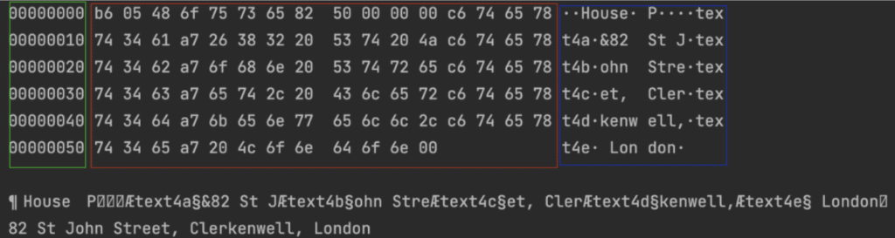
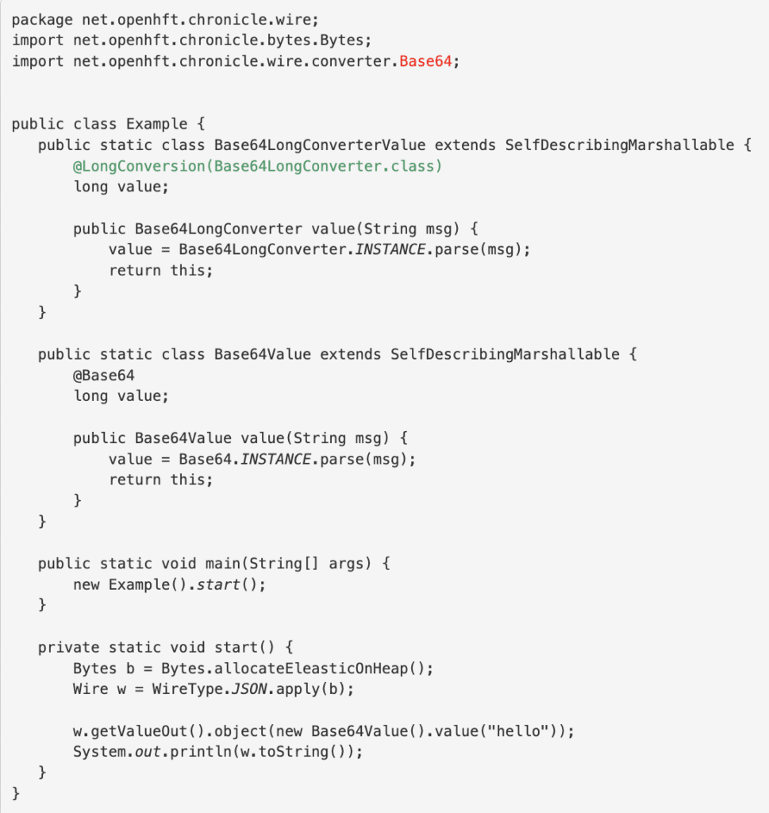
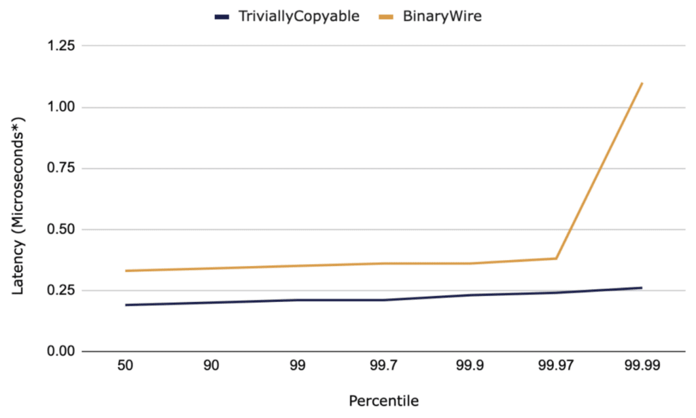

At [Chronicle](https://chronicle.software/?utm_source=foojay&utm_medium=article&utm_campaign=jasmine-article "Chronicle"), we know that efficient code doesn't just run faster; if it's using less compute-resource, it may also be cheaper to run.

In particular, distributed cloud applications can benefit from fast, lightweight serialisation.

In this article, we will demonstrate the efficiencies of using Chronicle Wire to encode small Strings into long primitives, with a few step-by-step examples of object marshalling, and show how this can improve the performance of your application's serialisation.

### Chronicle Wire

[Chronicle-Wire](https://chronicle.software/wire/?utm_source=foojay&utm_medium=article&utm_campaign=jasmine-article "Chronicle-Wire") is an open source Java serialiser that is able to read and write to different message formats such as JSON, YAML, and raw binary data.

Chronicle Wire is able to find a middle ground between compacting data formatting (storing more data into the same space) versus compressing data (reducing the amount of storage required).

Rather, data is stored in as few bytes as possible without causing performance degradation.

This is done through marshalling an object.

#### What is Object Marshalling, and Why use it?

Marshalling is another name for serialisation. In other words, it's the process of transforming an object's memory representation into another format.

With Chronicle wire, we can write the marshalling code agnostic of the written format, so the same marshalling code can be used to generate/read YAML, JSON or binary representations.

Because we can generate human-readable representations, we can trivially implement a toString() method by just writing to a readable wire instance (and equals and hashcode, assuming the serialised form is equivalent to the object's identity).

Moreover, for readable wire instances, we can write numeric values in string representations (e.g. timestamp long converter) or use long conversion to store short text values in numeric forms for compact writes to binary representations.

What this allows is for you to choose the format most appropriate for the application. For instance, when reading hand-crafted config files we can use YAML.

While sending over a wire to another machine, or storing in a machine readable file, we can use binary.

Or, we can also convert between them, such as for debugging binary messages going over a wire we can read from a binary format and log using a YAML format. This can all be executed with the same code.

#### Chronicle Wire: LongConverter Example

This example walks through a simple Plain Old Java Object (POJO) example.

```
public class LongConversionExampleA {
   public static class House {
       long owner;
       public void owner(CharSequence owner) {
           this.owner = Base64LongConverter.INSTANCE.parse(owner);
       }
       @Override
       public String toString() {
           return "House{" +
                   "owner=" + owner +
                   '}';
       }
   }
   public static void main(String[] args) {
       House house = new House();
       house.owner("Bill");
       System.out.println(house);
   }
}
```

We start the process by storing a String object as a long. A Base64LongConverter is used here to parse the provided CharSequence and return the results as a long.

The example code can be seen in [LongConversionExampleA](https://github.com/OpenHFT/Chronicle-Wire/blob/develop/src/test/java/net/openhft/chronicle/wire/LongConversionExampleA.java "LongConversionExampleA").

```
public class LongConversionExampleA {
   public static class House {
       long owner;
       public void owner(CharSequence owner) {
           this.owner = Base64LongConverter.INSTANCE.parse(owner);
       }
       @Override
       public String toString() {
           return "House{" +
                   "owner=" + owner +
                   '}';
       }
   }
   public static void main(String[] args) {
       House house = new House();
       house.owner("Bill");
       System.out.println(house);
   }
}
```

This then prints out the house owner's name as a number, as it has been stored as a long:

```
House{owner=670118}
```

#### Printing YAML Example

We can then extend this class to use one of Chronicle's base classes SelfDescribingMarshallable, which allows us to trivially implement a toString() method and the object can be reconstructed.

This is useful for building sample data in unit tests from a file.

It also means that you can take the dump of an object in a log file and reconstruct the original object.

Demonstrated in the code below is `.addAlias` this enables referring to House rather than to `net.openhft.chronicle.LongConversionExampleB$House`.

[LongConversionExampleB](https://github.com/OpenHFT/Chronicle-Wire/blob/develop/src/test/java/net/openhft/chronicle/wire/LongConversionExampleB.java "LongConversionExampleB") illustrates how to print out the output as YAML:

```
public class LongConversionExampleB {
   static {
       ClassAliasPool.CLASS_ALIASES.addAlias(LongConversionExampleB.House.class);
   }
   public static class House extends SelfDescribingMarshallable {
       @LongConversion(Base64LongConverter.class)
       long owner;

       public void owner(CharSequence owner) {
           this.owner = Base64LongConverter.INSTANCE.parse(owner);
       }
   }
   public static void main(String[] args) {
       House house = new House();
       house.owner("Bill");
       System.out.println(house);
   }
}
```

When running this, instead of printing a number, the following is printed:

```
!House {
    Owner: Bill
}
```

#### Printing JSON Example

If we want the output to instead be JSON, we can remove the following line from LongConversionExampleB:

```
System.out.println(house);
```

And replace it with Chronicle-Wire, as this is a more light weight alternative:

```
Wire wire = WireType.JSON.apply(Bytes.allocateElasticOnHeap());
wire.getValueOut().object(house);
System.out.println(wire);
```

This outputs the following:

```
{"owner": "Bill"}
```

Now why is this helpful? Why can we not just store this originally as a String rather than a long?

Storing this as a long is a more efficient way of storing this data.

While there are usually 8 bytes to a long, by using @LongConversion(Base64LongConverter.class), we are able to store 10 of the Base64 encoded characters into an 8 byte long.

How is this possible?

Typically when we talk about a byte, a byte can represent one of 256 different characters.

Yet, rather than being able to represent one of 256 characters, because we used Base64LongConverter we are saying that the 8-bit byte can only represent one of 64 characters:

```
.ABCDEFGHIJKLMNOPQRSTUVWXYZabcdefghijklmnopqrstuvwxyz0123456789+
```

By limiting the number of characters that can be represented in a byte, we are able to compress more characters into a long.

Now what if these 64 characters do not include the characters you need? Or what if there are still too many?

Chronicle Wire has different versions of this LongConverter; from a Base64LongConverter to a Base32LongConverter. Furthermore, it is also possible to customise your own base encoding. After all, fewer characters results in a more compact way of storing data, which in turn means that the data is faster to both read and write, and who wouldn't want that?

#### Field Group Example

While the example above works well for storing a small number of characters, how about something longer, such as a house address?

This is where we can make use of @FieldGroup from [Chronicle Bytes](https://github.com/OpenHFT/Chronicle-Bytes "Chronicle Bytes"):

```
import net.openhft.chronicle.bytes.Bytes;
import net.openhft.chronicle.bytes.FieldGroup;
```

In[LongConversionExampleC](https://github.com/OpenHFT/Chronicle-Wire/blob/develop/src/test/java/net/openhft/chronicle/wire/LongConversionExampleC.java " LongConversionExampleC") below, we walk through how to store several longs into a FieldGroup.

In this example, @FieldGroup can store up to 5 longs, so up to 40 characters.

A benefit of storing this into primitive longs through Chronicle's serialisation libraries can be seen in [this article](https://dzone.com/articles/how-to-get-c-speed-in-java-serialisation "this article").

```
public static class House extends SelfDescribingMarshallable {
   @FieldGroup("address")
   // 5 longs, each at 8 bytes = 40 bytes, so we can store a String with up to 39 ISO-8859 characters (as the first byte contains the length)
   private long text4a, text4b, text4c, text4d, text4e;
   private transient Bytes address = Bytes.forFieldGroup(this, "address");

   public void address(CharSequence owner) {
       address.append(owner);
   }
}
```

The example continues below to illustrate how to firstly create a byte\[\] to store bytes, write the house object to it and to then read them.

```
public static void main(String[] args) {
   House house = new House();
   house.address("82 St John Street, Clerkenwell, London");

   // creates a buffer to store bytes
   final Bytes<?> t = allocateElasticOnHeap();

   // the encoding format
   final Wire wire = BINARY.apply(t);

   // writes the house object to the bytes
   wire.getValueOut().object(house);

   // dumps out the contents of the bytes
   System.out.println(t.toHexString());
   System.out.println(t);

   // reads the house object from the bytes
   final House object = wire.getValueIn().object(House.class);

   // prints the value of text4
   System.out.println(object.address);
}
```

As we are using toHexString( ), this example prints out our data as seen in figure 5. This is a standard way of producing a hex dump.

The section in green represents the 'offset'; the number of bytes from the beginning of the string, to the current position.

The section in red highlights the 'hex value' of the stored data. In order to read this, we can take the hex number 48 (in the top row) and firstly convert this to a decimal – HEX 48 as a decimal is 72.

We then take this decimal 72 and use an [ASCII character chart](https://ascii.cl/ "ASCII character chart"), which tells us that this is the character 'H'.

If we see look in the blue section, which is the 'ASCI IOS-8859', we see that this corresponds to the 3rd character in – 'H'.

  
*Figure 1. toHexString( ) output*

#### @Base64

As seen in the examples above, we have used:

```
@LongConversion(Base64LongConverter.class)
```

It should be noted that this can be simplified to just:

```
@Base64
```

An example of this being implemented can be seen in the snippet below, whereby the section in green is replaced by an alias (in red):



#### Creating your own annotations

It is easy to create your own Base64 annoatation that contains your own selection of 64 characters.

Below is how we create the @Base64 which makes use of the SymbolsLongConverter.

```
package net.openhft.chronicle.wire.converter;
import net.openhft.chronicle.wire.*;
import java.lang.annotation.*;

@Retention(RetentionPolicy.RUNTIME)
@Target({ElementType.FIELD, ElementType.PARAMETER})
@LongConversion(Base64.class)
public @interface Base64 {
   LongConverter INSTANCE = new SymbolsLongConverter(
                  ".ABCDEFGHIJKLMNOPQRSTUVWXYZabcdefghijklmnopqrstuvwxyz0123456789_");
}
```

Adding a Timestamp:

The example below demonstrates how to create a timestamp every time you create an event.

```
public class NanoTimeTest {
   @Test
   public void yaml() {
       Wire wire = Wire.newYamlWireOnHeap();
       UseNanoTime writer = wire.methodWriter(UseNanoTime.class);
       long ts = NanoTime.INSTANCE.parse("2022-06-17T12:35:56");
       writer.time(ts);
       writer.event(new Event(ts));
       assertEquals("" +
               "time: 2022-06-17T12:35:56\n" +
               "...\n" +
               "event: {\n" +
               "  start: 2022-06-17T12:35:56\n" +
               "}\n" +
               "...\n", wire.toString());
   }

   interface UseNanoTime {
       void time(@NanoTime long time);
       void event(Event event);
   }

   static class Event extends SelfDescribingMarshallable {
       @NanoTime
       private long start;

       Event(long start) {
           this.start = start;
       }
   }
}
```

#### JLBH Benchmark Performance

To explore the efficiency of these examples, this [TriviallyCopyableJLBH.java](https://github.com/OpenHFT/Chronicle-Wire/blob/develop/src/test/java/net/openhft/chronicle/wire/TriviallyCopyableJLBH.java "TriviallyCopyableJLBH.java") test was created.

As can be seen on lines 23-26, we have the ability to switch between running the TriviallyCopyable House ("House1") or the BinaryWire House ("House2").

Important to note is that trivially copyable objects were used in order to improve java serialisation speeds.

For further understanding on trivially copyable objects, refer to [this article](https://dzone.com/articles/how-to-get-c-speed-in-java-serialisation "this article"). This shows that we can serialise and then de-serialise 100,000 messages a second. The Trivially Copyable version is even faster, especially at the higher percentiles.



*Figure 2. Benchmark Performance Between TriviallyCopyable and BinaryWire*

\*Microseconds to both serialise and deserialise a message

### Conclusion

Overall, [Chronicle Wire's](https://github.com/OpenHFT/Chronicle-Wire "Chronicle Wire’s") Long Converters are beneficial due to the fact that comparing primitive longs is more efficient than comparing strings.

Even if we take into account that Strings can initially be compared using their hashcode().

Moreover, primitive longs are stored directly within the Object (this example used the 'House' object), so when accessing them, you do not have to undergo the level of indirection that you get when accessing an object – such as a String – through its reference.

Storing the data into primitives allows [TriviallyCopyable](https://github.com/OpenHFT/Chronicle-Wire/blob/develop/src/test/java/net/openhft/chronicle/wire/TriviallyCopyableJLBH.java "TriviallyCopyable") objects to be serialised by simply copying the memory of the java object as serialised bytes.

The graph above shows this technique improves both serialisation and deserialisation latencies.
