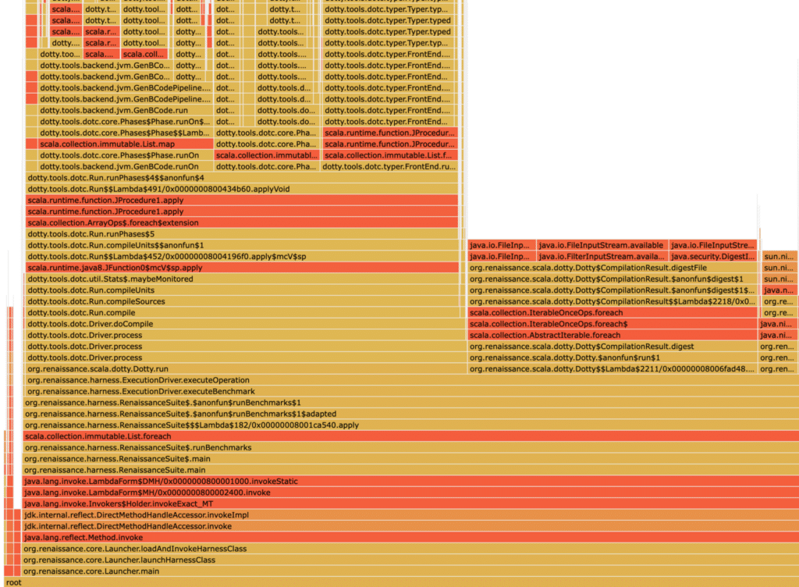

A few months back, I started writing a profiler from scratch, and the code since became the base of my profiler validation tools.

The only problem with this project: I wanted to write a proper non-safepoint-biased profiler from scratch.

This is a noble effort, but it requires lots C/C++/Unix programming which is finicky, and not everyone can read C/C++ code.

***For people unfamiliar with safepoint bias: A safepoint is a point in time where the JVM has a known defined state, and all threads have stopped. The JVM itself needs safepoints to do major garbage collections, Class definitions, method deoptimizations, and more. Threads are regularly checking whether they should get into a safepoint, for example, at method entry, exit, or loop backjumps. A profiler that only profiles at a safepoint have an inherent bias because it only includes frames from the locations inside methods where Threads check for a safepoint. The only advantage is that the stack-walking at safepoints is slightly less error-prone, as there are fewer mutations of heap and stack.* *For more information, consider reading the excellent article [Java Safepoint and Async Profiling](https://seethawenner.medium.com/java-safepoint-and-async-profiling-cdce0818cd29) by Seetha Wenner, the [more technical one by JP Bempel](http://Why%20JVM%20modern%20profilers%20are%20still%20safepoint%20biased?), or the classic article [Safepoints: Meaning, Side Effects and Overheads](http://psy-lob-saw.blogspot.com/2015/12/safepoints.html) by Nitsan Wakart. To conclude: Safepoint-biased profilers don't give you a holistic view of your application, but can still be helpful to analyze major performance issues where you look at the bigger picture.***

This article aims to develop a tiny Java profiler in pure Java code that everyone can understand.

Profilers are not rocket science, and ignoring safepoint-bias, we can write a usable profiler that outputs a flame graph in just 240 lines of code.

You can find the whole project on [GitHub](https://github.com/parttimenerd/tiny-profiler). Feel free to use it as a base for your adventures.

We implement the profiler in a daemon thread started by a Java agent. This allows us to start and run the profiler alongside the Java program we want to profile. The main parts of the profiler are:

* Main: Entry point of the Java agent and starter of the profiling thread
* Options: Parses and stores the agent options
* Profiler: Contains the profiling loop
* Store: Stores and outputs the collected results

## Main Class

We start by implementing the agent entry points:

```java
public class Main {
    public static void agentmain(String agentArgs) {
        premain(agentArgs);
    }

    public static void premain(String agentArgs) {
        Main main = new Main();
        main.run(new Options(agentArgs));
    }

    private void run(Options options) {
        Thread t = new Thread(new Profiler(options));
        t.setDaemon(true);
        t.setName("Profiler");
        t.start();
    }
}
```

The `premain` is called when the agent is attached to the JVM at the start.

This is typical because the user passed the `-javagent` to the JVM.

In our example, this means that the user runs Java with

```bash
java -javaagent:./target/tiny_profiler.jar=agentArgs ...
```

But there is also the possibility that the user attaches the agent at runtime. In this case, the JVM calls the method `agentmain`.

To learn more about Java agent, visit the [JDK documentation](https://docs.oracle.com/en/java/javase/17/docs/api/java.instrument/java/lang/instrument/package-summary.html).

Please be aware that we have to set the `Premain-Class` and the `Agent-Class` attributes in the MANIFEST file of our resulting JAR file.

Our Java agent parses the agent arguments to get the options. The options are modeled and parsed by the Options class:

```java
public class Options {
    /** interval option */
    private Duration interval = Duration.ofMillis(10);

    /** flamegraph option */
    private Optional<Path> flamePath;

    /** table option */
    private boolean printMethodTable = true;
    ...
}
```

The exciting part of the Main class is its run method. The Profiler class implements the Runnable interface so that we can create a thread directly:

```java
Thread t = new Thread(new Profiler(options));
```

We then mark the profiler thread as a daemon thread; this means that the JVM does terminate at the end of the profiled application even when the profiler thread is running:

```java
t.setDaemon(true);
```

No, we're almost finished; we only have to start the thread. Before we do this, we name the thread, this is not required, but it makes debugging easier.

```java
t.setName("Profiler");
t.start();
```

## Profiler Class

The actual sampling takes place in the Profiler class:

```java
public class Profiler implements Runnable {
    private final Options options;
    private final Store store;

    public Profiler(Options options) {
        this.options = options;
        this.store = new Store(options.getFlamePath());
        Runtime.getRuntime().addShutdownHook(new Thread(this::onEnd));
    }

    private static void sleep(Duration duration) {
        // ...
    }

    @Override
    public void run() {
        while (true) {
            Duration start = Duration.ofNanos(System.nanoTime());
            sample();
            Duration duration = Duration.ofNanos(System.nanoTime())
                                        .minus(start);
            Duration sleep = options.getInterval().minus(duration);
            sleep(sleep);
        }
    }

    private void sample() {
        Thread.getAllStackTraces().forEach(
          (thread, stackTraceElements) -> {
            if (!thread.isDaemon()) { 
                // exclude daemon threads
                store.addSample(stackTraceElements);
            }
        });
    }

    private void onEnd() {
        if (options.printMethodTable()) {
            store.printMethodTable();
        }
        store.storeFlameGraphIfNeeded();
    }
```

We start by looking at the constructor. The interesting part is

```java
Runtime.getRuntime().addShutdownHook(new Thread(this::onEnd));
```

which causes the JVM to call the `Profiler::onEnd` when it shuts down.

This is important as the profiler thread is silently aborted, and we still want to print the captured results.

You can read more on shutdown hooks in the [Java documentation](https://docs.oracle.com/en/java/javase/17/docs/api/java.base/java/lang/Runtime.html#addShutdownHook(java.lang.Thread)).

After this, we take a look at the profiling loop in the `run` method:

```java
while (true) {
    Duration start = Duration.ofNanos(System.nanoTime());
    sample();
    Duration duration = Duration.ofNanos(System.nanoTime())
                                .minus(start);
    Duration sleep = options.getInterval().minus(duration);
    sleep(sleep);
}
```

This calls the `sample` method and sleeps the required time afterward, to ensure that the `sample` method is called every `interval` (typically 10 ms).

The core sampling takes place in this `sample` method:

```
Thread.getAllStackTraces().forEach(
  (thread, stackTraceElements) -> {
    if (!thread.isDaemon()) { 
        // exclude daemon threads
        store.addSample(stackTraceElements);
    }
});
```

We use here the `Thread::getAllStackTraces` method to obtain the stack traces of all threads. This triggers a safepoint and is why this profiler is safepoint-biased.

Taking the stack traces of a subset of threads would not make sense, as there is no method in the JDK for this.

Calling Thread::getStackTrace on a subset of threads would trigger many safepoints, not just one, resulting in a more significant performance penalty than obtaining the traces for all threads.

The result of `Thread::getAllStackTraces` is filtered so that we don't include daemon threads (like the Profiler thread or unused Fork-Join-Pool threads).

We pass the appropriate traces to the Store, which deals with the post-processing.

## Store Class

This is the last class of this profiler and also the by far most significant, post-processing, storing, and outputting of the collected information:

```java
package me.bechberger;

import java.io.BufferedOutputStream;
import java.io.OutputStream;
import java.io.PrintStream;
import java.nio.file.Path;
import java.util.HashMap;
import java.util.List;
import java.util.Map;
import java.util.Optional;
import java.util.stream.Stream;

/**
 * store of the traces
 */
public class Store {

    /** too large and browsers can't display it anymore */
    private final int MAX_FLAMEGRAPH_DEPTH = 100;

    private static class Node {
        // ...
    }

    private final Optional<Path> flamePath;
    private final Map<String, Long> methodOnTopSampleCount = 
        new HashMap<>();
    private final Map<String, Long> methodSampleCount = 
        new HashMap<>();

    private long totalSampleCount = 0;

    /**
     * trace tree node, only populated if flamePath is present
     */
    private final Node rootNode = new Node("root");

    public Store(Optional<Path> flamePath) {
        this.flamePath = flamePath;
    }

    private String flattenStackTraceElement(
      StackTraceElement stackTraceElement) {
        // call intern to safe some memory
        return (stackTraceElement.getClassName() + "." + 
            stackTraceElement.getMethodName()).intern();
    }

    private void updateMethodTables(String method, boolean onTop) {
        methodSampleCount.put(method, 
            methodSampleCount.getOrDefault(method, 0L) + 1);
        if (onTop) {
            methodOnTopSampleCount.put(method, 
                methodOnTopSampleCount.getOrDefault(method, 0L) + 1);
        }
    }

    private void updateMethodTables(List<String> trace) {
        for (int i = 0; i < trace.size(); i++) {
            String method = trace.get(i);
            updateMethodTables(method, i == 0);
        }
    }

    public void addSample(StackTraceElement[] stackTraceElements) {
        List<String> trace = 
            Stream.of(stackTraceElements)
                   .map(this::flattenStackTraceElement)
                   .toList();
        updateMethodTables(trace);
        if (flamePath.isPresent()) {
            rootNode.addTrace(trace);
        }
        totalSampleCount++;
    }

    // the only reason this requires Java 17 :P
    private record MethodTableEntry(
        String method, 
        long sampleCount, 
        long onTopSampleCount) {
    }

    private void printMethodTable(PrintStream s, 
      List<MethodTableEntry> sortedEntries) {
        // ...
    }

    public void printMethodTable() {
        // sort methods by sample count
        // the print a table
        // ...
    }

    public void storeFlameGraphIfNeeded() {
        // ...
    }
}
```

The Profiler calls the `addSample` method which flattens the stack trace elements and stores them in the trace tree (for the flame graph) and counts the traces that any method is part of.

The interesting part is the trace tree modeled by the Node class.

The idea is that every trace `A -> B -> C` (`A` calls `B`, `B` calls `C`, `[C, B, A]`) when returned by the JVM) can be represented as a root node with a child node `A` with child `B` with child `C`, so that every captured trace is a path from the root node to a leaf. We count how many times a node is part of the trace.

This can then be used to output the tree data structure for [d3-flame-graph](https://github.com/spiermar/d3-flame-graph) which we use to create nice flamegraphs like:
 Flame graph produced by the profiler for the renaissance dotty benchmark

Keep in my mind that the actual Node class is as follows:

```java
private static class Node {                                                                                                                                                                                              
    private final String method;                                                                                                                                                                                         
    private final Map<String, Node> children = new HashMap<>();                                                                                                                                                          
    private long samples = 0;                                                                                                                                                                                            

    public Node(String method) {                                                                                                                                                                                         
        this.method = method;                                                                                                                                                                                            
    }                                                                                                                                                                                                                    

    private Node getChild(String method) {                                                                                                                                                                               
        return children.computeIfAbsent(method, Node::new);                                                                                                                                                              
    }                                                                                                                                                                                                                    

    private void addTrace(List<String> trace, int end) {                                                                                                                                                                 
        samples++;                                                                                                                                                                                                       
        if (end > 0) {                                                                                                                                                                                      
            getChild(trace.get(end)).addTrace(trace, end - 1);                                                                                                                                                           
        }                                                                                                                                                                                                                
    }                                                                                                                                                                                                                    

    public void addTrace(List<String> trace) {                                                                                                                                                                           
        addTrace(trace, trace.size() - 1);                                                                                                                                                                               
    }                                                                                                                                                                                                                    

    /**                                                                                                                                                                                                                  
     * Write in d3-flamegraph format                                                                                                                                                                                     
     */                                                                                                                                                                                                                  
    private void writeAsJson(PrintStream s, int maxDepth) {                                                                                                                                                              
        s.printf("{ \"name\": \"%s\", \"value\": %d, \"children\": [", 
                 method, samples);                                                                                                                                 
        if (maxDepth > 1) {                                                                                                                                                                                              
            for (Node child : children.values()) {                                                                                                                                                                       
                child.writeAsJson(s, maxDepth - 1);                                                                                                                                                                      
                s.print(",");                                                                                                                                                                                            
            }                                                                                                                                                                                                            
        }                                                                                                                                                                                                                
        s.print("]}");                                                                                                                                                                                                   
    }                                                                                                                                                                                                                    

    public void writeAsHTML(PrintStream s, int maxDepth) {                                                                                                                                                               
        s.print("""                                                                                                                                                                                                      
                <head>                                                                                                                                                                                                   
                  <link rel="stylesheet" 
                   type="text/css" 
                   href="https://cdn.jsdelivr.net/npm/<a href="/cdn-cgi/l/email-protection" class="__cf_email__" data-cfemail="395d0a145f5558545c145e4b584951790d1708170a">[email protected]</a>/dist/d3-flamegraph.css">                                                                                
                </head>                                                                                                                                                                                                  
                <body>                                                                                                                                                                                                   
                  <div id="chart"></div>                                                                                                                                                                                 
                  <script type="text/javascript" 
                   src="https://d3js.org/d3.v7.js"></script>                                                                                                                               
                  <script type="text/javascript" 
                   src="https://cdn.jsdelivr.net/npm/<a href="/cdn-cgi/l/email-protection" class="__cf_email__" data-cfemail="25411608434944484008425744554d65110b140b16">[email protected]</a>/dist/d3-flamegraph.min.js"></script>                                                                             
                  <script type="text/javascript">                                                                                                                                                                        
                  var chart = flamegraph().width(window.innerWidth);                                                                                                                                                     
                  d3.select("#chart").datum(""");                                                                                                                                                                        
        writeAsJson(s, maxDepth);                                                                                                                                                                                        
        s.print("""                                                                                                                                                                                                      
                ).call(chart);                                                                                                                                                                                           
                  window.onresize = 
                      () => chart.width(window.innerWidth);                                                                                                                                                
                  </script>                                                                                                                                                                                              
                </body>                                                                                                                                                                                                  
                """);                                                                                                                                                                                                    
    }                                                                                                                                                                                                                    
}
```

## Tiny-Profiler

I named the final profiler tiny-profiler and its sources are on [GitHub](https://github.com/parttimenerd/tiny-profiler) (MIT licensed).

The profiler should work on any platform with a JDK 17 or newer. The usage is fairly simple:

```bash
# build it
mvn package

# run your program and print the table of methods sorted by their sample count
# and the flame graph, taking a sample every 10ms
java -javaagent:target/tiny-profiler.jar=flamegraph=flame.html ...
```

You can easily run it on the renaissance benchmark and create the flame graph shown earlier:

```bash
# download a benchmark
> test -e renaissance.jar || wget https://github.com/renaissance-benchmarks/renaissance/releases/download/v0.14.2/renaissance-gpl-0.14.2.jar -O renaissance.jar

> java -javaagent:./target/tiny_profiler.jar=flamegraph=flame.html -jar renaissance.jar dotty
...
===== method table ======
Total samples: 11217
Method                                      Samples Percentage  On top Percentage
dotty.tools.dotc.typer.Typer.typed            59499     530.44       2       0.02
dotty.tools.dotc.typer.Typer.typedUnadapted   31050     276.81       7       0.06
scala.runtime.function.JProcedure1.apply      24283     216.48      13       0.12
dotty.tools.dotc.Driver.process               19012     169.49       0       0.00
dotty.tools.dotc.typer.Typer.typedUnnamed$1   18774     167.37       7       0.06
dotty.tools.dotc.typer.Typer.typedExpr        18072     161.11       0       0.00
scala.collection.immutable.List.foreach       16271     145.06       3       0.03
...
```

The overhead for this example is around 2% on my MacBook Pro 13" for a 10ms interval, which makes the profiler usable when you ignore the safepoint-bias.

## Conclusion

Writing a Java profiler in 240 lines of pure Java is possible and the resulting profiler could even be used to analyze performance problems.

This profiler is not designed to replace real profilers like async-profiler, but it demystifies the inner workings of simple profilers.

I hope you enjoyed this code-heavy blog post. As always I'm happy for any feedback, issue, or PR.

***This article is part of my work in the [SapMachine](https://sapmachine.io/) team at [SAP](https://sap.com), making profiling easier for everyone.* *This article first appeared on my personal blog [mostlynerdless.de](https://mostlynerdless.de/blog/2022/11/21/ap-loader-a-new-way-to-use-and-embed-async-profiler/).* *Significant parts of this post have been written below the English channel*...**
