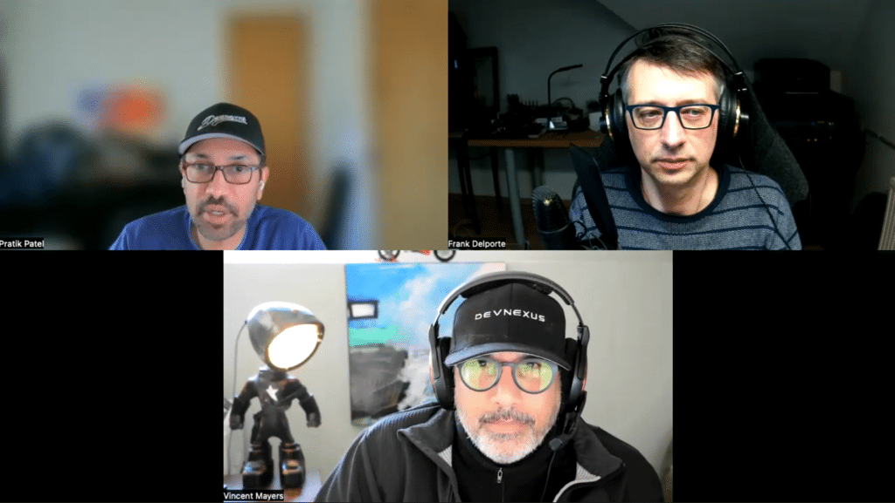

The Foojay Podcast Java User Group World Tour has already brought us to the UK, US, Dubai, and Japan.

Today we travel back to the US to learn more about the Atlanta JUG, mainly because this week, they are organizing the DevNexus conference!

Let's learn about the challenges of organizing both a Java User Group and an entire conference…



## Podcast Apps

You can listen and subscribe to the Foojay Podcast on:

* [Spotify](https://open.spotify.com/show/6CpTfgn9LirzJGAtc4ICdQ)
* [Apple Podcasts](https://podcasts.apple.com/be/podcast/foojay-io-the-friends-of-openjdk/id1652281304)
* And most others...

## Guests

* Pratik Patel
  * <https://twitter.com/prpatel>
  * [https://www.linkedin.com/in/prpatel/](https://www.linkedin.com/in/prpatel/%20)
  * Lead Dev Rel at Azul
* Vincent Mayers
  * <https://twitter.com/vincentmayers>
  * [https://www.linkedin.com/in/vincentmayers/](https://www.linkedin.com/in/vincentmayers/%20)
  * Dev Community at Gradle

## Podcast host

* Frank Delporte
  * <https://twitter.com/FrankDelporte>
  * <https://foojay.social/@frankdelporte>

## Links

* Atlanta JUG
  * <https://ajug.org/>
  * <https://twitter.com/atlantajug>
* DevNexus
  * 4-6th of April 2023, Atlanta US
  * [https://devnexus.org/](https://devnexus.org/%20)

## Content

* 00'00 Intro
* 00'36 Introduction of the guests
* 01'37 How the Atlanta JUG started
  * NYJavaSIG: <https://www.javasig.com/>
* 03'17 Why the guests joined the Atlanta JUG and became organizers
* 04'39 Impact of Covid
* 05'39 Venue is a hotel or co-working space
* 06'34 Atlanta JUG is a US non-profit
  * <https://sessionize.com/s/vincentmayers/the-jug-business-tips-n-tricks-for-running-an-amaz/51617>
* 10'22 Other people involved in the organization
* 12'27 Number of JUG visitors
* 14'04 Most remarkable sessions
* 16'35 Starting a JUG is "just do it", a formal structure is not a requirement, and how to find speakers
  * <https://jugs.groups.io/g/jug-leaders>
* 20'53 About DevNexus, how it started, the many tracks,…
  * <https://devnexus.com/presentations/beyond-rest-and-crud-integration-patterns-in-microservices>
  * [https://devnexus.com/presentations/patterns-predictions-and-prescriptions](https://devnexus.com/presentations/patterns-predictions-and-prescriptions)
  * [https://foojay.io/today/visualizing-brain-computer-interface-data-using-javafx/](https://foojay.io/today/visualizing-brain-computer-interface-data-using-javafx/)
  * [https://devnexus.org/presentations/observing-minecraft](https://devnexus.org/presentations/observing-minecraft%20)
* 42'17 Who is visiting DevNexus and Atlanta JUG
* 52'16 Outro
