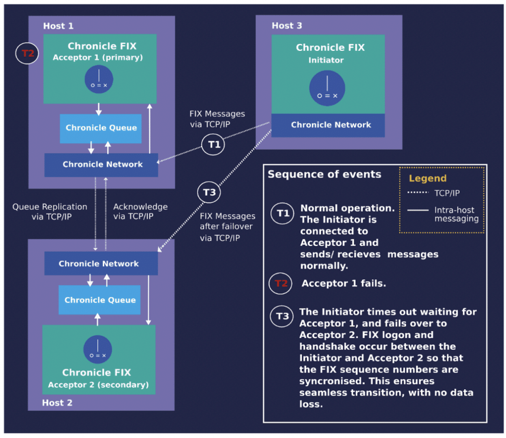

A high level of availability of IT services is crucial to prevent disruptions of service that can lead to financial losses, business opportunity losses, data loss, and reputational damage.

A business's downtime cost can vary depending on its size, nature and the length of the downtime.

Studies by Network Computing, the Meta Group, and Contingency Planning Research have identified financial services and telecommunications as industries with the highest revenue loss during downtime, demonstrating the importance of FIX engine high availability.

High availability is achieved in Chronicle FIX by failover, where workload is transferred from a primary engine to a secondary engine in the event of a primary engine failure.

Chronicle FIX failover provides rapid and efficient recovery of FIX sessions when a connection to the primary acceptor fails due to either the failure of the connection or the acceptor itself.

Following a failover to the secondary, an initiator continues exchanging messages with the secondary acceptor from the same state as it did with the primary.

This article reviews the high availability and failover solution in Chronicle FIX.

### Overview of the Solution

Figure 1. shows a high-level view of the Chronicle FIX failover mechanism and its components.

Outgoing messages and sequence numbers from the acceptor are logged in a Chronicle Queue and replicated to the secondary acceptor. In case of a connection failure, Chronicle Network automatically reconnects the initiator to the secondary acceptor.

Since the secondary acceptor already has the state of the failed session, it can continue to exchange messages with the initiator from the state before the failure.

  
*Figure 1. A high-level view of the Chronicle FIX failover mechanism and components*

As Figure 1. shows, all the necessary components for failover are provided natively by Chronicle Software.

As a result, the implementation of failover is integrated within the core products which helps keep configuration simple and is only a matter of setting the relevant configuration parameters.

#### Components

Following are the key components of the Chronicle FIX failover solution:

**Chronicle Queue:** A persisted low-latency message queue that operates with microsecond latency. It is designed for writing and reading large amounts of data in real-time for latency-critical applications.As a result, it is suitable for rapid Interprocess Communication (IPC) without adversely affecting system performance. In addition, it can replicate messages from a source queue to multiple sink queues on remote hosts using TCP/IP.Its role in the failover is to log the state of a session between an initiator and a primary acceptor and replicate this state to the secondary acceptor's queue, enabling the secondary to take over the message exchange with the initiator if the primary fails.

**Chronicle Network:**A Java library that -- similar to the java.net package -- supports the transport layer protocols TCP and UDP; however, it is over 60% faster than the standard Java library. It is designed to have the low latency and high throughput necessary for low latency trading systems.The library also provides mechanisms necessary for automatic failover, such as detecting connection failures and switching clients from a failed server to a backup server.The switchover offers several options as well as configurable parameters. In addition, the library's modular structure makes it possible to plug in customised switchover policies.

#### Mechanisms

Following are the mechanisms implemented by the above components to support failover:

**FIX log queue replication:** To take over the primary role after a connection failure between an initiator and a primary acceptor, a secondary acceptor needs to be informed of the session's state before the failure. The required information is provided by replicating the FIX log of the primary acceptor to the secondary acceptor's FIX log using Chronicle Queue replication.

The replication uses a replication acknowledgement strategy to determine if the replication of an outgoing message should be acknowledged by the secondary acceptor before the primary sends the message to the initiator. The strategy also specifies how long the primary acceptor should wait to receive the acknowledgement. The strategy is configurable; it can be set to the predefined strategies; NEVER_TIMES_OUT and WAIT_FOREVER_FOR_REPLICA_ACK; or a customised strategy. Acknowledgement strategies determine the tradeoff between consistency and availability, and the two predefined ones implement the two extremes.

Since NEVER_TIMES_OUT doesn't wait for replication acknowledgement from the secondary acceptor before replying to the initiator, the initiator always receives a response, thus compromising the consistency between the primary and secondary FIX log queues. This strategy offers optimal performance, but there is a risk of losing messages.

On the contrary, WAIT_FOREVER_FOR_REPLICA_ACK guarantees consistency between the primary and secondary FIX log queues at the cost of availability, since the primary acceptor does not reply to the initiator if it does not receive replication acknowledgement from the secondary.

Optionally, more sophisticated strategies can be implemented to balance consistency with availability for example the primary acceptor can wait only for a limited configurable time for replication acknowledgement.

**Connection Strategy:** All the details of how to establish a connection between an initiator and acceptors including timings, the number of attempts and detection of failed connections are defined in the property ConnectionStrategy implemented by the Chronicle Network library.For an initiator, a list of socket addresses of acceptors can be defined as backup acceptors.

Then ConnectionStrategy defines in what order the initiator tries to connect to the specified acceptor addresses, and how many connection attempts are made before that address is considered inaccessible.There are predefined connection strategies with the possibility to modify the parameters of each strategy including timings and the number of attempts to connect to a server.

In addition, if a different connection behaviour is required, it is possible to implement the required behaviour and plug it into the engine.

### Conclusion

Chronicle FIX offers a failover solution that is built based on native products, so the implementation is straightforward and just a matter of configuring a focused set of parameters such as IP address, cluster definitions, acknowledgement strategies.

As the required components were designed with an efficient failover in mind, they can provide optimal functionality.

A by-product of the native solution is benefiting from support on all components of the solution.

Additionally, the modular design of the components allows for customising the components to meet a broad range of requirements.

### References

[Chronicle FIX](https://chronicle.software/fix-engine/)  
[Chronicle Queue Enterprise](https://chronicle.software/queue-enterprise/ "Chronicle Queue Enterprise")  
[Chronicle Network](https://github.com/OpenHFT/Chronicle-Network "Chronicle Network")  
[Chronicle Network Layer -- Chronicle Software](https://chronicle.software/chronicle-network-layer/ "Chronicle Network Layer – Chronicle Software")
