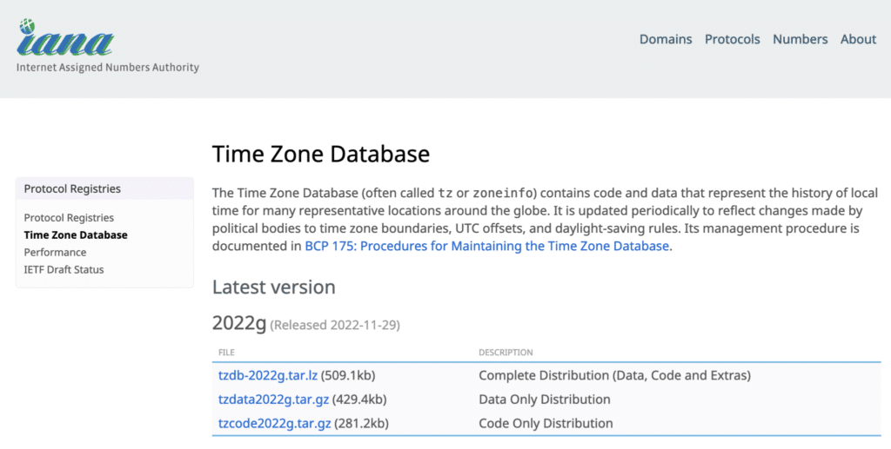
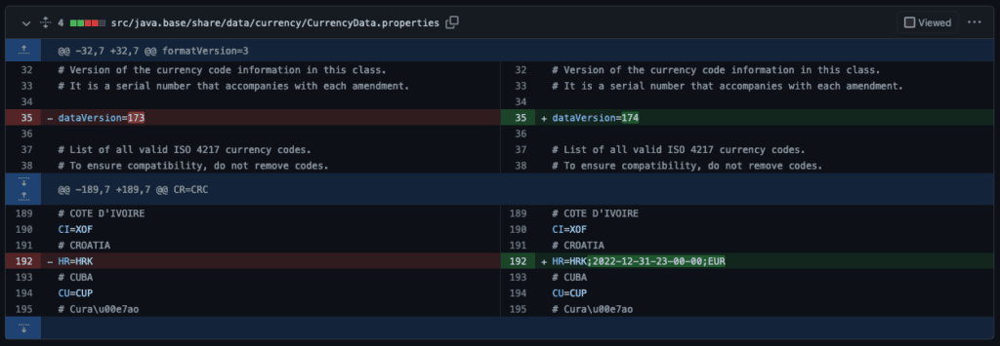

There is a saying that you aren't a real developer until you have done programming involving dates, times, daylight savings, and time zones.

Luckily the JDK contains multiple methods to assist you.

Related to this topic, it is essential to understand that each new JDK release includes a new version of the time zone and currency database.

As we will discover, you can get correct output by just switching to the most up-to-date version of Java -- without changing code!

For instance, the January 2023 release notes for Azul Zulu Builds of OpenJDK contain this note:

```
This release of Azul Zulu comes with IANA Time Zone Database version 2022g.
```


Why do we need a new version of the time zone and currency database every few months?

Let's find out...


Time Zone Database
------------------

Within the Java code, a whole list of time zones is defined. We can get this list quickly in jshell. The result below is truncated because it has 602 entries!

```
jshell> import java.time.ZoneId

jshell> ZoneId.getAvailableZoneIds()
$2 ==> [Asia/Aden, America/Cuiaba, Etc/GMT+9, Etc/GMT+8, Africa/Nairobi, America/Marigot, ..., Europe/Nicosia, Pacific/Guadalcanal, Europe/Athens, US/Pacific, Europe/Monaco]

jshell> ZoneId.getAvailableZoneIds().size()
$3 ==> 602
```


### Where are the Time Zones Managed?

The Java time zone information is based on the Time Zone Database of the [Internet Assigned Numbers Authority](https://www.iana.org/time-zones) (IANA).

The IANA announces changes via two different mailing lists, in which proposals for database updates are discussed.

If we look at the IANA website, we see precisely this version **2022g** that was included in the January release notes of Zulu.


In Java, the ZoneRulesProvider provides access to this information. The JavaDoc of this class says: "*The Java virtual machine has a default provider that provides zone rules for the time-zones defined by IANA Time Zone Database (TZDB).* " Another vital aspect described in the JavaDoc: "*Time-zone rules are political, thus the data can change at any time. Each provider will provide the latest rules for each zone ID, but they may also provide the history of how the rules changed.*"

That history is actually essential if you want to find out the correct daylight savings timestamps from earlier years!


***IANA is an external third party with its own community that maintains the Time Zone Database. Based on this database, many other projects -- like OpenJDK -- keep their own database up-to-date by following the changes in IANA. Anyone can contribute or monitor changes via the [OpenJDK GitHub project](https://github.com/openjdk/jdk), so it's easy to check if all changes are applied. Within the OpenJDK project, these changes are backported to all active versions. Azul even goes a step further and goes back to version 6.***

**Dmitry Cherepanov and Andrew Brygin, Staff Software Engineers, Azul**


The database itself is defined in text files within the OpenJDK project, with a set of rules for each country. You can find [the rules on GitHub](https://github.com/openjdk/jdk/tree/master/src/java.base/share/data/tzdata).

These are actually fun to read, as they contain comments on why specific rules were added!

I live in Belgium, so when looking at the `europe` file, I found this history of one specific rule line for 1945 only, just as an illustration of how detailed this rule set actually is:

```
# Rule France 1945 only - Sep 16  3:00 0 -
# Rule Belgium 1945 only - Sep 16  2:00s 0 -
# Rule Neth 1945 only - Sep 16 2:00s 0 -
#
# The rule line to be changed is:
#
# Rule C-Eur 1945 only - Sep 16  2:00 0 -
#
# It seems that Paris, Monaco, Rule France, Rule Belgium all agree on
# 2:00 standard time, e.g. 3:00 local time.  However there are no
# countries that use C-Eur rules in September 1945, so the only items
# affected are apparently these fictitious zones that translate acronyms
# CET and MET:
#
# Zone CET  1:00 C-Eur CE%sT
# Zone MET  1:00 C-Eur ME%sT
#
# It this is right then the corrected version would look like:
#
# Rule C-Eur 1945 only - Sep 16  2:00s 0 -
#
# A small step for mankind though 8-)
Rule    C-Eur   1945    only    -   Sep 16   2:00s  0   -
Rule    C-Eur   1977    1980    -   Apr Sun>=1    2:00s  1:00    S
...
```


In the files `iso3166.tab` and `zone.tab`, the connection is made between the country rules and the time zones. This is the data for the same example country "Belgium":

```
iso3166.tab
BE  Belgium

zone.tab
BE  +5050+00420 Europe/Brussels
```


***Keeping the JDK in sync with the changes in the time zone database is a real team effort! These changes are not only implemented in the most recent version but are also backported to all other still-maintained versions. This means many people are involved from various companies and the OpenJDK community. To give you an idea of the work needed for such a change, take a look at the list of tickets and people who contributed to this [OpenJDK ticket JDK-8296108](https://bugs.openjdk.org/browse/JDK-8296108).***

**Yuri Nesterenko, Azul Senior Software Engineer, Azul**


### What Methods are Available?

Let's go back to `jshell` to find out what we can do with this time zone data.

First, we import all the time-related classes. Second, we define a `datetime` variable for the UTC (Universal Time Coordinated) time zone, which is the time based on the 0° longitude meridian, also known as the Greenwich Meridian.

Now we can get the value of this `datetime` for each time zone known to Java with `withZoneSameInstant`.

As you can see, in Belgium, I'm only 01:00 hour apart from the UTC zone and have difficulty meeting my colleagues in the US (-08:00) and India (+05:30) simultaneously.

Also, note that time zones don't always have an entire hour difference, as India has 5 and a half hours difference with UTC.

```
jshell> import java.time.*

jshell> var datetime = ZonedDateTime.of(2023, 1, 2, 12, 0, 0, 0, ZoneId.of("UTC"));
datetime ==> 2023-01-02T12:00Z[UTC]

jshell> datetime.withZoneSameInstant(ZoneId.of("Europe/Brussels"))
$3 ==> 2023-01-02T13:00+01:00[Europe/Brussels]

jshell> datetime.withZoneSameInstant(ZoneId.of("US/Pacific"))
$4 ==> 2023-01-02T04:00-08:00[US/Pacific]

jshell> datetime.withZoneSameInstant(ZoneId.of("Asia/Kolkata"))
$5 ==> 2023-01-02T17:30+05:30[Asia/Kolkata]
```


We can also work vice-versa, define a variable for a given time zone, and get the offsets compared to the UTC:

```
jshell> var datetime = ZonedDateTime.of(2023, 1, 2, 12, 0, 0, 0, ZoneId.of("US/Pacific"));
now ==> 2023-01-02T12:00-08:00[US/Pacific]

jshell> datetime.getOffset().getRules()
$7 ==> ZoneRules[currentStandardOffset=-08:00]

jshell> datetime.getOffset().getTotalSeconds()
$8 ==> -28800

jshell> datetime.getOffset()
$9 ==> -08:00
```


Within the rules files, the daylight saving change dates are also included. Let's see how we can retrieve some of that information.

For example, for Belgium again, to find the first daylight saving change in 2023 (changing to summer time) and the second one (changing back to winter time):

```
jshell> var datetime = ZonedDateTime.of(2023, 3, 1, 0, 0, 0, 0, ZoneId.of("Europe/Brussels"));
datetime ==> 2023-03-01T00:00+01:00[Europe/Brussels]

jshell> ZoneId.of("Europe/Brussels").getRules().nextTransition(datetime.toInstant())
$13 ==> Transition[Gap at 2023-03-26T02:00+01:00 to +02:00]

jshell> ZoneId.of("Europe/Brussels").getRules().nextTransition(datetime.plusMonths(6).toInstant())
$14 ==> Transition[Overlap at 2023-10-29T03:00+02:00 to +01:00]
```


***These changes may seem to be trivial, but they sometimes have a very big impact on the OpenJDK project. An excellent example is [JDK-8284840](https://bugs.openjdk.org/browse/JDK-8284840), to upgrade the Unicode Common Locale Data Repository (CLDR) data in the JDK to version 42. This CLDR provides critical building blocks for software to support the world's languages. The pull request to achieve this Unicode compatibility includes changes in 377 files, as seen [in this commit](https://github.com/openjdk/jdk/commit/5b3de6e143e370272c36383adac3e31f359bc686). Luckily these kinds of significant changes usually happen only once in a feature release and are never backported as a whole to earlier versions. This differs from time zone updates, which may occur rather often and always get integrated into update releases.***

***Sometimes small changes have a huge impact...***

**Yuri Nesterenko, Senior Software Engineer, Azul**


### Update the Timezone Database Separately

The ZIUpdater tool provided by Azul is a solution if you can't update the Java runtime to keep track of changes in the timezone database.

It works as a JAR file utility that operates against the Java installation of the JRE that invokes it. It compiles tzdata source information into binary files and puts them into the Java installation directory.

More information is available on:

* Azul website: [ZIUpdater Time Zone Tool](https://www.azul.com/products/components/ziupdater-time-zone-tool/)
* Azul docs: [Timezone Updater](https://docs.azul.com/core/timezone-updater)

Also Changing Between Releases: Currency Data
---------------------------------------------

The data directory in the OpenJDK sources contains another file that can change between versions: `CurrencyData.properties`[. The January 2023 release notes of Azul Zulu Builds of OpenJDK](https://docs.azul.com/core/zulu-openjdk/release-notes/january-2023#whats-new) lists the following changes, which align this properties file with ISO-related changes regarding the codes for historic denominations of currencies and funds.

* [JDK-8289549](https://bugs.openjdk.java.net/browse/JDK-8289549): ISO 4217 Amendment 172 Update, 1 October 2022: changes in entity SIERRA LEONE.
* [JDK-8294307](https://bugs.openjdk.java.net/browse/JDK-8294307): ISO 4217 Amendment 173 Update, 23 September 2022: renaming of TÜRKİYE.
* [JDK-8296239](https://bugs.openjdk.java.net/browse/JDK-8296239): ISO 4217 Amendment 174 Update, 02 November 2022: currency changes for CROATIA.

The third one is caused by Croatia joining the group of countries where the EURO is used as the currency. We can see this is reflected in the changes in [this pull request](https://github.com/openjdk/jdk/pull/10994/files):


### Code Examples of Currency Usage

With `jshell` we can again do some experiments to check these changes for Croatia, with country code `HR`.

```
jshell
|  Welcome to JShell -- Version 19.0.1
|  For an introduction type: /help intro

jshell> var currency = Currency.getInstance(new Locale("EN", "HR"))
currency ==> HRK

jshell> currency.getCurrencyCode()
$2 ==> "HRK"

jshell> currency.getDisplayName()
$3 ==> "Croatian Kuna"

jshell> currency.getSymbol()
$4 ==> "HRK"
```


When I wrote this post in January 2023, this didn't seem to align with the changes we saw in the screenshot above, as Croatia changed from HRK to EUR! Let's check the Java version...

```
$ java -version
openjdk version "19.0.1" 2022-10-18
OpenJDK Runtime Environment Zulu19.30+11-CA (build 19.0.1+10)
OpenJDK 64-Bit Server VM Zulu19.30+11-CA (build 19.0.1+10, mixed mode, sharing)
```


Let's change to the latest Java 19 version, released later in January, and check the same code...

```
$ sdk install java 19.0.2-zulu

$ java -version
openjdk version "19.0.2" 2023-01-17
OpenJDK Runtime Environment Zulu19.32+13-CA (build 19.0.2+7)
OpenJDK 64-Bit Server VM Zulu19.32+13-CA (build 19.0.2+7, mixed mode, sharing)

$ jshell
|  Welcome to JShell -- Version 19.0.2
|  For an introduction type: /help intro

jshell> var currency = Currency.getInstance(new Locale("EN", "HR"))
currency ==> EUR

jshell> currency.getCurrencyCode()
$2 ==> "EUR"

jshell> currency.getDisplayName()
$3 ==> "Euro"

jshell> currency.getSymbol()
$4 ==> "€"
```


Isn't that impressive? The same code now gives the correct output by just switching to the most up-to-date version of Java!

Conclusion
----------

Time zone, daylight savings, and currencies are not only a problem for programmers.

As with every daylight saving change, a new discussion pops up to end them once and for all.

But by keeping your Java runtime up-to-date, you are assured that your program will use the correct date, times, and other settings, as you will always use the correct time zone and currency database included in the Java runtime!

**Sidenote**: if currencies and daylight savings are part of your unit tests, test results can differ depending on the Java version you are using! Something to keep in mind when writing such tests...

And ... in case you still have `jshell` open in your terminal and want to get out of it, `/exit` is the command you are looking for!

```
jshell> /exit
|  Goodbye
```

