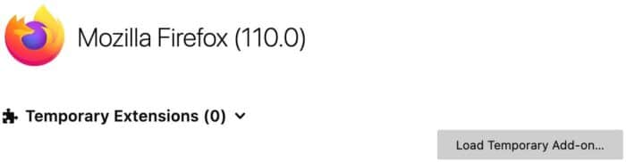
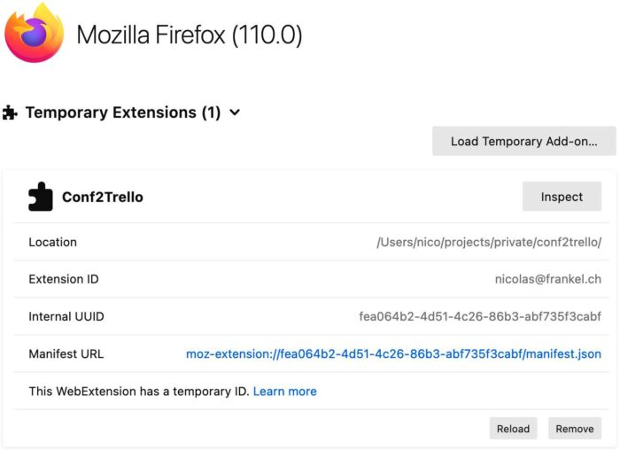
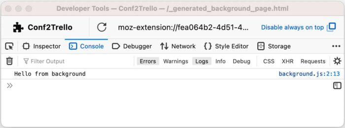
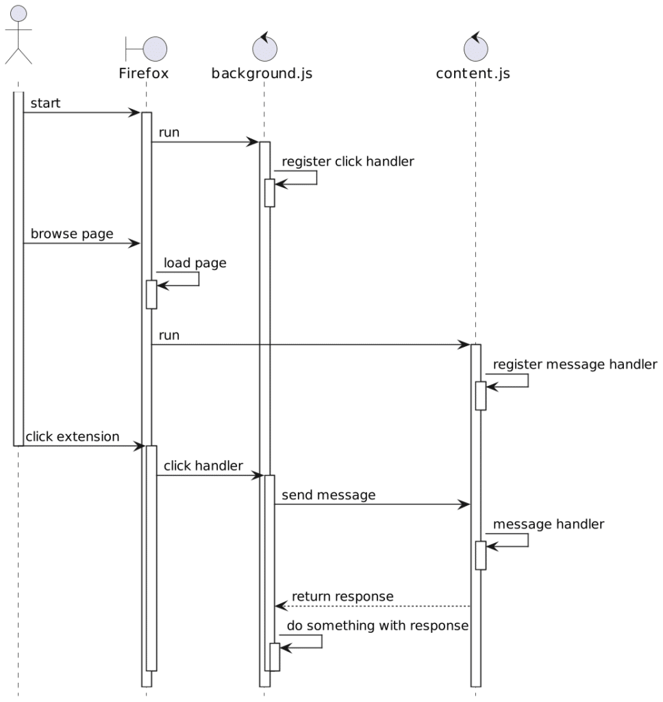
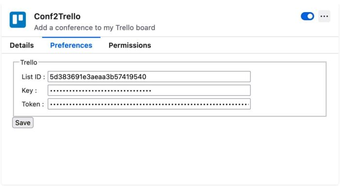
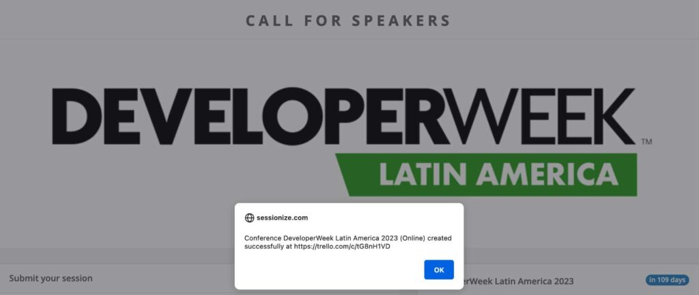

A couple of weeks ago, I spent the weekend creating another submission helper in the form of a Firefox extension.

It was not a walk in the park.

To help others who may be interested in doing the same (and my future self), here's my journey!

Context {#h2-0-context}
-----------------------

I've written multiple posts about my [conference submission workflow](https://blog.frankel.ch/automating-conference-submission-workflow/).

To sum up:

* Everything is based on a Trello board
* I created an app that registered a webhook on the board
* When I move a conference from one lane to another, it starts or continues a workflow on the app side

I source the board by looking at websites, mainly [Papercall](https://www.papercall.io/events?cfps-scope=open&amp;keywords=) and [Sessionize](https://sessionize.com/), and manually copying conference data on cards. Two automation options are available:

1. Automating conference sourcing
2. Automating a card creation

I thought long and hard about the first part. If I automate it, it will create a long list of Trello cards, which I'll need to filter anyway. I concluded that it's better to filter them before.

However, I created the card manually by copy-pasting relevant data: name, dates, due date, CFP link, and website. It's precisely what a Firefox extension can help one with.

Requirements and design {#h2-1-requirements-and-design}
-------------------------------------------------------

The user story is pretty straightforward:
> AS A: Lazy developer  
>
> I WANT TO: Automatically add CFP data on Trello while browsing a web page on Papercall or Sessionize  
>
> SO AS: To spend my time doing more fun stuff than copy-paste
>
> -- My single user story

My only requirement is that it needs to work with Firefox.

My first idea is a button to trigger the creation, but I don't care much where it is: inside the page as an overlay or somewhere on the browser. In the first case, it should be a JavaScript injected client-side; on the other, a Firefox extension.

I chose the second option because I needed to figure out how to achieve the first.

I also wanted first to create my extension in Rust with WebAssembly. Spoiler: I didn't.

A simple Firefox extension {#h2-2-a-simple-firefox-extension}
-------------------------------------------------------------

I had no clue about writing a Firefox extension, as this was the first time I did write one. My first step was to follow the [tutorial](https://developer.mozilla.org/en-US/docs/Mozilla/Add-ons/WebExtensions/Your_first_WebExtension). It explains the basics of an extension structure. Then, I followed the [second tutorial](https://developer.mozilla.org/en-US/docs/Mozilla/Add-ons/WebExtensions/Your_second_WebExtension). It explains how to create a pop-up menu for the extension but not how to interact with the web page. At this point, I decided to learn by doing, a technique that works well for me.

A Firefox extension starts with a [manifest](https://developer.mozilla.org/en-US/docs/Mozilla/Add-ons/WebExtensions/manifest.json). Here's the one from the first tutorial, simplified:

<pre class="EnlighterJSRAW" data-enlighter-language="json">{
  "manifest_version": 2,
  "name": "Borderify",
  "version": "1.0",
  "content_scripts": [
    {
      "js": ["borderify.js"]
    }
  ]
}</pre>

<pre class="EnlighterJSRAW" data-enlighter-language="js">document.body.style.border = '5px solid red';</pre>

I found the development feedback loop good. Imagine that you have followed the tutorial and created all the necessary files above. You can go to and click on the "Load Temporary Add-on" button.

 

Then, point to your manifest file. Firefox loads the extension: it's now active.

 

In the above example, the JavaScript from the tutorial adds a red border around every web page. It's useless, we can do better, but it shows how it works. We can change the script to change the color, *e.g.* , from `red` to `green`. To make Firefox reload **any change**, including changes to the manifest, click on the "Reload" button on the temporary extension panel.

Interacting with the extension {#h2-3-interacting-with-the-extension}
---------------------------------------------------------------------

As I mentioned above, I want a button to trigger the creation of the Trello Card. Firefox allows multiple interaction options: direct trigger or opening of a pop-up window. I don't need to enter any parameter, so the former is enough in my case.

Firefox allows multiple places to add buttons: the browser's toolbar, a sidebar, or inside the browser's URL bar. I used the toolbar for no reason than because it was what the second tutorial demoed. Ultimately, it only changes a little, and moving from one to another is easy.

Adding the button takes place in the manifest:

<pre class="EnlighterJSRAW" data-enlighter-language="json">"browser_action": {
  "default_area": "navbar",                            #1
  "default_icon": "icons/trello-tile.svg"              #2
}</pre>

1. Set the button on the navigation bar. For more details on the button location, please check the [documentation](https://developer.mozilla.org/en-US/docs/Mozilla/Add-ons/WebExtensions/manifest.json/browser_action)
2. Configure the icon. One can use bitmaps in different formats, but it's so much easier to set an SVG

At this point, everything was fine and dandy. Afterward, I lost many hours trying to understand the different kinds of scripts and how they interact. I'll make it a dedicated section.

Scripts, scripts everywhere {#h2-4-scripts-scripts-everywhere}
--------------------------------------------------------------

The default language for scripts in extensions is JavaScript. However, depending on their location, they play different roles. Worse, they need to "talk" with one another.

Let's start with the `content-script` I used in the above `manifest.json`. Content scripts are bound to a web page. As such, they can access its DOM. They run when Firefox loads the page. The script adds a red border around the web page's `body` in the tutorial.

However, we need another kind of script: one to trigger when we click on the button. Such scripts should run along with the extension but can listen to events. They are known as `background` scripts.
> Background scripts are the place to put code that needs to maintain long-term state, or perform long-term operations, independently of the lifetime of any particular web pages or browser windows.
>
> Background scripts are loaded as soon as the extension is loaded and stay loaded until the extension is disabled or uninstalled, unless persistent is specified as false. You can use any of the WebExtension APIs in the script, as long as you have requested the necessary permissions.
>
> -- [background scripts](https://developer.mozilla.org/en-US/docs/Mozilla/Add-ons/WebExtensions/manifest.json/background)

Let's create such a script. It starts with the `manifest` - as usual:

<pre class="EnlighterJSRAW" data-enlighter-language="json">"background": {
  "scripts": [ "background.js" ]
}</pre>

We can now create the script itself:

<pre class="EnlighterJSRAW" data-enlighter-language="js">function foo() {
    console.log('Hello from background')
}

browser.browserAction.onClicked.addListener(foo)    //1</pre>

1. Register the `foo` function as an event listener to the button. When one clicks the extension button, it calls the `foo` function

Debugging the extension {#h2-5-debugging-the-extension}
-------------------------------------------------------

Let's stop for a moment to talk about debugging. I lost several hours because I didn't know what had happened. When I started to develop JavaScript 20 years ago, we "debugged" with `alert()`. It was not the best developer experience you could hope for. More modern practices include *logging* and *debugging*. Spoiler: I didn't manage to get debugging working, so I'll focus on logging.

First things first, content scripts work in the context of the page. Hence, logging statements work in the regular console. Background scripts do work in another context. To watch their log statements, we need to have **another** Firefox developer console. You can open it on the extension panel by clicking the "Inspect" button.

 

Communication across scripts {#h2-6-communication-across-scripts}
-----------------------------------------------------------------

Now that we know how to log, it's possible to go further and describe communication across scripts. Here's an overview of the overall flow:

Let's change the code a bit so that `background.js` sends a message:

<pre class="EnlighterJSRAW" data-enlighter-language="js">function sendMessage(tab) {
    browser.tabs
           .sendMessage(tab.id, 'message in from background')
           .then(response =&gt; {
               console.log(response)
           })
           .catch(error =&gt; {
               console.error(`Error: ${error}`)
           })
}

browser.browserAction.onClicked.addListener(sendMessage)</pre>

Now, we change the code of `content.js`:

<pre class="EnlighterJSRAW" data-enlighter-language="js">browser.runtime.onMessage.addListener((message, sender) =&gt; {
    return Promise.resolve('message back from content')
});</pre>

Getting the content {#h2-7-getting-the-content}
-----------------------------------------------

So far, we have implemented a back-and-forth flow between the `background` and the `content` scripts. The meat is to get content from the page in the `content` script and pass it back to the `background` via a message. Remember that only the `content` script can access the page! The code itself uses the Document API, *e.g.* , `document.querySelector()`, `document.getElementsByClassName()`, etc. Specifics are unimportant.

The next issue is that the structure of Sessionize and Papercall are different. Hence, we need different scraping codes for each site. We could develop a single script that checks the URL, but the extensions can take care of it for us. Let's change the manifest:

<pre class="EnlighterJSRAW" data-enlighter-language="json">"content_scripts" : [{
  "matches": [ "https://sessionize.com/*" ],            #1
  "js": [                                               #2
    "content/common.js",                                #4
    "content/sessionize.js"
  ]
},
{
  "matches": [ "https://www.papercall.io/*" ],          #1
  "js": [                                               #3
    "content/common.js",                                #4
    "content/papercall.js"
  ]
}]</pre>

1. Match different sites
2. Scripts for Sessionize
3. Scripts for Papercall
4. Code shared on both sites

At this point, we managed to get the necessary data and send it back to the `background` script. The last step is to call Trello with the data.

Handling authentication credentials {#h2-8-handling-authentication-credentials}
-------------------------------------------------------------------------------

Using Trello's REST requires authentication credentials. I want to share the code on GitHub, so I cannot hard-code credentials: I need configuration.

We can configure a Firefox extension via a dedicated *options* page. To do so, the *manifest* offers a dedicated `options_ui` section where we can provide the path to the HTML page:

<pre class="EnlighterJSRAW" data-enlighter-language="json">"options_ui": {
  "page": "settings/options.html"
}</pre>

The page can directly reference the scripts and stylesheet it needs. The script needs to:

1. Store credentials in the *browser storage* on save
2. Load credentials from the *browser storage* when the settings page opens

It's pretty straightforward with the [provided example](https://github.com/mdn/webextensions-examples/blob/main/favourite-colour/options.js).

My code is quite similar; it just needs three fields instead of one:

<pre class="EnlighterJSRAW" data-enlighter-language="js">function saveOptions(e) {
    browser.storage.sync.set({                                               //1
        listId: document.querySelector('#list-id').value,
        key: document.querySelector('#key').value,
        token: document.querySelector('#token').value,
    })
}

function restoreOptions() {
    browser.storage.sync.get()                                               //1
           .then(data =&gt; {
               document.querySelector('#list-id').value = data.listId || ''
               document.querySelector('#key').value = data.key || ''
               document.querySelector('#token').value = data.token || ''
           }, error =&gt; {
               console.error(`Error: ${error}`)
           })
}

document.addEventListener('DOMContentLoaded', restoreOptions)                //2
document.querySelector('form').addEventListener('submit', saveOptions)       //3</pre>

1. Uses the Firefox `storage` API
2. Read from the storage when the page loads
3. Save to the storage when the user submits the HTML `form`

We also need to ask the `storage` permission in the manifest:

<pre class="EnlighterJSRAW" data-enlighter-language="json">"permissions": [ "storage" ]</pre>

We can now store the Trello credentials (as well as the required Trello list id) on the settings page:

 

We can use the same `storage` API in the Trello calling code to read credentials.

At this point, I was happy with my setup. I just added another round-trip from the `background` to the `content` to display an `alert` with Trello's card name and URL.

Conclusion {#h2-9-conclusion}
-----------------------------

It was the first extension I wrote, and though the beginning was challenging, I achieved what I wanted. Now, I can navigate to a Papercall and a Sessionize page, click the extension button, and get the conference on my Trello board. It took me a couple of days and was fun; it was well worth it. I continue working on it to improve it bit by bit.

The complete source code for this post can be found on [GitHub](https://github.com/nfrankel/conf2trello).

**To go further:**

* [Your first extension](https://developer.mozilla.org/en-US/docs/Mozilla/Add-ons/WebExtensions/Your_first_WebExtension)
* [Your second extension](https://developer.mozilla.org/en-US/docs/Mozilla/Add-ons/WebExtensions/Your_second_WebExtension)
* [Content scripts](https://developer.mozilla.org/en-US/docs/Mozilla/Add-ons/WebExtensions/Content_scripts)
* [Background scripts](https://developer.mozilla.org/en-US/docs/Mozilla/Add-ons/WebExtensions/Background_scripts)
* [manifest.json](https://developer.mozilla.org/en-US/docs/Mozilla/Add-ons/WebExtensions/manifest.json)
* [webextensions-examples](https://github.com/mdn/webextensions-examples)

*Originally published at [A Java Geek](https://blog.frankel.ch/firefox-extension/) on April 2^nd^, 2023*

*[CFP]: Call For Paper
