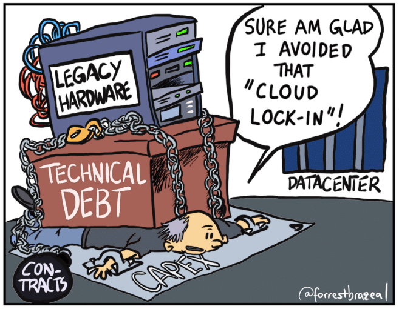

The old engineering adage: "don't touch it, it works". Is terrible. Don't listen to it. It might be OK at a small scale but as time goes by the bit rot spreads through your code and servers polluting everything.

Large swaths of your system become "no-man's-land". As you're developing a new system, you must always "touch it" and make sure we hire engineers who aren't afraid to do so.

Yes, I get it. I said that sentence frequently in the past. I understand the motivation. Management doesn't care about the bit rot in our future. They care about the here and now. Why are you wasting time on this feature?

It's working. Don't you have enough on your plate already?

Are you the Marie Kondo of coding? Does this code not spark joy?

It's more like a bad apple in a barrel. Bad code and forbidden zones tend to grow and metastasize. A living project needs to be fully accessible by the current team. It can keep working without that, but that makes every future step painful.

When we have a flexible team with a relatively small and familiar code base, touching everything isn't challenging. It's easy in that case.

The Legacy Project
------------------

The hard part is touching code in legacy projects. As a consultant, I had to do that often. How do you enter a project with a million lines of code and start refactoring?

The nice thing is that we're all alike. The engineers that built the project were trained with similar books and similar thought processes. Once you understand their logic you can understand why they did something. But a large part of the difficulty is in the tooling. Projects that were built 20 years ago used tools that are no longer available. The code might no longer compile on a modern IDE. Our immediate reflex would be to try to use an old IDE and old tooling.

That might be a mistake.

Old tools keep the stale bit rot. This is an opportunity. Revisit the project and update the tools. A few years ago I did some work for an older C++ codebase. I didn't understand the code base, but the original developers built it in an older version of Visual Studio.

Getting it to work on my Mac with LLVM and VS Code helped me visualize the moving pieces more clearly. Once I had a debugger up and running, fixing the bugs and weird issues became trivial. I can't say I fully understood that codebase. But the process of porting and updating the tools exposed me to many nuances and issues.

When You Can't
--------------

The flip side of that were cases where an existing legacy system is a customer requirement. I had to implement integrations with legacy systems that were external black boxes. We didn't need to touch their code, but we needed to interface with these systems and rely on their behaviors. This is a very challenging situation.

Our solution in those cases was to create a mock of the system so we can simulate and test various scenarios. In one such situation, we wrote an app that sent requests and saved responses from such a "black box" to create a simple recorder.

We then used the recordings as the basis for tests in our implementation. This might not be an option since sometimes, the black box is directly wired to production (directly to the stock market in one case).

My rules for dealing with such a black box are:

* A single isolated module handles all the connections - that way we can build uniform workarounds for failures. We can use a physically isolated microservice which is ideal for this specific case.
* Expose results using asynchronous calls - this prevents deadlocks and overloading a legacy system. We can use a queue to map causes of failure and error handling is simpler since a failure just won't invoke the result callback.
* We need to Code defensively. Use circuit breakers, logging and general observability tooling. Expect failure in every corner since this will be the most contentious part of the project.

Once we wrap that legacy we need to trigger alerts on the failures. Some failures might not bubble up to the user interface and might trigger retries that succeed. This can be a serious problem.

E.g., in a case of a stock market purchase command that fails a trader might press retry which will issue a new successful command. But the original command might retry implicitly in the legacy system and we can end up with two purchases.

Such mistakes can be very costly and originate from that black box. Without reviewing the legacy code fully and understanding it, we can make no guarantee. What we can do is respond promptly and accurately to failures of this type. Debuggability is important in these situations hence the importance of observability and isolation in such a black box.

Confidence Through Observability
--------------------------------

In the past, we used to watch the server logs whenever we pushed a new release. Waiting for user complaints to pour in. Thanks to observability we're the first to know about a problem in our production. Observability flipped the script.

Unfortunately, there's a wide chasm between knowing about a problem and understanding it, fixing it and noticing it. If we look at the observability console, we might notice an anomaly that highlights a problem but it might not trigger an alert even though a regression occurs. A good example of that would be a miscalculation. A change to the application logic can report wrong results and this is very unlikely to show in the observability data.

In theory, tests should have found that issue but tests are very good at verifying that things we predicted didn't happen. They don't check against unexpected bugs. E.g. We might allocate a field size for financial calculations and it worked great for our developers based in the USA. However, a customer in Japan working in Yen might have a far larger number and experience a regression because of that limit.

We can debug such issues with developer observability tools but when we deeply integrate legacy systems, we must apply the fail-fast principles deeply, that way the observability layer will know of the problem. We need to assert expectations and check for conditions not in the test, but in the production code. Here an actual error will be better than a stealthy bug.

A lot of focus has been given in languages to the non-null capabilities of languages. But the concepts pioneered in languages like Eiffel of design by contract have gone out of fashion. This is understandable, it's hard and awkward to write that sort of code. Checked exceptions are often the most hated feature of the Java language. Imagine having to write all the constraints you expect for every input.

Not to mention dependencies on the environmental state. This isn't tenable and enforcing this check-in runtime would be even more expensive. However, this is something we can consciously do in entry points to our module or microservice. The fail-fast principle is essential when integrating with legacy systems because of the unpredictable nature of the result.

Summary
-------

In the '90's I used to take a bus to my job.

Every day as I walked to the office I would pass by a bank machine and every time it would reboot as I came close.

This was probably part of their cycling policy, banks have a culture of rebooting machines on a schedule to avoid potential issues.

One morning I went by the machine and it didn't reboot.

I did what every good programmer/hacker would do; I pulled out my card and tried to use it.

It instantly rebooted and wouldn't take my card, but the fact that my instinct was to "try" is good.

Even if it isn't the smartest thing in the world, we need to keep code accessible and fresh.

Legacy code isn't a haunted house and we shouldn't be afraid.
