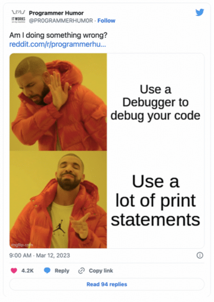
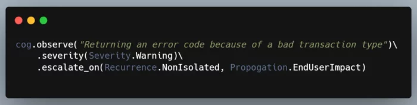
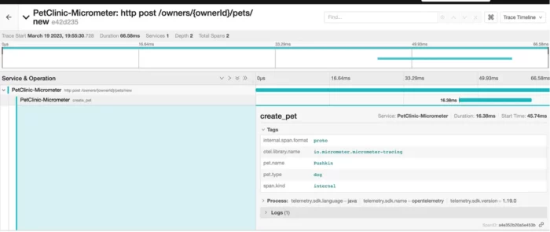

### How a Java library is taking a completely new approach to understanding what the code does, and why it makes perfect developer sense.

A while back, I [wrote](https://medium.com/gitconnected/breaking-the-fourth-wall-in-coding-189055955c85 "wrote") about the fact that logs need an overhaul, and that practices that were relevant when logs were still text messages in files may no longer be relevant in an age when logs traces and metrics are as artifacts and observations stored in cloud platforms.

We need a new metaphor, I argued, as traditional logging is prone to anti-patterns such as the infamous console.error('here!') message. A code smell that is indicative of the frameworks' inadequacies in understanding the evolving developers' needs, and a side product of the fact that most logging libraries closely couple verbosity with severity.

More generally speaking, they don't offer a good way to specify intent. As a result, the logs become muddled with debugging messages, excavation attempts, warnings, and notices, to the point where we actually need AI systems to try and make sense of our mess.

[](https://twitter.com/PR0GRAMMERHUM0R/status/1634902085228539905?ref_src=twsrc%5Etfw%7Ctwcamp%5Etweetembed%7Ctwterm%5E1634902085228539905%7Ctwgr%5E3f7b17a90d093b9c894fa7947b4e563a79dc5ad2%7Ctwcon%5Es1_&ref_url=https%3A%2F%2Fcdn.embedly.com%2Fwidgets%2Fmedia.html%3Ftype%3Dtext2Fhtmlkey%3Da19fcc184b9711e1b4764040d3dc5c07schema%3Dtwitterurl%3Dhttps3A%2F%2Ftwitter.com%2FPR0GRAMMERHUM0R%2Fstatus%2F16349020852285399053Fs3D20image%3Dhttps3A%2F%2Fi.embed.ly%2F1%2Fimage3Furl3Dhttps253A252F252Fabs.twimg.com252Ferrors252Flogo46x38.png26key3Da19fcc184b9711e1b4764040d3dc5c07 "")

Newer standards such as OTEL have introduced new ways by which to holistically view logging, tracing, and metrics. These seem to demand similar innovation in the verbs and metaphors we use in our code in using them.

What do we want to record? For which purpose? Are we tracking an object state? specific metrics? Or simply leaving something behind that may be relevant for a specific debugging session later if a certain condition happened later in the flow (say an exception occurred)?

#### A unique new approach

I was quite surprised to find that a Java library was already starting to implement a similar approach. In all of the commotion and flurry of OTEL projects, I stumbled into it almost by mistake.

The library is called [Micrometer](https://micrometer.io/ "Micrometer") and its approach to observability and tracing represents the beginning of that very next step I was looking for. An abstraction that will finally allow developers to turn observability constructs into first-class code citizens.

Let's take a look at a few examples! Here is how I originally imagined the future of observability back in my 2021 blog post on 'breaking the fourth wall':



While not quite in the same direction, here is how one might define observability in code using Micrometer:

```java
@PostMapping("/pets/new")
public String processCreationForm(Owner owner, @Valid Pet pet, BindingResult result, ModelMap model) {

  Observation observation = Observation.createNotStarted("create_pet", registry).start();
  try (Observation.Scope scope = observation.openScope()) {
    // only 2 names are valid (low cardinality)
    observation.lowCardinalityKeyValue("pet.type", pet.getType().getName());
    observation.highCardinalityKeyValue("pet.name", pet.getName());

    observation.event(Observation.Event.of("PetCreated"));

    //more logic

    this.owners.save(owner);
    return "redirect:/owners/{ownerId}";
  }

  catch (Exception exception) {

    observation.error(exception);
    throw exception;
  }
  finally {
    observation.stop();
  }

}
```

Let's dissect, what we see in the example above:

First, the developer can define an observation scope, and highlight the values that are needed to be tracked. A necessary step is to differentiate between values that tend to be highly unique (marked here as 'high cardinality') and hence inefficient to index and group by, and those items that would have a set of discrete values that are great candidates for data manipulation later on the observability pipeline.

Second, notice how we didn't need to specify (or know) anything about specific observability abstractions such as traces, spans, metrics, and so on. As developers, we simply had to define our interest in observing how this particular code behaves. Behind the scenes, the abstraction took care of the following:

* Creating a span for the observation context
* Creating two tags for the tracked value as a part of the span
* Adding multiple metrics for the observation scope with the low cardinality value tracked as part of it (e.g Timer, Counter)
* Explicit record of any errors through the 'error' abstraction

Below you can see the trace results captured via [Jaeger](https://www.jaegertracing.io/ "Jaeger"):



As a developer, it shifts the focus to intent, artifacts, and events rather than worrying about the underlying technologies and boilerplate. And if the above example is too verbose to your liking (I like the explicitness), there is also a slicker DSL-like interface for accomplishing the same result:

```java
@PostMapping("/pets/{petId}/edit")
public String processUpdateForm(@Valid Pet pet, BindingResult result, Owner owner, ModelMap model) {

  return Observation.createNotStarted("update ", registry).observe(()->{

    if (result.hasErrors()) {
      model.put("pet", pet);
      return VIEWS_PETS_CREATE_OR_UPDATE_FORM;
    }

    owner.addPet(pet);
    this.owners.save(owner);
    return "redirect:/owners/{ownerId}";

  });

}
```

#### A facade for observability

One of the things that are unique about Micrometer is that it aims to be a facade with support for multiple observability standards, including OTEL, Brave, and others.

As such, its focus is more on defining the vocabulary, conventions, and interfaces to use in the application which are arguably the more important aspect of making logging effective from a code perspective.

Here is an example of how I've set Micrometer to work with OTEL (you can find the complete code here):

```
@Bean
public OpenTelemetry getOpenTelemetry() {
    Resource serviceNameResource = Resource.create(Attributes.of(ResourceAttributes.SERVICE_NAME, applicationName));
    // [OTel component] SpanExporter is a component that gets called when a span is finished.
    OtlpGrpcSpanExporter otlpExporter =
        OtlpGrpcSpanExporter.builder()
            .setEndpoint(otlpEexporterEndpoint)
            .setTimeout(30, TimeUnit.SECONDS)
            .build();
    // [OTel component] SdkTracerProvider is an SDK implementation for TracerProvider
    SdkTracerProvider sdkTracerProvider =
        SdkTracerProvider.builder()
            .setResource(Resource.getDefault().merge(serviceNameResource))
            .addSpanProcessor(SimpleSpanProcessor.create(otlpExporter))
            .build();
    // [OTel component] The SDK implementation of OpenTelemetry
    OpenTelemetrySdk openTelemetrySdk =
        OpenTelemetrySdk.builder()
            .setTracerProvider(sdkTracerProvider)
            .setPropagators(ContextPropagators.create(B3Propagator.injectingSingleHeader()))
            .build();
    return openTelemetrySdk;
}
```

In addition, I've learned that since it doesn't use reflection or 'magic' at all.

The Micrometer instrumentation doesn't suffer from some of the performance issues other instrumentations can inadvertently introduce to software projects.

To read more about the tradeoff of this approach over the more traditional OTEL agents, I recommend @jonatan_ivanov's excellent [post](https://develotters.com/posts/should-you-use-java-agents-to-instrument-your-application/ "post").

#### What comes next?

I am super hyped about the prospect of using a new and modern, holistic abstraction for observability, encapsulating logs traces, and metrics.

This library is made possible by the work of @jonatan_ivanov, Tommy Ludwig (@TommyLudwig), Marcin Grzejszczak (@MGrzejszczak), and others who are truly creating something new and novel.

Working with Micrometer, are several additions to the library that would make it even more invaluable for developers:

* Easier codeless configuration --- Specify exporter and other settings via environment variables.
* More sophisticated parameter extraction policies --- automatically capture array sizes, enum values, or JSON lengths as a part of each request.
* Better logging instrumentation- implicitly add the TraceId and additional tags to your logs/structure logs provider.

That said, Micrometer is a mature, production-ready framework that can have an amazing effect on the observability of your code base and your ability as developer to be more data-driven in design and code decisions.

Check it out at <https://micrometer.io/>!
