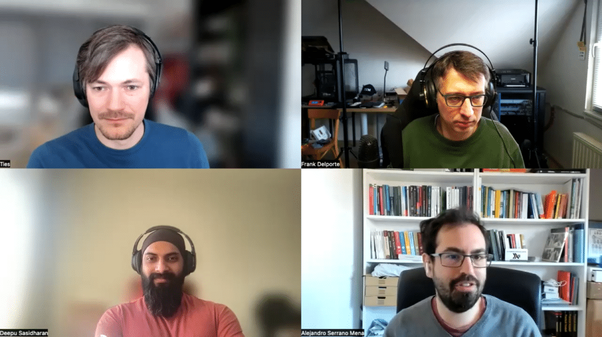

Functional programming... it seems you either love it or you hate it.

But, like everything in software engineering, it is a trade-off.

So for today, let's focus on the good, the bad, and the ugly parts of functional programming!



## Podcast Apps

You can listen and subscribe to the Foojay Podcast on:

* [Spotify](https://open.spotify.com/show/6CpTfgn9LirzJGAtc4ICdQ)
* [Apple Podcasts](https://podcasts.apple.com/be/podcast/foojay-io-the-friends-of-openjdk/id1652281304)
* And most others...

## Guests

* Alejandro Serrano, Software Engineer at 47 Degrees, author of "Practical Haskell", "The Book of Monads", and "FP Ideas for the Curious Kotliner"
  * <https://serranofp.com/>
  * <https://twitter.com/trupill>
  * <https://www.linkedin.com/in/alejandroserranomena/>
* Deepu K Sasidharan, JHipster co-lead, Java Champion, Staff Dev Advocate @ Okta, Java, JS, Rust, Cloud Native Advocate, Author, Speaker
  * <https://twitter.com/deepu105>
  * <https://mastodon.social/@deepu105>
  * <https://deepu.tech/>
  * <https://www.linkedin.com/in/deepu05/>

## Podcast

* Host: Ties van de Ven
  * <https://www.tiesvandeven.nl/>
  * <https://twitter.com/ties_ven>
  * <https://www.linkedin.com/in/ties-van-de-ven-a24480a/>
* Producer: Frank Delporte
  * <https://twitter.com/FrankDelporte>
  * <https://foojay.social/@frankdelporte>

## Links

* <https://foojay.io/today/7-functional-programming-techniques-in-java-a-primer/> (Deepu)
* <https://foojay.io/today/the-problem-with-functional-programming/> (Ties)
* <https://www.baeldung.com/java-functional-programming>   

## Content

* 00'00 Intro
* 00'17 Introduction of the guests
* 07'40 What is functional programming (FP)?
* 11'50 The same problems exist in FP and Object Oriented Programming
* 13'50 Academic approach to programming
* 17'54 Who of the guests is a FP purist?
* 22'25 Understand the "Why"? Why use FP?
* 28'11 The costs of FP
* 30'57 When to learn FP
  * <https://www.baeldung.com/java-monads>
* 42'43 What is the future of FP?
* 50'41 Outro
